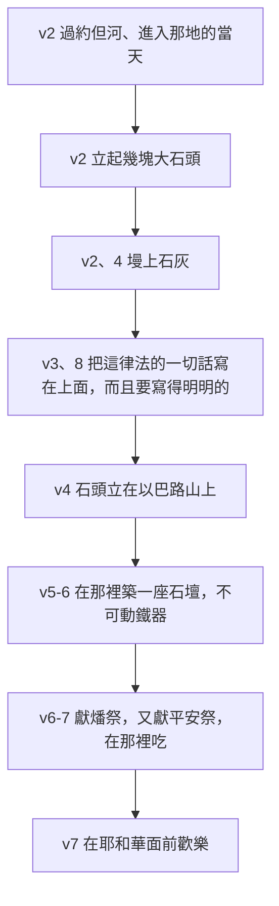

# 申命記 第27章

<!-- chapter-navigation:start -->
| [前一章](../05%20申命記/第26章.md) | [回目錄](../05%20申命記/全書目錄及綱要.md) | [下一章](../05%20申命記/第28章.md) |
| :--- | :---: | ---: |
<!-- chapter-navigation:end -->

1. 摩西和以色列的[[以色列的長老|眾長老]]吩咐百姓說：你們要遵守我今日所吩咐的一切誡命。
2. 你們過[[約但河]]，到了耶和華─你神所賜給你的地，當天要立起幾塊大石頭，[[墁上石灰（sid）|墁上石灰]]，
3. [[立石寫律法的儀式|把這律法的一切話寫在石頭上]]。你過了河，可以進入耶和華─你神所賜你流奶與蜜之地，正如耶和華─你列祖之神所應許你的。
4. 你們過了[[約但河]]，就要在[[基利心山與以巴路山|以巴路山]]上照我今日所吩咐的，將這些石頭立起來，[[墁上石灰（sid）|墁上石灰]]。
5. 在那裡要為耶和華─你的神[[築壇|築一座石壇]]；在石頭上不可動鐵器。
6. 要用[[土壇|沒有鑿過的石頭]]築耶和華─你神的壇，在壇上要將[[燔祭]]獻給耶和華─你的神。
7. 又要獻[[平安祭]]，且在那裡吃，在耶和華─你的神面前[[在耶和華面前歡樂|歡樂]]。
8. 你要將這律法的一切話[[講律法（ba.ar）|明明的]]寫在石頭上。
9. 摩西和祭司[[利未支派|利未人]]曉諭以色列眾人說：以色列啊，要默默靜聽。[[立約|你今日成為耶和華─你神的百姓了]]。
10. 所以要聽從耶和華─你神的話，遵行他的誡命律例，就是我今日所吩咐你的。
11. 當日，摩西囑咐百姓說：
12. 你們過了[[約但河]]，西緬、利未、猶大、以薩迦、約瑟、便雅憫六個支派的人都要站在[[基利心山與以巴路山|基利心山]]上[[兩山宣告祝福與咒詛的儀式|為百姓祝福]]。
13. 流便、迦得、亞設、西布倫、但、拿弗他利六個支派的人都要站在[[基利心山與以巴路山|以巴路山]]上宣布[[咒詛（a.rar 與 qa.vav）|咒詛]]。
14. [[利未支派|利未人]]要向以色列眾人高聲說：
15. 有人製造耶和華[[可憎的物（to.e.vah）|所憎惡的]]偶像，[[不可為自己雕刻偶像|或雕刻，或鑄造]]，就是工匠手所做的，在暗中設立，那人[[咒詛（a.rar 與 qa.vav）|必受咒詛]]！百姓都要答應說：[[十二項咒詛與百姓的阿們|阿們]]！
16. [[當孝敬父母|輕慢父母的]]，[[咒詛（a.rar 與 qa.vav）|必受咒詛]]！百姓都要說：[[十二項咒詛與百姓的阿們|阿們]]！
17. [[不可挪移地界（ge.vul）|挪移鄰舍地界的]]，[[咒詛（a.rar 與 qa.vav）|必受咒詛]]！百姓都要說：[[十二項咒詛與百姓的阿們|阿們]]！
18. [[不可咒罵聾子絆倒瞎子|使瞎子走差路的]]，[[咒詛（a.rar 與 qa.vav）|必受咒詛]]！百姓都要說：[[十二項咒詛與百姓的阿們|阿們]]！
19. 向[[寄居的]]和[[孤兒寡婦]]屈枉正直的，[[咒詛（a.rar 與 qa.vav）|必受咒詛]]！百姓都要說：[[十二項咒詛與百姓的阿們|阿們]]！
20. [[近親性關係的十二項條例|與繼母行淫的]]，[[咒詛（a.rar 與 qa.vav）|必受咒詛]]！因為[[衣襟（ka.naph）|掀開他父親的衣襟]]。百姓都要說：[[十二項咒詛與百姓的阿們|阿們]]！
21. [[不可與獸淫合逆性的事|與獸淫合的]]，[[咒詛（a.rar 與 qa.vav）|必受咒詛]]！百姓都要說：[[十二項咒詛與百姓的阿們|阿們]]！
22. [[近親性關係的十二項條例|與異母同父，或異父同母的姊妹行淫的]]，[[咒詛（a.rar 與 qa.vav）|必受咒詛]]！百姓都要說：[[十二項咒詛與百姓的阿們|阿們]]！
23. [[近親性關係的十二項條例|與岳母行淫的]]，[[咒詛（a.rar 與 qa.vav）|必受咒詛]]！百姓都要說：[[十二項咒詛與百姓的阿們|阿們]]！
24. 暗中殺人的，[[咒詛（a.rar 與 qa.vav）|必受咒詛]]！百姓都要說：[[十二項咒詛與百姓的阿們|阿們]]！
25. [[賄賂使智慧人的眼變瞎（sha.chad）|受賄賂]][[流無辜血的罪|害死無辜之人的]]，[[咒詛（a.rar 與 qa.vav）|必受咒詛]]！百姓都要說：[[十二項咒詛與百姓的阿們|阿們]]！
26. [[為定與廢去（qum 與 pa.rar）|不堅守遵行這律法言語的]]，[[咒詛（a.rar 與 qa.vav）|必受咒詛]]！百姓都要說：[[十二項咒詛與百姓的阿們|阿們]]！

---

## 本章知識節點

### 主題
- [[立石寫律法的儀式]]
- [[兩山宣告祝福與咒詛的儀式]]
- [[十二項咒詛與百姓的阿們]]
- [[築壇]]
- [[在耶和華面前歡樂]]
- [[立約]]
- [[不可挪移地界（ge.vul）]]
- [[不可咒罵聾子絆倒瞎子]]
- [[近親性關係的十二項條例]]
- [[孤兒寡婦]]
- [[不可與獸淫合逆性的事]]

### 原文
- [[墁上石灰（sid）]]
- [[講律法（ba.ar）]]
- [[為定與廢去（qum 與 pa.rar）]]
- [[咒詛（a.rar 與 qa.vav）]]
- [[可憎的物（to.e.vah）]]
- [[寄居的]]
- [[衣襟（ka.naph）]]
- [[賄賂使智慧人的眼變瞎（sha.chad）]]

### 地點
- [[基利心山與以巴路山]]
- [[約但河]]
- [[示劍（城）]]

### 神學
- [[土壇]]
- [[燔祭]]
- [[平安祭]]
- [[不可為自己雕刻偶像]]
- [[當孝敬父母]]
- [[流無辜血的罪]]

### 人物
- [[利未支派]]

### 文化
- [[以色列的長老]]

### 背景
- [[摩利橡樹]]
- [[古代近東立約]]

---

## 本章整理

申命記第二十七章換了講員的組合，也換了整卷書的段落。前面二十幾章都是摩西一個人說話；這一章他先和 [[以色列的長老|眾長老]] 一起吩咐（第1節），再和祭司利未人一起曉諭（第9節），最後自己囑咐（第11節）。CT 注意到這件事：這是《申命記》中首次記載摩西和眾長老一起向百姓說話，可能是摩西在臨死前有意使眾長老更多承擔職責。

GT《聖經精讀本──申命記註解》把位置點明：本文是摩西的第三篇講章，也是整個摩西五經的結論部分。KC 說得更具體——申命記27章是一章過渡的章，其中有兩個主題，而 [[基利心山與以巴路山|以巴路山]] 在兩個主題裡都居中心：前半是在以巴路山立起記念的石頭與一座壇，後半是在同一座山上宣告咒詛。

### 過河那天先做的事（v1-8）

第一件事不是打仗，也不是分地，是搬石頭。CT 的話中之光說：過河後的第一件事，不是別的，是要立起石頭。他並解釋「當天」這兩個字的份量——雖然這些石頭在以後的日子要搬到以巴路山，但是他們當天就得把石頭立起來，說明律法已經開始生效了。

[[立石寫律法的儀式|整套動作]] 是有次序的：

[[墁上石灰（sid）|石灰那一道手續]] 純粹是技術性的。STEP語言資料顯示這是一組同源結構——動詞 ve./sad.Ta（H7874，簡要詞典義 sid: to whitewash）配名詞 ba./Sid（H7875，簡要詞典義 sid: lime）。CT 說在石頭上墁上石灰，是為了寫上字後更顯清晰；GT《申命記雷氏研讀本》交代材料來源：「石灰」借烘石膏而得，「石膏可採於約但和死海的河谷」。BH 說用灰泥做出可書寫的平滑表面，這作法有該地區的考古發現支持。

第8節要求寫得「明明的」。STEP語言資料顯示這是兩個不定詞連用——ba.'Er（H874，簡要詞典義 ba.ar: to make plain）加 hei.Tev（H3190，簡要詞典義 ya.tav: be good）。==而那個 H874，正是申命記1:5 [[講律法（ba.ar）|「摩西…講律法」]] 的同一個動詞。==整卷書開頭摩西做的事是把律法講明白，到了結尾，百姓要做的事是把律法寫明白。KC 說要寫得夠清楚，好讓經過的人可以毫不費力地讀到。

那麼石頭上到底要寫哪些字？這是本段唯一各家沒有共識的地方，而且分歧不小。CT 認為範圍最窄：'律法的一切話'並非指《申命記》書中的一切律法，而是指律法中關於神的總綱，更有可能僅指「十誡」。GT《申命記雷氏研讀本》推測是這一段前後：「這律法的一切」大概指這裏的咒詛與祝福，以及其後的經文。GT《啟導本聖經申命記註釋》取的範圍最大：「這律法的一切話」指摩西所重申的一切法例規章。GT《聖經精讀本──申命記註解》乾脆把三種讀法並列——純粹法律性的部分、單指27與28章的祝福與咒詛，或狹義地只指本章15至26節。==幾塊石頭能寫下多少字，決定了這場儀式究竟是把整部律法立在那地，還是只立下一份摘要；而經文沒有說。==

石頭旁邊還要 [[築壇]]，而且 [[土壇|壇的作法有規定]]：在石頭上不可動鐵器，要用沒有鑿過的石頭。STEP語言資料顯示「動」是 ta.Nif（H5130B，簡要詞典義 nuph: to wave，揮動），「沒有鑿過的」是 she.le.mOt（H8003，簡要詞典義 sha.lem: complete，完整的）。CT 說用意在保持渾然天成，避免人工的玷污（參出二十25）。GT《聖經精讀本──申命記註解》給兩個理由：不可為外在的美麗所震攝，乃要用心靈和誠實單單敬拜神；不能用可流人之血的鐵器等不潔淨的工具來雕鑿。

KC 把碑與壇的分工講得最清楚：藉著碑上所寫的，神向人說話；藉著壇，人歸向神。他並注意到祭的種類——這裡沒有提到贖罪祭，只有 [[燔祭]] 與 [[平安祭]]；這座壇上的祭是向神表達感恩。而平安祭要在那裡吃，[[在耶和華面前歡樂|並且要歡樂]]。

這一整套動作後來真的做了，而且四套來源都指向同一處。GT《申命記雷氏研讀本》：「約書亞執行了這些指引(書八30～35)。」GT《啟導本聖經申命記註釋》說以色列人過約但河之後，在示劍的以巴路山上和基利心山上立石志念。GT《聖經精讀本──申命記註解》說這場兩山儀式在書8:30~35 照實遵行。KC 說第4節在約書亞記8章應驗。CT 補上一個細節：進了迦南以後，這律法言語全部都要宣讀，「沒有一句不宣讀的」(書八34~35)。

### 你今日成為耶和華─你神的百姓了（v9-10）

第9至10節只有兩節，卻是全章的轉折。摩西和祭司 [[利未支派|利未人]] 一同開口，第一句話是要百姓默默靜聽。STEP語言資料顯示這是 has.Ket（H5535，簡要詞典義 sa.khat: be silent，使役語態的命令式）加 u./she.Ma'（H8085G）。

接著那句話容易被誤讀：你今日成為耶和華─你神的百姓了。CT 先把它擋住：這裡並不是說今日才成為神的百姓，而是重申他們是神百姓的身分。GT《啟導本聖經申命記註釋》說法一致——這裡記下的是重申神與以色列民 [[立約]] 的話，新一代像他們的上一代一樣，是神的子民。

CT 的話中之光把第9節與第10節的因果次序讀了出來：因為以色列人已經成為耶和華你神的百姓了，所以要聽從耶和華你神的話；==他們是因為有立約百姓的地位，所以需要順服神；順服不是立約的前提，而是立約的結果。==

### 誰站哪座山（v11-13）

[[兩山宣告祝福與咒詛的儀式|接下來的安排]] 很具體：六個支派站 [[基利心山與以巴路山|基利心山]] 祝福，六個支派站以巴路山宣布咒詛，而 GT《申命記雷氏研讀本》補上中間那一塊——利未人站在中間的山谷。BH 說這兩座山在 [[示劍（城）|示劍]] 附近形成一個天然的圓形劇場。CT 的背景註解則指出以巴路山靠近 [[摩利橡樹]]，那是亞伯拉罕進入迦南時第一次停留的地方。

| | 基利心山（南，祝福） | 以巴路山（北，咒詛） |
| --- | --- | --- |
| 支派 | 西緬、利未、猶大、以薩迦、約瑟、便雅憫 | 流便、迦得、亞設、西布倫、但、拿弗他利 |
| 母系 | 全是利亞與拉結所生的後裔 | 四支出自兩妾辟拉與悉帕，另加流便與西布倫 |
| 山的樣子 | 林木茂盛，象徵福氣 | 光禿荒涼，象徵禍患 |

這張表的最後一列來自 GT《啟導本聖經申命記註釋》：「林木茂盛的基利心山在南，是福氣的象徵；牛山濯濯的以巴路山在北，象徵禍患。」CT 補上的是兩山的相對位置與距離：以巴路山「距離約但河淺灘僅約29公里」，「它與基利心山對峙，兩山之間為極深的裂谷」，而基利心山「距約但河約48公里，地處示劍之南」。

分組的理由，各家補得很齊。CT 指出流便因與父親之妾同寢而失去長子名分，故與幼弟西布倫同被拉結所生的兩個兒子取代。KC 說站在祝福之山上的都是自主之婦人的後裔（加4:31），並坦白承認一件事：流便大概是因為失去長子名分才在這一組，但關於西布倫為什麼在這一組，沒有任何已知的說法。

> [!note] 為什麼祝福一句都沒寫下來
> 第14節之後只有咒詛，祝福的內容一字未提。GT《啟導本聖經申命記註釋》給的是結構上的理由：這裡沒有列舉出祝福，因為咒詛的反面便是祝福；具體的福分見申28:1～14。GT《聖經精讀本──申命記註解》給的是心理上的理由：這恐怕是考慮到容易因不順服招來咒詛的人的罪性，為了引起人的強烈警覺。CT 注意的是次序——雖然沒寫內容，祝福仍被放在咒詛的前頭。KC 讀出的則是另一層：神先把祝福擺在祂百姓面前，但同時也顯明祂的百姓並不要這祝福。

### 十二句咒詛，十二聲阿們（v14-26）

[[十二項咒詛與百姓的阿們|最後十三節]] 是全章唯一有文字記下來的部分。STEP語言資料顯示這份清單的形狀非常整齊：每一項的第一個字都是 'a.Rur（H779，簡要詞典義 a.rar: to curse，[[咒詛（a.rar 與 qa.vav）|Qal 被動分詞]]），每一項的最後一個字都是 'a.Men（H543）。CT 也指出原文每句都以「咒詛」開頭。

十二項的內容從敬拜一路走到法庭：第15節是 [[不可為自己雕刻偶像|在暗中設立偶像]]（STEP語言資料：Fe.sel H6459、u./ma.se.Khah H4541A、[[可憎的物（to.e.vah）|to.'a.Vat]] H8441）；第16節是 [[當孝敬父母|輕慢父母]]；第17節是 [[不可挪移地界（ge.vul）|挪移鄰舍地界]]；第18節是 [[不可咒罵聾子絆倒瞎子|使瞎子走差路]]；第19節是向 [[寄居的]] 和 [[孤兒寡婦]] 屈枉正直；第20、22、23節是三種 [[近親性關係的十二項條例|近親性關係]]（第20節的理由是 [[衣襟（ka.naph）|掀開他父親的衣襟]]）；第21節是 [[不可與獸淫合逆性的事|與獸淫合]]；第24節是暗中殺人；第25節是 [[賄賂使智慧人的眼變瞎（sha.chad）|受賄賂]] [[流無辜血的罪|害死無辜之人]]。

GT《聖經精讀本──申命記註解》替這份清單找到一個對照的座標：可以說，這十二種咒詛只是悖論性地表現了十誡的精神，即愛神與愛人（太22:36~40）。清單觸及的確實是十誡關切的那幾個範圍——拜偶像、孝敬父母、財產與地界、性的界線、不可殺人——只是全部翻成了反面，而且並不照十誡的順序排列，中間還夾著十誡沒有明寫的幾項：使瞎子走差路、向寄居的和孤兒寡婦屈枉正直。

第16節還藏著一個與前兩章相連的字。STEP語言資料顯示「輕慢父母的」是 mak.Leh（H7034，簡要詞典義 qa.lah: to dishonor）；而申命記25:3 那句「若過數，便是輕賤你的弟兄了」，用的是同一個 H7034（nik.Lah）。==同一個字根，在申25 是不可以這樣對待一個受刑的弟兄，在申27 是不可以這樣對待自己的父母。==

第20至23節那四項，GT《聖經精讀本──申命記註解》放在一起處理：這是與第七誡相關的對性犯罪的警告，本文尤其嚴禁了使神的神聖創造秩序極度紊亂的近親相奸罪與獸奸罪（利18:6~18;20:10~21）。它並指出這一類罪在以色列被看得極重的理由——男女間的性欲只能在一夫一妻的神聖婚姻制度中享受。

CT 看出前十一項有一個共同點：前十一項通常都是「暗中」進行的罪惡，第十二項泛指所有的罪惡。STEP語言資料證實第15節與第24節都明寫了 ba./Sa.ter（H5643A，簡要詞典義 se.ter: secrecy）。GT《申命記雷氏研讀本》一句話：「神看見人「在暗中」所做的事。」KC 說即使不順從是暗中發生的，咒詛還是會擊中它的目標。

第26節收尾的方式與前面十一項都不同——它不指名任何行為，只說不堅守遵行這律法言語的必受咒詛。而這裡藏著全章最緊的一個扣：STEP語言資料顯示「堅守」是 ya.Kim（H6965I，簡要詞典義 qum: to arise: establish），==正是第2節「立起」石頭的同一個動詞（va./ha.ke.mo.Ta）。==[[為定與廢去（qum 與 pa.rar）|第2節要百姓把石頭立起來，第26節咒詛那不把律法的話立起來的人]]——石頭立得再穩，話沒有立住，還是在咒詛之下。

GT《啟導本聖經申命記註釋》把第26節讀成總結，並提醒「只是口裡說遵守律法是不夠的，必須在生活中實行出來」。KC 說得最重：這項咒詛關乎律法的任何一項違犯，沒有任何脫身條款。GT《申命記雷氏研讀本》指出保羅正是引述這一節（加三10）。

至於那聲阿們，CT 的解釋最短：意思是「是的、誠心所願、實實在在」，百姓如此回應，表示要負起自己行為的責任。GT《申命記串珠聖經註釋》注意到這份清單的性質：咒詛都是對個人的良心而發的，以色列民聚在一起，公開地裁定這些惡行的罪。==十二句話由利未人喊出來，十二聲回答由百姓自己說出口；宣告的是別人，認下的是自己。==

**參考資料**
https://www.ccbiblestudy.org/Old%20Testament/05Deut/05CT27.htm
https://www.ccbiblestudy.org/Old%20Testament/05Deut/05GT27.htm
https://www.kingcomments.com/en/bible-studies/Deu/27
https://biblehub.com/study/deuteronomy/27.htm
https://github.com/STEPBible/STEPBible-Data

<!-- appendix-links:start -->
## 附錄

### 相關地圖
- [[appendix/fhl_maps/maps/025|〈申圖一〉應許之地全圖]]
- [[appendix/fhl_maps/maps/026|〈申圖二〉征服東岸及分地給兩個半支派]]
- [[appendix/fhl_maps/maps/028|〈書圖一〉過約但河及征服南方諸王]]
<!-- appendix-links:end -->

<!-- chapter-navigation:start -->
| [前一章](../05%20申命記/第26章.md) | [回目錄](../05%20申命記/全書目錄及綱要.md) | [下一章](../05%20申命記/第28章.md) |
| :--- | :---: | ---: |
<!-- chapter-navigation:end -->
