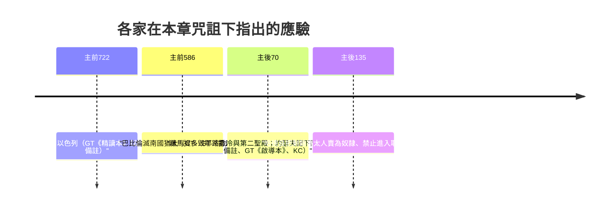

# 申命記 第28章

<!-- chapter-navigation:start -->
| [前一章](../05%20申命記/第27章.md) | [回目錄](../05%20申命記/全書目錄及綱要.md) | [下一章](../05%20申命記/第29章.md) |
| :--- | :---: | ---: |
<!-- chapter-navigation:end -->

1. 你若留意聽從耶和華─你神的話，謹守遵行他的一切誡命，就是我今日所吩咐你的，他必使你超乎天下萬民之上。
2. 你若聽從耶和華─你神的話，這以下的福必[[追隨與臨到（na.sag）|追隨]]你，臨到你身上：
3. [[六組祝福與六組咒詛的對稱|你在城裡必蒙福，在田間也必蒙福]]。
4. 你身所生的，地所產的，牲畜所下的，以及牛犢、羊羔，都必蒙福。
5. 你的[[筐子（te.ne）|筐子]]和你的[[爐灶和摶麵盆|摶麵盆]]都必蒙福。
6. [[出入（領袖用語）|你出也蒙福，入也蒙福]]。
7. 仇敵起來攻擊你，耶和華必使他們在你面前被你殺敗；他們從一條路來攻擊你，必從七條路逃跑。
8. 在你倉房裡，並你手所辦的一切事上，耶和華所命的福必臨到你。耶和華─你神也要在所給你的地上賜福與你。
9. 你若謹守耶和華─你神的誡命，遵行他的道，他必照著向你所起的誓立你作為自己的聖民。
10. 天下萬民見你歸在耶和華的名下，就要懼怕你。
11. 你在耶和華向你列祖起誓應許賜你的地上，他必使你身所生的，牲畜所下的，地所產的，都綽綽有餘。
12. 耶和華必為你[[開天上的府庫（o.tsar）|開天上的府庫]]，按時降雨在你的地上。在你手裡所辦的一切事上賜福與你。你必借給許多國民，卻不致向他們借貸。
13. 你若聽從耶和華─你神的誡命，就是我今日所吩咐你的，謹守遵行，不偏左右，也不隨從事奉別神，耶和華就必使你[[作首不作尾居上不居下（rosh 與 za.nav）|作首不作尾]]，但居上不居下。
14. 併於上節。
15. 你若不聽從耶和華─你神的話，不謹守遵行他的一切誡命律例，就是我今日所吩咐你的，這以下的[[咒詛（a.rar 與 qa.vav）|咒詛]]都必[[追隨與臨到（na.sag）|追隨]]你，臨到你身上：
16. [[六組祝福與六組咒詛的對稱|你在城裡必受咒詛，在田間也必受咒詛]]。
17. 你的[[筐子（te.ne）|筐子]]和你的[[爐灶和摶麵盆|摶麵盆]]都必受[[咒詛（a.rar 與 qa.vav）|咒詛]]。
18. [[咒詛（a.rar 與 qa.vav）|你身所生的，地所產的，以及牛犢、羊羔，都必受咒詛]]。
19. [[出入（領袖用語）|你出也受咒詛，入也受咒詛]]。
20. 耶和華因你行惡離棄他，必在你手裡所辦的一切事上，使[[咒詛擾亂責罰（me.e.rah、me.hu.mah、mig.e.ret）|咒詛、擾亂、責罰]]臨到你，直到你被毀滅，速速地滅亡。
21. 耶和華必使瘟疫貼在你身上，直到他將你從所進去得為業的地上滅絕。
22. 耶和華要用[[攻擊你的七樣災害|癆病、熱病、火症、瘧疾]]、刀劍、旱風（或作：乾旱）、霉爛攻擊你。這都要追趕你，直到你滅亡。
23. [[天如鐵地如銅（乾旱咒詛的意象）|你頭上的天要變為銅]]，腳下的地要變為鐵。
24. 耶和華要使那降在你地上的雨變為塵沙，從天臨在你身上，直到你滅亡。
25. 耶和華必使你敗在仇敵面前，你從一條路去攻擊他們，必從七條路逃跑。你必在天下萬國中[[在萬國中令人驚駭（za.a.vah）|拋來拋去]]。
26. 你的屍首必給空中的飛鳥和地上的走獸作食物，並無人鬨趕。
27. 耶和華必用[[起泡的瘡|埃及人的瘡]]並痔瘡、牛皮癬與疥攻擊你，使你不能醫治。
28. 耶和華必用癲狂、眼瞎、心驚攻擊你。
29. 你必在午間摸索，好像瞎子在暗中摸索一樣。你所行的必不亨通，時常遭遇欺壓、搶奪，無人搭救。
30. 你聘定了妻，別人必與他同房；你建造房屋，不得住在其內；你栽種葡萄園，也不得用其中的果子。
31. 你的牛在你眼前宰了，你必不得吃他的肉；你的驢在你眼前被搶奪，不得歸還；你的羊歸了仇敵，無人搭救。
32. 你的兒女必歸與別國的民；你的眼目終日切望，甚至失明，你手中無力拯救。
33. 你的土產和你勞碌得來的，必被你所不認識的國民吃盡。你時常被欺負，受壓制，
34. 甚至你因眼中所看見的，必致瘋狂。
35. 耶和華必攻擊你，使你膝上腿上，從腳掌到頭頂，長毒瘡無法醫治。
36. 耶和華必將你和[[王的三禁與抄錄律法書|你所立的王]]領到你和你列祖素不認識的國去；在那裡你必事奉木頭石頭的神。
37. 你在耶和華領你到的各國中，要令人驚駭、笑談、譏誚。
38. 你帶到田間的種子雖多，收進來的卻少，因為被[[蝗災|蝗蟲]]吃了。
39. 你栽種、修理葡萄園，卻不得收葡萄，也不得喝葡萄酒，因為被蟲子吃了。
40. 你全境有橄欖樹，卻不得其油抹身，因為樹上的橄欖不熟自落了。
41. 你生兒養女，卻不算是你的，因為必被擄去。
42. 你所有的樹木和你地裡的出產必被[[蝗災|蝗蟲]]所吃。
43. 在你中間[[寄居的]]，必漸漸上升，比你高而又高；你必漸漸下降，低而又低。
44. 他必借給你，你卻不能借給他；[[作首不作尾居上不居下（rosh 與 za.nav）|他必作首，你必作尾]]。
45. 這一切[[咒詛（a.rar 與 qa.vav）|咒詛]]必[[追隨與臨到（na.sag）|追隨]]你，趕上你，直到你滅亡；因為你不聽從耶和華─你神的話，不遵守他所吩咐的誡命律例。
46. 這些[[咒詛（a.rar 與 qa.vav）|咒詛]]必在你和你後裔的身上成為[[異蹟奇事（ot 與 mo.phet）|異蹟奇事]]，直到永遠！
47. 因為你富有的時候，[[富有的時候不歡心樂意地事奉|不歡心樂意地事奉]]耶和華─你的神，
48. 所以你必在飢餓、乾渴、赤露、缺乏之中事奉耶和華所打發來攻擊你的仇敵。他必把[[鐵軛（ol 與 bar.zel）|鐵軛]]加在你的頸項上，直到將你滅絕。
49. 耶和華要從遠方、地極帶一國的民，[[如鷹飛來的遠方之民|如鷹飛來攻擊你]]。這民的言語，你不懂得。
50. 這民的面貌凶惡，不顧恤年老的，也不恩待年少的。
51. 他們必吃你牲畜所下的和你地土所產的，直到你滅亡。你的[[五穀、新酒和油（da.gan、ti.rosh、yits.har）|五穀、新酒，和油]]，以及牛犢、羊羔，都不給你留下，直到將你滅絕。
52. 他們必將你困在你各城裡，直到你所倚靠、高大堅固的城牆都被攻塌。他們必將你困在耶和華─你神所賜你遍地的各城裡。
53. 你在仇敵[[古代近東的圍城戰與營壘|圍困窘迫]]之中，必吃你本身所生的，就是耶和華─你神所賜給你的兒女之肉。
54. 你們中間，柔弱嬌嫩的人必惡眼看他弟兄和他懷中的妻，並他餘剩的兒女；
55. 甚至在你受仇敵圍困窘迫的城中，他要[[吃兒女的肉（極端饑荒的咒詛）|吃兒女的肉]]，不肯分一點給他的親人，因為他一無所剩。
56. 你們中間，柔弱嬌嫩的婦人，是因嬌嫩柔弱不肯把腳踏地的，必惡眼看他懷中的丈夫和他的兒女。
57. 他兩腿中間出來的嬰孩與他所要生的兒女，他因缺乏一切就要在你受仇敵圍困窘迫的城中將他們暗暗地吃了。
58. 這書上所寫律法的一切話是叫你[[敬畏神|敬畏耶和華]]─你神可榮可畏的名。你若不謹守遵行，耶和華就必將奇災，就是至大至長的災，至重至久的病，加在你和你後裔的身上，
59. 併於上節。
60. 也必使你所懼怕、[[第六災：瘡災|埃及人的病]]都臨到你，貼在你身上，
61. 又必將沒有寫在這律法書上的各樣疾病、災殃降在你身上，直到你滅亡。
62. 你們先前雖然像天上的星那樣多，卻因不聽從耶和華─你神的話，所剩的人數就稀少了。
63. 先前耶和華怎樣喜悅善待你們，使你們眾多，也要照樣[[喜悅善待也喜悅毀滅（su.s）|喜悅毀滅你們]]，使你們滅亡；並且你們從所要進去得的地上必被拔除。
64. 耶和華必使你們[[分散在萬民中]]，從地這邊到地那邊，你必在那裡事奉你和你列祖素不認識、木頭石頭的神。
65. 在那些國中，你必不得安逸，也不得落腳之地；耶和華卻使你在那裡心中跳動，眼目失明，精神消耗。
66. 你的性命必[[性命懸懸無定|懸懸無定]]；你晝夜恐懼，自料性命難保。
67. 你因心裡所恐懼的，眼中所看見的，早晨必說，巴不得到晚上才好；晚上必說，巴不得到早晨才好。
68. 耶和華必使你[[坐船回埃及卻無人買|坐船回埃及去]]，走我曾告訴你不得再見的路；在那裡你必賣己身與仇敵作奴婢，卻無人買。

---

## 本章知識節點

### 主題
- [[祝福與咒詛]]
- [[六組祝福與六組咒詛的對稱]]
- [[攻擊你的七樣災害]]
- [[如鷹飛來的遠方之民]]
- [[富有的時候不歡心樂意地事奉]]
- [[性命懸懸無定]]
- [[坐船回埃及卻無人買]]
- [[天如鐵地如銅（乾旱咒詛的意象）]]
- [[吃兒女的肉（極端饑荒的咒詛）]]
- [[遵行誡命必蒙福的七重應許（利26：3-13）]]
- [[不聽從神的五層漸進懲罰（利26：14-39）]]
- [[王的三禁與抄錄律法書]]

### 原文
- [[追隨與臨到（na.sag）]]
- [[咒詛（a.rar 與 qa.vav）]]
- [[咒詛擾亂責罰（me.e.rah、me.hu.mah、mig.e.ret）]]
- [[作首不作尾居上不居下（rosh 與 za.nav）]]
- [[開天上的府庫（o.tsar）]]
- [[在萬國中令人驚駭（za.a.vah）]]
- [[鐵軛（ol 與 bar.zel）]]
- [[異蹟奇事（ot 與 mo.phet）]]
- [[喜悅善待也喜悅毀滅（su.s）]]
- [[筐子（te.ne）]]
- [[寄居的]]
- [[出入（領袖用語）]]
- [[五穀、新酒和油（da.gan、ti.rosh、yits.har）]]
- [[秋雨春雨（yo.reh、mal.qosh）]]
- [[起泡的瘡]]

### 背景
- [[宗主條約]]
- [[古代近東的圍城戰與營壘]]

### 歷史
- [[分散在萬民中]]
- [[蝗災]]
- [[第六災：瘡災]]

### 文化
- [[爐灶和摶麵盆]]

### 神學
- [[敬畏神]]

### 地點
- [[亞述]]

---

## 本章整理

### 若留意聽從：十二樣祝福（v1-14）

第二十八章的開頭是一個條件句：「你若留意聽從耶和華─你神的話，謹守遵行他的一切誡命」。CT 在原文字義裡指出，「留意聽從」原文是重複使用「聽從」兩次，強調其重要性；他並把後面兩個動詞分開解釋——『謹守』重在指思想觀念的贊同和一致，『遵行』重在指行為上的遵照和實施。這個條件在前十四節裡出現了三次，分別在第1、9、13節。

條件之後，福氣自己會走過來。第2節說「這以下的福必追隨你，臨到你身上」，用的是 [[追隨與臨到（na.sag）|追隨與臨到]] 這一組動詞；CT 解釋這意指不必特意去追求，反而自動地追著賞給你。KC 讀出同樣的畫面，說摩西把這些祝福呈現為緊緊跟著這百姓並趕上他們的力量。

接下來的十二樣祝福分成兩層。第3至6節是 [[六組祝福與六組咒詛的對稱|六句短促的宣告]]，涵蓋居住與工作的場所、人口與莊稼與牲畜的多產、日常生計、以及一切出入的事務。GT 注意到這六句在原文由六組富有節奏感的片語組成，可以用作敬拜中的儀文；其中的 [[筐子（te.ne）|筐子]] 與 [[爐灶和摶麵盆|摶麵盆]] 一個裝地裡收來的東西、一個做每天的餅，[[出入（領袖用語）|出也蒙福、入也蒙福]] 則把一天當中的一切行動都包了進去。

第7至14節換成整個民族的事。其中第12節值得特別停一下：「耶和華必為你開天上的府庫，按時降雨在你的地上」。[[開天上的府庫（o.tsar）|這句話]] 在迦南地不是一句客套的祝福——GT《申命記雷氏研讀本》直接點破它的針對性：「從天上府庫降雨灌溉土地的是神，不是巴力。」CT 則解釋「按時降雨」意指按照農作物播種和收割的需要，而降 [[秋雨春雨（yo.reh、mal.qosh）|秋雨春雨]]。BH 從古代近東的宗教背景補上這句話的分量：天常被看作神明的居所，雨被視為直接從那裡來的恩賜，而「按時」表示供應來得及時、正好配合農作。

GT 指出第7至14節這八節在原文也是交錯配列的：先列出各個祝福（7至9節），再以倒序重複一遍（10至13a節）。照這個排法，最外圈是對外的事務——戰勝仇敵（7節）、借給列國與作首不作尾（12b至13a節）；中間一圈是內部的事務，神在百姓手所辦的一切事上賜福（8節、11至12b節）；而祝福的最高點落在正中間的第9至10節：立你作為自己的聖民，天下萬民見你歸在耶和華的名下，就要懼怕你。GT 說這最核心的祝福是屬靈的地位，百姓因此能安然作「祭司的國度，為聖潔的國民」。到了第13節，這個身分落成國際上的位置——[[作首不作尾居上不居下（rosh 與 za.nav）|作首不作尾，但居上不居下]]。CT 在這裡留了一句提醒：今天許多信徒喜歡這個應許，卻常常忽略「謹守遵行，不偏左右，也不隨從事奉別神」的蒙福之道。BH 則說明這組比喻本身：頭代表權柄、領導與決策，尾代表沒有主導權與從屬；它並指出以賽亞書九14至15 也用同一組比喻，那裡把領袖說成頭、把假先知說成尾。

### 咒詛從同一句話開始（v15-24）

第15節與第2節是同一個句子，只換了一個名詞。這種寫法一路貫穿到第19節：[[咒詛（a.rar 與 qa.vav）|每一句咒詛]] 都是把對應那句祝福的動詞換掉，其餘一字不動。STEP語言資料把這件事量得很清楚——第3至6節出現六次 ba.Rukh（H1288，被動分詞），第16至19節出現六次 'a.Rur（H779，被動分詞），連在句子裡的位置都相同。

| 蒙福（節） | 內容 | 受咒詛（節） |
| --- | --- | --- |
| 3 | 在城裡、在田間 | 16 |
| 4 | 身所生的、地所產的、牛犢羊羔 | 18 |
| 5 | 筐子和摶麵盆 | 17 |
| 6 | 出也、入也 | 19 |

唯一的差別是次序：祝福這邊生產（4節）排在飲食（5節）之前，咒詛那邊調過來。CT 讀這一段時說，正如順服會使人的整個生命都蒙神祝福，悖逆也會使人的整個生命都陷入咒詛。KC 說得更貼近讀者的感受：咒詛正好打在祝福本身上。

第20節把語氣換掉，從對稱的短句轉入長篇的描述。[[咒詛擾亂責罰（me.e.rah、me.hu.mah、mig.e.ret）|「咒詛、擾亂、責罰」三個詞]] 在中文裡像同義的堆疊，STEP語言資料顯示原文是三個各自獨立的陰性名詞。CT 分別解釋：咒詛指將人置於受禍的地位上，擾亂指身心困惑、挫折、受壓，責罰指被神譴責、懲罰、棄絕；GT《申命記串珠聖經註釋》給第二個詞的畫面更具體——「『擾亂』：指在戰場上恐慌、站不住腳。」

這一節的末尾寫出了原因。CT 指出「因你行惡離棄祂」原文直譯是「因你離棄祂的惡行」，並從這個語序讀出一個判斷：並非「行惡」才會離棄神，離棄神本身就是「惡行」。

第21至24節開始列舉災禍。[[攻擊你的七樣災害|第22節]] 一口氣列出七樣——癆病、熱病、火症、瘧疾、刀劍、旱風、霉爛，STEP語言資料顯示原文正好是七個名詞。CT 說本節所列舉的七種（七含意完全）災害，代表一切神所使用的懲治工具；GT《啟導本聖經申命記註釋》說法一致：「這裡一共列了七種災難，而七為完整之數」，因此災難不限七種。同一段還指出癆病與熱病在聖經中只見於此處與利未記二十六16，火症與瘧疾更是只見於此處。

第23節的 [[天如鐵地如銅（乾旱咒詛的意象）|天變為銅、地變為鐵]]，是利未記二十六19 那個比喻的翻版，只是兩種金屬對調了。BH 另補一層讀法：銅是堅硬不透的金屬，這個比喻也連上禱告上達不到神那裡的意思。GT《聖經精讀本──申命記註解》在這一節就標出了利未記二十六19，並說這是「用修辭手法表現了不下一滴雨的極度乾旱」，而及時雨象徵著神之恩典（12節），極度乾旱地象徵了神的咒詛。

> [!note] 旱風是什麼
> GT 指出第22節的「旱風」是源自撒哈拉的西洛克風（sirocco），會導致乾燥炎熱的天氣、容易致病；第24節「雨變為塵沙」比喻的正是這種風帶來的沙塵暴。這一組災害因此不是三件互不相干的事，而是同一種天氣的三個面向。

### 交錯配列的六組打擊（v25-37）

CT 在第25節下面點出一個結構：第25至37節的咒詛，原文以交錯配列的形式排列——先列出各個咒詛（25至33節），再以倒序重複一遍（34至37節）。GT 也列出同樣的六組對應。

| 失去的 | 順列（節） | 倒序（節） |
| --- | --- | --- |
| 神的爭戰 | 25a | 36 |
| 神的同在 | 25b-26 | 37 |
| 神的醫治 | 27 | 35 |
| 神的安慰 | 28 | 34 |
| 神的保護 | 29 | 33 |
| 神的拯救 | 30-32 | — |

第25節末句和合本作「你必在天下萬國中拋來拋去」，[[在萬國中令人驚駭（za.a.vah）|原文的意思稍有不同]]：GT 指出原文是「在天下萬國中成為令人驚駭的事物」，比喻不受歡迎。CT 則從結果解釋，說這意指被擄分散各國、居無定所、無法安定下來。兩種讀法指的是同一段歷史，只是一個站在旁觀者那邊、一個站在當事人這邊。

第27節列出皮膚病，其中的 [[起泡的瘡|「埃及人的瘡」]] 用的正是出埃及記九章 [[第六災：瘡災|第六災]] 那個名詞。CT 說這可能指象皮病，一種很難治的皮膚病；GT《申命記串珠聖經註釋》說這可能是指以色列人在埃及時神懲罰當地百姓而加諸其身的一種皮膚病，並指第35節更明言此皮膚病乃出於神的攻擊和咒詛。

第30至33節寫的是一種特別的痛苦：東西還在，但享用不到。聘定了妻、建造房屋、栽種葡萄園、養了牛驢羊、生了兒女，每一樣都被別人拿走，而當事人只能看著。CT 在第33節下面留了一句：人常常誤以為自己的所有都是「勞碌得來的」，但若離開了神的保護，人根本沒有機會享用勞碌得來的。第36節提到 [[王的三禁與抄錄律法書|「你所立的王」]]，GT 認為這暗示人不要神作王、自己立王是不合神心意的，最終只會把百姓帶到偏離的路上。

### 收成、地位與那個真正的原因（v38-48）

第38至42節連續五節講同一件事：種了收不到。CT 說第38節的 [[蝗災|「被蝗蟲吃了」]] 代表一切減產的天然和人為災害因素，第39、40、42節也是同樣的道理。GT《聖經精讀本──申命記註解》補上一個細節，說明這種缺乏不是懶惰造成的：「這種缺乏並不是他們的懶惰所導致，雖然他們付出及辛勤勞動，神的審判卻帶來了自然災害，使之不能收穫出產」。CT 在第40節另給了一個農業上的解釋——只有成熟變黑的橄欖才能用來榨油，「橄欖不熟自落」表示不能榨取橄欖油。

第43至44節把社會位置翻了過來。[[寄居的|在你中間寄居的]] 漸漸上升，以色列漸漸下降；連借貸的方向都調轉，最後回到那一組頭與尾的比喻——「他必作首，你必作尾」。GT《聖經精讀本──申命記註解》直接指出：「本文是與12,13節相對照的宣告。」

第45至46節是一個停頓。KC 注意到這裡有一個語氣上的轉折：第15節說的還是「你若不聽從」，到第45節已經變成「因為你不聽從」；假設句成了事實句。第46節則替這一切下了一個定性——[[異蹟奇事（ot 與 mo.phet）|「這些咒詛必在你和你後裔的身上成為異蹟奇事，直到永遠」]]。CT 指出這一組詞原文與「神蹟奇事」同字，意指所發生的各種現象乃是從神而來、深具意義的記號。GT《聖經精讀本──申命記註解》則說：「『異跡』具有『記號』(sign)之意,『奇事』具有『徵兆』(omen)之意,聖經主要用來指神跡」，然而在這裡與以色列的破滅相關而使用，故視其為警告或教訓更為妥當。

真正的原因寫在第47至48節，而且只有一句話：[[富有的時候不歡心樂意地事奉|因為你富有的時候，不歡心樂意地事奉耶和華─你的神]]。這裡被追究的不是完全不事奉，而是事奉得不甘不願。CT 的解釋是：「『富有的時候』意指蒙神賜福的時候」，而「『不歡心樂意』即指不心甘情願」。KC 說耶和華已豐豐富富地賜福給他的百姓，這只能成為以喜樂和歡心事奉他的理由；若不如此，就是最粗暴的忘恩形式。

STEP語言資料在這裡看得見一個安排：第47節與第48節用同一個動詞 a.vad（第47節 'a.Vad.ta，H5647H；第48節 ve./'a.vad.Ta，H5647G），而且兩節都以 kol（H3605，一切）收尾——前面那一節是 me./Ro Kol（從一切的豐富之中），後面那一節是 u./ve./Cho.ser Kol（在缺乏一切之中）。==事奉沒有被取消，只換了對象；豐富也沒有變少，是換到了另一頭。==

第48節末句的 [[鐵軛（ol 與 bar.zel）|鐵軛]]，GT 把這件器具講得很細：軛是加在牲畜後頸上的橫木，在頭部兩邊的位置穿有軫子，軫子是最易斷裂的部分，因此鐵軛可能是安有鐵軫的軛。換句話說，連最容易斷的那個零件都換成了斷不了的材質。

### 遠方來的民與城裡的慘況（v49-57）

第49節起，咒詛換成一個具體的敵人：[[如鷹飛來的遠方之民|從遠方、地極帶一國的民，如鷹飛來攻擊你]]。四套來源在這個敵人是誰的問題上並不一致，而且各有理由。

CT 說一國的民即指巴比倫人，如鷹飛來的鷹是巴比倫人的表號（耶四十八40）；不過他在同一段的備註裡把範圍放寬——49至57節所描述的慘狀，也應驗在巴比倫人之前的 [[亞述|亞述人]] 侵攻北國以色列，以及主後70年羅馬提多率軍攻打耶路撒冷兩件事上。GT《申命記雷氏研讀本》認為顯然是巴比倫，因為聖經把巴比倫比作鷹；GT《啟導本聖經申命記註釋》卻說「如鷹飛來攻擊」乃言亞述人攻擊力量的大而且快。KC 的判斷方向相反：他說這幾節看來更像羅馬人的壓迫，前面幾節比較像迦勒底人這個敵人，並補上一個具體理由——羅馬人的軍旗上就有一隻鷹。GT《聖經精讀本──申命記註解》給了一個折衷的說法，認為與其說仇敵指某一特定軍隊，不如說是指包括羅馬軍隊的一切當以色列悖逆時折磨他們的列邦。

這個敵人做的事寫在第50至52節：不顧恤年老的，也不恩待年少的；吃盡牲畜與土產，連 [[五穀、新酒和油（da.gan、ti.rosh、yits.har）|五穀、新酒和油]] 都不留下；最後把人困在各城裡，直到高大堅固的城牆都被攻塌。BH 在第52節點出重點不在城牆有多堅固，而在以色列所倚靠的正是那道城牆，並說耶利哥與拉吉的考古發現讓人看得見城牆在古代防禦裡的分量。CT 說這形容以色列人屆時將放棄鄉村田野，逃到有城牆防護的幾個城市中，被敵軍圍困，終至陷落——[[古代近東的圍城戰與營壘|圍城]] 於是成了下一段的舞台。

第53至57節是全章最難讀的五節，也是 [[吃兒女的肉（極端饑荒的咒詛）|這個主題在聖經裡最長的一段]]。經文先講一般的人（53節），再分別講柔弱嬌嫩的男人（54至55節）與婦人（56至57節）。CT 指出第57節的「嬰孩」原文是胎盤，本句意指她先吃胎盤，後吃剛生的嬰兒。GT《啟導本聖經申命記註釋》記下歷史上的對應：「據史家約瑟夫記述，主後七十年，羅馬大軍圍困耶路撒冷時，發生過此處所描寫的悲慘光景」，並要讀者參王下六24至29、利未記二十六29、耶利米哀歌二20與四10。

> [!quote] KC 對這一段的讀法
> KC 把第56節那位婦人原本的處境與她後來的樣子放在一起講：耶路撒冷那些出身高貴、養尊處優、在好日子裡讓人抬著走的婦人——就是經文說的那位因嬌嫩柔弱不肯把腳踏地的——會失去對自己孩子的一切天然之愛，變成行為不近人情、如同野獸的怪物；他並說她們在難以形容的困境中沒有轉向神，而是轉向所能想到最低的一步。

### 全備的咒詛與最後一句（v58-68）

第58節重新起頭，把整段話收在一個目的上：「這書上所寫律法的一切話是叫你 [[敬畏神|敬畏耶和華─你神可榮可畏的名]]」。CT 說本章中可怕的咒詛之言，是為讓讀這些話的人生發敬畏神的心，知道神正如其名，是當受尊榮且可畏懼的，因為祂說到就必做到。KC 的說法是：持守這書上的話與敬畏這名，總括了享受這些祝福所需要的一切。

第59至62節說災禍還沒有到頭——連沒有寫在這律法書上的疾病災殃都會降下來，而人數要從天上的星那樣多減到稀少。第63節是全章神學上最刺眼的一句：[[喜悅善待也喜悅毀滅（su.s）|「先前耶和華怎樣喜悅善待你們……也要照樣喜悅毀滅你們」]]。STEP語言資料顯示前後兩個「喜悅」是同一個動詞 H7797 的兩種時態（sas 與 ya.Sis），句子刻意做成鏡像。

GT《聖經精讀本──申命記註解》正面處理了這句話會引起的疑問：「這句話悖論性地表現了神的公義屬性,因為神是斷不喜悅惡人滅在其罪惡之中的神」，並主張當理解為神懇切地希望，即使是用強有力的懲戒之鞭來鞭打終不肯悔改的百姓，他們能夠認識到自己的罪惡並悔改。KC 讀這一段時的說法是：整卷書都是對那地的熱情頌讚，但神在這裡說，如果他們對他和他的話不忠，他要樂意把百姓從那地上撕下來。

第64節起是分散之後的日子。[[分散在萬民中|分散在萬民中]] 的以色列不得安逸，也不得落腳之地；接下來三節寫的不是遭遇了什麼，而是人變成了什麼樣子——[[性命懸懸無定|心中跳動、眼目失明、精神消耗，早晨盼晚上，晚上盼早晨]]。CT 逐項解釋：懸懸無定指千鈞一髮、生死交關；晝夜恐懼指日以繼夜、無時無刻不活在恐懼之中。KC 注意到第67節同時列出兩個恐懼的來源——不只是眼睛所見的真實危險，也包括心裡的恐懼，而人去追查恐懼的原因時，往往發現那只是想像的產物。

全章的最後一句把一切收回到起點的反面：[[坐船回埃及卻無人買|耶和華必使你坐船回埃及去]]，在那裡賣己身與仇敵作奴婢，卻無人買。CT 說出埃及時原本走上了不歸路，如今卻身不由己地被送回埃及，這是咒詛的極峰；而最後那半句更狠——從前雖在仇敵的手下作苦工，還能受到基本生活的照顧與供應，如今卻找不到買主，生活毫無保障。GT《聖經精讀本──申命記註解》引 Schultz 的話說：「若說出埃及是以色列民族的誕生,入埃及則意味著以色列民族的死亡」。

### 跨章脈絡：從西奈山到摩押平原

GT 把本章的位置說得很清楚：二十七至二十八章是從十二章開始的重申律法的總結；神在西奈山頒佈律法時，最後是向舊世代的百姓宣告 [[遵行誡命必蒙福的七重應許（利26：3-13）|祝福]] 與 [[不聽從神的五層漸進懲罰（利26：14-39）|咒詛]]，現在摩西在摩押平原重申律法，最後也是向新世代的百姓做同樣的事。CT 把這件事量化了一下：本章宣告了十二個祝福（3至14節），但咒詛（15至68節）的篇幅卻是祝福的四倍之多。

這個 [[祝福與咒詛|祝福與咒詛]] 作結的寫法，在當時是通行的文書格式。GT 指出，在主前二十世紀的古代中東文明中，法律、條約通常以祝福和咒詛作為結束語，並且咒詛多於祝福，並舉出 Ur~Nammu、Lipit~Ishtar 和漢謨拉比法典、巴比倫的疆界石碑，以及埃及人、赫人、亞蘭人和亞述人的條約；它認為神俯就當時的聖經讀者，採用了他們熟悉的文學形式。不過 GT《串珠聖經註釋》也標出兩者的根本差別：神和百姓立的 [[宗主條約|約]] 與昔日近東的盟約在基本精神上是迥異的——前者屬宗教性，包括道德行為的責任，而後者卻純粹是政治性的。GT 另在本章末尾補上一個關鍵的區分：在世俗的條約中是人靠著自己的行為來賺得祝福的獎勵，但神的祝福並不是根據人的好行為，而是根據他自己的恩典和應許；人還沒有開始做任何事情，神就預先賜下「這以下的福」。

各家對這一章的應驗指向不同的年代，合起來剛好排成一條線。

> [!important] 讀這一章的一個提醒
> CT 在章末說明神為什麼要把咒詛寫得這麼長：「神如此強調『咒詛』，是要讓百姓清楚明白背約的結果，好讓他們學習做正確的選擇，保守自己活在神的『祝福』裡。」他並把兩條路接到下一段經文——世界上有千萬條道路，但最終都歸向這兩條，神把它們擺在人面前，盼望人能「揀選生命」（三十19）。

而 GT 丁良才早在利未記二十六章就提醒過一件事，同樣適用在這裡：這不是將來必成的預言，乃是令以色列人懼怕的警誡；後來以色列人有時雖是違背神的命令，有時卻也遵行神的旨意，所以享福和遭禍是輪流迴圈的。

**參考資料**
https://www.ccbiblestudy.org/Old%20Testament/05Deut/05CT28.htm
https://www.ccbiblestudy.org/Old%20Testament/05Deut/05GT28.htm
https://www.kingcomments.com/en/bible-studies/Deu/28
https://biblehub.com/study/deuteronomy/28.htm
https://github.com/STEPBible/STEPBible-Data

<!-- appendix-links:start -->
## 附錄

### 相關地圖
- [[appendix/fhl_maps/maps/025|〈申圖一〉應許之地全圖]]
<!-- appendix-links:end -->

<!-- chapter-navigation:start -->
| [前一章](../05%20申命記/第27章.md) | [回目錄](../05%20申命記/全書目錄及綱要.md) | [下一章](../05%20申命記/第29章.md) |
| :--- | :---: | ---: |
<!-- chapter-navigation:end -->
