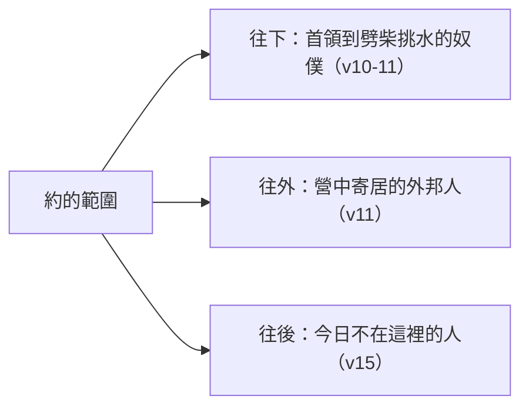

# 申命記 第29章

<!-- chapter-navigation:start -->
| [前一章](../05%20申命記/第28章.md) | [回目錄](../05%20申命記/全書目錄及綱要.md) | [下一章](../05%20申命記/第30章.md) |
| :--- | :---: | ---: |
<!-- chapter-navigation:end -->

1. 這是耶和華在[[摩押地]]吩咐摩西與以色列人[[摩押平原之約|立約的話]]，是在他和他們於[[何烈山]]所立的約之外。
2. 摩西召了以色列眾人來，對他們說：耶和華在埃及地，在你們眼前向法老和他眾臣僕，並他全地所行的一切事，你們都看見了，
3. 就是你親眼看見的大試驗和[[異蹟奇事（ot 與 mo.phet）|神蹟，並那些大奇事]]。
4. 但耶和華到今日沒有使你們[[心能明白眼能看見耳能聽見|心能明白，眼能看見，耳能聽見]]。
5. 我領你們[[曠野飄流四十年|在曠野四十年]]，你們身上的[[衣服沒有穿破鞋沒有穿壞（ba.lah）|衣服並沒有穿破]]，腳上的鞋也沒有穿壞。
6. 你們沒有吃餅，也沒有喝清酒濃酒。這要使你們知道，耶和華是你們的神。
7. 你們來到這地方，[[以色列戰勝亞摩利王西宏互文（申2：24-37；3：1-7；詩135：10-12；136：17-22）|希實本王西宏]]、[[以色列戰勝巴珊王噩互文（申3：1-11；詩135：10-12；136：17-22）|巴珊王噩]]都出來與我們交戰，我們就擊殺了他們，
8. 取了他們的地給流便支派、迦得支派，和瑪拿西半支派為業。
9. 所以你們要謹守遵行這約的話，好叫你們在一切所行的事上亨通。
10. 今日，你們的首領、族長（原文作支派）、長老、官長、以色列的男丁，你們的妻子兒女，和[[寄居的|營中寄居的]]，以及為你們[[劈柴挑水的人]]，都站在耶和華─你們的神面前，
11. 併於上節。
12. [[進入約中（a.var）|為要你順從]]耶和華─你神今日與你所立的約，向你所起的誓。
13. 這樣，他要照他向你所應許的話，又向你列祖亞伯拉罕、以撒、雅各所起的誓，今日立你作他的子民，他作你的神。
14. 我不但與你們立這約，起這誓，
15. 凡與我們一同站在耶和華─我們神面前的，並[[這約是與哪一代人立的|今日不在我們這裡的人]]，我也與他們立這約，起這誓。
16. 我們曾住過埃及地，也從列國經過；這是你們知道的。
17. 你們也看見他們中間可憎之物，並他們[[古代近東偶像崇拜|木、石、金、銀的偶像]]。
18. 惟恐你們中間，或男或女，或族長或支派長，今日心裡偏離耶和華─我們的神，去事奉那些國的神；又怕你們中間有[[惡根生出苦菜和茵蔯（rosh 與 la.a.nah）|惡根生出苦菜和茵蔯]]來，
19. 聽見這咒詛的話，心裡仍是自誇說：我雖然行事[[心裡頑梗卻還是平安|心裡頑梗]]，連累眾人，卻還是平安。
20. 耶和華必不饒恕他；耶和華的怒氣與憤恨要向他發作，如煙冒出，將這書上所寫的一切咒詛都加在他身上。耶和華又要[[塗抹（ma.chah）|從天下塗抹他的名]]，
21. 也必照著寫在律法書上、約中的一切咒詛將他從以色列眾支派中分別出來，使他受禍。
22. 你們的後代，就是以後興起來的子孫，和遠方來的外人，看見這地的災殃，並耶和華所降與這地的疾病，
23. 又看見[[硫磺鹽鹵火跡的荒地|遍地有硫磺，有鹽鹵，有火跡]]，沒有耕種，沒有出產，連草都不生長─好像耶和華在忿怒中所傾覆的[[所多瑪]]、[[蛾摩拉]]、[[押瑪]]、[[洗扁]]一樣─
24. 所看見的人，連萬國人，都必問說：耶和華為何向此地這樣行呢？這樣大發烈怒是什麼意思呢？
25. 人必回答說：是因這地的人離棄了耶和華─他們列祖的神，領他們出埃及地的時候與他們所立的約，
26. 去事奉敬拜素不認識的別神，是耶和華所未曾給他們安排的。
27. 所以耶和華的怒氣向這地發作，將這書上所寫的一切咒詛都降在這地上。
28. 耶和華在怒氣、忿怒、大惱恨中將他們[[拔出來扔在別的地上（na.tash）|從本地拔出來]]，扔在別的地上，像今日一樣。
29. [[隱祕的事與明顯的事（sa.tar 與 ga.lah）|隱祕的事]]是屬耶和華─我們神的；惟有明顯的事是永遠屬我們和我們子孫的，好叫我們遵行這律法上的一切話。

---

## 本章知識節點

### 神學
- [[摩押平原之約]]
- [[西乃之約]]
- [[亞伯拉罕之約]]
- [[隱祕的事與明顯的事（sa.tar 與 ga.lah）]]
- [[硫磺與火從天上降下]]
- [[漸進式的啟示]]

### 原文
- [[進入約中（a.var）]]
- [[衣服沒有穿破鞋沒有穿壞（ba.lah）]]
- [[惡根生出苦菜和茵蔯（rosh 與 la.a.nah）]]
- [[拔出來扔在別的地上（na.tash）]]
- [[塗抹（ma.chah）]]
- [[異蹟奇事（ot 與 mo.phet）]]
- [[寄居的]]

### 主題
- [[心能明白眼能看見耳能聽見]]
- [[心裡頑梗卻還是平安]]
- [[硫磺鹽鹵火跡的荒地]]
- [[立約]]
- [[嗎哪]]

### 文化
- [[劈柴挑水的人]]

### 地點
- [[何烈山]]
- [[摩押地]]
- [[所多瑪]]
- [[蛾摩拉]]
- [[押瑪]]
- [[洗扁]]

### 歷史
- [[曠野飄流四十年]]

### 解經爭議
- [[這約是與哪一代人立的]]

### 背景
- [[古代近東偶像崇拜]]

### 互文
- [[申8：3 人活著不是單靠食物]]
- [[以色列戰勝亞摩利王西宏互文（申2：24-37；3：1-7；詩135：10-12；136：17-22）]]
- [[以色列戰勝巴珊王噩互文（申3：1-11；詩135：10-12；136：17-22）]]

---

## 本章整理

### 又一次立約：這是重申，還是另一個約（v1）

第二十九章開頭只有一句話，卻替整章定了性：「這是耶和華在摩押地吩咐摩西與以色列人立約的話，是在他和他們於何烈山所立的約之外。」CT 說聖經學者將 [[摩押平原之約|此約]] 稱作「巴勒斯坦之約」，GT《申命記雷氏研讀本》用的是同一個名字。

分歧就落在「之外」那兩個字上。CT 讀成重申：「之外」意指以 [[西乃之約]] 為基礎，加以重申和擴充。GT《啟導本聖經申命記註釋》同向，說神歷代與以色列人所立之約都以西奈之約為基礎。GT《聖經精讀本──申命記註解》說得最細：「這句話並不是指『並非在何烈山所立的約』，而是指『除了在何烈山所立的約之外，再次』」，並指出「這並非指聖約的內容有所更新，而是指立約的物件有所改變」——[[何烈山|何烈山]] 之約與摩押平地之約是本質上相同的約。

KC 的判斷相反。他說這裡有一個新的約，不是舊約的更新，而是一個額外的約，並不廢掉何烈山的約；他把三個約排開來——與列祖 [[亞伯拉罕之約|亞伯拉罕、以撒、雅各所立的]] 是無條件的約，何烈山之約是建立在律法之上的約，而 [[摩押地]] 的這一個把列祖之約所表達的恩典與何烈山之約所根據的律法結合在一起。

> [!note] 這個分歧值得記下來
> 四套來源都同意這一章在立約，也都同意它與何烈山有關；分別在於「另立」還是「重申」。經文本身只給了「之外」這兩個字，沒有再多說。

### 立約之前先數算：四十年做過什麼（v2-9）

摩西沒有直接進到條款，而是先回頭數。第2至3節講出埃及的 [[異蹟奇事（ot 與 mo.phet）|大試驗、神蹟與大奇事]]，第5至6節講曠野的日常，第7至8節講 [[以色列戰勝亞摩利王西宏互文（申2：24-37；3：1-7；詩135：10-12；136：17-22）|戰勝西宏]] 與 [[以色列戰勝巴珊王噩互文（申3：1-11；詩135：10-12；136：17-22）|戰勝噩]]。CT 把這三段的共同點點出來：從生活的供應與保守，到爭戰的得勝，全是神所賜的恩典。

中間卻插了一句很不搭調的話。第4節說：「但耶和華到今日沒有使你們心能明白，眼能看見，耳能聽見。」上一節才說他們「親眼看見」，這一節卻說他們沒有看見——[[心能明白眼能看見耳能聽見|同一批人的兩種看見]]。

各家都停在這裡處理一個誤讀。GT《聖經精讀本──申命記註解》寫得最直接：「若錯誤地解釋本節,就會誤認為以色列的無知與頑梗都是神的責任」，但本節「乃是悖論性地警戒、責備了以色列」。KC 說耶和華沒有給他們一顆能轉向他的心、眼、耳，這並不是因為耶和華不願意，而是因為他們不要；他們從來沒有求他給。CT 的說法是：本節並非表示神的無能，而是詫異以色列人見過那些神蹟奇事之後，仍不能醒悟過來。

第5至6節是這個診斷的反面例子：[[衣服沒有穿破鞋沒有穿壞（ba.lah）|衣服沒有穿破，鞋也沒有穿壞]]。STEP語言資料顯示這兩處是同一個動詞的兩種形態（H1086），CT 的原文字義也記下「穿壞」原文與「穿破」同字。GT《申命記串珠聖經註釋》說他們沒有吃餅、也沒有喝清酒濃酒，是因神為他們預備了 [[嗎哪]] 和活水；GT《聖經精讀本──申命記註解》進一步說，神禁止他們在 [[曠野飄流四十年|四十年曠野生活]] 中從事耕種，是為了使他們認識到神的權能，同時也認識到 [[申8：3 人活著不是單靠食物|人活著並不是只靠糧食]]。

### 誰站在這裡：一份從上到下、從今到後的名單（v10-15）

第10至11節把立約的人一一點名，順序是從最高到最低：首領、族長、長老、官長、以色列的男丁、妻子、兒女、營中 [[寄居的]]，最後是 [[劈柴挑水的人]]。

| 誰 | 各家的說明 |
| --- | --- |
| 營中寄居的 | CT：自願隨以色列人飄流在曠野的外族人（可能是出十二38 一起出埃及的外邦人） |
| 劈柴挑水的人 | CT：服役的奴僕（可能是書九21 的外邦奴僕）；GT《串珠》：社會的下層階級 |
| 妻子、兒女 | BH：反映立約的家庭性質，也把責任傳給下一代 |
| 外邦的寄居者 | BH：他們出現在立約群體裡，顯出這約向以色列血統之外的人敞開 |

GT《聖經精讀本──申命記註解》認為這份名單本身就是重點：「不分男女老少,身份的貴賤,地位的高下及民族和血統,只要居住在以色列共同體內的人皆可以『無差別』地參與耶和華的聖約」，並說在把身份乃至血統視為神聖的古代社會，這足以說是劃時代性事件。

第12節說明他們站在那裡要做什麼。和合本作「為要你順從」，但 [[進入約中（a.var）|原文的動作是走進去]]。CT 在話中之光直接寫明：「為要你順從」原文是「為要你進入」；他在原文字義另說這個字指通過劈開的祭物當中，表示誓約的成立。GT《聖經精讀本──申命記註解》把 [[立約]] 這個習俗說完整——立約的雙方作為約的擔保，將牲畜劈成兩半，兩個人一起從被劈開的牲畜之間走過。

第14至15節再把範圍往後推：「並今日不在我們這裡的人，我也與他們立這約，起這誓。」這正面回答了 [[這約是與哪一代人立的|申命記五3 留下的那個問題]]。CT 說立約不是只為當時活著而站在神面前的人，而是包括以後要來的人和在別處的人。

### 一條看不見的根（v16-21）

第16至17節先講他們見過什麼：住過埃及地，也從列國經過，看見他們中間可憎之物，並他們木、石、金、銀的 [[古代近東偶像崇拜|偶像]]。CT 指出這裡的「並」字可翻作「就是、亦即」，表示可憎之物與偶像是同義詞、彼此通用。

第18節接著防的是一件還沒發生的事：[[惡根生出苦菜和茵蔯（rosh 與 la.a.nah）|又怕你們中間有惡根生出苦菜和茵蔯來]]。GT《啟導本聖經申命記註釋》在這裡加了一條重要的辨別：「此處『苦菜』實為一種毒果，與《出埃及記》十二8的苦菜不同，後者無毒，是逾越節必吃的」。GT《申命記雷氏研讀本》說明這個比喻的作用：一個拜偶像的人或群體能影響整個民族，使他們都中了拜偶像的毒。

KC 把這一節的危險分成兩個方向：一種是我們重新對神百姓以外、世界裡的東西動了眼目，另一種不是從外面來的，而是人裡面可能有的一條根。他並指出茵蔯這種毒像鴉片一樣起作用，因此曾被用來使受刑的人麻醉（太27:34）。

第19節寫出那條根長出來的話——[[心裡頑梗卻還是平安|「我雖然行事心裡頑梗，連累眾人，卻還是平安」]]。KC 讀出的順序是：當苦毒的麻醉發作時，背道的思想就來了，這使人談論平安，其實並沒有平安。CT 說這是自己心裡慶幸，雖然作惡多端卻仍平安無事。BH 另注意到這一節的下半句——和合本作「連累眾人」，它讀到的英文譯法卻是水澆的地連同乾旱之地一同遭災，並說這一對意象表示審判涵蓋一切、無所遺漏，正與同書二十八23 那句天變為銅、地變為鐵相呼應。

後果寫在第20至21節：耶和華必不饒恕他，又要從天下 [[塗抹（ma.chah）|塗抹他的名]]。CT 說「他的名」就是他自己，即指將他完全除滅；並說第21節的「分別出來」意指以色列人所擁有的福分，與他無分無關，獨自承擔災禍。KC 注意到人稱的變化：第19至21節講的是一個個人，而接下來摩西的話就從這個必須被除去的個人，轉到了整個被趕出去的民族。

### 後來的人走過這片地（v22-28）

第22節換了鏡頭：說話的不再是摩西，看的人是後代子孫與遠方來的外人。他們看見的寫在第23節——[[硫磺鹽鹵火跡的荒地|遍地有硫磺，有鹽鹵，有火跡]]，並且拿 [[所多瑪]]、[[蛾摩拉]]、[[押瑪]]、[[洗扁]] 作比。

BH 先把這幅景象的機制說清楚：鹽會使土地失去生產力，硫磺與鹽合起來就是一片不能住人的荒地。CT 說遍地蓋滿火山噴發後岩漿冷卻後遺留的硫磺、鹽鹵、火跡，不適於耕種生產，並在原文字義指出押瑪、洗扁「現今已無遺跡可考，有聖經學者認為已經沉在死海海底」。GT《啟導本聖經申命記註釋》另給了一個條約文書的背景：「一城一地若破壞條約，須將之徹底燒毀。覆以硫磺、鹽鹵，乃古代通行的懲罰，使其地永不能再有人居住。」照這個讀法，這幅景象不只是自然災害，而是背約者依例應得的處置——與 [[硫磺與火從天上降下|所多瑪那一次]] 是同一種刑罰。

第24至26節是一問一答：萬國人問「耶和華為何向此地這樣行呢」，答案是「因這地的人離棄了耶和華─他們列祖的神」。GT《聖經精讀本──申命記註解》讀出的重點是羞辱：以色列不但未能在列邦受到審判時指出其原因、且善導他們，反而為他們所指摘。

第28節收在兩個動作上：[[拔出來扔在別的地上（na.tash）|將他們從本地拔出來，扔在別的地上]]。KC 特別把分寸點出來——神並沒有毀滅這百姓，而是把他們連根拔起；十個支派被亞述人擄走，兩個支派被擄到巴比倫。==地與人是分開處理的：地被傾覆留在原處供人觀看，人被拔起搬到別處。==而這句話與上一章第63節的語氣並不一樣：那裡說耶和華要喜悅毀滅你們、使你們滅亡，用的是兩個表示滅絕的動詞；這裡用的卻是拔起與扔出去。==兩章說的不是同一個動作——一章寫的是條款上的結局，一章寫的是歷史上實際發生的事。==

### 隱祕與明顯：立約之後人該做什麼（v29）

全章最後一節單獨成段，語氣與前面二十八節完全不同：「[[隱祕的事與明顯的事（sa.tar 與 ga.lah）|隱祕的事是屬耶和華─我們神的；惟有明顯的事是永遠屬我們和我們子孫的]]，好叫我們遵行這律法上的一切話。」STEP語言資料顯示這是同一種形態的兩個被動分詞（H5641 與 H1540H），一個是被藏起來的那些事，一個是被揭開的那些事。

GT《申命記雷氏研讀本》說得最簡潔：「這節重要的經文定下神啟示的界限和目的：有某些事情，神選擇不說出來，而祂（在這情況下透過律法）所啟示的，就是要祂子民遵守的事情。」GT《啟導本聖經申命記註釋》把兩邊的內容說明白：隱祕的事指只有神才知道屬於未來的發展，「都不應該去揣測，因全在神手中」；明顯的事則是「神已顯明的律法、所昭示的神的旨意和人的責任」。GT《聖經精讀本──申命記註解》從中讀出 [[漸進式的啟示|神的主權與啟示的漸進性]]。

KC 的讀法與其他三家不同，值得並陳。他不把「隱祕的事」讀成人不該揣測的未來，而是讀成神若必須因全民違背律法而懲罰他們時，仍對餘民施恩的作為；而下一章就會顯出其中一些——神若要施行恢復，那本是一件隱祕的事，對信心而言卻已是被啟示的事。

> [!important] 這一節是本章的出口
> 全章有二十八節在講約與背約的後果，只有這一節在講立約之後人該做什麼。CT 在話中之光下的結論是：在神的眼裡，切實遵行「明顯的事」，比搞清楚那些「隱祕的事」更有屬天的價值；不順服神是出於意志的行為，並不是缺少知識。

### 跨章脈絡：摩押平原的第三篇講話

GT 把本章的位置說清楚：第1節在希伯來文聖經中是二十八章的最後一節，可能是第二篇長篇講話（四44至二十八68）的結語，也可能是第三篇講話（二十九2至三十20）的引言；而二十九至三十章可當作一至二十八章的摘要或總結看。

這也解釋了本章與前一章的關係。第二十八章用五十四節列出咒詛的內容，本章第19、20、21、27 節四次提到「這書上所寫的一切咒詛」，等於把那一章整份接了進來。CT 在第19節註明：「這咒詛的話」就是本書第二十七、二十八章中所載咒詛的話。

而摩西這篇講話還沒講完。GT《聖經精讀本──申命記註解》把接下來的走向也標了出來：若以色列因不順服而受咒詛分散到世界各地，只要肯悔改歸向神，憐憫之神必重新恢復他們的盼望與確信——那是下一章的內容，也正是 KC 在第29節讀出的那件「隱祕的事」。

**參考資料**
https://www.ccbiblestudy.org/Old%20Testament/05Deut/05CT29.htm
https://www.ccbiblestudy.org/Old%20Testament/05Deut/05GT29.htm
https://www.kingcomments.com/en/bible-studies/Deu/29
https://biblehub.com/study/deuteronomy/29.htm
https://github.com/STEPBible/STEPBible-Data

<!-- appendix-links:start -->
## 附錄

### 相關地圖
- [[appendix/fhl_maps/maps/025|〈申圖一〉應許之地全圖]]
<!-- appendix-links:end -->

<!-- chapter-navigation:start -->
| [前一章](../05%20申命記/第28章.md) | [回目錄](../05%20申命記/全書目錄及綱要.md) | [下一章](../05%20申命記/第30章.md) |
| :--- | :---: | ---: |
<!-- chapter-navigation:end -->
