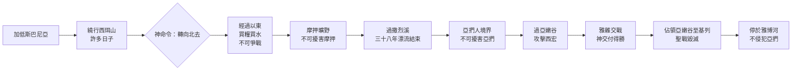

# 申命記 第2章

1. 此後，我們轉回，從紅海的路往曠野去，是照耶和華所吩咐我的。我們在[[以色列繞行西珥山|西珥山繞行]]了許多日子。
2. 耶和華對我說：
3. 你們繞行這山的日子夠了，要轉向北去。
4. 你吩咐百姓說：你們弟兄以掃的子孫住在西珥，你們要經過他們的境界。他們必懼怕你們，所以你們要分外謹慎。
5. 不可與他們爭戰；他們的地，連腳掌可踏之處，我都不給你們，因我已將西珥山賜給以掃為業。
6. 你們要用錢向他們買糧吃，也要用錢向他們買水喝。
7. 因為耶和華─你的神在你手裡所辦的一切事上已賜福與你。你走這大曠野，他都知道了。這四十年，耶和華─你的神常與你同在，故此你一無所缺。
8. 於是，我們離了我們弟兄以掃子孫所住的西珥，從亞拉巴的路，經過[[以拉他]]、[[以旬迦別]]，轉向摩押曠野的路去。
9. 耶和華吩咐我說：[[不可擾害摩押人]]，也不可與他們爭戰。他們的地，我不賜給你為業，因我已將[[亞珥]]賜給羅得的子孫為業。
10. （先前，有以米人住在那裡，民數眾多，身體高大，像[[亞衲人]]一樣。
11. 這以米人像[[亞衲人]]；也算為[[利乏音人]]；摩押人稱他們為以米人。
12. 先前，何利人也住在西珥，但以掃的子孫將他們除滅，得了他們的地，接著居住，就如以色列在耶和華賜給他為業之地所行的一樣。）
13. 現在，起來[[過撒烈溪]]！於是我們過了撒烈溪。
14. 自從離開加低斯巴尼亞，到過了[[撒烈溪]]的時候，共有三十八年，等那世代的兵丁都從營中滅盡，正如耶和華向他們所起的誓。
15. 耶和華的手也攻擊他們，將他們從營中除滅，直到滅盡。
16. 兵丁從民中都滅盡死亡以後，
17. 耶和華吩咐我說：
18. 你今天要從摩押的境界[[亞珥]]經過，
19. 走近亞捫人之地，不可擾害他們，也不可與他們爭戰。亞捫人的地，我不賜給你們為業，因我已將那地賜給羅得的子孫為業。
20. （那地也算為[[利乏音人]]之地，先前利乏音人住在那裡，亞捫人稱他們為[[散送冥與利乏音人|散送冥]]。
21. 那民眾多，身體高大，像[[亞衲人]]一樣，但耶和華從亞捫人面前除滅他們，亞捫人就得了他們的地，接著居住。
22. 正如耶和華從前為住西珥的以掃子孫將何利人從他們面前除滅、他們得了何利人的地、接著居住一樣，直到今日。
23. 從迦斐託出來的迦斐託人將先前住在鄉村直到迦薩的亞衛人除滅，接著居住。）
24. 你們起來前往，過[[亞嫩谷]]；我已將亞摩利人希實本王西宏和他的地交在你手中，你要與他爭戰，得他的地為業。
25. 從今日起，我要使天下萬民聽見你的名聲都驚恐懼怕，且因你發顫傷慟。
26. 我從基底莫的曠野差遣使者去見希實本王西宏，用和睦的話說：
27. 求你容我從你的地經過，只走大道，不偏左右。
28. 你可以賣糧給我吃，也可以賣水給我喝，只要容我步行過去，
29. 就如住西珥的以掃子孫和住[[亞珥]]的摩押人待我一樣，等我過了約但河，好進入耶和華─我們神所賜給我們的地。
30. 但希實本王西宏不容我們從他那裡經過；因為耶和華─你的神使他心中剛硬，性情頑梗，為要將他交在你手中，像今日一樣。
31. 耶和華對我說：從此起首，我要將西宏和他的地交給你；你要得他的地為業。
32. 那時，西宏和他的眾民出來攻擊我們，在[[雅雜]]與我們交戰。
33. 耶和華─我們的神將他交給我們，我們就把他和他的兒子，並他的眾民，都擊殺了。
34. 我們奪了他的一切城邑，將有人煙的各城，連女人帶孩子，盡都毀滅，沒有留下一個。
35. 惟有牲畜和所奪的各城，並其中的財物，都取為自己的掠物。
36. 從[[亞嫩谷]]邊的[[亞羅珥]]和谷中的城，直到[[基列]]，耶和華─我們的神都交給我們了，沒有一座城高得使我們不能攻取的。
37. 惟有亞捫人之地，凡靠近[[雅博|雅博河]]的地，並山地的城邑，與耶和華─我們神所禁止我們去的地方，都沒有挨近。

<!-- fhl-map-links:start -->
## 相關地圖

- [[appendix/fhl_maps/maps/025|〈申圖一〉應許之地全圖]]
- [[appendix/fhl_maps/maps/026|〈申圖二〉征服東岸及分地給兩個半支派]]
- [[appendix/fhl_maps/maps/031|〈書圖四〉以色列人所征服應許地的諸王]]
<!-- fhl-map-links:end -->

---

## 本章知識節點

### 神學
- [[神硬化西宏心]]
- [[聖戰毀滅原則]]
- [[四十年曠野漂流結束]]
- [[神賜福四十年無缺]]

### 地理
- [[亞嫩谷]]
- [[雅雜]]
- [[亞羅珥]]
- [[亞珥]]
- [[撒烈溪]]
- [[以拉他]]
- [[以旬迦別]]
- [[基列]]
- [[雅博]]

### 歷史
- [[以色列繞行西珥山]]
- [[不可擾害以掃子孫]]
- [[不可擾害摩押人]]
- [[何利人被以掃子孫除滅]]
- [[過撒烈溪]]
- [[不可擾害亞捫人]]
- [[散送冥與利乏音人]]
- [[迦斐託人除滅亞衛人]]
- [[亞嫩谷至基列全地得勝]]
- [[征服希實本王西宏]]

### 民族
- [[亞衲人]]
- [[以米人與利乏音人]]

---

## 本章整理

### 繞行西珥與轉向北上（v1-7）
以色列離開加低斯巴尼亞後，順著紅海的路轉入曠野，在[[以色列繞行西珥山|西珥山]]繞行許多日子（v1）。耶和華指示摩西：「你們繞行這山的日子夠了，要轉向北去」（v3）。神吩咐百姓經過[[不可擾害以掃子孫|以掃子孫]]（以東人）的境界，雖然以東人必懼怕以色列，但以色列[[不可擾害以掃子孫|不可與他們爭戰]]，連腳掌可踏之處也不賜給以色列，因[[以色列繞行西珥山|西珥山]]已賜給以掃為業（v4-5）。以色列當用錢向他們買糧買水（v6）。摩西回顧這四十年曠野漂流：「耶和華─你的神在你手裡所辦的一切事上已賜福與你……這四十年，耶和華─你的神常與你同在，故此你一無所缺」（v7），見證[[神賜福四十年無缺]]的恩典。

### 經過摩押與亞捫之地：不可擾害的命令（v8-23）
以色列離開以東，轉向[[不可擾害摩押人|摩押曠野]]的路去（v8）。耶和華吩咐[[不可擾害摩押人|不可擾害摩押人]]，也不與他們爭戰，因[[亞珥]]已賜給羅得的子孫為業（v9）。經文插入歷史註記：先前有[[以米人與利乏音人|以米人]]住在那裡，民數眾多、身體高大，像[[亞衲人]]一樣，也算為[[利乏音人]]（v10-11）。同樣，[[何利人被以掃子孫除滅|何利人]]先住西珥，後被以掃子孫除滅得地而居（v12），這成為以色列得地的預表。

繼而神吩咐過[[撒烈溪]]（v13）。從離開加低斯巴尼亞到過[[過撒烈溪|撒烈溪]]，共三十八年，等那世代的兵丁都從營中滅盡，應驗耶和華的誓言（v14-15），標誌[[四十年曠野漂流結束]]。接著神吩咐從摩押境界[[亞珥]]經過，走近[[不可擾害亞捫人|亞捫人]]之地，同樣[[不可擾害亞捫人|不可擾害他們]]，因那地賜給羅得子孫為業（v18-19）。經文再記載：那地先有[[利乏音人]]（亞捫人稱[[散送冥與利乏音人|散送冥]]），身材高大如亞衲人，被耶和華從亞捫人面前除滅（v20-21）。又記[[迦斐託人除滅亞衛人|迦斐託人]]從迦斐託出來，除滅[[迦斐託人除滅亞衛人|亞衛人]]而居住（v23）。這些歷史註記強調「耶和華從他們面前除滅他們，他們得了他們的地，接著居住」（v22），彰顯神主權賜地的歷史模式。

> [!note]- 歷史註記的神學功能
> 經文中關於以米人、利乏音人、何利人、散送冥、亞衛人被除滅的插入記載（v10-12, 20-23），並非單純地理志，而是神學論證：耶和華曾為外邦人（以掃、羅得子孫）行「聖戰」除滅巨人得地，如今必為以色列行同樣的事。這構成「得地」合法性的類比論證。

### 征服希實本王西宏：聖戰的開始（v24-37）
神命令以色列起行，過[[亞嫩谷]]，將[[征服希實本王西宏|亞摩利人希實本王西宏]]和他的地交在手中，要與他爭戰，得地為業（v24），並預告要使天下萬民聽見以色列名聲都驚恐懼怕（v25）。摩西從基底莫曠野差遣使者用和睦話請求經過，承諾只走大道、用錢買糧買水（v26-29）。但西宏不允，因「耶和華─你的神使他心中剛硬，性情頑梗，為要將他交在你手中」（v30），見證[[神硬化西宏心]]的主權。

耶和華對摩西說：「從此起首，我要將西宏和他的地交給你」（v31）。西宏率眾在[[雅雜]]交戰，耶和華將他交給以色列，擊殺他、他的兒子與眾民（v32-33）。以色列奪取一切城邑，將有人煙的各城連女人帶孩子盡都[[聖戰毀滅原則|毀滅]]，沒有留下一個（v34），惟牲畜和財物取為掠物（v35）。從[[亞嫩谷]]邊的[[亞羅珥]]和谷中的城，直到[[基列]]，沒有一座城高得使以色列不能攻取的（v36），成就[[亞嫩谷至基列全地得勝]]。惟有亞捫人之地、靠近[[雅博]]的地與山地城邑，因耶和華禁止，都沒有挨近（v37)。

### 跨章脈絡：從曠野漂流到得地為業
本章是申命記歷史回顧的轉折點。前半段（v1-23）總結「繞行」與「等待」的四十年，核心是[[神賜福四十年無缺]]的供應與對外邦產業界限的尊重（以東、摩押、亞捫）；後半段（v24-37）進入「爭戰」與「得地」的新階段，核心是[[神硬化西宏心]]啟動[[聖戰毀滅原則]]，標誌應許之地征服的實質性開端。地理上從[[以色列繞行西珥山|西珥山]]、亞拉巴、[[以拉他]]、[[以旬迦別]]、[[過撒烈溪|撒烈溪]]、[[亞珥]]、[[亞嫩谷]]、[[雅雜]]、[[亞羅珥]]至[[基列]]的路線，串聯起「曠野漂流」到「約但河東得地」的救恩史地標。

**參考資料**
https://www.ccbiblestudy.org/Old%20Testament/05Deut/05CT02.htm
https://www.ccbiblestudy.org/Old%20Testament/05Deut/05GT02.htm
https://www.kingcomments.com/en/bible-studies/Deu/2
https://biblehub.com/study/deuteronomy/2.htm
