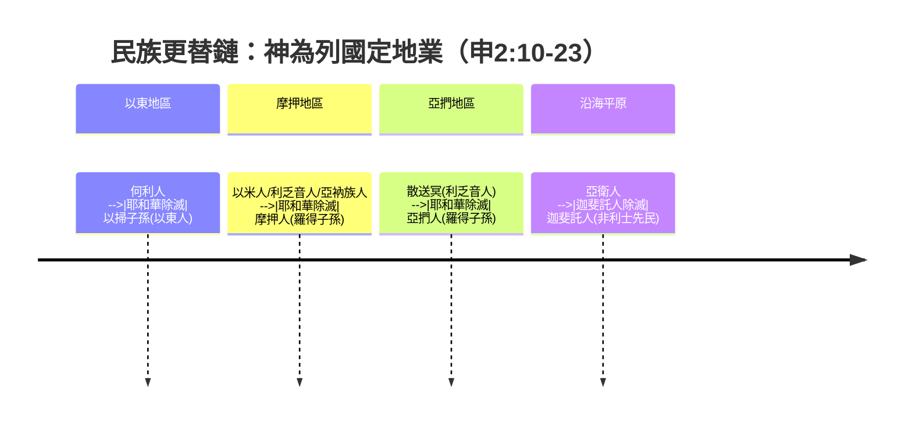
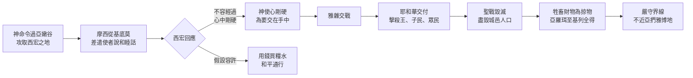
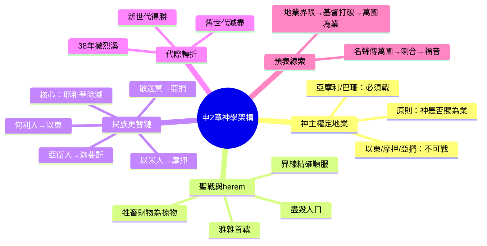

# 申命記 第2章

1. 此後，我們轉回，從[[海（紅海）|紅海]]的路往曠野去，是照耶和華所吩咐我的。我們在[[西珥山]]繞行了許多日子。
2. 耶和華對我說：
3. 你們繞行這山的日子夠了，要轉向北去。
4. 你吩咐百姓說：你們弟兄[[以掃]]的子孫住在[[西珥山|西珥]]，你們要經過他們的境界。他們必懼怕你們，所以你們要分外謹慎。
5. 不可與他們爭戰；他們的地，連腳掌可踏之處，我都不給你們，因我已將[[西珥山]]賜給[[以掃]]為業。
6. 你們要用錢向他們買糧吃，也要用錢向他們買水喝。
7. 因為耶和華─你的神在你手裡所辦的一切事上已賜福與你。你走這大曠野，他都知道了。這四十年，耶和華─你的神常與你同在，故此你一無所缺。
8. 於是，我們離了我們弟兄[[以掃]]子孫所住的[[西珥山|西珥]]，從[[亞拉巴（Aravah）|亞拉巴]]的路，經過[[以拉他（Elath）|以拉他]]、[[以旬迦別（Ezion-geber）|以旬迦別]]，轉向[[摩押曠野]]的路去。
9. 耶和華吩咐我說：不可擾害[[摩押人]]，也不可與他們爭戰。他們的地，我不賜給你為業，因我已將[[亞珥（Ar）|亞珥]]賜給[[羅得]]的子孫為業。
10. （先前，有[[以米人]]住在那裡，民數眾多，身體高大，像[[亞衲族人（Anaqim）|亞衲人]]一樣。
11. 這[[以米人]]像[[亞衲族人（Anaqim）|亞衲人]]；也算為[[利乏音人]]；[[摩押人]]稱他們為以米人。
12. 先前，[[何利人]]也住在[[西珥山|西珥]]，但[[以掃]]的子孫將他們除滅，得了他們的地，接著居住，就如以色列在耶和華賜給他為業之地所行的一樣。）
13. 現在，起來[[過撒烈溪舊世代滅盡|過撒烈溪]]！於是我們過了撒烈溪。
14. 自從離開[[加低斯|加低斯巴尼亞]]，到過了[[撒烈溪（Zered）|撒烈溪]]的時候，共有三十八年，等那世代的兵丁都從營中滅盡，正如耶和華向他們所起的誓。
15. 耶和華的手也攻擊他們，將他們從營中除滅，直到滅盡。
16. 兵丁從民中都滅盡死亡以後，
17. 耶和華吩咐我說：
18. 你今天要從摩押的境界[[亞珥（Ar）|亞珥]]經過，
19. 走近[[亞捫人]]之地，不可擾害他們，也不可與他們爭戰。亞捫人的地，我不賜給你們為業，因我已將那地賜給[[羅得]]的子孫為業。
20. （那地也算為[[利乏音人]]之地，先前利乏音人住在那裡，[[亞捫人]]稱他們為[[散送冥（Zamzummim）|散送冥]]。
21. 那民眾多，身體高大，像[[亞衲族人（Anaqim）|亞衲人]]一樣，但耶和華從[[亞捫人]]面前除滅他們，亞捫人就得了他們的地，接著居住。
22. 正如耶和華從前為住[[西珥山|西珥]]的[[以掃]]子孫將[[何利人]]從他們面前除滅、他們得了何利人的地、接著居住一樣，直到今日。
23. 從迦斐託出來的[[迦斐託人（Caphtorim）|迦斐託人]]將先前住在鄉村直到[[迦薩（Gaza）|迦薩]]的[[亞衛人（Avvim）|亞衛人]]除滅，接著居住。）
24. 你們起來前往，過[[亞嫩河|亞嫩谷]]；我已將[[亞摩利人]][[希實本]]王[[亞摩利王西宏|西宏]]和他的地交在你手中，你要與他爭戰，得他的地為業。
25. 從今日起，我要使天下萬民聽見你的名聲都驚恐懼怕，且因你發顫傷慟。
26. 我從[[基底莫（Kedemoth）|基底莫]]的曠野差遣使者去見[[希實本]]王[[亞摩利王西宏|西宏]]，用和睦的話說：
27. 求你容我從你的地經過，只走大道，不偏左右。
28. 你可以賣糧給我吃，也可以賣水給我喝，只要容我步行過去，
29. 就如住[[西珥山|西珥]]的[[以掃]]子孫和住[[亞珥（Ar）|亞珥]]的[[摩押人]]待我一樣，等我過了約但河，好進入耶和華─我們神所賜給我們的地。
30. 但[[希實本]]王[[亞摩利王西宏|西宏]]不容我們從他那裡經過；因為耶和華─你的神使他心中剛硬，性情頑梗，為要將他交在你手中，像今日一樣。
31. 耶和華對我說：從此起首，我要將[[亞摩利王西宏|西宏]]和他的地交給你；你要得他的地為業。
32. 那時，[[亞摩利王西宏|西宏]]和他的眾民出來攻擊我們，在[[雅雜（Jahaz）|雅雜]]與我們交戰。
33. 耶和華─我們的神將他交給我們，我們就把他和他的兒子，並他的眾民，都擊殺了。
34. 我們奪了他的一切城邑，將有人煙的各城，連女人帶孩子，[[聖戰毀滅原則|盡都毀滅]]，沒有留下一個。
35. 惟有牲畜和所奪的各城，並其中的財物，都取為自己的掠物。
36. 從[[亞嫩河|亞嫩谷]]邊的[[亞羅珥（Aroer）|亞羅珥]]和谷中的城，直到[[基列]]，耶和華─我們的神都交給我們了，沒有一座城高得使我們不能攻取的。
37. 惟有[[亞捫人]]之地，凡靠近[[雅博|雅博河]]的地，並山地的城邑，與耶和華─我們神所禁止我們去的地方，都沒有挨近。

---

## 本章知識節點

### 神學
- [[不可與兄弟民族爭戰（以東摩押亞捫）]]
- [[神為列國定地業（民族更替）]]
- [[聖戰毀滅原則]]
- [[神使西宏心中剛硬]]
- [[使天下萬民驚恐的名聲]]
- [[四十年一無所缺]]
- [[爭戰前先說和睦的話]]
- [[用錢買糧買水]]

### 地理
- [[西珥山]]
- [[亞拉巴（Aravah）]]
- [[以拉他（Elath）]]
- [[以旬迦別（Ezion-geber）]]
- [[摩押曠野]]
- [[亞珥（Ar）]]
- [[撒烈溪（Zered）]]
- [[基底莫（Kedemoth）]]
- [[亞嫩河]]
- [[亞羅珥（Aroer）]]
- [[希實本]]
- [[基列]]
- [[雅博]]
- [[雅雜（Jahaz）]]

### 民族
- [[以掃]]
- [[摩押人]]
- [[亞捫人]]
- [[亞摩利人]]
- [[亞摩利王西宏]]
- [[何利人]]
- [[利乏音人]]
- [[亞衲族人（Anaqim）]]
- [[以米人]]
- [[散送冥（Zamzummim）]]
- [[迦斐託人（Caphtorim）]]
- [[亞衛人（Avvim）]]

### 歷史
- [[過撒烈溪舊世代滅盡]]
- [[申2：12「就如以色列所行」是否後人補註]]
- [[以色列戰勝亞摩利王西宏]]
- [[十一天的路程與三十八年飄流]]

### 互文
- [[以色列戰勝亞摩利王西宏互文（申2：24-37；3：1-7；詩135：10-12；136：17-22）]]

---

## 本章整理

### 繞行西珥、經過以東地（v1-8）

摩西在申命記第二章開首回顧以色列從[[加低斯|加低斯巴尼亞]]轉回、從[[海（紅海）|紅海]]的路往曠野去，照耶和華所吩咐的（v1）。這段路程不只是地理移動，更是神主權安排的見證：以色列在[[西珥山]]繞行許多日子，直到神說「你們繞行這山的日子夠了，要轉向北去」（v3）。神明確吩咐不可與[[以掃|以東人]]爭戰，因[[西珥山]]已賜給[[以掃]]為業（v5）；百姓要用錢向他們買糧買水（v6），這體現[[用錢買糧買水]]與[[不可與兄弟民族爭戰（以東摩押亞捫）]]的雙重原則——神不但保護兄弟民族的地業，也要求以色列以公義商業方式通行。摩西特別強調：「這四十年，耶和華─你的神常與你同在，故此你一無所缺」（v7），這句話將整段曠野飄流定性為[[四十年一無所缺]]的恩典經驗，而非單純的懲罰。從[[亞拉巴（Aravah）|亞拉巴]]的路經過[[以拉他（Elath）|以拉他]]、[[以旬迦別（Ezion-geber）|以旬迦別]]，轉向[[摩押曠野]]（v8），標誌著舊世代漸盡、新世代即將進入應許之地的轉折。

> [!note] 歷史地理補充
> 以拉他與以旬迦別位於亞喀巴灣北端，是古代銅礦冶煉與海上貿易要衝（王上9:26；代下8:17）。以色列在此繞行，顯示神帶領他們避開以東核心領土，走邊境商路北上。

### 摩押與亞捫地界、民族更替記載（v9-23）

進入摩押境界時，神再次吩咐不可擾害[[摩押人]]、不可爭戰，因[[亞珥（Ar）|亞珥]]已賜給[[羅得]]子孫為業（v9）。經文隨即插入一段民族學註記（v10-12）：先前有[[以米人]]住在那裡，民數眾多、身體高大，像[[亞衲族人（Anaqim）|亞衲族人]]一樣，也算為[[利乏音人]]；摩押人稱他們為以米人。同樣，[[何利人]]先住[[西珥山]]，但以掃子孫將他們除滅、得地居住，「就如以色列在耶和華賜給他為業之地所行的一樣」（v12）。這句比較引發學者討論：[[申2：12「就如以色列所行」是否後人補註]]？支持後人補註者指出，此語句打斷摩西講論流暢度，且預設迦南征服已完成，屬編輯層添加；反對者則認為摩西以預言口吻預述將來，或反映當時已知的族群更替模式。無論如何，這段經文確立[[神為列國定地業（民族更替）]]的神學核心：耶和華不僅掌管以色列命運，也主導列國興衰遷徙。

過[[撒烈溪（Zered）|撒烈溪]]成為關鍵時間標記（v13-14）：從離開[[加低斯]]到過撒烈溪，共三十八年，等那世代的兵丁都從營中滅盡，正如耶和華所起的誓（v14）。[[過撒烈溪舊世代滅盡]]不僅是人口更替，更是神審判應驗的具體歷程——「耶和華的手也攻擊他們，將他們從營中除滅，直到滅盡」（v15）。這裡的「耶和華的手」雙重指向：既是保護之手（v7），也是審判之手（v15），彰顯約束關係的嚴肅性。

接著轉向[[亞捫人]]之地，神同樣禁止擾害爭戰，因那地賜給[[羅得]]子孫（v19）。經文再次插入民族更替記載（v20-23）：那地也算為[[利乏音人]]之地，先前住著[[散送冥（Zamzummim）|散送冥]]，民眾多、身體高大像亞衲人，但耶和華從亞捫人面前除滅他們；正如為以掃子孫除滅何利人一樣。補充說明[[迦斐託人（Caphtorim）|迦斐託人]]從迦斐託出來，除滅住在鄉村直到[[迦薩（Gaza）|迦薩]]的[[亞衛人（Avvim）|亞衛人]]，接著居住。這串平行敘事構成「民族更替鏈」：何利人→以東人、以米人/利乏音人→摩押人、散送冥→亞捫人、亞衛人→迦斐託人，每一環都強調「耶和華從……面前除滅他們」，將歷史歸因於神的主權安排而非單純軍事優勢。

> [!important] 神學樞紐
> 這段經文將「聖戰」概念從以色列獨有擴展到列國通用：神按自己的旨意興起一國、降卑一國（參詩75:7-8）。以色列的產業得著不是孤立事件，而是神治理萬國大棋局中的一著。

### 攻取希實本王西宏之地（v24-37）

神命令起行過[[亞嫩河|亞嫩谷]]，宣告已將[[亞摩利王西宏]]和他的地交在以色列手中，要與他爭戰、得地為業（v24）。這標誌從「不可爭戰」（以東、摩押、亞捫）轉向「要爭戰」（亞摩利人），界線在於神是否將地賜給以色列為業。神應許「從今日起，我要使天下萬民聽見你的名聲都驚恐懼怕，且因你發顫傷慟」（v25），這是[[使天下萬民驚恐的名聲]]的啟始，後在耶利哥的喇合口中得到印證（書2:9-11）。

摩西從[[基底莫（Kedemoth）|基底莫]]曠野差遣使者向西宏說和睦的話（v26），請求只走大道、不偏左右，用錢買糧買水（v27-28），引用以東、摩押待遇為例（v29），體現[[爭戰前先說和睦的話]]原則（參申20:10-11）。但西宏不容以色列經過，「因為耶和華─你的神使他心中剛硬，性情頑梗，為要將他交在你手中」（v30）。[[神使西宏心中剛硬]]這句話引出深刻神學張力：神主權硬化人心（如法老），卻不免除人的責任。西宏的拒絕不是被動結果，而是他頑梗性情在神主權許可下的自我彰顯，最終成為神審判工具。

神對摩西說：「從此起首，我要將西宏和他的地交給你」（v31）。雙方在[[雅雜（Jahaz）|雅雜]]交戰（v32），耶和華將西宏交給以色列，擊殺他、他的兒子與眾民（v33），奪取一切城邑，將有人煙的各城連女人帶孩子盡都毀滅，沒有留下一個（v34）——這是[[聖戰毀滅原則]]（herem）的具體執行：完全歸神、不可留存人命。惟有牲畜與財物取為掠物（v35）。從[[亞羅珥（Aroer）|亞羅珥]]到[[基列]]，沒有一座城高得使以色列不能攻取的（v36），彰顯神應許的可靠。但以色列未挨近[[亞捫人]]之地、[[雅博]]河邊與山地城邑，凡耶和華所禁止的地方都沒有去（v37），顯示順服界線的精確。

> [!quote] 關鍵經文對照
> **申2:30** 「因為耶和華─你的神使他心中剛硬，性情頑梗，為要將他交在你手中」
> **出4:21** 「我要使他的心剛硬」
> **書11:19-20** 「除了基遍的希未人，沒有一城與以色列人講和的……是耶和華使他們心裡剛硬，來與以色列交戰，好叫他們被毀滅」
> 三處「神使心剛硬」形成神學序列：法老→西宏→迦南諸王，顯示神在審判中主權使用人的悖逆成就救贖計劃。

### 跨章脈絡與預表整理（v1-37）

申命記第二章在書卷結構中扮演「轉折樞紐」：前一章回顧加低斯失敗與十一天路程變四十年飄流（[[十一天的路程與三十八年飄流]]），本章記載舊世代滅盡、新世代過撒烈溪、首戰得勝，為後續攻取巴珊王噩（申3章）與進入迦南鋪路。本章三大地理單元——以東（不可戰）、摩押/亞捫（不可戰）、亞摩利（必須戰）——構成神學地理三角形，核心原則是「神是否將地賜給你為業」。這原則在後續歷史書反覆驗證：約書亞記嚴守herem界限（書6-7），士師記因不盡趕逐而陷入循環（士1-2），列王記因越界而被擄（王下17, 25）。

本章兩大預表線索值得注意：
1. **聖戰名聲傳播**：v25「使天下萬民驚恐」在詩135:10-12、136:17-22成為讚美詩材料，並在喇合信心告白（書2:9-11）中見證應驗，最終指向福音傳至萬國時列國戰兢（賽52:15；啟15:4）。
2. **民族更替模式**：v10-23的「利乏音人→亞衲人→各族群」更替鏈，預表新約時代「神從各族、各方、各民、各國中選召子民」（啟5:9；7:9），舊約地業界限在基督裡打破，屬靈以色列繼承「萬國為業」的應許（詩2:8；太28:18-20）。

> [!question] 留待後續探討
> 1. v12「就如以色列所行」若非後人補註，摩西如何能以「將來完成時」口吻述說迦南征服？這涉及申命記成書歷史與預言性講論的關係。
> 2. 西宏「心剛硬」與法老「心剛硬」的異同：前者為「為要將他交在你手中」（單次審判），後者為「為要在埃及地顯出我的神蹟」（多重神蹟彰顯），兩者神學重心有何差異？
> 3. 本章herem執行（v34）與申7:2、20:16-18的規例是否完全一致？後者強調「免得他們教導你們行可憎惡的事」，前者未明說理由，這是否反映不同傳統層？

**參考資料**
https://www.ccbiblestudy.org/Old%20Testament/05Deut/05CT02.htm
https://www.ccbiblestudy.org/Old%20Testament/05Deut/05GT02.htm
https://www.kingcomments.com/en/bible-studies/Deu/2
https://biblehub.com/study/deuteronomy/2.htm
