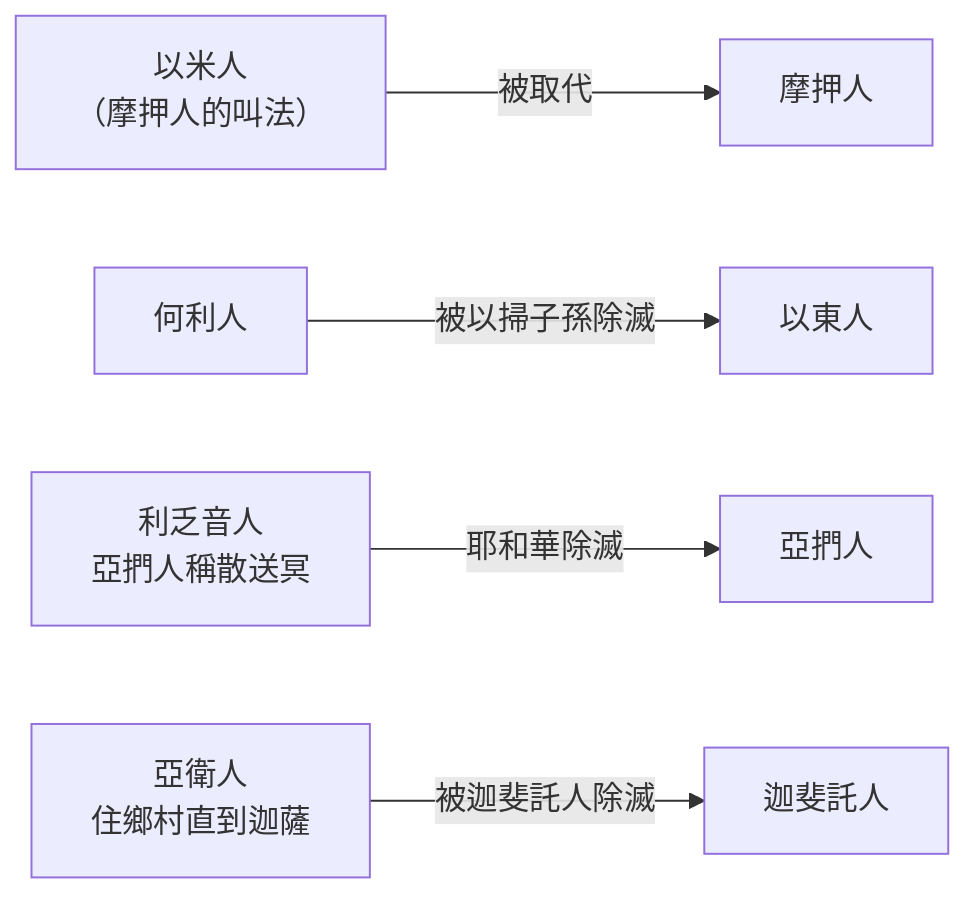
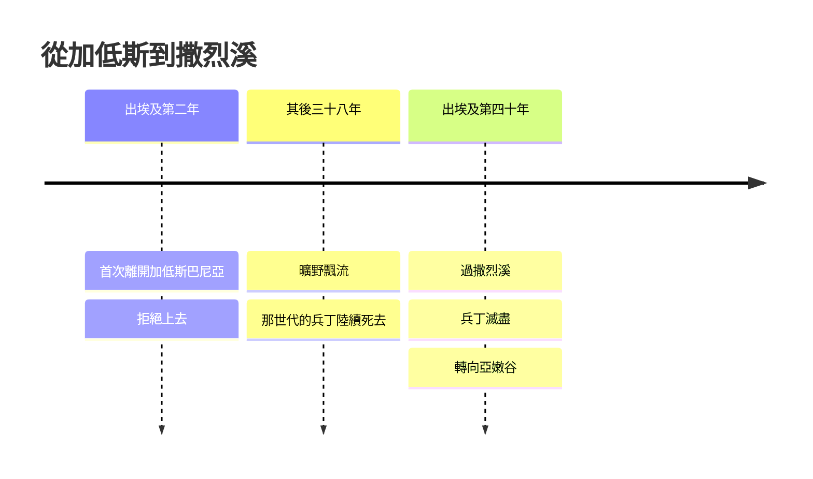

# 申命記 第2章

<!-- chapter-navigation:start -->
| [前一章](../05%20申命記/第1章.md) | [回目錄](../05%20申命記/全書目錄及綱要.md) | [下一章](../05%20申命記/第3章.md) |
| :--- | :---: | ---: |
<!-- chapter-navigation:end -->

1. 此後，我們轉回，從[[海（紅海）|紅海]]的路往曠野去，是照耶和華所吩咐我的。我們在[[西珥山]]繞行了許多日子。
2. 耶和華對我說：
3. 你們繞行這山的日子夠了，要轉向北去。
4. 你吩咐百姓說：你們弟兄[[以掃]]的子孫住在西珥，你們要經過他們的境界。他們必懼怕你們，所以你們要分外謹慎。
5. 不可與他們爭戰；他們的地，[[腳掌可踏之處|連腳掌可踏之處]]，我都不給你們，因我已將[[西珥山]]賜給[[以掃]][[為業（ye.ru.shah）|為業]]。
6. 你們要[[用錢買糧買水|用錢]]向他們買糧吃，也要用錢向他們買水喝。
7. 因為耶和華─你的神在你手裡所辦的一切事上已賜福與你。你走這大曠野，他都知道了。這四十年，耶和華─你的神常與你同在，故此[[你一無所缺]]。
8. 於是，我們離了我們弟兄[[以掃]]子孫所住的西珥，從[[亞拉巴|亞拉巴的路]]，經過[[以拉他]]、[[以旬迦別]]，轉向[[摩押地|摩押曠野]]的路去。
9. 耶和華吩咐我說：不可[[不可擾害也不可爭戰（tsur、garah）|擾害]][[摩押人]]，也不可與他們爭戰。他們的地，我不賜給你[[為業（ye.ru.shah）|為業]]，因我已將[[亞珥]]賜給[[羅得]]的子孫為業。
10. （先前，有[[以米人]]住在那裡，民數眾多，身體高大，像[[亞衲族與偉人拿非林|亞衲人]]一樣。
11. 這[[以米人]]像[[亞衲族與偉人拿非林|亞衲人]]；也算為[[利乏音人]]；[[摩押人]]稱他們為以米人。
12. 先前，[[何利人]]也住在西珥，但[[以掃]]的子孫將他們除滅，得了他們的地，接著居住，就如以色列在耶和華賜給他[[為業（ye.ru.shah）|為業]]之地所行的一樣。）
13. 現在，起來過[[撒烈溪]]！於是我們過了撒烈溪。
14. 自從離開[[加低斯|加低斯巴尼亞]]，到過了[[撒烈溪]]的時候，共有[[三十八年與那世代的兵丁滅盡|三十八年]]，等那世代的兵丁都從營中滅盡，正如耶和華向他們所起的誓。
15. 耶和華的手也攻擊他們，將他們從營中除滅，直到滅盡。
16. 兵丁從民中都滅盡死亡以後，
17. 耶和華吩咐我說：
18. 你今天要從[[摩押地|摩押的境界]][[亞珥]]經過，
19. 走近[[亞捫人]]之地，不可[[不可擾害也不可爭戰（tsur、garah）|擾害]]他們，也不可與他們爭戰。亞捫人的地，我不賜給你們[[為業（ye.ru.shah）|為業]]，因我已將那地賜給[[羅得]]的子孫為業。
20. （那地也算為[[利乏音人]]之地，先前利乏音人住在那裡，[[亞捫人]]稱他們為[[散送冥]]。
21. 那民眾多，身體高大，像[[亞衲族與偉人拿非林|亞衲人]]一樣，但耶和華從[[亞捫人]]面前除滅他們，亞捫人就得了他們的地，接著居住。
22. 正如耶和華從前為住西珥的[[以掃]]子孫將[[何利人]]從他們面前除滅、他們得了何利人的地、接著居住一樣，直到今日。
23. 從[[非利士人|迦斐託]]出來的[[非利士人|迦斐託人]]將先前住在鄉村直到[[迦薩]]的[[亞衛人]]除滅，接著居住。）
24. 你們起來前往，過[[亞嫩河|亞嫩谷]]；我已將[[亞摩利人]][[希實本]]王[[以色列戰勝亞摩利王西宏互文（申2：24-37；3：1-7；詩135：10-12；136：17-22）|西宏]]和他的地交在你手中，你要與他爭戰，得他的地[[為業（ye.ru.shah）|為業]]。
25. 從今日起，我要使天下萬民聽見你的名聲都[[使天下萬民驚恐懼怕|驚恐懼怕]]，且因你發顫傷慟。
26. 我從[[基底莫]]的曠野差遣[[使者]]去見[[希實本]]王[[以色列戰勝亞摩利王西宏互文（申2：24-37；3：1-7；詩135：10-12；136：17-22）|西宏]]，用和睦的話說：
27. 求你容我從你的地經過，[[大道（原文作王道）|只走大道，不偏左右]]。
28. 你可以賣糧給我吃，也可以賣水給我喝，只要容我步行過去，
29. 就如住西珥的[[以掃]]子孫和住[[亞珥]]的[[摩押人]]待我一樣，等我過了[[約但河]]，好進入耶和華─我們神所賜給我們的地。
30. 但[[希實本]]王[[以色列戰勝亞摩利王西宏互文（申2：24-37；3：1-7；詩135：10-12；136：17-22）|西宏]]不容我們從他那裡經過；因為耶和華─你的神使他心中[[法老心剛硬三字|剛硬]]，性情頑梗，為要將他交在你手中，像今日一樣。
31. 耶和華對我說：[[起首得那地（cha.lal）|從此起首]]，我要將[[以色列戰勝亞摩利王西宏互文（申2：24-37；3：1-7；詩135：10-12；136：17-22）|西宏]]和他的地交給你；你要得他的地[[為業（ye.ru.shah）|為業]]。
32. 那時，[[以色列戰勝亞摩利王西宏互文（申2：24-37；3：1-7；詩135：10-12；136：17-22）|西宏]]和他的眾民出來攻擊我們，在[[雅雜]]與我們交戰。
33. 耶和華─我們的神將他交給我們，我們就把他和他的兒子，並他的眾民，都擊殺了。
34. 我們奪了他的一切城邑，將有人煙的各城，連女人帶孩子，[[滅絕|盡都毀滅]]，沒有留下一個。
35. 惟有牲畜和所奪的各城，並其中的財物，都取為自己的掠物。
36. 從[[亞嫩河|亞嫩谷]]邊的[[亞羅珥]]和谷中的城，直到[[基列]]，耶和華─我們的神都交給我們了，[[沒有一座城高得使我們不能攻取|沒有一座城高得使我們不能攻取的]]。
37. 惟有[[亞捫人]]之地，凡靠近[[雅博渡口|雅博河]]的地，並山地的城邑，與耶和華─我們神所禁止我們去的地方，都沒有挨近。

---

## 本章知識節點

### 原文
- [[為業（ye.ru.shah）]]
- [[不可擾害也不可爭戰（tsur、garah）]]
- [[腳掌可踏之處]]
- [[起首得那地（cha.lal）]]
- [[使天下萬民驚恐懼怕]]
- [[滅絕]]
- [[接連的山谷（na.chal）]]
- [[法老心剛硬三字]]
- [[使者]]

### 地點
- [[亞拉巴]]
- [[以拉他]]
- [[以旬迦別]]
- [[亞珥]]
- [[撒烈溪]]
- [[基底莫]]
- [[雅雜]]
- [[亞羅珥]]
- [[迦薩]]
- [[亞嫩河]]
- [[希實本]]
- [[基列]]
- [[雅博渡口]]
- [[西珥山]]
- [[摩押地]]

### 人物
- [[以掃]]
- [[羅得]]
- [[以米人]]
- [[利乏音人]]
- [[散送冥]]
- [[何利人]]
- [[亞衛人]]
- [[亞捫人]]
- [[摩押人]]
- [[亞摩利人]]

### 主題
- [[用錢買糧買水]]
- [[你一無所缺]]
- [[大道（原文作王道）]]
- [[沒有一座城高得使我們不能攻取]]

### 神學
- [[神所定的邊界]]
- [[滅絕（herem）]]

### 歷史
- [[三十八年與那世代的兵丁滅盡]]
- [[曠野飄流四十年]]

### 背景
- [[亞衲族與偉人拿非林]]

### 解經爭議
- [[神使西宏心中剛硬與人的責任]]
- [[非利士人出自迦斯路希或迦斐託]]

### 互文
- [[以色列戰勝亞摩利王西宏互文（申2：24-37；3：1-7；詩135：10-12；136：17-22）|申2：24-37 以色列戰勝亞摩利王西宏]]

---

## 本章整理

### 繞行夠了，轉向北去（v1-3）

第一章停在加低斯，第二章從那裡轉身。第1節「此後，我們轉回，從[[海（紅海）|紅海]]的路往曠野去⋯我們在[[西珥山]]繞行了許多日子」——GT《聖經精讀本》把「許多日子」說明白：「指加低斯巴尼亞探子事件之後的38年。」同一段還澄清了一個容易誤讀的地名：「西珥山：在這裡並非指某一特定的山，乃是指整個以東山地」。

第3節神說「你們繞行這山的日子夠了，要轉向北去」。這句話與申1:6「你們在這山上住的日子夠了」是同一個句型，只是對象換了——一次是何烈山，一次是西珥山。GT《聖經精讀本》說明轉向的具體走法：「即已到了恢復迦南之時，不繞過以東山區的南端，向死海東部的亞嫩河北上。」

KC 從第1節的「我們」讀出一件事：摩西把自己也算了進去。因著別人的不信，所有人——包括約書亞、迦勒和摩西自己——都得跟著轉回；全體的不忠，對每一個忠心的人都有後果。

### 三次不可：以東、摩押、亞捫（v4-23）

本章前二十三節反覆用同一組句型下禁令，三次的結構完全一樣。CT 在靈訓要義裡把整章的命令數了一遍：「神共有六個命令，三個『可』（轉回、轉向、過溪），三個『不可』（不可侵犯以東人、摩押人、亞捫人之地）。」三可是行程，三不可是界線。

| 節次 | 對象 | 血緣 | 神已賜給他們的地 |
| --- | --- | --- | --- |
| 4-7 | [[以掃]]的子孫（[[以東]]人） | 雅各的哥哥 | [[西珥山]] |
| 9-12 | [[摩押人]] | [[羅得]]的長女之後 | [[亞珥]] |
| 19-23 | [[亞捫人]] | 羅得的次女之後 | 亞捫人之地 |

GT《聖經精讀本》把理由歸納成兩點：「①以東是雅各之兄以掃的後裔⋯摩押與亞捫人則是亞伯拉罕的侄子羅得的後裔⋯都是與以色列相親的兄弟民族；②神也已賜給他們世俗的產業之地（5,9,19節）。」

禁令用的兩個動詞值得分開看。STEP語言資料顯示「擾害」是 ta.tzar（H6696B，簡要詞典義 tsur: to provoke），「爭戰」是 tit.ga.Ru 或 tit.Gar（H1624 ga.rah，to stir up，Hithpael），後面常帶 mil.cha.Mah（H4421 battle）。這組詞在第24節會反過來變成命令（見 [[不可擾害也不可爭戰（tsur、garah）]]）。

「為業」這個名詞則在本章出現四次，其中三次講的不是以色列的地——STEP語言資料顯示是 ye.ru.Shah（H3425），而第24節「得他的地為業」是同一字根的動詞 Rash（H3423H）（見 [[為業（ye.ru.shah）]]）。KC 從這裡讀出一個原則：「God also has His involvement with these other peoples. He also gave the nations land (verses 9,19).」（神與這些別的民族也有關係，祂也把地賜給了列國。）CT 在第5節的〔話中之光〕說得更貼身：「神的兒女要知道自己的地界，不能羨慕別人，也不該妒忌別人為甚麼先得了地上的成就」（見 [[神所定的邊界]]）。

第5節把不給的程度量到最小：「連[[腳掌可踏之處]]，我都不給你們」。CT 說這是「形容寸土之地」，STEP語言資料顯示是三個名詞疊起來的 mid.Rakh kaf- Ra.gel（H4096＋H3709H＋H7272）。

第6節則規定他們怎麼取得補給：[[用錢買糧買水]]。GT《聖經精讀本》：「本節是指以色列在通過以東地時不可像侵略者那樣無禮妄動，乃要像路過的旅人一樣彬彬有禮。」第7節說明他們付得起：「這四十年，耶和華─你的神常與你同在，故此你[[你一無所缺|一無所缺]]。」

### 三段插敘：誰住過這些地（v10-12、20-23）

本章有三段括號裡的補充，寫的都是同一件事——這些地先前住著別人。

```mermaid
flowchart LR
    A["以米人<br/>（摩押人的叫法）"] -->|被取代| B["摩押人"]
    C["何利人"] -->|被以掃子孫除滅| D["以東人"]
    E["利乏音人<br/>亞捫人稱散送冥"] -->|耶和華除滅| F["亞捫人"]
    G["亞衛人<br/>住鄉村直到迦薩"] -->|被迦斐託人除滅| H["迦斐託人"]
```

[[利乏音人]]這個族群有三個名字。GT《啟導本》把它們排在一起：「摩押人稱他們為『[[以米人]]』（創十四5）；猶大人稱他們為[[亞衲族與偉人拿非林|亞衲人]]（民十三33；士一20）；亞捫人叫他們做[[散送冥]]（20節）。」其中散送冥全本聖經只出現這一次，CT 給的原文字義是「陰謀者」。

[[何利人]]的身分近年有修正。GT《啟導本》：「過去以為何利人為穴居部落民族，因其希伯來文名中的hor有『穴』的意思，現在已知為主前一千五百年時住在巴勒斯坦北部和敘利亞一帶的強大赫倫人（Hurrians）。」

第23節的[[亞衛人]]被從[[迦薩]]一帶趕走，取代他們的是[[非利士人|迦斐託人]]。GT《聖經精讀本》：「指非利士人（耶47:4;摩9:7），其土著地為愛琴海沿岸地區的Crete。『非利士』本身具有『移民』（immigrant）之意」（見 [[非利士人出自迦斯路希或迦斐託]]）。

KC 把這幾段插敘讀成一個提醒：以色列從中可以看見神掌管一切，並為每一國定下居住的地方；而那些曾經令人生畏的居民既已被趕出，這對以色列本該是鼓勵。

### 過撒烈溪：三十八年到此為止（v13-16）

第13節「現在，起來過[[撒烈溪]]！於是我們過了撒烈溪。」第14節接著算帳：「自從離開[[加低斯|加低斯巴尼亞]]，到過了撒烈溪的時候，共有三十八年」。

```mermaid
timeline
    title 從加低斯到撒烈溪
    出埃及第二年 : 首次離開加低斯巴尼亞 : 拒絕上去
    其後三十八年 : 曠野飄流 : 那世代的兵丁陸續死去
    出埃及第四十年 : 過撒烈溪 : 兵丁滅盡 : 轉向亞嫩谷
```

CT 從這個數字推出一個具體結果：「『都從營中滅盡』由此可見，那一代人的平均壽命，沒有超過六十歲」。第15節說這不是自然凋零：「耶和華的手也攻擊他們，將他們從營中除滅，直到滅盡。」KC 讀到同一件事：他們藐視了神看顧的手，就得面對祂管教的手；等最後一人死去，那隻手就不再與他們相對（見 [[三十八年與那世代的兵丁滅盡]]、[[曠野飄流四十年]]）。

GT《聖經精讀本》對這一代軍人的評語不客氣：他們雖然與亞瑪力人爭戰過、有作戰經驗，「但因他們違背了指揮官的命令，神卻毫無迷戀地除去了他們，將征服迦南的偉業託付給了毫無戰鬥經驗的新世代」。

### 起首：同一個動詞從禁令變成命令（v24-25）

第24節是全章的轉軸：「你們起來前往，過[[亞嫩河|亞嫩谷]]；我已將[[亞摩利人]][[希實本]]王西宏和他的地交在你手中，你要與他爭戰，得他的地為業。」BH 指出亞嫩谷就是今日約旦的 Wadi Mujib，一道天然的深谷，本來是摩押與亞摩利人的分界；過了它就等於從飄流轉入征戰。

前面三次說「不可爭戰」用的 ga.rah，這裡變成命令式 ve./hit.Gar；前面說「我不賜給你們為業」，這裡說「得他的地為業」。STEP語言資料另顯示第24節的「起首」是 ha.Chel、第25節的「從今日起」是 'a.Chel，同為 H2490C（cha.lal，簡要詞典義 to profane/begin: begin）（見 [[起首得那地（cha.lal）]]）。CT 在第31節註明「『從此起首』（原文無此詞）」——中文那句是補出來的。

第25節宣告效果：「我要使天下萬民聽見你的名聲都驚恐懼怕，且因你發顫傷慟。」CT 的原文字義把四個詞逐一拆開，STEP 的逐字資料完全對得上：

| 和合本 | CT 原文字義 | 原文 | Extended Strong |
| --- | --- | --- | --- |
| 驚恐 | 恐懼 | pach.de./Kha | H6343 |
| 懼怕 | 害怕，不安 | ve./yir.'A.te./kha | H3374 |
| 發顫 | 發抖，震動 | ve./ra.ge.Zu | H7264 |
| 傷慟 | 扭曲，扭動 | ve./cha.Lu | H2342I |

「傷慟」在中文像是悲傷，原文其實是身體扭動（見 [[使天下萬民驚恐懼怕]]）。

### 談判、剛硬、開戰（v26-33）

動武之前先談。第26節摩西從[[基底莫]]的曠野差遣[[使者]]，「用和睦的話」請求借道。GT《聖經精讀本》指出這符合律法：「在爭戰之前先提出和親是符合律法（20:10）的行為。」

請求的內容有三項：只走[[大道（原文作王道）|大道]]不偏左右、糧水照付、只求步行過去。GT《聖經精讀本》說明這條路是什麼：「只走大道：具有『只走道，只走道』的意思⋯此道與民21:22的『王道』（Kings Highway）是同一道路，是古代東方幾個主要國際道路之一。」BH 補上這條路的兩端：從南邊的阿卡巴灣一直通到北邊的大馬士革，是當時的商旅幹道；走這條路等於公開行進、不進私人田地，本身就是不侵犯的保證。

第30節說明談判為什麼破裂：「因為耶和華─你的神使他心中剛硬，性情頑梗」。STEP語言資料顯示是 hik.Shah 'et- ru.Ch/o（H7185＋H7307G ru.ach）與 ve./'i.Metz 'et- le.va.V/o（H553＋H3824 le.vav）——和合本譯作「心中」的那個字是靈，譯作「性情」的才是心。CT 的原文字義早就這樣註：「『心中』靈，氣，風；『剛硬』固執，頑固；『性情』內心；『頑梗』堅強，堅固」（見 [[法老心剛硬三字]]）。

這句話怎麼讀，各家重心不同。GT《雷氏研讀本》：「雖然是西宏自己作出決定，但摩西從神控制歷史的希伯來人觀點而說出這句話（民二一23）。」GT《串珠》：「按神的計畫，希實本王西宏使自己的心剛硬⋯故此，人不可忽視自己的行動，因神的預定與人的責任是不能分割的」。GT《聖經精讀本》：「並不是指敵意使原本善良的希實本王西宏變得頑梗，乃是指任他持有剛硬的心。」KC 說神使他剛硬只是確認了那早已存在的不肯回轉的態度（見 [[神使西宏心中剛硬與人的責任]]）。CT 只講結果：「他這個態度迫使以色列人訴諸武力」。

第32節在[[雅雜]]開戰，第33節「耶和華─我們的神將他交給我們」。

### 盡都毀滅與所得之地（v34-37）

第34節寫戰後處置：「我們奪了他的一切城邑，將有人煙的各城，連女人帶孩子，盡都[[滅絕|毀滅]]，沒有留下一個。」

GT《啟導本》在這裡指出這是一個專用字，但爬取下來的來源檔在該處字形缺漏：「『毀滅』的希伯來原文作（），為一專用字，指在為神而作的聖戰中，將所有戰俘、擄物完全殲滅，當作對神的奉獻。」STEP語言資料補上了缺的那個字：va./na.cha.Rem（H2763A，簡要詞典義 cha.ram: to devote/destroy，Hiphil）（見 [[滅絕（herem）]]）。CT 說明這種處置的適用範圍：「意指不留一個活口，通常只有在聖戰的指令下才這樣作，例如在耶利哥城（參書六17）。」

GT《啟導本》另列出戰後處理的三種型態：人畜財物通通毀滅、消滅人但留下財產、只消滅男丁——本章第35節屬第二種：「惟有牲畜和所奪的各城，並其中的財物，都取為自己的掠物。」

第36節劃出所得之地的範圍：從亞嫩谷邊的[[亞羅珥]]和谷中的城，直到[[基列]]。BH 說基列以乳香和豐美的牧場著稱，後來成了流便、迦得與瑪拿西半支派安家的地方。而全章最後一句話回頭接上了第一章：「沒有一座城高得使我們不能攻取的。」GT《雷氏研讀本》點明它在回應誰：「『高得使我們不能攻取』。高高的城牆把以色列人嚇壞了（一28）。」CT 註明「攻取」在原文無此字，STEP 也證實本節只有 kir.Yah 'a.Sher sa.ge.Vah mi.Me./nu（H7151＋H7682＋H4480A），字面是沒有一座城對我們太高（見 [[沒有一座城高得使我們不能攻取]]）。

> [!important] 全章收在一句「沒有挨近」
> 第37節：「惟有亞捫人之地，凡靠近[[雅博渡口|雅博河]]的地，並山地的城邑，與耶和華─我們神所禁止我們去的地方，都沒有挨近。」BH 補上這條河的兩層身分：雅博河就是今日的 Zarqa 河，是天然的疆界；而創世記32:22-32 記載雅各正是在這裡與神摔跤。KC 特別指出這一節的作用：這裡摩西強調的是以色列的順服——經文不是只記不信與它的後果，遵行神旨意的事也被記下來了。打得贏的仗打了，不准碰的地一步也沒踏。

**參考資料**
https://www.ccbiblestudy.org/Old%20Testament/05Deut/05CT02.htm
https://www.ccbiblestudy.org/Old%20Testament/05Deut/05GT02.htm
https://www.kingcomments.com/en/bible-studies/Deu/2
https://biblehub.com/study/deuteronomy/2.htm
https://github.com/STEPBible/STEPBible-Data

<!-- appendix-links:start -->
## 附錄

### 相關地圖
- [[appendix/fhl_maps/maps/025|〈申圖一〉應許之地全圖]]
- [[appendix/fhl_maps/maps/026|〈申圖二〉征服東岸及分地給兩個半支派]]
- [[appendix/fhl_maps/maps/031|〈書圖四〉以色列人所征服應許地的諸王]]
<!-- appendix-links:end -->

<!-- chapter-navigation:start -->
| [前一章](../05%20申命記/第1章.md) | [回目錄](../05%20申命記/全書目錄及綱要.md) | [下一章](../05%20申命記/第3章.md) |
| :--- | :---: | ---: |
<!-- chapter-navigation:end -->
