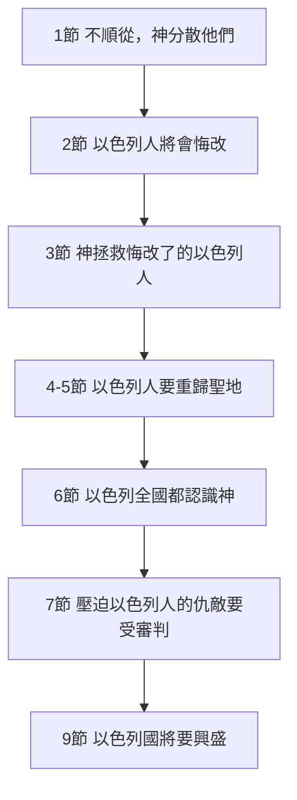

# 申命記 第30章

<!-- chapter-navigation:start -->
| [前一章](../05%20申命記/第29章.md) | [回目錄](../05%20申命記/全書目錄及綱要.md) | [下一章](../05%20申命記/第31章.md) |
| :--- | :---: | ---: |
<!-- chapter-navigation:end -->

1. 我所陳明在你面前的[[祝福與咒詛|這一切咒詛]]都臨到你身上；你在耶和華─你神追趕你到的萬國中必[[七次回轉（shuv）|心裡追念]]祝福的話；
2. 你和你的子孫若[[悔改|盡心盡性歸向耶和華]]─你的神，照著我今日一切所吩咐的聽從他的話；
3. 那時，耶和華─你的神必憐恤你，[[救回被擄的子民（she.vut）|救回你這被擄的子民]]；耶和華─你的神要[[七次回轉（shuv）|回轉過來]]，從[[分散在萬民中|分散你到的萬民中]]將你招聚回來。
4. 你被趕散的人，就是在天涯的，耶和華─你的神也必從那裡將你招聚回來。
5. 耶和華─你的神必領你進入你列祖所得的地，使你可以得著；[[得福（ya.tav）|又必善待你]]，使你的人數比你列祖眾多。
6. 耶和華─你神必將你心裡和你後裔[[未受割禮的心若謙卑（認罪悔改的條件）|心裡的污穢除掉]]，好叫你[[你要盡心盡性盡力愛耶和華（a.hav）|盡心盡性愛耶和華]]─你的神，使你可以存活。
7. 耶和華─你的神必將[[祝福與咒詛|這一切咒詛]][[神必審判仇敵|加在你仇敵和恨惡你、逼迫你的人身上]]。
8. [[七次回轉（shuv）|你必歸回]]，聽從耶和華的話，遵行他的一切誡命，就是我今日所吩咐你的。
9. 你若聽從耶和華─你神的話，謹守這律法書上所寫的誡命律例，又[[悔改|盡心盡性歸向耶和華]]─你的神，他必使你手裡所辦的一切事，並你身所生的，牲畜所下的，地土所產的，都[[綽綽有餘（ya.tar）|綽綽有餘]]；因為[[喜悅善待也喜悅毀滅（su.s）|耶和華必再喜悅你]]，降福與你，像從前喜悅你列祖一樣。
10. 併於上節。
11. 我今日所吩咐你的誡命[[不是難行也不是離你遠（pa.la 與 ra.choq）|不是你難行的，也不是離你遠的]]；
12. [[不在天上也不在海外，卻在你口中你心裡|不是在天上]]，使你說：誰替我們上天取下來，使我們聽見可以遵行呢？
13. [[不在天上也不在海外，卻在你口中你心裡|也不是在海外]]，使你說：誰替我們過海取了來，使我們聽見可以遵行呢？
14. 這話卻離你甚近，[[不在天上也不在海外，卻在你口中你心裡|就在你口中，在你心裡]]，使你可以遵行。
15. 看哪，我今日將[[生與福，死與禍]]，陳明在你面前。
16. 吩咐你愛耶和華─你的神，遵行他的道，謹守[[吩咐、律例、典章、誡命四個詞|他的誡命、律例、典章]]，使你可以存活，人數增多，耶和華─你神就必在你所要進去得為業的地上賜福與你。
17. 倘若[[心裡偏離與被勾引（pa.nah 與 na.dach）|你心裡偏離，不肯聽從，卻被勾引]]去敬拜事奉別神，
18. 我今日明明告訴你們，你們必要滅亡；在你過[[約但河]]、進去得為業的地上，你的日子必不長久。
19. 我今日[[呼天喚地作見證（ud）|呼天喚地向你作見證]]；我將[[生與福，死與禍|生死禍福]]陳明在你面前，所以你要[[揀選生命（ba.char）|揀選生命]]，使你和你的後裔都得存活；
20. 且愛耶和華─你的神，聽從他的話，[[專靠（da.veq）|專靠]]他；[[因為他是你的生命]]，你的日子長久也在乎他。這樣，你就可以在耶和華向你列祖[[亞伯拉罕之約|亞伯拉罕、以撒、雅各起誓應許所賜的地]]上居住。

---

## 本章知識節點

### 原文
- [[七次回轉（shuv）]]
- [[救回被擄的子民（she.vut）]]
- [[得福（ya.tav）]]
- [[綽綽有餘（ya.tar）]]
- [[喜悅善待也喜悅毀滅（su.s）]]
- [[不是難行也不是離你遠（pa.la 與 ra.choq）]]
- [[心裡偏離與被勾引（pa.nah 與 na.dach）]]
- [[你要盡心盡性盡力愛耶和華（a.hav）]]
- [[專靠（da.veq）]]
- [[吩咐、律例、典章、誡命四個詞]]

### 主題
- [[不在天上也不在海外，卻在你口中你心裡]]
- [[生與福，死與禍]]
- [[揀選生命（ba.char）]]
- [[祝福與咒詛]]
- [[呼天喚地作見證（ud）]]
- [[不聽從神的五層漸進懲罰（利26：14-39）]]

### 神學
- [[悔改]]
- [[未受割禮的心若謙卑（認罪悔改的條件）]]
- [[神必審判仇敵]]
- [[因信稱義]]
- [[新約]]
- [[人若遵行律例典章就必因此活著]]
- [[因為他是你的生命]]
- [[摩押平原之約]]
- [[亞伯拉罕之約]]

### 歷史
- [[分散在萬民中]]

### 地點
- [[約但河]]

---

## 本章整理

### 咒詛之後的赦免條款（v1-10）

二十八章用五十多節寫盡了不聽從的下場，三十章開頭卻沒有停在那裡。CT 一句話定了這一段的性質：1~10節就像盟約中的赦免條款；在使人絕望的咒詛之後，神卻馬上發表了復興的應許——因為神的咒詛並不是要敗壞人，他所做的一切都是要恢復人，甚至使用咒詛來催逼人回轉（參 [[不聽從神的五層漸進懲罰（利26：14-39）|利未記那份漸進的懲罰清單]]）。

第1節的措辭值得停一下。和合本作「我所陳明在你面前的這一切咒詛都臨到你身上」，CT 在文意註解卻指出『這一切咒詛』原文是將「咒詛」與「祝福」兩者一起擺放，並說本節的原文是「我所陳明在你面前的這一切祝福和咒詛都臨到你身上」（英文ESV、NASB、KJV譯本）。把人叫醒的因此不只是災禍，也包括他們曾經嘗過、後來失去的那些好處（見 [[祝福與咒詛]]）。

這一段真正的骨架不在中文，而在原文。CT 在第1節的話中之光把它數了出來：這段短短的經文裡，希伯來文字根「回轉」出現了七次。STEP 可以逐處核對，而且核對之後會發現一件中文讀不出來的事——==人的回轉與神的回轉，用的是同一個動作==（見 [[七次回轉（shuv）]]）。

| 節 | 和合本用詞 | STEP 字形 | 擴充 Strong | 誰在回轉 |
| --- | --- | --- | --- | --- |
| 1 | 心裡追念 | va./ha.she.vo.Ta | H7725N | 人 |
| 2 | 歸向 | ve./shav.Ta | H7725G | 人 |
| 3 | 救回 | ve./Shav | H7725H | 神 |
| 3 | 回轉過來 | ve./Shav | H7725J | 神 |
| 8 | 你必歸回 | ta.Shuv | H7725J | 人 |
| 9 | 必再（喜悅） | ya.Shuv | H7725J | 神 |
| 10 | 歸向 | ta.Shuv | H7725G | 人 |

CT 由此推出他認為最要緊的一句：轉咒詛為祝福的關鍵，在於歸向神；不怕人落下到多深，只怕人的心意不回轉，人的心一轉回，神的祝福立刻就顯出來。GT《聖經精讀本──申命記註解》則把 [[悔改|真悔改]] 拆成三個先後：首先，是認識到自己的錯誤並痛悔；其次，斷然離開那罪孽之地，回到神的懷抱；最後，過在神懷抱中，單單聽從神話語的正確生活。

至於這幾節怎麼一步步走完，GT《啟導本聖經申命記註釋》轉述有的解經家把1~9節當作二十九至三十章的濃縮，列出七個重點：

七步裡，第一步與第三、四步是 [[分散在萬民中|分散]] 與 [[救回被擄的子民（she.vut）|招聚]] 的一來一回。這件事什麼時候發生，各家給的答案不同：CT 舉了波斯王古列下詔允准猶太人回耶路撒冷重建聖殿，以及主後1948年以色列復國；GT《聖經精讀本──申命記註解》數的是所羅巴伯與約書亞（B.C.538）、以斯拉（B.C.458）、尼希米（B.C.445）三次歸還；KC 的判斷更保留，他說以斯拉與尼希米時代的歸回幾乎只涉及從巴比倫歸回，而不是從各種各樣的民族中歸回，所以只算一次預先的應驗。GT《申命記雷氏研讀本》乾脆把整段的時間推到最後：這次重聚會發生在基督第二次降臨的時候。

第五步——第6節——是全段的轉折。和合本作「必將你心裡和你後裔心裡的污穢除掉」，CT 說原文是「心受割禮」，GT《申命記串珠聖經註釋》說原是「替他們的心行割禮」，使他們願意順服。==同樣一個動作，申10:16 是命令百姓自己動手，這一節是神親自動手==（見 [[未受割禮的心若謙卑（認罪悔改的條件）]]）。GT《聖經精讀本──申命記註解》把這一節接到 [[新約]]：在舊約之下所成就的肉身之割禮，是預表將要在新約之下所成就的心靈之割禮的。KC 從個人的一面說同一件事——他說惟有在心受過割禮的人裡面才有對神的愛。

復興的另外兩步落在具體的東西上。第5節說神必 [[得福（ya.tav）|善待]] 你、使你的人數比你列祖眾多；第9節說手所辦的一切事、身所生的、牲畜所下的、地土所產的都 [[綽綽有餘（ya.tar）|綽綽有餘]]，而且「耶和華必再 [[喜悅善待也喜悅毀滅（su.s）|喜悅]] 你」——那個「喜悅」正是二十八63 說神要喜悅毀滅你們時用的同一個字。至於第7節，CT 說這是扭轉因叛逆而帶來的咒詛，將其歸在那些叛逆神的人身上（見 [[神必審判仇敵]]）。

### 誡命不遠：三句否定與一句肯定（v11-14）

從第11節起，講題換了。前面十節講神怎麼把人帶回來，這幾節講人推託的理由不成立。

[[不是難行也不是離你遠（pa.la 與 ra.choq）|第11節那兩個形容詞]]，兩家中譯不一樣：CT 的原文字義給「難行的」的是了不起的、非凡的，並說原意是「隱藏的」，即不是你所「難於理解的」；GT《申命記串珠聖經註釋》給的是「難行」原文是「困難」，意思是難以理解、難以執行，而「離你遠」的意思是「難以得知」。兩家的落點其實一樣——都在講聽不懂和拿不到這兩種推託。

接著的三句話把誡命的位置定死了（見 [[不在天上也不在海外，卻在你口中你心裡]]）。第12節設想有人說：誰替我們上天取下來；第13節設想有人說：誰替我們過海取了來；第14節收在「這話卻離你甚近，就在你口中，在你心裡」。GT《申命記串珠聖經註釋》的總結是：誡命並不在高不可攀的天上，也不在遙不可及的海外，而是在人的口中、人的心裡，可見神的話可以在百姓中間實行。

> [!quote] KC 讀出的兩種現代版推託
> KC 說這幾節的用意是要指出神向人或向他百姓所要求的並不是重擔，不需要任何個人的努力。他特別停在過海那一句上：摩西講到渡到海的那一邊去，好像那誡命是放在地上某個遙遠的地方，只要有人能從那裡把它取回來，我們就辦得到——他舉的例子是許多人往東方去，想在東方宗教裡找到自己的救恩。至於上天那一句，他說在「上升」這個字裡有靠自己的力量抵達天上的想法，只要還這樣想，基督的工作就被看輕、他就等於又被拉了下來。

四套註釋在這裡難得地指向同一個地方：保羅在羅馬書十6至8引用的正是這三節（見 [[因信稱義]]）。GT《啟導本聖經申命記註釋》說保羅曾引用14節的話來解釋福音可以廣傳；GT《申命記串珠聖經註釋》說保羅把它應用在基督身上，指明基督成為肉身，福音真道不難覓得。KC 又補了一個容易被跳過的細節：經文先提口再提心，因為別人只能從我們的言語和行為感受到我們的信心。BH 從古代的背景說明這件事為什麼稀奇——在古代近東，神明的旨意常被看作神祕、只能透過祭司或神諭得知，而以色列不需要中間人。

不過 KC 讀這一段時帶著一個前提：他說一個人惟有看見自己的努力毫無用處，才會看見基督是律法的總結；他引羅十5 與利18:5 說律法的目的就是行這事的人必因此活著，而沒有一個人守全了律法（見 [[人若遵行律例典章就必因此活著]]）。CT 的重點不同，他仍站在申命記自己的語氣上：人若不肯順服，總能找到不順服的理由，不是說沒時間讀聖經、就是說聖經讀不懂；將來百姓落到咒詛中，不是因為律法難行，而是因為人不甘心活在神的話裡。

### 兩條路擺在面前（v15-20）

第15節起是摩西三篇講章的收尾，也是 [[摩押平原之約]] 講詞的最後一段。GT《啟導本聖經申命記註釋》說15至20節是本書所揭示的律法、誡命中福與禍的綜合總結；KC 的說法一樣，並提醒這個抉擇擺出來的位置——它擺在百姓進地的開頭，而到了百姓在地上的歷史末了，耶利米又在他們被擄之前把同樣的抉擇擺了一次。

[[生與福，死與禍|第15節那四個名詞]] 兩兩一組，第19節再擺一次，旁邊還多了祝福與咒詛。兩節的「陳明」和第1節是同一個字。摩西把兩條路寫得對稱：

| | 揀選生命這一邊（v16、19-20） | 偏離這一邊（v17-18） |
| --- | --- | --- |
| 心的方向 | 愛耶和華你的神 | 心裡偏離 |
| 對話語的反應 | 聽從他的話、謹守誡命律例典章 | 不肯聽從 |
| 依附的對象 | 專靠他 | 被勾引去敬拜事奉別神 |
| 結果 | 存活、人數增多、在地上蒙福 | 必要滅亡、日子不長久 |

原文在這裡也留了一條線索。[[心裡偏離與被勾引（pa.nah 與 na.dach）|第17節的被勾引]] 是 ve./ni.dach.Ta（H5080），而同一個 H5080 在第1節是神把人趕出去、第4節是被趕散的人。神趕散與人被拉走，用的是同一個字。

第19節先立見證再下命令：「我今日呼天喚地向你作見證」。GT《啟導本聖經申命記註釋》說古代訂約習慣用所信奉的神祇來作見證人，中國人也慣用「皇天后土」作盟誓的憑證，這裡指出神所造天地見證此約；GT 另指出神的百姓不可呼召其他神祇，所以摩西就「呼天喚地向你作見證」，用天地來代表這見證的長久有效（見 [[呼天喚地作見證（ud）]]）。GT《聖經精讀本──申命記註解》讀出的分量更重：摩西選擇天地作證人，是為了強調現今所立之約如同屹立不動的天地一樣不變、恒久。

見證立好之後才是那個動詞：「所以你要 [[揀選生命（ba.char）|揀選生命]]」。CT 說揀選生命就是揀選愛神、遵行、謹守，並把層次再推一步——生命不是人能活著的意思，生命乃是神的自己；揀選生命乃是揀選神的自己。KC 注意到第19節接下去把後裔也算了進來，於是說這個抉擇對後代也有影響：一心跟隨主的父母，通常可以指望兒女在這個抉擇上跟隨他們，而選擇禍患的也是一樣。

全章最後一句只有三個動作和一個理由：[[你要盡心盡性盡力愛耶和華（a.hav）|且愛耶和華你的神]]、聽從他的話、[[專靠（da.veq）|專靠他]]，「因為他是你的生命」。KC 把三者的分工說得清楚：愛是動機，順服是表達，緊緊抓住他則給人持續下去的力量。CT 說「他是你的生命」意指他是生命的創始成終者。GT《啟導本聖經申命記註釋》另提醒這裡用的是「你」字，說明不只是向全以色列人的呼喚，也要求每一個人作出及時的回應（見 [[因為他是你的生命]]）。

### 一章之內的兩種語氣

這一章有一個容易被忽略的落差。前十節，主詞幾乎都是神：他招聚、他領你進去、他 [[得福（ya.tav）|善待]] 你、他替你的心行割禮、他把咒詛轉到仇敵身上。後十節，主詞換成了人：你要揀選、你若心裡偏離、你要愛、要聽從、要專靠。

兩邊沒有被經文調和成一句話，它們就這樣並排放著。CT 在第19節的話中之光提出的解釋是神不強迫人：他把兩種選擇、兩種後果向人陳明，讓人用自由意志來做抉擇，並且勸勉百姓揀選生命。GT《聖經精讀本──申命記註解》從另一頭說：兩者之間決不可能有躊躇，兩者之外再沒有其它路可走。

而全章結尾那句話又把地的應許接回更早的地方——「在耶和華向你列祖亞伯拉罕、以撒、雅各起誓應許所賜的地上居住」。以色列能不能在 [[約但河]] 那一邊住得長久，說到底不是新條件，是 [[亞伯拉罕之約|列祖那個古老的誓言]] 還算不算數。經文的答案是算數，只是要人先走過第19節那一步。

**參考資料**
https://www.ccbiblestudy.org/Old%20Testament/05Deut/05CT30.htm
https://www.ccbiblestudy.org/Old%20Testament/05Deut/05GT30.htm
https://www.kingcomments.com/en/bible-studies/Deu/30
https://biblehub.com/study/deuteronomy/30.htm
https://github.com/STEPBible/STEPBible-Data

<!-- appendix-links:start -->
## 附錄

### 相關地圖
- [[appendix/fhl_maps/maps/009|〈創圖四〉亞伯拉罕的生平]]
<!-- appendix-links:end -->

<!-- chapter-navigation:start -->
| [前一章](../05%20申命記/第29章.md) | [回目錄](../05%20申命記/全書目錄及綱要.md) | [下一章](../05%20申命記/第31章.md) |
| :--- | :---: | ---: |
<!-- chapter-navigation:end -->
