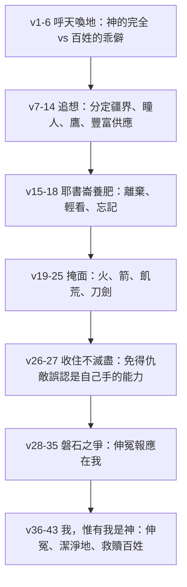
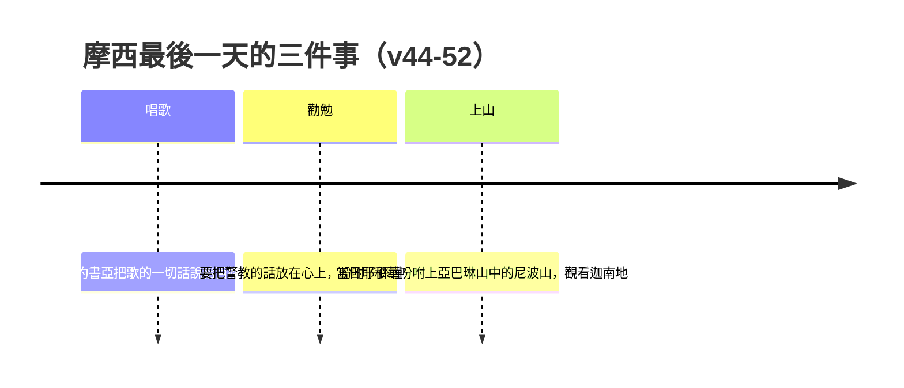

# 申命記 第32章

<!-- chapter-navigation:start -->
| [前一章](../05%20申命記/第31章.md) | [回目錄](../05%20申命記/全書目錄及綱要.md) | [下一章](../05%20申命記/第33章.md) |
| :--- | :---: | ---: |
<!-- chapter-navigation:end -->

1. 諸天哪，側耳，我要說話；[[呼天喚地作見證（ud）|願地也聽我口中的言語]]。
2. 我的教訓要淋漓如雨；我的言語要滴落如露，如細雨降在嫩草上，如甘霖降在菜蔬中。
3. 我要宣告耶和華的名；你們要將大德歸與我們的神。
4. 他是[[磐石（tsur）|磐石]]，他的作為完全；他所行的無不公平，是誠實無偽的神，又公義，又正直。
5. 這[[乖僻彎曲的世代（i.qesh 與 pe.tal.tol）|乖僻彎曲的世代]]向他行事邪僻；有這弊病就不是[[神的兒女|他的兒女]]。
6. 愚昧無知的民哪，你們這樣報答耶和華嗎？他豈不是你的父、將你買來的嗎？他是製造你、建立你的。
7. 你當追想上古之日，思念歷代之年；問你的父親，他必指示你；問你的長者，他必告訴你。
8. 至高者將地業賜給列邦，將世人分開，就[[照以色列人的數目立定萬民的疆界]]。
9. 耶和華的分本是他的百姓；他的[[產業（na.cha.lah）|產業]]本是[[雅各]]。
10. 耶和華遇見他在曠野─荒涼野獸吼叫之地，就環繞他，看顧他，保護他，如同保護[[眼中的瞳人（i.shon）|眼中的瞳人]]。
11. [[申32：11-12 如鷹攪動巢窩|又如鷹攪動巢窩]]，在雛鷹以上兩翅搧展，[[如鷹背在翅膀上是鷹還是兀鷲|接取雛鷹]]，[[如鷹背在翅膀上|背在兩翼之上]]。
12. 這樣，耶和華獨自引導他，並無外邦神與他同在。
13. 耶和華使他乘駕地的高處，得吃田間的土產；又使他從磐石中咂蜜，從堅石中吸油；
14. 也吃牛的奶油，羊的奶，羊羔的脂油，[[巴珊]]所出的公綿羊和山羊，與上好的麥子，也喝葡萄汁釀的酒。
15. 但[[耶書崙（ye.shu.run）|耶書崙]]漸漸肥胖，粗壯，光潤，踢跳，奔跑，便離棄造他的神，輕看救他的[[磐石（tsur）|磐石]]；
16. 敬拜別神，[[忌邪的神|觸動神的憤恨]]，行可憎惡的事，惹了他的怒氣。
17. [[所祭祀的鬼魔（she.dim）|所祭祀的鬼魔]]並非真神，乃是素不認識的神，是近來新興的，是你列祖所不畏懼的。
18. 你輕忽生你的[[磐石（tsur）|磐石]]，忘記產你的神。
19. 耶和華看見[[神的兒女|他的兒女]]惹動他，就厭惡他們，說：
20. 我要向他們[[掩面不顧（sa.tar）|掩面]]，看他們的結局如何。他們本是極乖僻的族類，心中無誠實的兒女。
21. 他們以那不算為神的觸動我的憤恨，以虛無的神惹了我的怒氣。我也要以那不成子民的觸動他們的憤恨，以愚昧的國民惹了他們的怒氣。
22. 因為在我怒中有火燒起，直燒到極深的[[陰間（Sheol）|陰間]]，把地和地的出產盡都焚燒，山的根基也燒著了。
23. 我要將禍患堆在他們身上，把我的箭向他們射盡。
24. 他們必因飢餓消瘦，被炎熱苦毒吞滅。我要打發野獸用牙齒咬他們，並土中腹行的，用毒氣害他們。
25. 外頭有刀劍，內室有驚恐，使人喪亡，使少男、童女、吃奶的、白髮的，盡都滅絕。
26. 我說，我必將他們分散遠方，使他們的名號從人間除滅。
27. 惟恐仇敵惹動我，只怕敵人錯看，說：是我們手的能力，並非耶和華所行的。
28. 因為以色列民毫無計謀，心中沒有聰明。
29. 惟願他們有智慧，能明白這事，肯思念他們的結局。
30. 若不是他們的[[磐石（tsur）|磐石]]賣了他們，若不是耶和華交出他們，一人焉能追趕他們千人？二人焉能使萬人逃跑呢？
31. 據我們的仇敵自己斷定，他們的[[磐石（tsur）|磐石]]不如我們的磐石。
32. 他們的葡萄樹是[[所多瑪的葡萄樹指誰|所多瑪的葡萄樹]]，[[蛾摩拉]]田園所生的；他們的葡萄是[[所多瑪的葡萄樹指誰|毒葡萄]]，全掛都是苦的。
33. 他們的酒是大蛇的毒氣，是虺蛇殘害的惡毒。
34. 這不都是積蓄在我這裡，封鎖在我府庫中嗎？
35. 他們失腳的時候，[[伸冤報應在我（na.kam 與 shil.lem）|伸冤報應在我]]；因他們遭災的日子近了；那要臨在他們身上的必速速來到。
36. 耶和華見他百姓毫無能力，無論困住的、自由的都沒有剩下，就必為他們伸冤，為他的僕人後悔。
37. 他必說：他們的神，他們所投靠的[[磐石（tsur）|磐石]]，
38. 就是向來吃他們祭牲的脂油，喝他們奠祭之酒的，在哪裡呢？他可以興起幫助你們，護衛你們。
39. 你們如今要知道：我，惟有我是神；[[除他以外再無別神|在我以外並無別神]]。[[我使人死我使人活|我使人死，我使人活]]；我損傷，我也醫治，並無人能從我手中救出來。
40. 我向天舉手說：我憑我的永生起誓：
41. 我若磨我閃亮的刀，手掌審判之權，就必報復我的敵人，報應恨我的人。
42. 我要使我的箭飲血飲醉，就是被殺被擄之人的血。我的刀要吃肉，乃是仇敵中首領之頭的肉。
43. [[申32：43 外邦人歡呼的異文|你們外邦人當與主的百姓一同歡呼]]；因他要伸他僕人流血的冤，報應他的敵人，[[那地不得潔淨（ki.pher）|潔淨他的地]]，救贖他的百姓。
44. [[摩西]]和嫩的兒子[[約書亞]]去將[[摩西之歌|這歌的一切話]]說給百姓聽。
45. [[作見證的歌（shi.rah 與 ed）|摩西向以色列眾人說完了這一切的話]]，
46. 又說：我今日所警教你們的，你們都要放在心上；要吩咐你們的子孫謹守遵行這律法上的話。
47. 因為這不是虛空、與你們無關的事，乃是你們的生命；在你們過[[約但河]]要得為業的地上必因這事日子得以長久。
48. 當日，耶和華吩咐[[摩西]]說：
49. 你上這[[亞巴琳山]]中的[[尼波山]]去，在[[摩押地]]與[[耶利哥]]相對，觀看我所要賜給以色列人為業的[[迦南地]]。
50. 你必死在你所登的山上，歸你列祖（原文作本民）去，像你哥哥[[亞倫]]死在[[何珥山]]上，歸他的列祖一樣。
51. 因為你們在尋的曠野，[[加低斯]]的米利巴水，在以色列人中[[摩西擊打磐石兩下|沒有尊我為聖]]，得罪了我。
52. 我所賜給以色列人的地，你可以遠遠地觀看，[[摩西不得進入應許之地|卻不得進去]]。

---

## 本章知識節點

### 原文
- [[磐石（tsur）]]
- [[耶書崙（ye.shu.run）]]
- [[眼中的瞳人（i.shon）]]
- [[所祭祀的鬼魔（she.dim）]]
- [[乖僻彎曲的世代（i.qesh 與 pe.tal.tol）]]
- [[伸冤報應在我（na.kam 與 shil.lem）]]
- [[那地不得潔淨（ki.pher）]]
- [[陰間（Sheol）]]
- [[掩面不顧（sa.tar）]]
- [[產業（na.cha.lah）]]
- [[作見證的歌（shi.rah 與 ed）]]

### 解經爭議
- [[照以色列人的數目立定萬民的疆界]]
- [[所多瑪的葡萄樹指誰]]
- [[申32：43 外邦人歡呼的異文]]
- [[如鷹背在翅膀上是鷹還是兀鷲]]

### 神學
- [[摩西之歌]]
- [[我使人死我使人活]]
- [[如鷹背在翅膀上]]
- [[忌邪的神]]
- [[神的兒女]]
- [[除他以外再無別神]]

### 主題
- [[呼天喚地作見證（ud）]]

### 互文
- [[申32：11-12 如鷹攪動巢窩]]

### 地點
- [[尼波山]]
- [[亞巴琳山]]
- [[何珥山]]
- [[加低斯]]
- [[巴珊]]
- [[蛾摩拉]]
- [[摩押地]]
- [[耶利哥]]
- [[迦南地]]
- [[約但河]]

### 人物
- [[摩西]]
- [[約書亞]]
- [[亞倫]]
- [[雅各]]

### 事件
- [[摩西不得進入應許之地]]
- [[摩西擊打磐石兩下]]

---

## 本章整理

### 開場：叫天地來聽的一首歌（v1-6）

上一章神吩咐摩西寫一篇歌，歌詞就在這一章。開頭三節是序言，摩西沒有先對百姓說話，而是先叫天和地：「諸天哪，側耳，我要說話；願地也聽我口中的言語。」這是 [[呼天喚地作見證（ud）|呼天喚地]] 的正式開場。

CT 注意到一個細節：「側耳」原文是「聽、留心聽」，是本歌的第一個字。GT《聖經精讀本──申命記註解》說摩西在序言部分使用了極其莊嚴的語句，特別是選擇天地作證人，用意是強調這首歌的不變性與宇宙性的重大意義；GT《申命記串珠聖經註釋》則說天地就是此歌的無聲見證人。GT《啟導本聖經申命記註釋》把同樣的手法接到申4:26、31:28 與賽1:2、彌6:1-2——先知常這樣開口。KC 給的理由不同角度：摩西所帶來的教導關乎整個宇宙，所以天與地都被牽進這首歌裡。BH 說這也呼應先知傳統，並把它連回申30:19 呼天喚地見證生死之選的立約語言。

第2節說這歌要起什麼作用。CT 指出「我的教訓」原文是「我的心得」，並說對多年身處乾旱沙漠的人而言，沒有什麼比雨更令人耳目一新。KC 把四種水分排成一個由輕到重的次序：先是一滴一滴的教導，柔和得像露水，然後成為細雨，最後才是傾瀉而下的大雨。

接著第4、5兩節把全歌的骨架擺了出來——一邊是神，一邊是人。第4節連用五個詞說神：磐石、作為完全、所行無不公平、誠實無偽、又公義又正直；第5節立刻用兩個扭曲的字說百姓，那就是 [[乖僻彎曲的世代（i.qesh 與 pe.tal.tol）|乖僻彎曲的世代]]。CT 說末句原文的意思是他們因自己的缺陷，不能作神的後裔；這一句同時預告了後面 [[神的兒女]] 這條線的張力。

| 第4節說神 | 第5至6節說百姓 |
|---|---|
| 他是磐石 | 這乖僻彎曲的世代 |
| 他的作為完全 | 向他行事邪僻 |
| 他所行的無不公平 | 有這弊病就不是他的兒女 |
| 是誠實無偽的神，又公義，又正直 | 愚昧無知的民哪，你們這樣報答耶和華嗎 |

### 追想上古：疆界、瞳人與鷹（v7-14）

第7節叫人回頭去問父親和長者，第8節就給出要問的第一件事：「至高者將地業賜給列邦，將世人分開，就照以色列人的數目立定萬民的疆界。」這一句正是 [[照以色列人的數目立定萬民的疆界]] 這個爭議的所在——STEP 語言資料在這裡的讀法是 le./mis.Par be.Nei Yis.ra.El（本節譯義是 to the number of the people of Israel），而 GT《申命記串珠聖經註釋》記下「以色列人的數目」或作「天使的數目」，BH 所據的英文譯本正文則作神的眾子。四家對這一句的取向不同，本庫只並列各家所說，不替它們裁定抄本歸屬。

第9節接著把以色列的位置講定：「耶和華的分本是他的百姓；他的產業本是 [[雅各]]。」這裡的 [[產業（na.cha.lah）|產業]] 在原文旁邊還有一個量地的繩字，字面是量出來的一份。KC 說世界和其中所充滿的都屬於神，以色列卻以特別的方式歸他所有。

第10至14節是全歌最溫柔的一段，兩個比喻接連出現。前一個是 [[眼中的瞳人（i.shon）|眼中的瞳人]]：地方寫得極兇險——曠野、荒涼、野獸吼叫，保護卻寫得極貼身，神環繞他、看顧他、保護他，像護住眼球正中那一小點。CT 說得很生活化：如果有什麼要打進眼睛裡，眼皮立刻蓋下。GT《聖經精讀本──申命記註解》提醒那是四十年裡不能期待任何收穫、只聽得見野獸吼聲的地方，沒有神細心的照顧根本走不出來。

後一個比喻是鷹。[[申32：11-12 如鷹攪動巢窩|又如鷹攪動巢窩]] 寫的是母鷹把雛鷹逼出巢外、又在牠掉到地面之前俯衝到正下方接住，如此反覆直到牠學會飛。GT《申命記串珠聖經註釋》說神訓導以色列也是這樣：表面上要他們單獨面對艱難的環境，卻暗地裡護著他們。第11節末的 [[如鷹背在翅膀上|背在兩翼之上]]，KC 與 BH 都接回出19:4。至於那隻鳥到底是什麼，CT 在這裡多寫了一句，說原文是成熟的鷹或兀鷲，這就是 [[如鷹背在翅膀上是鷹還是兀鷲]] 的由來；STEP 語言資料本節作 ke./Ne.sher，簡要詞典只給 eagle 一個對應詞，沒有列出兀鷲一義，這屬於註釋層的討論。

第13至14節換成餐桌：地的高處、田間土產、磐石中的蜜、堅石中的油、牛的奶油、羊的奶、[[巴珊]] 的公綿羊和山羊、上好的麥子、葡萄汁釀的酒。KC 說最豐美的果子、蜜與油，恰恰是從人無法耕作的最貧瘠土地上出來的，這正是神作為的憑據。

### 耶書崙養肥了以後（v15-18）

第15節一開口就用了以色列最體面的別名，說 [[耶書崙（ye.shu.run）|耶書崙]] 「漸漸肥胖，粗壯，光潤，踢跳，奔跑，便離棄造他的神，輕看救他的磐石」。這是全章的轉折。

這個名字的字義各家給法略有差別。CT 給的是正直的人，說這是以色列人的暱稱；GT《聖經精讀本──申命記註解》記七十士譯本譯為蒙愛者、德里支譯成正直人或義人，並說摩西是諷刺性地用這個名字，責備以色列本當過著與名字相符合的生活。GT《申命記串珠聖經註釋》說這裡用耶書崙，針對的正是以色列的忘恩負義。GT《啟導本聖經申命記註釋》的比喻更兇：像肥沃草原上養肥了的羊，變成野獸，狂踢狂跳，反過來咬主人的手。KC 從另一頭說同一件事——神把自己的屬性給了他的百姓，他們卻不去反映神，反倒開始誇耀自己的義。

第16至17節寫他們轉去拜什麼。「觸動神的憤恨」在原文是嫉妒那個字，CT 說這比喻神的感受就像丈夫嫉妒妻子的外遇一樣，也就是 [[忌邪的神]] 這條線。第17節再往下挖一層，說他們所祭祀的是 [[所祭祀的鬼魔（she.dim）|鬼魔]]。GT《聖經精讀本──申命記註解》給了詞源，說此詞的希伯來語源自亞述語，意為半神半人，同時劃了一條界線：這裡指的是外邦偶像，不是新約概念上的魔鬼。KC 與 BH 則往另一個方向讀，說偶像本身雖是死的木石，背後卻真有活的邪靈，兩家都引林前10章。兩種讀法在四套註釋裡並存。

第18節收在一個很重的字上：「你輕忽生你的磐石，忘記產你的神。」CT 說前半用的是作父親的說法，後半則把神比作以色列的母親。

### 掩面：審判怎麼落下來（v19-27）

第19節神看見了，第20節就說出後果：「我要向他們掩面，看他們的結局如何。」[[掩面不顧（sa.tar）|掩面]] 在 GT《聖經精讀本──申命記註解》的讀法裡意指中斷施行恩典而加諸懲罰，並註明參申31:17、18；KC 說這是不再以恩眷顧，而是在忿怒中俯視、要看事情如何發展。

第21節是一組很整齊的對稱：他們用「不算為神」的觸動神的憤恨，神就用「不成子民」的觸動他們的憤恨。GT《申命記串珠聖經註釋》說「不成子民」與「不算為神」相應，指的是外邦人；GT《聖經精讀本──申命記註解》另記使徒保羅從救贖的角度理解本節（羅10:19、11:11）。KC 說得更完整：神差往列國的不是審判而是救恩，那份給外邦人的恩典本身就是要領以色列悔改。

第22至25節寫災禍的樣子，火、箭、飢餓、炎熱、野獸、毒物、刀劍、驚恐，不分老幼。其中第22節說火「直燒到極深的陰間」——CT 說原文是最低層的 [[陰間（Sheol）|陰間]]，形容神的怒火極其深切；GT《啟導本聖經申命記註釋》說陰間是舊約中死人去處的總稱。

第26至27節出現一個轉折。神說本要把他們分散遠方、名號從人間除滅，卻因為一個顧慮而收住：「惟恐仇敵惹動我，只怕敵人錯看，說：是我們手的能力，並非耶和華所行的。」GT《申命記串珠聖經註釋》說得直接——若不是要避免選民的敵人高估自己殺傷之力、不歸功於耶和華，神很可能會把以色列人消滅淨盡。KC 把這個轉折的兩個根據列了出來：一個是神的名在列國中的見證，另一個是神自己的偉大。

### 磐石之爭與封在府庫裡的那一天（v28-35）

第28至31節把問題挑明：以色列打了敗仗，原因不在敵人強。第30節問得很白——若不是他們的磐石賣了他們，一人怎能追趕千人。第31節接著說，連仇敵自己都斷定，他們的磐石不如以色列的磐石。GT《啟導本聖經申命記註釋》說這些國民應該承認這一切全是耶和華神的作為；GT《聖經精讀本──申命記註解》指出這裡的磐石象徵著人所信靠的自己的神。

第32至33節那串毒葡萄的比喻，是本章分歧最大的一處。「他們」到底指誰，四家分成兩路，這就是 [[所多瑪的葡萄樹指誰]]。

| 來源 | 讀法 |
|---|---|
| CT | 指外邦敵人是邪惡的種類，深深植根在惡中，所發出的也是惡毒 |
| GT《申命記雷氏研讀本》、《啟導本聖經申命記註釋》 | 同樣讀成外邦人／敵人 |
| GT《聖經精讀本──申命記註解》 | 讀成以色列自己，並引何10:1、詩80:8、賽5:2 |
| KC | 兩種都列：先說指惡貫滿盈的仇敵，再說也可以指以色列自己 |
| BH | 讀成以色列，說這是把以色列的敗壞與 [[蛾摩拉]] 一帶的惡名並列 |

第34節說這一切封鎖在神的府庫中，第35節就說開庫的時間由誰決定：[[伸冤報應在我（na.kam 與 shil.lem）|伸冤報應在我]]。CT 在這裡給了一個依英文 ESV、NASB、KJV 譯本的原文直譯：「伸冤報應在我，時候要到，他們腳就要滑動；他們遭難的日子近了，那為他們所預備的，快要來臨了。」他並註明羅12:19 和來10:30 都引用了本節。KC 補一個角度：神不立刻審判，人就繼續犯罪；他說腳滑動是跌倒或墜落開始的圖畫。

### 我，惟有我是神（v36-43）

第36節是全歌的翻轉點：耶和華見他百姓毫無能力的時候，就必為他們伸冤。GT《聖經精讀本──申命記註解》說當以色列所剩無幾時，神必不再將以色列丟棄在滅亡中，終會恢復他。KC 特別指出第36節那些僕人是不忠的整體之中仍然忠心的少數，這些人受的是雙重的苦——來自四圍列國的敵意，也來自自己同胞中不敬虔的人。

第37至38節神索性叫人去問偶像：那些向來吃祭牲脂油、喝奠祭之酒的神在哪裡，叫它們起來幫助看看。第39節就是這個問題的答案，也是 [[我使人死我使人活]] 這一節：「我，惟有我是神；在我以外並無別神。」這句宣告同時是 [[除他以外再無別神]] 的核心經文。STEP 語言資料顯示這一節的四個動作都由神自己作主詞——使死、使活、損傷、醫治，末句字面是沒有一位能從我手中搶救的。

> [!important]
> KC 在這裡加了一個限制，很值得注意：神行事完全自由、不向任何人交帳，卻從不任意而行——他的作為總有全然公義的根據，並且以祝福為目的。主權與任意不是同一回事。

第40至42節是起誓與刀劍，第43節收在一個呼召上：「你們外邦人當與主的百姓一同歡呼」。這一節有版本差異，就是 [[申32：43 外邦人歡呼的異文]]：GT《啟導本聖經申命記註釋》記下死海發現的古卷在「一同歡呼」後加有「眾天使一同敬拜」句，《希伯來書》一6曾予引用；BH 所據的英文譯本正文正是長版。KC 與 GT 都注意到保羅引用了本節前半，用來說明神在舊約裡的心已經向著以色列以外的列國。

節末那句「潔淨他的地」在原文是贖罪那個動詞，與民35:33 [[那地不得潔淨（ki.pher）|那地不得潔淨]] 是同一個字，只是方向相反：那裡說地因流血而不得贖，這裡說神要為他的地贖罪。KC 就是這樣讀的，並把它接到民35:33 與西1:19-20。

### 唱完之後：律法、尼波山與遠遠的觀看（v44-52）

第44至47節是歌的收束。[[摩西]] 和嫩的兒子 [[約書亞]] 把這歌的一切話說給百姓聽，摩西接著勸他們把警教的話放在心上，並吩咐子孫謹守遵行。第47節那句話很重：「因為這不是虛空、與你們無關的事，乃是你們的生命；在你們過 [[約但河]] 要得為業的地上必因這事日子得以長久。」CT 說「警教」原文是「作證」，這正接回 [[作見證的歌（shi.rah 與 ed）|作見證的歌]] 的功能。KC 說這幾節是歌中神的統治與下一章各支派祝福之間的過渡。

第48至52節，神當日就吩咐摩西上山。

[[尼波山]] 不是獨立的一座山，而是 [[亞巴琳山]] 山脈裡的一座。CT 說在尼波山嶺中有一最高山峰名叫毗斯迦山，與約但河西面的 [[耶利哥]] 相對；GT《聖經精讀本──申命記註解》說尼波山海拔802米，是最適合俯瞰巴勒斯坦全景的場所；GT《啟導本聖經申命記註釋》說今天的尼波山山頂可以俯瞰約但河谷，傳統認為此即摩西遠眺美地之山。從 [[摩押地]] 那一側望出去的，就是 [[迦南地]]。

第50節把摩西的結局與哥哥 [[亞倫]] 並排：像亞倫死在 [[何珥山]] 上一樣。KC 說神用亞倫之死的回憶來緩和摩西面對死亡的痛苦——摩西當時在場，那必定是一場莊重而使他印象深刻的告別。

第51節說明理由：在尋的曠野、[[加低斯]] 的米利巴水，摩西與亞倫沒有尊神為聖。那是 [[摩西擊打磐石兩下]] 那件事，CT 註明參民20:7-12。於是第52節：可以遠遠地觀看，卻不得進去，這就是 [[摩西不得進入應許之地]]。KC 把這一點說得最狠：摩西在自己的一生中就是這百姓將要遭遇之事的寫照，他所向百姓陳明的原則同樣適用在他自己身上，而且因著他所負的責任更重，適用得更嚴。

### 一個字撐起整首歌：磐石的六次轉身

讀完全章回頭看，會發現摩西靠一個字把整首歌串了起來。[[磐石（tsur）|磐石]] 在本章出現八次、分布在七節，前後指的卻不是同一位。

| 節次 | 和合本 | 指誰 |
|---|---|---|
| v4 | 他是磐石，他的作為完全 | 神 |
| v15 | 輕看救他的磐石 | 神 |
| v18 | 你輕忽生你的磐石 | 神 |
| v30 | 若不是他們的磐石賣了他們 | 神（以色列的磐石） |
| v31 | 他們的磐石不如我們的磐石 | 前者為假神，後者為神 |
| v37 | 他們所投靠的磐石 | 假神 |

> [!note]
> 第13節和合本也出現「磐石」二字，但 STEP 語言資料顯示那裡是另一個字（mi./Se.la，簡要詞典義 se.la: crag），同節的「堅石」才是 tsur 那個字。那一節講的是迦南地的實體岩層，不是神的稱號。

CT 的背景註解替這個字的畫面定了調：這是沙漠背景下的比喻，摩西想到的是與易積易散的沙山完全不同、屹立不動的巨大磐石。KC 把對比壓到最緊——神是磐石，我們是塵土，人一切的作為都不改變神與他寶座的穩固。BH 說在聖經文學裡磐石一詞表示力量、穩定與可靠，並把它接到林前10:4。

歌的邏輯也就藏在這個字的移動裡：神是磐石（v4）→ 百姓輕看、忘記這磐石（v15、18）→ 磐石親自把他們交出去（v30）→ 連仇敵都承認兩個磐石不一樣（v31）→ 神叫人去問假磐石在哪裡（v37）→ 最後由那位真磐石親口說「我，惟有我是神」（v39）。這條線走完，[[摩西之歌]] 也就從控訴走到了拯救。

**參考資料**
https://www.ccbiblestudy.org/Old%20Testament/05Deut/05CT32.htm
https://www.ccbiblestudy.org/Old%20Testament/05Deut/05GT32.htm
https://www.kingcomments.com/en/bible-studies/Deu/32
https://biblehub.com/study/deuteronomy/32.htm
https://github.com/STEPBible/STEPBible-Data

<!-- appendix-links:start -->
## 附錄

### 相關地圖
- [[appendix/fhl_maps/maps/025|〈申圖一〉應許之地全圖]]
- [[appendix/fhl_maps/maps/027|〈申圖三〉摩西觀看迦南地後去世和埋葬]]
<!-- appendix-links:end -->

<!-- chapter-navigation:start -->
| [前一章](../05%20申命記/第31章.md) | [回目錄](../05%20申命記/全書目錄及綱要.md) | [下一章](../05%20申命記/第33章.md) |
| :--- | :---: | ---: |
<!-- chapter-navigation:end -->
