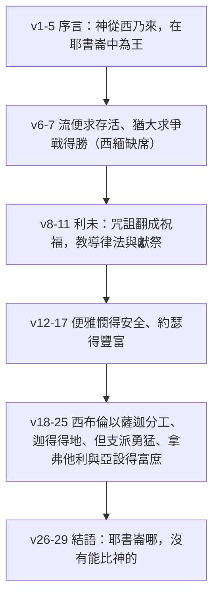

# 申命記 第33章

<!-- chapter-navigation:start -->
| [前一章](../05%20申命記/第32章.md) | [回目錄](../05%20申命記/全書目錄及綱要.md) | [下一章](../05%20申命記/第34章.md) |
| :--- | :---: | ---: |
<!-- chapter-navigation:end -->

1. 以下是[[神人（ish ha.e.lo.him）|神人]][[摩西]]在未死之先[[摩西的祝福與雅各的祝福|為以色列人所祝的福]]：
2. 他說：耶和華[[西乃山|從西乃而來]]，從[[西珥]]向他們顯現，[[從西乃西珥巴蘭山顯現|從巴蘭山發出光輝]]，[[萬萬聖者與眾聖徒（qo.desh 與 qa.dosh）|從萬萬聖者中來臨]]，從他右手為百姓傳出[[烈火的律法]]。
3. 他疼愛百姓；眾聖徒都在他手中。他們坐在他的腳下，領受他的言語。
4. [[摩西]]將律法傳給我們，作為[[雅各]]會眾的[[產業（na.cha.lah）|產業]]。
5. 百姓的眾首領，以色列的各支派，一同聚會的時候，耶和華（原文作他）在[[耶書崙（ye.shu.run）|耶書崙]]中為王。
6. 願[[流便]]存活，不致死亡；[[摩西的祝福為何漏掉西緬|願他人數不致稀少]]。
7. [[猶大支派|為猶大祝福說]]：求耶和華俯聽猶大的聲音，引導他歸於本族；他曾用手為自己爭戰，你必幫助他攻擊敵人。
8. [[利未支派|論利未說]]：耶和華啊，你的[[烏陵和土明|土明]]和[[烏陵和土明|烏陵]]都在你的虔誠人那裡。你在[[瑪撒（Massah）|瑪撒]]曾試驗他，[[瑪撒米利巴是一次還是兩次|在米利巴水與他爭論]]。
9. 他論自己的父母說：我未曾看見；[[金牛犢事件|他也不承認弟兄]]，也不認識自己的兒女。這是因[[利未支派|利未人]]遵行你的話，謹守你的約。
10. 他們要將你的典章教訓[[雅各]]，將你的律法教訓以色列。他們要把香焚在你面前，把全牲的燔祭獻在你的壇上。
11. 求耶和華降福在他的財物上，悅納他手裡所辦的事。那些起來攻擊他和恨惡他的人，願你刺透他們的腰，使他們不得再起來。
12. 論[[便雅憫]]說：耶和華所親愛的必同耶和華安然居住；耶和華終日遮蔽他，也住在他兩肩之中。
13. 論[[約瑟]]說：願他的地蒙耶和華賜福，得天上的寶物、甘露，以及地裡所藏的泉水；
14. 得太陽所曬熟的美果，月亮所養成的寶物；
15. 得上古之山的至寶，永世之嶺的寶物；
16. 得地和其中所充滿的寶物，並[[燃燒卻不燒毀的荊棘|住荊棘中]]上主的喜悅。願這些福都歸於[[約瑟]]的頭上，歸於那與弟兄迥別之人的頂上。
17. 他為[[長子名分|牛群中頭生的]]，有威嚴；他的角是野牛的角，用以牴觸萬邦，直到地極。這角是[[以法蓮|以法蓮的萬萬]]，[[瑪拿西|瑪拿西的千千]]。
18. 論[[西布倫（同住）|西布倫]]說：西布倫哪，你出外可以歡喜。[[以薩迦（價值）|以薩迦]]啊，在你帳棚裡可以快樂。
19. 他們要將列邦召到山上，在那裡獻公義的祭；因為他們要吸取海裡的豐富，並沙中所藏的珍寶。
20. [[迦得（萬幸）|論迦得說]]：使迦得擴張的應當稱頌！迦得住如母獅；他撕裂膀臂，連頭頂也撕裂。
21. 他為自己選擇頭一段地，因在那裡[[設立律法者的分存留指什麼|有設立律法者的分存留]]。他與百姓的首領同來；他施行耶和華的公義和耶和華與以色列所立的典章。
22. [[但支派|論但說]]：但為小獅子，從[[巴珊]]跳出來。
23. 論[[拿弗他利]]說：拿弗他利啊，你足沾恩惠，滿得耶和華的福，可以得西方和南方為業。
24. 論[[亞設（有福）|亞設]]說：願亞設享受多子的福樂，得他弟兄的喜悅，可以把腳蘸在油中。
25. 你的門閂（門閂或作：鞋）是銅的，鐵的。[[你的日子如何你的力量也必如何|你的日子如何，你的力量也必如何]]。
26. [[耶書崙（ye.shu.run）|耶書崙]]哪，沒有能比神的。他為幫助你，乘在天空，顯其威榮，駕行穹蒼。
27. [[永生的神是你的居所（me.o.nah）|永生的神是你的居所]]；他[[永生的神是你的居所（me.o.nah）|永久的膀臂]]在你以下。他在你前面攆出仇敵，說：毀滅吧。
28. 以色列安然居住；[[雅各]]的本源獨居[[迦南地|五穀新酒之地]]。他的天也滴甘露。
29. 以色列啊，你是有福的！誰像你這蒙耶和華所拯救的百姓呢？[[神的盾牌|他是你的盾牌]]，幫助你，是你威榮的刀劍。你的仇敵必投降你；你必踏在他們的高處。

---

## 本章知識節點

### 原文
- [[神人（ish ha.e.lo.him）]]
- [[烈火的律法]]
- [[萬萬聖者與眾聖徒（qo.desh 與 qa.dosh）]]
- [[耶書崙（ye.shu.run）]]
- [[烏陵和土明]]
- [[瑪撒（Massah）]]
- [[產業（na.cha.lah）]]

### 神學
- [[從西乃西珥巴蘭山顯現]]
- [[永生的神是你的居所（me.o.nah）]]
- [[燃燒卻不燒毀的荊棘]]
- [[神的盾牌]]

### 解經爭議
- [[摩西的祝福為何漏掉西緬]]
- [[設立律法者的分存留指什麼]]
- [[瑪撒米利巴是一次還是兩次]]

### 主題
- [[摩西的祝福與雅各的祝福]]
- [[你的日子如何你的力量也必如何]]
- [[長子名分]]

### 事件
- [[金牛犢事件]]

### 人物
- [[摩西]]
- [[雅各]]
- [[流便]]
- [[猶大支派]]
- [[利未支派]]
- [[便雅憫]]
- [[約瑟]]
- [[以法蓮]]
- [[瑪拿西]]
- [[西布倫（同住）]]
- [[以薩迦（價值）]]
- [[迦得（萬幸）]]
- [[但支派]]
- [[拿弗他利]]
- [[亞設（有福）]]

### 地點
- [[西乃山]]
- [[西珥]]
- [[巴珊]]
- [[迦南地]]

---

## 本章整理

### 序言：神從哪裡來（v1-5）

上一章是控訴，這一章是祝福。同一個人、同一天、同一批聽眾，語氣卻整個翻過來。第1節先給這篇話定性：「以下是神人摩西在未死之先為以色列人所祝的福」。

[[神人（ish ha.e.lo.him）|神人]] 這個稱呼在聖經裡是第一次出現。GT《啟導本聖經申命記註釋》說神人為負起神的使命的人，這是舊約中首次用此稱呼，後來也用來指神的其他先知。GT《聖經精讀本──申命記註解》說這句話不僅指出了摩西的偉大性，也暗示了他底下所說的祝福完全是由神而來的宣告。KC 從另一面補：神人是在衰敗的時代裡以個人身分承認神的權利、並在自己生活中活出來的人，這樣的人既看得見百姓當前的光景，也看得見神對他們最終的目的就是賜福。

接著三節不講支派，先講神從哪裡來。[[從西乃西珥巴蘭山顯現|耶和華從西乃而來]]，從西珥向他們顯現，從巴蘭山發出光輝。STEP 語言資料顯示這三句用的是三個不同的動詞，亮度一句比一句強——來、發亮、照耀。三家對這幅畫面的讀法略有不同：GT《聖經精讀本──申命記註解》讀成光的擴散，說神降臨在西奈山的榮耀過於威嚴莊重，其光甚至照耀了遠離西奈山的兩座山；KC 讀成路程，說 [[西乃山|西乃]] 是旅程的起點、[[西珥]] 標誌終點，中間一切失敗都被跳過；BH 讀成引導，說發出光輝可能連到曠野飄流時的雲柱火柱。

第2節末交代神帶來的是什麼——[[烈火的律法|烈火的律法]]。STEP 語言資料把這裡標成一個複合形式，火與律法接在一起；CT 在話中之光說原文由火和律法兩個字合成，意思是如火的律法。

緊接的第2、3節有一個中文看不出來的分別。第2節的「萬萬聖者」與第3節的「眾聖徒」在原文是兩個詞，這就是 [[萬萬聖者與眾聖徒（qo.desh 與 qa.dosh）|從萬萬聖者中來臨]] 那條線索。GT《申命記雷氏研讀本》分得最清楚：第2節指天使，第3節指以色列人、神分別為聖的子民。只有 KC 在第2節讀成神自己的百姓。

序言收在第5節：耶和華在 [[耶書崙（ye.shu.run）|耶書崙]] 中為王。上一章用這個名字諷刺百姓，這一章把它用回本義，而且第26節結語還要再用一次。

### 一份缺了一格的名單（v6-7）

祝福從流便開始。第6節只求兩件事：[[流便|願流便存活]]，不致死亡；願他人數不致稀少。CT 說流便因亂倫而失去長子的名分，支派又分配在約但河東、摩押地的正北面，缺少地理屏障容易受攻擊，故有沒落的危機。KC 讀出另一層：摩西為他求存活，而他的行為本不配得存活；當一切本相的以色列被除去、卻仍留下一個餘剩的少數有生命，那就是祝福。

第7節跳到 [[猶大支派|為猶大祝福說]]。中間少了一個支派——西緬整個不見了，這就是 [[摩西的祝福為何漏掉西緬]]。四家都注意到，理由卻不同：

| 來源 | 給的理由 |
|---|---|
| CT | 剛與巴力毗珥連合受刑罰、人數最少，地業又在猶大境內，所以與猶大一起分享祝福 |
| GT《申命記雷氏研讀本》 | 七十士譯本使第6節下半所指的作西緬；被刪大概因為西緬分得的地在猶大邊界以內 |
| GT《啟導本聖經申命記註釋》 | 只留分地在猶大境內這一條 |
| GT《聖經精讀本──申命記註解》 | 兩種可能並列：與猶大合併，或因受咒詛後又犯新罪而被省略 |
| KC | 可能因為他的地業屬於猶大的地業 |

### 利未：從咒詛翻成祝福（v8-11）

本章給利未的篇幅最長，也是與創世記49章落差最大的一段。

第8節先講職分：[[烏陵和土明|土明]] 和烏陵都在你的虔誠人那裡。CT 說這是放在大祭司胸牌裡的兩塊石頭，用於尋求神的旨意。KC 說這兩塊石頭說明 [[利未支派|論利未說]] 這一段的重點——利未是一群認識神旨意、又能把神旨意教導神百姓的祭司之民。

同一節接著提兩件舊事：你在 [[瑪撒（Massah）|瑪撒]] 曾試驗他，[[瑪撒米利巴是一次還是兩次|在米利巴水與他爭論]]。KC 在這裡點出一個方向上的差別很值得注意：出埃及記17章說的是以色列試探神，這一節說的卻是神在瑪撒試驗利未——那裡沒有水，那是神的試驗、要看百姓怎麼反應。

第9節那句冷硬的話——他也不承認弟兄，也不認識自己的兒女——四家一致讀成 [[金牛犢事件]]。CT 說意指利未人大義滅親，拔刀殺死拜金牛犢的同胞。GT《申命記串珠聖經註釋》說看見、承認、認識本是法律的術語，表示利未人不讓家人成為他們事奉神的阻礙。KC 說他們在執行審判時沒有分別誰是家人誰不是。

然後是本章最大的翻轉。CT 在這一段的話中之光把它講得很直白：[[摩西的祝福與雅各的祝福|在雅各的祝福語中利未是遭咒詛的]]，將來這族必分散在以色列各地，但是現在咒詛成為祝福，分散成為以色列聖工的特權——他們要以律例教導雅各，將神的律法教以色列，在神面前燒香、將燔祭獻在神的壇上。GT《聖經精讀本──申命記註解》說的是同一件事：利未支派要分居以色列支派，這就將雅各的咒詛恢復成了祝福。

> [!note]
> 這裡的對照是全章的縮影。KC 說雅各講的是以色列歷史將如何展開，那是一份失敗的記錄；本章摩西沒有講歷史、也沒有講失敗，他描述的是各支派在千年國度平安時期的光景。

### 各支派：位置決定了福分的樣子（v12-25）

接下來幾段有一個共同點：每個支派得到的福，幾乎都與它將來住在哪裡有關。

[[便雅憫]] 得的是安全（v12）。CT 說神所揀選作他居所的聖殿將會建於耶路撒冷，而它是屬便雅憫支派轄境；KC 說耶路撒冷坐落在便雅憫地業中的摩利亞山上，因此便雅憫住在聖殿旁邊、享受它的保護。「住在他兩肩之中」這個畫面，GT《啟導本聖經申命記註釋》解成父親讓幼童騎在兩肩之間，安全且快樂。

[[約瑟]] 得的是豐富（v13-17），篇幅最長。天上的甘露、地裡的泉水、太陽曬熟的美果、月亮養成的寶物、上古之山的至寶——GT《聖經精讀本──申命記註解》把三段祝福排成一組：猶大蒙的是政治性的祝福，利未蒙的是宗教性的祝福，約瑟蒙的是物質性的祝福。第16節末尾說到 [[燃燒卻不燒毀的荊棘|住荊棘中]] 上主的喜悅，CT 說這幾個字原文是「住荊棘中的」，因神曾在荊棘中向摩西顯現。KC 從這裡讀出一層意思：神藉著壓迫並不是要滅絕他的百姓，而是要教他們呼求他。

第17節說約瑟是 [[長子名分|牛群中頭生的]]，角是野牛的角。CT 說頭生的指他得著長子的名分，野牛的角指他大有能力；[[以法蓮|以法蓮的萬萬]] 與 [[瑪拿西|瑪拿西的千千]] 的數量差別，是因為約書亞所屬的以法蓮支派被雅各改立在瑪拿西支派之上。

[[西布倫（同住）|西布倫]] 出外、[[以薩迦（價值）|以薩迦]] 在帳棚裡（v18-19），這一組講的是分工。KC 一句話收住：西布倫是那個旅行的人、做生意的人，以薩迦是那個在家做工的人。GT《聖經精讀本──申命記註解》說出外是指出海、從事貿易活動，居住在帳棚裡則是平靜度日的文學性表達。

[[迦得（萬幸）|論迦得說]] 那一段（v20-21）有本章唯一一句不好讀通的話——[[設立律法者的分存留指什麼|有設立律法者的分存留]]。CT 讀成迦得自認領袖群倫、配分得那段地；GT《申命記串珠聖經註釋》乾脆給另一個譯法，或作「因他期望得到首領的位分」；GT《聖經精讀本──申命記註解》走第三條路，說其它支派皆從約書亞分得了地，而迦得支派卻從立律法者摩西手中直接分得了產業。

[[但支派|論但說]]：但為小獅子，從 [[巴珊]] 跳出來（v22）。CT 說巴珊地為高山峻嶺地帶、猛獸出沒其中，故形容但支派勇猛。GT《啟導本聖經申命記註釋》在這裡提了一個保留：因為巴珊地在歷史上從不曾是但的軍事活動地區，此處只可解作但英勇像小獅子從巴珊跳出來；GT《申命記串珠聖經註釋》另給一個譯法——本句也可能譯作「從虺蛇跳開來」。

[[拿弗他利]] 足沾恩惠（v23）。「西方和南方」怎麼讀，CT 與 GT 不同：CT 說西方指地中海、南方指加利利海；GT《啟導本聖經申命記註釋》說西方可譯為海、指加利利海，本節可譯為「可以取得加利利海及其南方為業」。

[[亞設（有福）|亞設]] 把腳蘸在油中（v24-25），因為境內盛產橄欖油。這一段收在本章最常被單獨引用的那句話上：[[你的日子如何你的力量也必如何|你的日子如何，你的力量也必如何]]。CT 在話中之光指出一個原文細節——日子在原文為多數，表明力量是要與日俱增的。BH 說這句話表示神所賜的力量正好對應每一天的需要，令人想起曠野中每日的嗎哪。

### 結語：誰像你這蒙拯救的百姓（v26-29）

第26節回到第5節那個名字：耶書崙哪，沒有能比神的。CT 在話中之光指出這個結構——摩西的祝福開始和結束都把以色列稱為耶書崙。

第27節是這段的中心：[[永生的神是你的居所（me.o.nah）|永生的神是你的居所]]；他永久的膀臂在你以下。神被放在上下兩個位置，上面是可以住進去的地方，下面是托住人的膀臂。KC 把「居所」的內容展開得最細：那不只是人生風暴來時的避難處，也說到平靜無慮地享受安寧與相交；他接著說，那位在天上坐著為王的，同時就是那位在地上與他百姓同在、把他們抱在懷裡背著走的神。CT 說真正的安全乃在於永生的神——在我們所賴以支撐的人或物傾覆、自己也快要跌倒時，他往往扶持著我們的膀臂使我們站穩。

第28節說以色列安然居住，[[雅各]] 的本源獨居 [[迦南地|五穀新酒之地]]。GT《聖經精讀本──申命記註解》說天也滴甘露隱含著神施恩典之意。

最後一節把全篇收在一個問句上：以色列啊，你是有福的！誰像你這蒙耶和華所拯救的百姓呢？[[神的盾牌|他是你的盾牌]]，幫助你，是你威榮的刀劍。CT 說盾牌指防守和保護，幫助指維持和加力，刀劍指攻擊和消滅——防守、支撐、進攻三面都由神自己承擔。

> [!important]
> KC 把首尾扣在一起：開頭摩西說到耶和華作王，是他百姓得救的穩固根基；結尾則說耶和華是永遠的保護與避難所。他並指出這段結語有兩句對稱的話——第26節說沒有一位像以色列的神，第29節說沒有一個民族像神的百姓。

### 兩份支派祝福放在一起讀

本章與創世記49章是聖經裡僅有的兩份逐支派祝福。放在一起讀，差別比相似更值得注意。

| 支派 | 創49（雅各） | 申33（摩西） |
|---|---|---|
| 流便 | 暗示不得居首、人數減少 | 求他存活、人數不致稀少 |
| 西緬 | 受咒詛 | 名單上缺席 |
| 利未 | 遭咒詛、必分散在以色列各地 | 分散成為聖工的特權，教導律法、獻祭焚香 |
| 但 | 比作蛇 | 比作小獅子 |

GT《啟導本聖經申命記註釋》把兩者的差別壓成一句：內容與雅各晚年所作的相似，只是摩西的祝福中沒有斥責的話。GT《聖經精讀本──申命記註解》說兩者相距450年，根據啟示的漸進性具有進一步發展的形態。

這也解釋了申32 與申33 為什麼可以擺在一起而不衝突。前一章講百姓會怎樣背棄神，本章講神要怎樣待這批百姓；[[摩西的祝福與雅各的祝福|為以色列人所祝的福]] 不是把前一章的控訴收回，而是把話說完——[[摩西]] 一生最後留下的，不是對失敗的判詞，而是一份福。

**參考資料**
https://www.ccbiblestudy.org/Old%20Testament/05Deut/05CT33.htm
https://www.ccbiblestudy.org/Old%20Testament/05Deut/05GT33.htm
https://www.kingcomments.com/en/bible-studies/Deu/33
https://biblehub.com/study/deuteronomy/33.htm
https://github.com/STEPBible/STEPBible-Data

<!-- appendix-links:start -->
## 附錄

### 相關地圖
- [[appendix/fhl_maps/maps/025|〈申圖一〉應許之地全圖]]
- [[appendix/fhl_maps/maps/036|〈書圖九〉西緬和猶大支派的地業]]
<!-- appendix-links:end -->

<!-- chapter-navigation:start -->
| [前一章](../05%20申命記/第32章.md) | [回目錄](../05%20申命記/全書目錄及綱要.md) | [下一章](../05%20申命記/第34章.md) |
| :--- | :---: | ---: |
<!-- chapter-navigation:end -->
