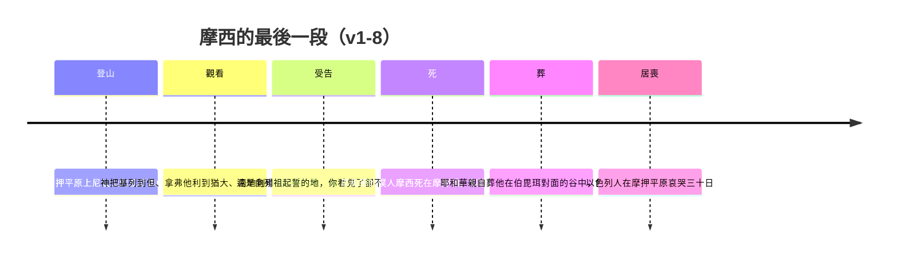

# 申命記 第34章

<!-- chapter-navigation:start -->
| [前一章](../05%20申命記/第33章.md) | [回目錄](../05%20申命記/全書目錄及綱要.md) |  |
| :--- | :---: | ---: |
<!-- chapter-navigation:end -->

1. [[摩西]]從[[摩押平原]]登[[尼波山]]，上了那與[[耶利哥]]相對的[[瑣腓田與毘斯迦山頂|毘斯迦山頂]]。耶和華把[[基列]]全地[[但|直到但]]，
2. [[拿弗他利]]全地，[[以法蓮]]、[[瑪拿西]]的地，[[猶大支派|猶大全地]]直到西海，
3. [[南地]]和棕樹城[[耶利哥]]的平原，直到[[瑣珥]]，[[申命記34章的作者|都指給他看]]。
4. 耶和華對他說：這就是我向[[亞伯拉罕]]、[[以撒]]、[[雅各]][[亞伯拉罕之約|起誓應許之地]]，說：我必將這地賜給你的後裔。現在我使你眼睛看見了，[[摩西不得進入應許之地|你卻不得過到那裡去]]。
5. 於是，[[耶和華的僕人摩西（e.ved 與 al pi）|耶和華的僕人摩西]]死在[[摩押地]]，正如耶和華所說的。
6. [[神親自埋葬摩西|耶和華將他埋葬]]在[[摩押地]]、[[伯毘珥]]對面的谷中，只是到今日[[神親自埋葬摩西|沒有人知道他的墳墓]]。
7. [[摩西]]死的時候[[一百二十歲的摩西|年一百二十歲]]；[[眼目沒有昏花精神沒有衰敗（le.ach）|眼目沒有昏花，精神沒有衰敗]]。
8. [[以色列|以色列人]]在[[摩押平原]]為[[摩西]][[哀哭三十天|哀哭了三十日]]，為摩西居喪哀哭的日子就滿了。
9. 嫩的兒子[[約書亞]]；因為[[摩西]]曾[[按手]]在他頭上，就被[[智慧的靈（ru.ach chokh.mah）|智慧的靈]]充滿，[[以色列|以色列人]]便聽從他，照著耶和華吩咐摩西的行了。
10. 以後[[以色列]]中[[興起一位先知像我|再沒有興起先知像摩西的]]。他是耶和華[[神與摩西面對面明說|面對面所認識的]]。
11. 耶和華打發他在埃及地向法老和他的一切臣僕，並他的全地，行各樣神蹟奇事，
12. 又在[[以色列]]眾人眼前顯[[大能的手]]，行一切大而可畏的事。

---

## 本章知識節點

### 原文
- [[耶和華的僕人摩西（e.ved 與 al pi）]]
- [[眼目沒有昏花精神沒有衰敗（le.ach）]]
- [[智慧的靈（ru.ach chokh.mah）]]
- [[按手]]
- [[以色列]]

### 事件
- [[神親自埋葬摩西]]
- [[摩西不得進入應許之地]]

### 解經爭議
- [[申命記34章的作者]]

### 神學
- [[興起一位先知像我]]
- [[神與摩西面對面明說]]
- [[大能的手]]
- [[亞伯拉罕之約]]

### 主題
- [[一百二十歲的摩西]]

### 文化
- [[哀哭三十天]]

### 地點
- [[摩押平原]]
- [[尼波山]]
- [[瑣腓田與毘斯迦山頂]]
- [[伯毘珥]]
- [[摩押地]]
- [[耶利哥]]
- [[基列]]
- [[但]]
- [[南地]]
- [[瑣珥]]

### 人物
- [[摩西]]
- [[約書亞]]
- [[亞伯拉罕]]
- [[以撒]]
- [[雅各]]
- [[拿弗他利]]
- [[以法蓮]]
- [[瑪拿西]]
- [[猶大支派]]

---

## 本章整理

### 最後一次登高（v1-3）

全卷申命記的講論都是在 [[摩押平原]] 說的，最後一章也從那裡開始：「摩西從摩押平原登 [[尼波山]]，上了那與 [[耶利哥]] 相對的 [[瑣腓田與毘斯迦山頂|毘斯迦山頂]]。」

KC 把這一段的氣氛寫得很清楚：摩西是照著神在申32:49 的吩咐上山的，百姓一定盡可能地望著他；他沒有人扶就自己上到山頂。KC 接著說了一句很值得記住的話——他不是力盡了，也不是厭倦了活著，只是安息在耶和華說他任務已了的決定裡；他心裡沒有懼怕死亡，他上山不是為了死，而是為了與神同在。

接下來兩節半是一份地名清單。GT《啟導本聖經申命記註釋》指出這串地名的排列方式：本節下半和第2節所記各地為反時鐘方向自北而南列舉——從約但河東的 [[基列]] 全地，經 [[但]]、[[拿弗他利]] 全地、[[以法蓮]] 與 [[瑪拿西]] 的地、[[猶大支派|猶大全地]] 直到西海，再到 [[南地]] 和棕樹城耶利哥的平原，最後 [[瑣珥]]。

這串名字有多遠？GT《聖經精讀本──申命記註解》算過：從毗斯迦山所在的摩押平原到北部黑門山腳下的但，約有160公里，所以摩西是因神特殊的恩典才得以眺望到此。CT 也提同一件事——要一眼眺望南北約300公里、東西約100公里全境，必是神賜給他特殊的恩典。

KC 說得更進一步：耶和華以超自然的方式，在一瞬間把那地在它一切的細部裡指給他看；摩西看見的不只是那地，也看見了百姓最終的福分。

> [!note]
> CT 從這串地名讀出一條線索：第2節提到的拿弗他利、以法蓮、瑪拿西、猶大，都是約書亞分地以後各支派的名字。這正是他判斷本章寫作時間的根據，也就是 [[申命記34章的作者]] 那個問題的起點。

### 看得見，進不去（v4）

第4節是神在山上對摩西說的話，也是這一幕的重心：「這就是我向 [[亞伯拉罕]]、[[以撒]]、[[雅各]] [[亞伯拉罕之約|起誓應許之地]]，說：我必將這地賜給你的後裔。現在我使你眼睛看見了，[[摩西不得進入應許之地|你卻不得過到那裡去]]。」

CT 說這是耶和華神先後向以色列人的列祖起誓應許、必賜給他們和他們後裔的地（參創十七8；二十六3；三十五12）。GT《啟導本聖經申命記註釋》另補一層法律上的意味：要摩西觀看全地寓有法律上的意義，要觀看了才可以得到為業。

至於為什麼不得過去，CT 與 GT《聖經精讀本──申命記註解》給的答案幾乎一字不差，都分成表面與深層兩層：表面理由是因在米利巴水事件時未能全然彰顯神的聖潔（民20:12）；深層原因有兩條——為了曉諭人天國斷不能靠著人的功勞而進去，以及摩西象徵著律法，為了曉諭律法斷不能引領人進入天上迦南的事實。

KC 把同一件事說成兩句對稱的話：神的定規是他不得過去，神的恩典是他看見了那地，而且是用別人都沒有過的方式看見的。

### 死與葬（v5-8）

第5節只有一句：「於是，[[耶和華的僕人摩西（e.ved 與 al pi）|耶和華的僕人摩西]] 死在 [[摩押地]]，正如耶和華所說的。」STEP 語言資料顯示末句原文不是「說」那個字，字面是照耶和華的口。CT 則在本節的話中之光說，這表明不但他比一般人多活幾十年是神親自安排的，他在進迦南之前的死也是神親自安排的。

第6節則是全本聖經只發生過一次的事：[[神親自埋葬摩西|耶和華將他埋葬]] 在 [[伯毘珥]] 對面的谷中。BH 說這在聖經裡是獨一無二的，是唯一一處神直接參與埋葬的記載。CT 說神不藉著天使的手去埋葬摩西，而是他親自的將他埋葬。

四家都注意到那句「只是到今日沒有人知道他的墳墓」，而且理由一致。GT《啟導本聖經申命記註釋》說按猶太人傳統，耶和華神不讓人知道摩西的墳墓所在，恐怕後人去敬拜他的骸骨、陷於罪惡中；BH 說墳墓的匿名使它不致成為偶像崇拜或朝聖的地點。KC 加了一句：沒有人知道摩西的葬處，魔鬼卻知道——他為摩西的身體與天使長米迦勒爭辯（猶9）。

第7節排除了一個誤解：[[眼目沒有昏花精神沒有衰敗（le.ach）|眼目沒有昏花，精神沒有衰敗]]。STEP 語言資料顯示後半句字面是他的精力沒有逃走。KC 在這裡做了一組對照——這與以撒（創27:1）和雅各（創48:10）晚年眼睛昏花正好相反。CT 補上實際的旁證：摩西能從海平面以下300多米的摩押平原登上海拔700多米的尼波山，爬了1000多米的山。他不是因為身體撐不住才死的。

第8節是 [[哀哭三十天|哀哭了三十日]]。CT 說一般哀悼期為七日（參創五十10），但人們為大祭司亞倫（參民二十29）與神人摩西則哀哭了三十日；他在話中之光說這並不是因為悲傷，而是表達對神的僕人極大的敬意，也是表達對神的敬畏。BH 說哀悼期的結束標誌著從悲傷轉入行動。

### 交接（v9）

第9節是全卷唯一一節寫 [[約書亞]] 實際接手：「嫩的兒子約書亞；因為摩西曾 [[按手]] 在他頭上，就被 [[智慧的靈（ru.ach chokh.mah）|智慧的靈]] 充滿，[[以色列|以色列人]] 便聽從他，照著耶和華吩咐摩西的行了。」

CT 在這裡點出一個容易滑過去的分工：按手在約書亞頭上的是摩西（民二十七18~23），用智慧的靈充滿約書亞的卻是神自己。他接著說明用意——摩西和約書亞都不會永遠活在地上，但差遣他們的神卻永遠也不會撇下自己的百姓；神不讓百姓倚靠屬靈的領袖，而是讓百姓跟隨神的話語。

GT《聖經精讀本──申命記註解》從程序看：按手是表示將摩西至今以來對以色列百姓所擁有的領袖權都交給後任領袖約書亞的公開委任儀式；它並說約書亞在此處的出現不僅自然地連接了本書與約書亞記，還暗示了已作好準備展開迦南征服戰。

KC 給了一個很要緊的限定：約書亞接續摩西作百姓的領袖，不是接續作先知，而是接續作領兵取得應許之地的領袖。這個分別在下一節馬上得到印證。

### 全卷的最後三句（v10-12）

申命記結束在一段對摩西的總評上：[[興起一位先知像我|再沒有興起先知像摩西的]]。他是耶和華 [[神與摩西面對面明說|面對面所認識的]]；神打發他在埃及地行各樣神蹟奇事，又在以色列眾人眼前顯 [[大能的手]]。

這三句話的重點在「像摩西」到底像在哪裡。四家各給了不同的切面：

| 來源 | 摩西的獨特之處 |
|---|---|
| CT | 神所設立的四種職事——審判官、君王、祭司、先知——都集中在他身上；舊約其他先知只是重新強調摩西所頒佈的律法的原則 |
| GT《聖經精讀本──申命記註解》 | 兩方面：與神的親密關係（神對他好像人與朋友說話一般），以及彰顯神權能的事情上 |
| GT《啟導本聖經申命記註釋》 | 他集先知、審判者、祭司和行政首長於一身；神通過他給了以色列一部律法 |
| KC | 他與神的相交是獨一無二的；在這幾句最後的話裡，他的失敗一次都沒有被提起 |

CT 與 GT《啟導本聖經申命記註釋》都指出同一個具體差別：神直接向摩西說話，約書亞則須藉著祭司的烏陵和土明來尋求神的旨意（民二十七21）。GT《啟導本聖經申命記註釋》另註明一個文本細節——第12節有古卷在句首多「沒有誰像摩西那樣」數字。

> [!important]
> 這三節與申18:15 那句應許正好構成一組張力。申命記先說神要興起一位先知像摩西，最後又說再沒有興起先知像摩西的。四家都不把這讀成矛盾：GT《啟導本聖經申命記註釋》說等到主基督來到世間後，這位謙沖的人子所達到的境界則遠遠超過摩西；KC 說摩西在神的全家盡忠（來3:1-6），他是那位完全忠心者的預表，而那一位不只在神家中，更是治理神家的兒子。

### 一卷書怎麼收尾

申命記的最後三章是一組完整的收束：申32 是控訴的歌，申33 是逐支派的祝福，申34 是訃告。三章都出自摩西一生的最後一天或最後幾天，語氣卻一章比一章平靜。

這一章沒有再講律法，只講了三件事：一個人看見了他一生朝著走的地方卻進不去；他死了，而且是神親手葬的；他的位分交給了另一個人，百姓也真的聽從了。

KC 注意到本章寫法上的一個選擇——在這幾句關於摩西的最後的話裡，他的失敗一次都沒有被提起。全卷寫滿了以色列的失敗，也兩次寫到摩西自己在米利巴水的失腳，但收尾的時候，經文選擇記下的是他所是的那個人。

至於這一章是誰寫的，四家意見不同，這正是 [[申命記34章的作者]] 那個條目要處理的；但四家在一件事上一致：本章的內容不影響全卷其餘部分的作者歸屬。GT《聖經精讀本──申命記註解》給的收束最平：不論本章是由誰記錄的，必定是因神的感動，記錄得毫無差錯。

**參考資料**
https://www.ccbiblestudy.org/Old%20Testament/05Deut/05CT34.htm
https://www.ccbiblestudy.org/Old%20Testament/05Deut/05GT34.htm
https://www.kingcomments.com/en/bible-studies/Deu/34
https://biblehub.com/study/deuteronomy/34.htm
https://github.com/STEPBible/STEPBible-Data

<!-- appendix-links:start -->
## 附錄

### 相關地圖
- [[appendix/fhl_maps/maps/027|〈申圖三〉摩西觀看迦南地後去世和埋葬]]
<!-- appendix-links:end -->

<!-- chapter-navigation:start -->
| [前一章](../05%20申命記/第33章.md) | [回目錄](../05%20申命記/全書目錄及綱要.md) |  |
| :--- | :---: | ---: |
<!-- chapter-navigation:end -->
