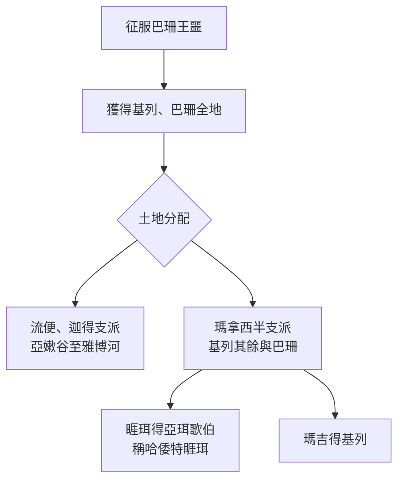

# 申命記 第3章

1. 以後，我們轉回，向巴珊去。巴珊王噩和他的眾民都出來，在[[以得來]]與我們交戰。
2. 耶和華對我說：不要怕他！因我已將他和他的眾民，並他的地，都交在你手中；你要待他像從前待住希實本的亞摩利王西宏一樣。
3. 於是耶和華─我們的神也將巴珊王噩和他的眾民都交在我們手中；我們殺了他們，沒有留下一個。
4. 那時，我們奪了他所有的城，共有六十座，沒有一座城不被我們所奪。這為[[亞珥歌伯]]的全境，就是巴珊地噩王的國。
5. 這些城都有堅固的高牆，有門有閂。此外還有許多無城牆的鄉村。
6. 我們將這些都毀滅了，像從前待希實本王西宏一樣，把有人煙的各城，連女人帶孩子，盡都毀滅；
7. 惟有一切牲畜和城中的財物都取為自己的掠物。
8. 那時，我們從約但河東兩個亞摩利王的手將亞嫩谷直到[[黑門山]]之地奪過來
9. （這[[黑門山]]，西頓人稱為西連，亞摩利人稱為示尼珥），
10. 就是奪了平原的各城、基列全地、巴珊全地，直到[[撒迦（Salcah）|撒迦]]和[[以得來]]，都是巴珊王噩國內的城邑。
11. （[[利乏音人]]所剩下的只有巴珊王噩。他的床是鐵的，長九肘，寬四肘，都是以人肘為度。現今豈不是在亞捫人的拉巴嗎？）
12. 那時，我們得了這地。從亞嫩谷邊的亞羅珥起，我將基列山地的一半，並其中的城邑，都給了流便人和迦得人。
13. 其餘的基列地和巴珊全地，就是噩王的國，我給了瑪拿西半支派。[[亞珥歌伯全境（All the region of Argob）|亞珥歌伯全地]]乃是巴珊全地；這叫做[[利乏音人|利乏音人之地]]。
14. 瑪拿西的子孫[[睚珥（Jair）|睚珥]]佔了[[亞珥歌伯]]全境，直到[[基述人（Geshurites）|基述人]]和[[瑪迦人（Maacathites）|瑪迦人]]的交界，就按自己的名稱這巴珊地為哈倭特睚珥，直到今日。
15. 我又將基列給了[[瑪吉（Machir）|瑪吉]]。
16. 從基列到亞嫩谷，以谷中為界，直到亞捫人交界的雅博河，我給了流便人和迦得人，
17. 又將亞拉巴和靠近約但河之地，從[[基尼烈]]直到[[鹽海|亞拉巴海]]，就是[[鹽海]]，並[[毘斯迦山|毘斯迦山根]]東邊之地，都給了他們。
18. 那時，我吩咐你們說：耶和華─你們的神已將這地賜給你們為業；你們所有的勇士都要帶著兵器，在你們的弟兄以色列人前面過去。
19. 但你們的妻子、孩子、牲畜（我知道你們有許多的牲畜）可以住在我所賜給你們的各城裡。
20. 等到你們弟兄在約但河那邊，也得耶和華─你們神所賜給他們的地，又使他們得享平安，與你們一樣，你們才可以回到我所賜給你們為業之地。
21. 那時我吩咐約書亞說：你親眼看見了耶和華─你神向這二王所行的；耶和華也必向你所要去的各國照樣行。
22. 你不要怕他們，因那為你爭戰的是耶和華─你的神。
23. 那時，我懇求耶和華說：
24. 主耶和華啊，你已將你的大力大能顯給僕人看。在天上，在地下，有什麼神能像你行事、像你有大能的作為呢？
25. 求你容我過去，看約但河那邊的美地，就是那佳美的山地和利巴嫩。
26. 但耶和華因你們的緣故向我發怒，不應允我，對我說：罷了！你不要向我再提這事。
27. 你且上[[毘斯迦山|毘斯迦山頂]]去，向東、西、南、北舉目觀望，因為你必不能過這約但河。
28. 你卻要囑咐約書亞，勉勵他，使他膽壯；因為他必在這百姓前面過去，使他們承受你所要觀看之地。
29. 於是我們住在[[伯毘珥|伯毘珥對面]]的谷中。

<!-- fhl-map-links:start -->
## 相關地圖

- [[appendix/fhl_maps/maps/025|〈申圖一〉應許之地全圖]]
- [[appendix/fhl_maps/maps/026|〈申圖二〉征服東岸及分地給兩個半支派]]
- [[appendix/fhl_maps/maps/027|〈申圖三〉摩西觀看迦南地後去世和埋葬]]
- [[appendix/fhl_maps/maps/031|〈書圖四〉以色列人所征服應許地的諸王]]
<!-- fhl-map-links:end -->

---

## 本章知識節點

### 事件
- [[征服巴珊王噩]]
- [[摩西懇求過約但河]]
- [[摩西囑咐約書亞]]
- [[二個半支派得約但河東地]]
- [[睚珥得亞珥歌伯地]]
- [[約書亞接替摩西]]

### 地理
- [[巴珊王噩的鐵床]]
- [[伯毘珥]]
- [[基尼烈]]
- [[黑門山]]
- [[毘斯迦山]]
- [[鹽海]]
- [[亞珥歌伯全境（All the region of Argob）]]
- [[亞珥歌伯]]
- [[撒迦（Salcah）]]
- [[以得來]]
- [[西連（Sirion）]]
- [[示尼珥（Senir）]]
- [[哈倭特睚珥（Havvoth-jair）]]

### 人物
- [[利乏音人]]
- [[基述人（Geshurites）]]
- [[瑪迦人（Maacathites）]]
- [[睚珥（Jair）]]
- [[瑪吉（Machir）]]

### 神學
- [[聖戰毀滅原則]]
- [[神為你爭戰]]

---

## 本章整理

### 巴珊王噩被滅與六十城盡毀（v1-7）
經文記載以色列人轉向巴珊，[[征服巴珊王噩|巴珊王噩]]率眾在[[以得來]]交戰。耶和華命摩西勿懼，應許將噩交在手中，如同先前擊敗希實本王西宏。以色列盡毀噩的六十座堅固城與無牆鄉村，連婦女孩童一併滅盡，僅取牲畜財物為掠物，展現[[聖戰毀滅原則]]的嚴格執行。

### 疆界總覽與利乏音人遺跡（v8-11）
征服範圍自亞嫩谷至[[黑門山]]（[[西連（Sirion）|西連]]、[[示尼珥（Senir）|示尼珥]]），涵蓋平原諸城、基列全地、巴珊全地，直到[[撒迦（Salcah）|撒迦]]與[[以得來]]。經文特別記載[[利乏音人]]僅剩噩王，其[[巴珊王噩的鐵床|鐵床]]長九肘寬四肘，陳列於亞捫人的拉巴，見證巨人遺蹟與神恩膺選的反差。

### 約但河東地分賜二個半支派（v12-17）
摩西將所得之地分賜：流便、迦得二支派得亞嫩谷邊亞羅珥起至雅博河的基列地，並亞拉巴靠近約但河至[[基尼烈]]、[[鹽海]]、[[毘斯迦山]]根東邊之地；瑪拿西半支派得基列其餘與巴珊全地（即[[亞珥歌伯全境（All the region of Argob）|亞珥歌伯全境]]）。[[睚珥（Jair）|睚珥]]佔[[亞珥歌伯]]至[[基述人（Geshurites）|基述]]、[[瑪迦人（Maacathites）|瑪迦]]交界，名為[[哈倭特睚珥（Havvoth-jair）|哈倭特睚珥]]；[[瑪吉（Machir）|瑪吉]]得基列。此為[[二個半支派得約但河東地]]的具體落實。

上圖梳理本章土地分賜的層級關係。

### 勇士先行過河與囑咐約書亞（v18-22）
摩西吩咐二個半支派的勇士帶兵器在弟兄前過河協助征戰，妻兒牲畜留在賜給的城邑，直等弟兄在約但河西也得享平安才可歸回。摩西勉勵約書亞：親眼見神擊敗二王，未來征戰同樣[[神為你爭戰]]，勿懼怕。

### 摩西懇求過河被拒與交棒約書亞（v23-29）
摩西[[摩西懇求過約但河|懇求耶和華]]容許過河看美地、利巴嫩，卻因百姓緣故被拒，神說「罷了！不要再提」。神命摩西登[[毘斯迦山]]頂極目四望，並[[摩西囑咐約書亞|囑咐約書亞]]壯膽，因他必率百姓進入應許之地。這標誌[[約書亞接替摩西]]領導權的正式移交。以色列遂住在[[伯毘珥]]對面的谷中。

**參考資料**
https://www.ccbiblestudy.org/Old%20Testament/05Deut/05CT03.htm
https://www.ccbiblestudy.org/Old%20Testament/05Deut/05GT03.htm
https://www.kingcomments.com/en/bible-studies/Deu/3
https://biblehub.com/study/deuteronomy/3.htm
