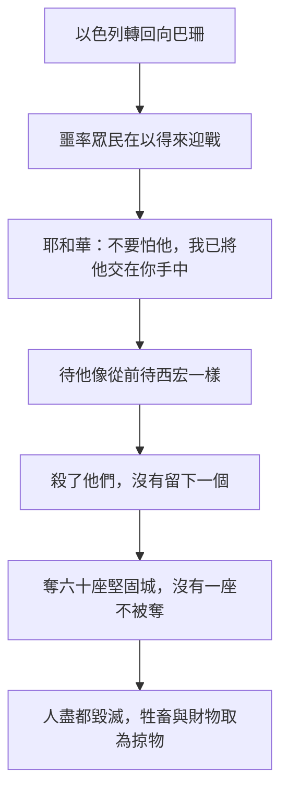
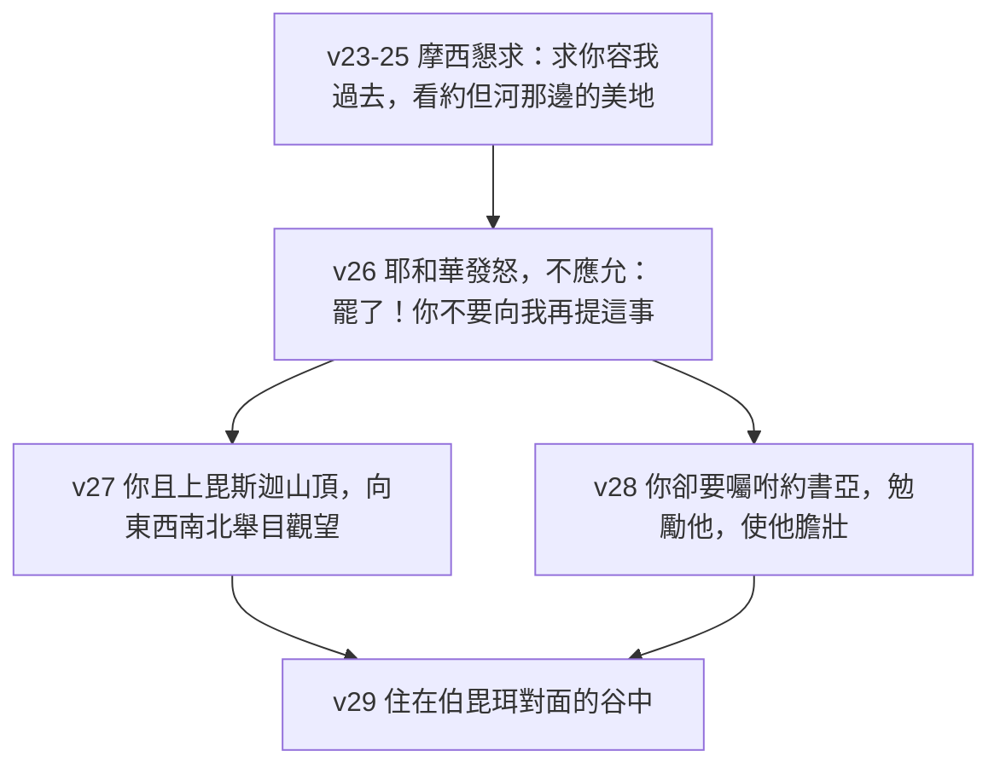

# 申命記 第3章

<!-- chapter-navigation:start -->
| [前一章](../05%20申命記/第2章.md) | [回目錄](../05%20申命記/全書目錄及綱要.md) | [下一章](../05%20申命記/第4章.md) |
| :--- | :---: | ---: |
<!-- chapter-navigation:end -->

1. 以後，我們轉回，向[[巴珊]]去。[[以色列戰勝巴珊王噩互文（申3：1-11；詩135：10-12；136：17-22）|巴珊王噩]]和他的眾民都出來，在[[以得來]]與我們交戰。
2. 耶和華對我說：不要怕他！因我已將他和他的眾民，並他的地，都交在你手中；你要待他像從前待住[[希實本]]的[[以色列戰勝亞摩利王西宏互文（申2：24-37；3：1-7；詩135：10-12；136：17-22）|亞摩利王西宏]]一樣。
3. 於是耶和華─我們的神也將[[以色列戰勝巴珊王噩互文（申3：1-11；詩135：10-12；136：17-22）|巴珊王噩]]和他的眾民都交在我們手中；我們殺了他們，沒有留下一個。
4. 那時，我們奪了他所有的城，共有[[六十座堅固城與無城牆的鄉村|六十座]]，沒有一座城不被我們所奪。這為[[亞珥歌伯（ar.gov）|亞珥歌伯]]的全境，就是[[巴珊]]地噩王的國。
5. 這些城都有[[六十座堅固城與無城牆的鄉村|堅固的高牆]]，有門有閂。此外還有許多[[六十座堅固城與無城牆的鄉村|無城牆的鄉村]]。
6. 我們將這些[[滅絕|都毀滅了]]，像從前待[[以色列戰勝亞摩利王西宏互文（申2：24-37；3：1-7；詩135：10-12；136：17-22）|希實本王西宏]]一樣，把有人煙的各城，連女人帶孩子，[[滅絕（herem）|盡都毀滅]]；
7. 惟有一切牲畜和城中的財物都取為自己的[[戰利品的分配辦法|掠物]]。
8. 那時，我們從[[約但河]]東[[亞摩利人|兩個亞摩利王]]的手將[[亞嫩河|亞嫩谷]]直到[[黑門山]]之地奪過來
9. （這[[黑門山]]，西頓人稱為[[黑門山|西連]]，[[亞摩利人]]稱為[[黑門山|示尼珥]]），
10. 就是奪了[[平原（mi.shor）|平原的各城]]、[[基列]]全地、[[巴珊]]全地，直到[[撒迦]]和[[以得來]]，都是[[以色列戰勝巴珊王噩互文（申3：1-11；詩135：10-12；136：17-22）|巴珊王噩]]國內的城邑。
11. （[[利乏音人]]所剩下的只有[[以色列戰勝巴珊王噩互文（申3：1-11；詩135：10-12；136：17-22）|巴珊王噩]]。[[巴珊王噩的鐵床（e.re.s）|他的床是鐵的]]，長九肘，寬四肘，都是[[以人肘為度]]。現今豈不是在[[亞捫人]]的拉巴嗎？）
12. 那時，我們得了這地。從[[亞嫩河|亞嫩谷]]邊的[[亞羅珥]]起，我將[[基列]]山地的一半，並其中的城邑，都給了[[流便|流便人]]和[[迦得（萬幸）|迦得人]]。
13. 其餘的[[基列]]地和[[巴珊]]全地，就是噩王的國，我給了[[瑪拿西半支派為何留在河東|瑪拿西半支派]]。[[亞珥歌伯（ar.gov）|亞珥歌伯]]全地乃是巴珊全地；這叫做[[利乏音人]]之地。
14. [[瑪拿西|瑪拿西的子孫]][[睚珥]]佔了[[亞珥歌伯（ar.gov）|亞珥歌伯]]全境，直到[[基述人和瑪迦人]]的交界，就按自己的名稱這[[巴珊]]地為[[哈倭特睚珥]]，直到今日。
15. 我又將[[基列]]給了[[瑪吉]]。
16. 從[[基列]]到[[亞嫩河|亞嫩谷]]，以谷中為界，直到[[亞捫人]]交界的[[雅博渡口|雅博河]]，我給了[[流便|流便人]]和[[迦得（萬幸）|迦得人]]，
17. 又將[[亞拉巴]]和靠近[[約但河]]之地，從[[基尼烈湖|基尼烈]]直到[[鹽海|亞拉巴海]]，就是[[鹽海]]，並[[瑣腓田與毘斯迦山頂|毘斯迦]]山根東邊之地，都給了他們。
18. 那時，我吩咐你們說：耶和華─你們的神[[河東之地是神的旨意還是神的允許|已將這地賜給你們為業]]；你們所有的[[勇士（cha.yil）|勇士]]都要[[帶兵器（cha.lats）|帶著兵器]]，[[兩支派半求河東之地為業|在你們的弟兄以色列人前面過去]]。
19. 但你們的妻子、孩子、牲畜（我知道你們有許多的牲畜）可以住在我所賜給你們的各城裡。
20. 等到你們弟兄在[[約但河]]那邊，也得耶和華─你們神所賜給他們的地，又使他們[[得享平安（nu.ach）|得享平安]]，與你們一樣，你們才可以回到我所賜給你們[[為業（ye.ru.shah）|為業之地]]。
21. 那時我吩咐[[約書亞]]說：[[你親眼看見了]]耶和華─你神向這二王所行的；耶和華也必向你所要去的各國照樣行。
22. 你不要怕他們，因那為你[[耶和華的爭戰|爭戰]]的是耶和華─你的神。
23. 那時，我[[懇求（cha.nan）|懇求]]耶和華說：
24. [[主耶和華（a.do.nai）|主耶和華]]啊，[[起首得那地（cha.lal）|你已將]]你的[[大能的手|大力大能]]顯給僕人看。在天上，在地下，[[在天上在地下有什麼神能像你|有什麼神能像你行事]]、像你有大能的作為呢？
25. 求你[[過去與發怒同一字根（a.var）|容我過去]]，看[[約但河]]那邊的[[美地]]，就是那[[美地|佳美的山地]]和[[利巴嫩]]。
26. 但耶和華[[在米利巴未將耶和華尊為聖|因你們的緣故]][[過去與發怒同一字根（a.var）|向我發怒]]，不應允我，對我說：[[罷了（rav）|罷了]]！你不要向我再提這事。
27. 你且上[[瑣腓田與毘斯迦山頂|毘斯迦]]山頂去，[[面東定向的左右方位|向東、西、南、北]][[擔當（na.sa）|舉目]]觀望，因為[[摩西不得進入應許之地|你必不能過這約但河]]。
28. [[約書亞承接摩西|你卻要囑咐約書亞]]，[[勉勵他使他膽壯（cha.zaq、a.mats）|勉勵他，使他膽壯]]；因為他必在這百姓前面過去，使他們承受你所要觀看之地。
29. 於是我們住在[[伯毘珥]]對面的谷中。

---

## 本章知識節點

### 地點
- [[巴珊]]
- [[以得來]]
- [[希實本]]
- [[亞珥歌伯（ar.gov）]]
- [[黑門山]]
- [[平原（mi.shor）]]
- [[基列]]
- [[撒迦]]
- [[亞嫩河]]
- [[亞羅珥]]
- [[哈倭特睚珥]]
- [[雅博渡口]]
- [[亞拉巴]]
- [[基尼烈湖]]
- [[鹽海]]
- [[瑣腓田與毘斯迦山頂]]
- [[約但河]]
- [[利巴嫩]]
- [[伯毘珥]]

### 人物
- [[亞摩利人]]
- [[利乏音人]]
- [[亞捫人]]
- [[流便]]
- [[迦得（萬幸）]]
- [[瑪拿西]]
- [[睚珥]]
- [[瑪吉]]
- [[基述人和瑪迦人]]
- [[約書亞]]

### 原文
- [[巴珊王噩的鐵床（e.re.s）]]
- [[勇士（cha.yil）]]
- [[帶兵器（cha.lats）]]
- [[得享平安（nu.ach）]]
- [[為業（ye.ru.shah）]]
- [[懇求（cha.nan）]]
- [[過去與發怒同一字根（a.var）]]
- [[罷了（rav）]]
- [[勉勵他使他膽壯（cha.zaq、a.mats）]]
- [[起首得那地（cha.lal）]]
- [[擔當（na.sa）]]
- [[滅絕]]

### 神學
- [[滅絕（herem）]]
- [[主耶和華（a.do.nai）]]
- [[在天上在地下有什麼神能像你]]
- [[大能的手]]
- [[耶和華的爭戰]]
- [[在米利巴未將耶和華尊為聖]]

### 主題
- [[六十座堅固城與無城牆的鄉村]]
- [[你親眼看見了]]
- [[美地]]
- [[戰利品的分配辦法]]

### 事件
- [[兩支派半求河東之地為業]]
- [[摩西不得進入應許之地]]
- [[約書亞承接摩西]]

### 互文
- [[以色列戰勝巴珊王噩互文（申3：1-11；詩135：10-12；136：17-22）]]
- [[以色列戰勝亞摩利王西宏互文（申2：24-37；3：1-7；詩135：10-12；136：17-22）]]

### 解經爭議
- [[瑪拿西半支派為何留在河東]]
- [[河東之地是神的旨意還是神的允許]]

### 文化
- [[以人肘為度]]

### 背景
- [[面東定向的左右方位]]

---

## 本章整理

### 一、巴珊王噩：比上一仗更大的勝仗（v1-11）

申命記第三章接著第二章往下講。以色列打完[[以色列戰勝亞摩利王西宏互文（申2：24-37；3：1-7；詩135：10-12；136：17-22）|希實本王西宏]]，轉頭向北進[[巴珊]]，[[以色列戰勝巴珊王噩互文（申3：1-11；詩135：10-12；136：17-22）|巴珊王噩]]帶著全軍在[[以得來]]迎戰。KC 注意到噩的態度：「Og has not been warned by Sihon's defeat. Audaciously, relying on his own strength, he comes out to meet Israel to fight against them.」（噩沒有因西宏的敗亡而受警戒。他大膽地倚仗自己的力量，出來迎戰以色列。）神給摩西的話很短——不要怕他，因為已經把他交在你手中，你要待他像從前待西宏一樣。KC 說前一場仗在這裡被當成憑據：「The previous victory, that over Sihon, is cited as evidence.」（先前那場勝過西宏的仗，在這裡被舉出來當作憑據。）

打下來的規模比上一次大得多。[[六十座堅固城與無城牆的鄉村|六十座城]]全部拿下，一座不剩，另有許多無城牆的村莊。GT《啟導本》從列王紀推算這些城的樣子：「從《王上》四13所記，這60座城都是有城牆的大城，還有許多鄉村（5節），其地人口必甚多。」KC 把對比講得直白：「After forty years of roaming through the wilderness, where they probably did not see a city, they are now facing fortresses that are considered impregnable.」（四十年在曠野漂流，他們大概一座城都沒看過；如今面對的卻是被認為攻不破的要塞。）處置方式與上一仗相同：人[[滅絕（herem）|盡都毀滅]]，牲畜與城中財物[[戰利品的分配辦法|取為掠物]]——CT 原文字義給「毀滅」的是完全毀壞（見[[滅絕]]）。

```mermaid
flowchart TD
  A["以色列轉回向巴珊"] --> B["噩率眾民在以得來迎戰"]
  B --> C["耶和華：不要怕他，我已將他交在你手中"]
  C --> D["待他像從前待西宏一樣"]
  D --> E["殺了他們，沒有留下一個"]
  E --> F["奪六十座堅固城，沒有一座不被奪"]
  F --> G["人盡都毀滅，牲畜與財物取為掠物"]
```

CT 在第2節的〔話中之光〕給了一個看整件事的角度：「只發生過一次的事件，人都可以看它為偶然的，但事情接連的發生，就沒有人可以說它是偶然的。」第8節總結兩仗的成果：從兩個[[亞摩利人|亞摩利王]]手中，把[[亞嫩河|亞嫩谷]]直到[[黑門山]]之地奪過來——這是以色列在河東實際控制的南北兩端；南邊的[[希實本]]是西宏的京城。

第9-11節接連三段插敘，補的都是地名與人的來歷：

| 節 | 插敘內容 | 來源怎麼說 |
|---|---|---|
| 9 | [[黑門山]]有三個名字：西頓人叫西連、亞摩利人叫示尼珥 | CT 原文字義：「西連」護胸甲、「示尼珥」雪山；GT《啟導本》另補一個「西雲山（四48）」 |
| 10 | 奪來的地一次列齊：[[平原（mi.shor）]]、[[基列]]、巴珊，直到[[撒迦]]和以得來 | GT《啟導本》：「“平原的各城”北起基列，南到亞嫩河。」 |
| 11 | [[利乏音人]]只剩噩，他的[[巴珊王噩的鐵床（e.re.s）]]還在[[亞捫人]]的拉巴 | GT《雷氏研讀本》列三種理解：鐵裝飾的石棺材、有鐵裝飾的臥榻、玄武岩鑿刻的紀念碑 |

床的尺寸經文寫得很仔細，還特地註明[[以人肘為度]]——CT 說一肘約零點四五公尺，換算下來這張床長四公尺、寬一點八公尺。GT《聖經精讀本》說明為什麼要記這件事：「摩西之所以在這裡記錄了巴珊王噩的血統與他巨大鐵床的大小,是為了藉著談到世人之後裔“噩”的魁梧身軀來更加生動地刻畫以色列的驚人勝利。」

### 二、河東的地怎麼分（v12-17）

第12節起，敘述從打仗轉到分地。GT《啟導本》指出這一章後半有三段都以「那時」開頭：12～17節講土地怎麼分，18～22節講兩個半支派的義務，23～28節講摩西的請求與神的答覆。

| 得地的一方 | 範圍 | 節 |
|---|---|---|
| [[流便]]人和迦得人（見 [[迦得（萬幸）]]） | 從亞嫩谷邊的 [[亞羅珥]] 起，[[基列]] 山地的一半；南界是 [[亞嫩河]]，東北到 [[雅博渡口]]，西邊是 [[亞拉巴]] 與 [[約但河]]，從 [[基尼烈湖]] 直到 [[鹽海]]，再加 [[瑣腓田與毘斯迦山頂]] 山根東邊之地 | 12、16-17 |
| 瑪拿西半支派（見 [[瑪拿西半支派為何留在河東]]） | 其餘的基列地和巴珊全地，也就是 [[亞珥歌伯（ar.gov）]] 全地 | 13 |
| [[瑪吉]] | 基列 | 15 |

第14節單獨記了一個人：[[瑪拿西]]的子孫[[睚珥]]佔了亞珥歌伯全境，直到[[基述人和瑪迦人]]的交界，並按自己的名字把那地叫做[[哈倭特睚珥]]。CT 說明他的身世有點特別：「『睚珥』是猶大支派希斯崙的兒子西割和瑪吉的女兒結婚所生的兒子，歸屬母親家族，故稱瑪拿西的子孫(參民三十二41)」；GT《聖經精讀本》講的是同一件事：「若從父系就是猶大的五代子孫,在這裡則從了母系(代上2:3-24)。」BH 從那條邊界看出另一面：「These groups maintained their distinct identities and were not fully conquered by the Israelites, as noted in other biblical passages (Joshua 13:13).」（這兩族保有自己的身分，沒有被以色列完全征服，約書亞記13:13 有記。）第4節說「沒有一座城不被我們所奪」，第14節卻承認睚珥只推進到此為止——兩種敘述並存在同一章裡。

### 三、先拿到地的人要先過河（v18-20）

摩西接著把當年的約提出來（見[[兩支派半求河東之地為業]]）。地雖然已經給了，[[勇士（cha.yil）|所有的勇士]]仍要[[帶兵器（cha.lats）|帶著兵器]]，在弟兄以色列人前面過去；妻子、孩子、牲畜留在河東的城裡；要等到弟兄也得了地、也[[得享平安（nu.ach）|得享平安]]，他們才可以回到自己[[為業（ye.ru.shah）|為業之地]]。

GT《聖經精讀本》說明摩西為什麼挑這個時候重提：「如今,還有兩個月左右就要進入迦南,摩西為了督促他們履行所立之約,促使他們回想此事。」它也點出這件事牽動兩件更大的：「①為了以色列共同體的團結;②並且為了其它支派的士氣」。KC 讀出的方向相同：「We can learn from this that we should not only look for our own interests, but also for those of others (Phil 2:4). If we ourselves have rest, we will seek it for our brothers.」（我們可以從這裡學到，不要只顧自己的事，也要顧別人的事（腓2:4）。我們自己若已經得了安息，就會為弟兄去尋求安息。）

> [!note] 這一句在別處是爭議的關鍵
> 摩西在第18節說「耶和華你們的神已將這地賜給你們為業」，把河東之地直接說成神所賜。這句話是[[河東之地是神的旨意還是神的允許]]這個問題在申命記這一端的關鍵敘述。

### 四、摩西求過河，神說「罷了」（v21-29）

最後一段從勉勵[[約書亞]]開始。摩西要他先看已經發生過的事：「[[你親眼看見了]]耶和華你神向這二王所行的」——CT 指出這句直譯是「你自己的眼睛，就是看見一切的眼睛」。第22節接著把根據講明：「因那為你[[耶和華的爭戰|爭戰]]的是耶和華你的神。」GT《聖經精讀本》推想約書亞聽見這話時想起什麼：「因為約書亞在聽此番話時,心中必想起在與西宏和噩的爭戰中,在紅海海岸為了以色列的緣故親自與法老的軍隊爭戰的那位神(出14:13-31)」。

然後摩西為自己開口。第23節的[[懇求（cha.nan）|懇求]]在 CT 的原文字義是求恩、憐憫；第24節他換上一個在申命記只出現兩次的稱呼——「[[主耶和華（a.do.nai）|主耶和華]]啊」，接著說「你已將你的[[大能的手|大力大能]]顯給僕人看」，並問「[[在天上在地下有什麼神能像你|有什麼神能像你行事]]」。KC 界定這個請求的性質：「He has not asked to enter the land to be a leader, to assert himself. His question did not arise from envy of Joshua. To him it is about the land itself.」（他求進那地不是為了當領袖、彰顯自己，也不是出於嫉妒約書亞。對他來說，這件事只關乎那地本身。）

```mermaid
flowchart TD
  A["v23-25 摩西懇求：求你容我過去，看約但河那邊的美地"] --> B["v26 耶和華發怒，不應允：罷了！你不要向我再提這事"]
  B --> C["v27 你且上毘斯迦山頂，向東西南北舉目觀望"]
  B --> D["v28 你卻要囑咐約書亞，勉勵他，使他膽壯"]
  C --> E["v29 住在伯毘珥對面的谷中"]
  D --> E
```

第26節神的回答只有兩個字：「[[罷了（rav）|罷了]]」。CT 原文字義給的是「夠了」。GT《聖經精讀本》把它與新約並排：「罷了: 令我們聯想到神對保羅三次懇求挪去肉中刺的禱告所作出的回答(林後12:9)。」CT 在〔話中之光〕另補一句分辨：「如果你明白神的旨意了，還堅持自己的意思，並不是甚麼「恆切禱告」，而是頑梗悖逆。」

被拒之後，神給了別的：讓他上[[瑣腓田與毘斯迦山頂|毘斯迦山頂]]，向[[面東定向的左右方位|東西南北]][[擔當（na.sa）|舉目]]觀望；叫他[[勉勵他使他膽壯（cha.zaq、a.mats）|囑咐約書亞、勉勵他、使他膽壯]]（見[[約書亞承接摩西]]）；全章最後停在[[伯毘珥]]對面的谷中。KC 對頭一件事的評語是：「If God keeps something from us and we trust Him in it, He gives something in its place that goes beyond what we have asked for.」（神若把某樣東西留下不給我們，而我們在這件事上信靠祂，祂會用另一樣超過我們所求的來取代。）

神發怒的原因，各家的重心不一樣。CT 說：「『因你們的緣故』表面是因以色列人爭鬧求水喝，實際是因摩西違背神的命令，用杖擊打磐石兩下(參民二十11~13)」——落點在摩西自己（見[[在米利巴未將耶和華尊為聖]]）。KC 說：「The LORD had become angry with Moses, but it was on account of the people's past deportment. His deed was the result of the sin of the people (Psa 106:32-33).」（耶和華向摩西發怒，但那是因為百姓過去的行徑。他的作為是百姓犯罪的結果。）GT《串珠》把兩面都收進來：「摩西發怒得罪神，乃由百姓激怒所引起（民20:1-13; 27:12-14）；另一方面，作為選民的領袖，他要和他們共同承擔背逆神的罪。」

### 五、貫穿全章後半的一個字（跨章脈絡）

> [!important] STEP語言資料：「過去」與「發怒」在原文同一個字根
> 第18、21、25、27、28節的「過去／所要去」，STEP 標的都是 H5674A（a.var，簡要詞典義 to pass）；第26節「向我發怒」是 H5674B，簡要詞典義 be angry，base Strong 同為 H5674。[[過去與發怒同一字根（a.var）]]把五處詞形列齊了。第20、25節的「約但河那邊」用的是同字根的名詞（H5676H）。

本章後半反覆處理的是同一個問題：誰可以過去。兩支派半要過去，[[摩西不得進入應許之地|摩西不能過去]]，約書亞必過去。摩西求看的[[美地]]——「那佳美的山地和[[利巴嫩]]」——CT 指出「美」與「佳美的」在原文是同一個字，STEP 也標成同一個編號（H2896A）。第24節「你已將你的大力大能顯給僕人看」的那個「已將」，STEP 標的是 H2490C，與第二章的[[起首得那地（cha.lal）]]同一個 base Strong，本節 context gloss 作「你已經開始」。BH 讀出的正是這一層：「Moses is speaking here, recognizing that God has only just begun to reveal His full might and majesty.」（摩西在這裡說話，是意識到神才剛開始彰顯祂完全的大能與威嚴。）神沒有讓摩西看見這件事作完，卻讓他從山頂看見它的全貌。

**參考資料**
https://www.ccbiblestudy.org/Old%20Testament/05Deut/05CT03.htm
https://www.ccbiblestudy.org/Old%20Testament/05Deut/05GT03.htm
https://www.kingcomments.com/en/bible-studies/Deu/3
https://biblehub.com/study/deuteronomy/3.htm
https://github.com/STEPBible/STEPBible-Data

<!-- appendix-links:start -->
## 附錄

### 相關地圖
- [[appendix/fhl_maps/maps/025|〈申圖一〉應許之地全圖]]
- [[appendix/fhl_maps/maps/026|〈申圖二〉征服東岸及分地給兩個半支派]]
- [[appendix/fhl_maps/maps/027|〈申圖三〉摩西觀看迦南地後去世和埋葬]]
- [[appendix/fhl_maps/maps/031|〈書圖四〉以色列人所征服應許地的諸王]]
<!-- appendix-links:end -->

<!-- chapter-navigation:start -->
| [前一章](../05%20申命記/第2章.md) | [回目錄](../05%20申命記/全書目錄及綱要.md) | [下一章](../05%20申命記/第4章.md) |
| :--- | :---: | ---: |
<!-- chapter-navigation:end -->
