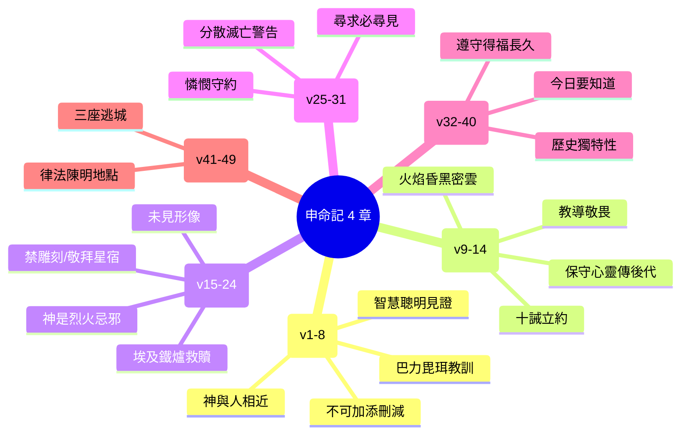

# 申命記 第4章

1. 以色列人哪，現在我所教訓你們的[[律例典章]]，你們要聽從遵行，好叫你們存活，得以進入耶和華─你們列祖之神所賜給你們的地，承受為業。
2. 所吩咐你們的話，你們不可加添，也不可刪減，好叫你們遵守我所吩咐的，就是耶和華─你們神的命令。
3. 耶和華因[[巴力毘珥事件|巴力毘珥]]的事所行的，你們親眼看見了。凡隨從巴力毘珥的人，耶和華─你們的神都從你們中間除滅了。
4. 惟有你們專靠耶和華─你們神的人，今日全都存活。
5. 我照著耶和華─我神所吩咐的將[[律例典章]]教訓你們，使你們在所要進去得為業的地上遵行。
6. 所以你們要[[智慧聰明|謹守遵行]]；這就是你們在萬民眼前的智慧、聰明。他們聽見這一切律例，必說：這大國的人真是有智慧，有聰明！
7. 哪一大國的人有神與他們相近，像耶和華─我們的神、在我們求告他的時候與我們相近呢？
8. 又哪一大國有這樣[[公義的律法|公義的律例典章]]、像我今日在你們面前所陳明的這一切律法呢？
9. 你只要謹慎，殷勤保守你的心靈，免得忘記你親眼所看見的事，又免得你一生這事離開你的心；總要傳給你的子子孫孫。
10. 你在[[何烈山領受十誡|何烈山]]站在耶和華─你神面前的那日，耶和華對我說：你為我招聚百姓，我要叫他們聽見我的話，使他們存活在世的日子，可以學習敬畏我，又可以教訓兒女這樣行。
11. 那時你們近前來，站在山下；山上有火焰沖天，並有昏黑、密雲、幽暗。
12. 耶和華從火焰中對你們說話，你們只聽見聲音，卻沒有看見形像。
13. 他將所吩咐你們當守的約指示你們，就是[[何烈山領受十誡|十條誡]]，並將這誡寫在兩塊石版上。
14. 那時耶和華又吩咐我將[[律例典章]]教訓你們，使你們在所要過去得為業的地上遵行。
15. 所以，你們要分外謹慎；因為耶和華在[[何烈山領受十誡|何烈山]]、從火中對你們說話的那日，你們沒有看見什麼形像。
16. 惟恐你們敗壞自己，雕刻偶像，彷彿什麼男像女像，
17. 或地上走獸的像，或空中飛鳥的像，
18. 或地上爬物的像，或地底下水中魚的像。
19. 又恐怕你向天舉目觀看，見耶和華─你的神為天下萬民所擺列的日月星，就是天上的萬象，自己便[[敬拜日月星宿被勾引|被勾引敬拜]]事奉他。
20. 耶和華將你們從埃及領出來，[[埃及為鐵爐|脫離鐵爐]]，要特作自己產業的子民，像今日一樣。
21. 耶和華又因你們的緣故向我發怒，起誓必不容我過約但河，也不容我進入耶和華─你神所賜你為業的那美地。
22. 我只得死在這地，不能過約但河；但你們必過去得那美地。
23. 你們要謹慎，免得忘記耶和華─你們神與你們所立的約，為自己雕刻偶像，就是耶和華─你神所禁止你做的偶像；
24. 因為耶和華─你的神乃是烈火，是[[神是烈火忌邪的神|忌邪的神]]。
25. 你們在那地住久了，生子生孫，就雕刻偶像，彷彿什麼形像，敗壞自己，行耶和華─你神眼中看為惡的事，惹他發怒。
26. 我今日呼天喚地向你們作見證，你們必在過約但河得為業的地上速速滅盡！你們不能在那地上長久，必盡行除滅。
27. 耶和華必使你們分散在萬民中；在他所領你們到的萬國裡，你們剩下的人數稀少。
28. 在那裡，你們必事奉人手所造的神，就是用木石造成、不能看、不能聽、不能吃、不能聞的神。
29. 但你們在那裡必尋求耶和華─你的神。你盡心盡性尋求他的時候，就必尋見。
30. 日後你遭遇一切患難的時候，你必歸回耶和華─你的神，聽從他的話。
31. 耶和華─你神原是有憐憫的神；他總不撇下你，不滅絕你，也不忘記他起誓與你列祖所立的約。
32. 你且考察在你以前的世代，自神造人在世以來，從天這邊到天那邊，曾有何民聽見神在火中說話的聲音，像你聽見還能存活呢？
33. 這樣的大事何曾有、何曾聽見呢？
34. 神何曾從別的國中將一國的人民領出來，用試驗、神蹟、奇事、爭戰、大能的手，和伸出來的膀臂，並大可畏的事，像耶和華─你們的神在埃及，在你們眼前為你們所行的一切事呢？
35. 這是顯給你看，要使你知道，惟有耶和華─他是神，除他以外，再無別神。
36. 他從天上使你聽見他的聲音，為要教訓你，又在地上使你看見他的烈火，並且聽見他從火中所說的話。
37. 因他愛你的列祖，所以揀選他們的後裔，用大能親自領你出了埃及，
38. 要將比你強大的國民從你面前趕出，領你進去，將他們的地賜你為業，像今日一樣。
39. 所以，今日你要知道，也要[[今日要知道耶和華是神|記在心上]]，天上地下惟有耶和華他是神，除他以外，再無別神。
40. 我今日將他的律例誡命曉諭你，你要遵守，使你和你的子孫可以得福，並使你的日子在耶和華─你神所賜的地上得以長久。
41. 那時，摩西在約但河東，向日出之地，分定三座城，
42. 使那素無仇恨、無心殺了人的，可以逃到這三城之中的一座城，就得存活：
43. 為流便人分定曠野平原的[[比悉]]；為迦得人分定[[拉末|基列的拉末]]；為瑪拿西人分定[[哥蘭|巴珊的哥蘭]]。
44. 摩西在以色列人面前所陳明的律法─
45. 就是摩西在以色列人出埃及後所傳給他們的法度、律例、典章；
46. 在約但河東[[伯毘珥對面谷中|伯毘珥]]對面的谷中，在住希實本、亞摩利王西宏之地；這西宏是摩西和以色列人出埃及後所擊殺的。
47. 他們得了他的地，又得了巴珊王噩的地，就是兩個亞摩利王，在約但河東向日出之地。
48. 從亞嫩谷邊的亞羅珥，直到西雲山，就是黑門山。
49. 還有約但河東的全亞拉巴，直到亞拉巴海，靠近[[毘斯迦山根|毘斯迦山]]根。

<!-- fhl-map-links:start -->
## 相關地圖

- [[appendix/fhl_maps/maps/025|〈申圖一〉應許之地全圖]]
- [[appendix/fhl_maps/maps/026|〈申圖二〉征服東岸及分地給兩個半支派]]
- [[appendix/fhl_maps/maps/038|〈書圖十一〉利未人的城和十二個支派的地業]]
<!-- fhl-map-links:end -->

---

## 本章知識節點

### 神學主題
- [[摩西勸勉遵守律例典章]]
- [[巴力毘珥事件]]
- [[何烈山領受十誡]]
- [[禁止雕刻偶像]]
- [[違背約的後果]]
- [[悔改蒙恩]]
- [[神的獨一無二]]
- [[神愛列祖揀選後裔]]
- [[今日要知道耶和華是神]]
- [[設立逃城]]
- [[摩西陳明律法]]
- [[不可加添刪減]]
- [[專靠耶和華]]
- [[智慧聰明]]
- [[神與人相近]]
- [[公義的律法]]
- [[保守心靈傳給子孫]]
- [[何烈山火焰昏黑密雲]]
- [[十誡是約]]
- [[教導兒女敬畏神]]
- [[神無形像]]
- [[敬拜日月星宿被勾引]]
- [[埃及為鐵爐]]
- [[摩西不得過約但河]]
- [[遵守律例得福長久]]
- [[三座逃城]]
- [[神是烈火忌邪的神]]

### 地理地點
- [[比悉]]
- [[拉末]]
- [[西雲山]]
- [[伯毘珥對面谷中]]
- [[亞嫩谷至黑門山]]
- [[毘斯迦山根]]

---

## 本章整理

### 遵守律例的勸勉與智慧（v1-8）
摩西開篇發出核心呼召：以色列人要聽從遵行[[摩西勸勉遵守律例典章|律例典章]]，不可加添刪減（[[不可加添刪減]]），好在應許之地存活得業。他引用[[巴力毘珥事件]]作反面教材——隨從巴力毘珥者被滅，專靠耶和華者（[[專靠耶和華]]）今日全都存活。遵守這律法不僅關生死，更是以色列在萬民眼前的[[智慧聰明]]，因為沒有一大國有神與他們相近（[[神與人相近]]），也沒有一大國有這樣[[公義的律法]]。

### 何烈山之約與教導責任（v9-14）
摩西囑咐百姓[[保守心靈傳給子孫|謹慎保守心靈]]，免得忘記親眼所見的[[何烈山領受十誡|何烈山之事]]，要傳給子子孫孫。他回顧當日[[何烈山火焰昏黑密雲|火焰昏黑密雲]]中，耶和華從火中說話，百姓只聽見聲音，未見形像。神將[[十誡是約|十條誡]]作為約的核心寫在兩塊石版上，並吩咐摩西教導律例典章，使百姓在得業之地遵行，也好[[教導兒女敬畏神|教訓兒女敬畏神]]。

### 禁止偶像崇拜與神的屬性（v15-24）
基於何烈山未見形像，摩西嚴禁[[禁止雕刻偶像|雕刻任何偶像]]，無論男女、走獸、飛鳥、爬物、魚類，也不可向天敬拜日月星宿（[[敬拜日月星宿被勾引]]）。他提醒以色列人是耶和華從[[埃及為鐵爐|鐵爐般的埃及]]領出、特作產業的子民。摩西因百姓緣故不得過約但河（[[摩西不得過約但河]]），並警告耶和華是[[神是烈火忌邪的神|烈火、忌邪的神]]。

### 違背之果與悔改之恩（v25-31）
摩西預言若在世久了[[違背約的後果|敗壞雕刻偶像]]，必速速滅盡，被分散在萬民中事奉木石偶像。但[[悔改蒙恩|盡心盡性尋求神]]就必尋見；遭遇患難歸回聽從，神必不撇下、不滅絕、不忘記列祖之約，因祂是有憐憫的神，並[[神愛列祖揀選後裔|愛列祖揀選後裔]]。

### 獨一真神的見證與回應（v32-40）
摩西呼籲考察古今：何曾有神從火中說話而民存活？何曾有神用試驗、神蹟、爭戰、大能手、伸出膀臂、大可畏的事，從別國領出一國（出埃及）？這[[神的獨一無二|顯明惟有耶和華是神]]。今日當[[今日要知道耶和華是神|知道並記在心上]]，天上地下除祂無別神。遵守律例誡命，使你和子孫得福，日子在耶和華所賜地上長久（[[遵守律例得福長久]]）。

### 約但河東設立逃城（v41-43）
摩西在約但河東分定三座[[設立逃城|逃城]]，讓無心殺人者逃往存活：流便地的[[比悉]]、迦得地的[[拉末]]、瑪拿西地的[[哥蘭]]（[[三座逃城]]）。

### 律法陳明的地理背景（v44-49）
經文總結[[摩西陳明律法|摩西在以色列人面前所陳明的律法]]（法度、律例、典章），地點在[[伯毘珥對面谷中]]，屬亞摩利王西宏之地（摩西出埃及後擊殺）。他們得了西宏與巴珊王噩的地，從[[亞嫩谷至黑門山|亞嫩谷邊的亞羅珥直到西雲山（黑門山）]]，並[[毘斯迦山根|約但河東全亞拉巴直到亞拉巴海，靠近毘斯迦山根]]。

### 章節結構脈絡圖

**參考資料**
https://www.ccbiblestudy.org/Old%20Testament/05Deut/05CT04.htm
https://www.ccbiblestudy.org/Old%20Testament/05Deut/05GT04.htm
https://www.kingcomments.com/en/bible-studies/Deu/4
https://biblehub.com/study/deuteronomy/4.htm
