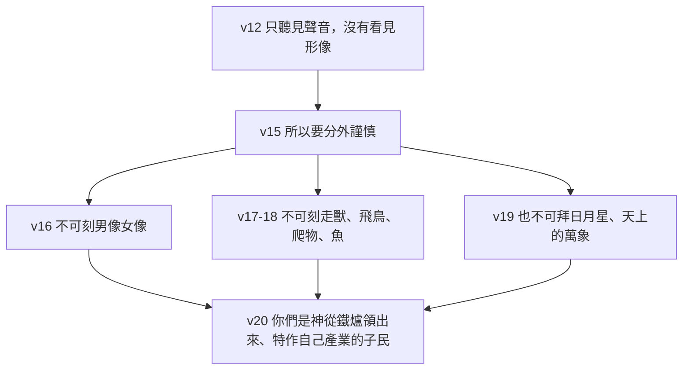

# 申命記 第4章

<!-- chapter-navigation:start -->
| [前一章](../05%20申命記/第3章.md) | [回目錄](../05%20申命記/全書目錄及綱要.md) | [下一章](../05%20申命記/第5章.md) |
| :--- | :---: | ---: |
<!-- chapter-navigation:end -->

1. 以色列人哪，現在我所教訓你們的[[律例（choq）|律例]][[典章]]，你們要聽從遵行，好叫你們存活，得以進入耶和華─你們列祖之神所賜給你們的地，承受為業。
2. 所吩咐你們的話，你們[[不可加添也不可刪減（ya.saph、ga.ra）|不可加添]]，也不可刪減，好叫你們遵守我所吩咐的，就是耶和華─你們神的命令。
3. 耶和華因[[巴力毘珥]]的事所行的，你們親眼看見了。凡隨從巴力毘珥的人，耶和華─你們的神都從你們中間除滅了。
4. 惟有你們[[專靠（da.veq）|專靠]]耶和華─你們神的人，今日全都存活。
5. 我照著耶和華─我神所吩咐的將[[律例（choq）|律例]][[典章]]教訓你們，使你們在所要進去得為業的地上遵行。
6. 所以你們要謹守遵行；這就是你們在萬民眼前的[[智慧與聰明（chokh.mah、bi.nah）|智慧、聰明]]。他們聽見這一切[[律例（choq）|律例]]，必說：這大國的人真是有智慧，有聰明！
7. 哪一大國的人有神[[神與我們相近（qa.rov）|與他們相近]]，像耶和華─我們的神、在我們求告他的時候與我們相近呢？
8. 又哪一大國有這樣公義的[[律例（choq）|律例]][[典章]]、像我今日在你們面前所陳明的這一切律法呢？
9. 你只要謹慎，殷勤保守你的心靈，免得忘記你親眼所看見的事，又免得你一生這事離開你的心；總要傳給你的子子孫孫。
10. 你在[[何烈山]]站在耶和華─你神面前的那日，耶和華對我說：你為我招聚百姓，我要叫他們聽見我的話，使他們存活在世的日子，可以[[敬畏神|學習敬畏我]]，又可以教訓兒女這樣行。
11. 那時你們近前來，站在山下；山上有火焰沖天，並有昏黑、[[密雲]]、[[神住在幽暗中|幽暗]]。
12. 耶和華從火焰中對你們說話，你們只聽見聲音，卻[[只聽見聲音卻沒有看見形像（te.mu.nah）|沒有看見形像]]。
13. 他將所吩咐你們當守的約指示你們，就是[[十誡|十條誡]]，並將這誡寫在兩塊[[石版]]上。
14. 那時耶和華又吩咐我將[[律例（choq）|律例]][[典章]]教訓你們，使你們在所要過去得為業的地上遵行。
15. 所以，你們要分外謹慎；因為耶和華在[[何烈山]]、從火中對你們說話的那日，你們沒有看見什麼形像。
16. 惟恐你們敗壞自己，[[不可為自己雕刻偶像|雕刻偶像]]，彷彿什麼男像女像，
17. 或地上[[古代近東偶像崇拜|走獸的像]]，或空中飛鳥的像，
18. 或地上爬物的像，或地底下水中魚的像。
19. 又恐怕你向天舉目觀看，見耶和華─你的神為天下萬民所擺列的日月星，就是[[天上的萬象（tze.va）|天上的萬象]]，自己便被勾引敬拜事奉他。
20. 耶和華將你們[[出埃及|從埃及領出來]]，脫離[[鐵爐（kur、bar.zel）|鐵爐]]，要特作自己[[產業（na.cha.lah）|產業的子民]]，像今日一樣。
21. 耶和華又因你們的緣故向我發怒，起誓必[[摩西不得進入應許之地|不容我過約但河]]，也不容我進入耶和華─你神所賜你為業的那[[美地]]。
22. 我只得死在這地，不能過[[約但河]]；但你們必過去得那[[美地]]。
23. 你們要謹慎，免得忘記耶和華─你們神與你們[[立約|所立的約]]，為自己[[不可為自己雕刻偶像|雕刻偶像]]，就是耶和華─你神所禁止你做的偶像；
24. 因為耶和華─你的神乃是[[烈火]]，是[[忌邪的神]]。
25. 你們在那地[[住久了原文是睡著了（ya.shen）|住久了]]，生子生孫，就[[不可為自己雕刻偶像|雕刻偶像]]，彷彿什麼形像，敗壞自己，行耶和華─你神眼中看為惡的事，惹他發怒。
26. 我今日[[呼天喚地作見證（ud）|呼天喚地]]向你們作見證，你們必在過[[約但河]]得為業的地上速速滅盡！你們不能在那地上長久，必[[滅盡與除滅的雙同字（sha.mad）|盡行除滅]]。
27. 耶和華必使你們[[分散在萬民中]]；在他所領你們到的萬國裡，你們剩下的人數稀少。
28. 在那裡，你們必事奉人手所造的神，就是用木石造成、[[不能看不能聽不能吃不能聞的神|不能看、不能聽、不能吃、不能聞]]的神。
29. 但你們在那裡必尋求耶和華─你的神。你[[盡心盡性尋求（ba.qash、da.rash）|盡心盡性尋求]]他的時候，就必尋見。
30. 日後你遭遇一切患難的時候，你必歸回耶和華─你的神，聽從他的話。
31. 耶和華─你神原是[[神的憐憫|有憐憫的神]]；他總不撇下你，[[敗壞與滅絕同一字根（sha.chat）|不滅絕你]]，也不忘記他起誓與你列祖[[立約|所立的約]]。
32. 你且考察在你以前的世代，自神造人在世以來，從天這邊到天那邊，曾有何民聽見神在火中說話的聲音，像你聽見[[曾有何民聽見神在火中說話還能存活|還能存活]]呢？
33. 這樣的大事何曾有、何曾聽見呢？
34. [[神何曾從別的國中將一國的人民領出來]]，用試驗、神蹟、奇事、爭戰、[[大能的手]]，和伸出來的膀臂，並大可畏的事，像耶和華─你們的神在[[埃及]]，在你們眼前為你們所行的一切事呢？
35. 這是顯給你看，要使你知道，惟有耶和華─他是神，[[除他以外再無別神|除他以外，再無別神]]。
36. 他從天上使你聽見他的聲音，為要教訓你，又在地上使你看見他的[[烈火]]，並且聽見他從火中所說的話。
37. 因他愛你的列祖，所以[[神的揀選|揀選他們的後裔]]，用大能親自領你出了[[埃及]]，
38. 要將比你強大的國民從你面前趕出，領你進去，將他們的地賜你為業，像今日一樣。
39. 所以，今日你要知道，也要記在心上，天上地下惟有耶和華他是神，[[除他以外再無別神|除他以外，再無別神]]。
40. 我今日將他的[[律例（choq）|律例]]誡命曉諭你，你要遵守，使你和你的子孫可以得福，並使你的日子在耶和華─你神所賜的地上得以長久。
41. 那時，摩西在[[約但河]]東，向日出之地，[[摩西分定河東三座逃城（ba.dal）|分定三座城]]，
42. 使那素無仇恨、[[謀殺與誤殺的區分|無心殺了人]]的，可以逃到[[逃城|這三城]]之中的一座城，就得存活：
43. 為[[流便|流便人]]分定[[平原（mi.shor）|曠野平原]]的[[比悉]]；為[[迦得（萬幸）|迦得人]]分定[[基列]]的[[拉末]]；為[[瑪拿西|瑪拿西人]]分定[[巴珊]]的[[哥蘭]]。
44. [[摩西的第二篇講章|摩西在以色列人面前所陳明的律法]]─
45. 就是摩西在[[出埃及|以色列人出埃及]]後所傳給他們的[[法度（e.dah）|法度]]、[[律例（choq）|律例]]、[[典章]]；
46. 在[[約但河]]東[[伯毘珥]]對面的谷中，在住[[希實本]]、[[亞摩利人|亞摩利王]]西宏之地；這西宏是摩西和[[出埃及|以色列人出埃及]]後所擊殺的。
47. 他們得了他的地，又得了[[巴珊]]王噩的地，就是兩個[[亞摩利人|亞摩利王]]，在[[約但河]]東向日出之地。
48. 從[[亞嫩河|亞嫩谷]]邊的[[亞羅珥]]，直到[[黑門山|西雲山]]，就是[[黑門山]]。
49. 還有[[約但河]]東的全[[亞拉巴]]，直到[[鹽海|亞拉巴海]]，靠近[[瑣腓田與毘斯迦山頂|毘斯迦山根]]。

---

## 本章知識節點

### 原文
- [[律例（choq）]]
- [[不可加添也不可刪減（ya.saph、ga.ra）]]
- [[專靠（da.veq）]]
- [[智慧與聰明（chokh.mah、bi.nah）]]
- [[鐵爐（kur、bar.zel）]]
- [[產業（na.cha.lah）]]
- [[住久了原文是睡著了（ya.shen）]]
- [[滅盡與除滅的雙同字（sha.mad）]]
- [[敗壞與滅絕同一字根（sha.chat）]]
- [[盡心盡性尋求（ba.qash、da.rash）]]
- [[法度（e.dah）]]
- [[烈火]]

### 神學
- [[典章]]
- [[神與我們相近（qa.rov）]]
- [[只聽見聲音卻沒有看見形像（te.mu.nah）]]
- [[除他以外再無別神]]
- [[神何曾從別的國中將一國的人民領出來]]
- [[十誡]]
- [[不可為自己雕刻偶像]]
- [[忌邪的神]]
- [[神的揀選]]
- [[神的憐憫]]
- [[敬畏神]]
- [[密雲]]
- [[神住在幽暗中]]
- [[大能的手]]
- [[謀殺與誤殺的區分]]

### 地點
- [[何烈山]]
- [[伯毘珥]]
- [[希實本]]
- [[亞羅珥]]
- [[黑門山]]
- [[亞拉巴]]
- [[鹽海]]
- [[瑣腓田與毘斯迦山頂]]
- [[約但河]]
- [[巴珊]]
- [[基列]]
- [[平原（mi.shor）]]
- [[亞嫩河]]
- [[埃及]]
- [[比悉]]
- [[拉末]]
- [[哥蘭]]

### 人物
- [[流便]]
- [[迦得（萬幸）]]
- [[瑪拿西]]
- [[亞摩利人]]

### 主題
- [[美地]]
- [[呼天喚地作見證（ud）]]
- [[不能看不能聽不能吃不能聞的神]]
- [[曾有何民聽見神在火中說話還能存活]]
- [[立約]]

### 背景
- [[天上的萬象（tze.va）]]
- [[古代近東偶像崇拜]]
- [[摩西的第二篇講章]]
- [[巴力毘珥]]

### 歷史
- [[分散在萬民中]]
- [[出埃及]]

### 事件
- [[摩西分定河東三座逃城（ba.dal）]]
- [[摩西不得進入應許之地]]

### 文化
- [[石版]]

### 互文
- [[逃城]]

---

## 本章整理

### 一、先講清楚為什麼要聽（v1-8）

申命記第四章是摩西第一篇講章的收尾。前三章講的是走過的路，這一章開頭一個「現在」，把話轉向要怎麼活。

第1節就把全章的骨架擺出來：[[律例（choq）|律例]]與[[典章]]。這兩個詞在本章出現七次以上。CT 把它們的分工說得最清楚——「『律例』指律法，是神向人的要求；『典章』指審判，是神對人是否遵行律法的判定」。CT 又在第14節指出，這套律例典章與[[十誡|十條誡]]不同：十條誡是基本原則，「猶如憲法」，律例典章則是通過摩西頒佈的細則。

不過 GT《聖經精讀本》提醒不要分得太死：「聖經混用了律例與典章（王上8:58；詩119:12-16），難以進行嚴謹的區分。」

**第2節先立一條規矩，才開始講內容。** 「所吩咐你們的話，你們不可加添，也不可刪減」——[[不可加添也不可刪減（ya.saph、ga.ra）|加添與刪減]]在原文是配成一對的兩個動詞。KC 為這兩種偏差各配了一種人：法利賽人把自己的誡命加在律法上，撒都該人把心智推不通的部分從律法裡拿掉。

**第3-4節用一件剛發生的事作對照。** [[巴力毘珥|巴力毘珥的事]]才過去不久，GT 指出那次死了二萬四千人。同一天、同一群人，差別只在黏著誰：隨從巴力毘珥的被除滅，[[專靠（da.veq）|專靠]]耶和華的全都存活。這個「專靠」在原文是「黏著」，CT 說它「意指最親密的關係，如同夫妻彼此的關係一樣」。

**第6-8節重新定義了什麼叫大國。** 三個並排的問句，答案都不在版圖上：

| 節 | 問的是什麼 | 憑據 |
|---|---|---|
| 6 | 列國會怎麼看以色列 | 守律例就顯出智慧、聰明（見 [[智慧與聰明（chokh.mah、bi.nah）]]） |
| 7 | 哪一大國的神這樣靠近 | 求告的時候與我們相近（見 [[神與我們相近（qa.rov）]]） |
| 8 | 哪一大國有這樣的律法 | 公義的律例典章（見 [[典章]]） |

KC 把這一段的重點講得很直接：把神的子民與世界分別出來的，不是他們的繁榮或軍事力量，而是照著神話語的律例典章而活的生命。

### 二、何烈山那一天：有聲音，沒有形像（v9-20）

第9節是一個轉折：不要忘記你親眼看見的事，還要傳給子子孫孫。CT 指出這是為人父母的責任——「父母負有教導兒女大責，是子女靈性上的祭司和生活知識上的教師」。

接著摩西回到[[何烈山]]。那一天山上有火焰沖天，有昏黑、[[密雲]]、[[神住在幽暗中|幽暗]]。GT《聖經精讀本》解釋為什麼神只能降臨在密雲中：因為神「居住在人所不能接近的光中（詩104:2；提前6:16），為了將顯在以色列百姓面前，就只能以密雲來摭掩耀眼的榮耀之光」。

**然後是全章最關鍵的一句：[[只聽見聲音卻沒有看見形像（te.mu.nah）|你們只聽見聲音，卻沒有看見形像]]。**

這一句不是描寫，是推論的前提。本章第15-19節整段禁令，全部從這裡長出來：

```mermaid
flowchart TD
  A["v12 只聽見聲音，沒有看見形像"] --> B["v15 所以要分外謹慎"]
  B --> C["v16 不可刻男像女像"]
  B --> D["v17-18 不可刻走獸、飛鳥、爬物、魚"]
  B --> E["v19 也不可拜日月星、天上的萬象"]
  C --> F["v20 你們是神從鐵爐領出來、特作自己產業的子民"]
  D --> F
  E --> F
```

CT 在第15節把因果講明：「『所以』表示因果關係⋯當時頒佈律法的神是沒有形像的，真神是看不見的，人卻能聽得見祂說話的聲音。」他並在〔話中之光〕給了一個正面的說法：神讓他們看見榮耀、權能、莊嚴，卻不叫他們看到任何形像，是「要在他們的心思上作出拒絕偶像的基礎」。

第13節提到[[立約|所立的約]]、十條誡與[[石版|兩塊石版]]。GT《啟導本》補一個細節：「兩塊石版上所寫的內容相同，立約的雙方各執一塊。」

**第19節把禁令抬到天上。** [[天上的萬象（tze.va）|天上的萬象]]原文是「軍隊」。GT《串珠》指出這在當時是真實的宗教環境：「早在亞伯拉罕的時代，吾珥和哈蘭二城的居民已有月神的敬拜，而埃及亦敬拜日神。」BH 抓住「所擺列的」這幾個字：天體是神分配給全人類使用的，不是拿來敬拜的。

**第20節收在一個冶金的比喻上。** 神把他們從[[鐵爐（kur、bar.zel）|鐵爐]]領出來，要[[產業（na.cha.lah）|特作自己產業的子民]]。KC 解釋鐵爐的用途：「An iron furnace is fired as hot as possible in order to process the metal afterwards.」（鐵爐要燒到最熱，才能接著加工金屬。）

> [!note] 兩處火不是同一個字
> 第20節的鐵爐（kur）是以色列被熬煉的地方；第24節說神自己「乃是[[烈火]]」，用的是另一組字。一個講人受的苦，一個講神的性情。

### 三、烈火、忌邪，與回頭的路（v21-31）

第21-22節摩西第三次提到自己[[摩西不得進入應許之地|不容我過約但河]]。KC 數過：這是他在申命記第三次講這件事（申1:37；3:26）。他自己進不去，卻要百姓過去得那[[美地]]——第22節把兩件事放在同一句裡：「我只得死在這地，不能過約但河；但你們必過去得那美地。」

第24節是本章最重的一句：「因為耶和華─你的神乃是[[烈火]]，是[[忌邪的神]]。」CT 分別解釋兩個詞——烈火「形容神的聖潔的性情和公義的審判」，忌邪「形容神對維護祂獨一、至尊的權利極其熱忱」。

**第25節開始，摩西以先知的身分預告未來。** 起點是一個容易被中文譯法掩蓋的字：[[住久了原文是睡著了（ya.shen）|住久了]]，CT 指出原文直譯是「睡著了」，意思是「失去警惕心，不知不覺地發生錯謬」。

接著是一串判詞，一步比一步重：

| 節 | 判詞 | 原文重點 |
|---|---|---|
| 26 | 呼天喚地向你們作見證（見 [[呼天喚地作見證（ud）]]） | 「呼喚」與「作見證」在原文是同一個動詞 |
| 26 | 速速滅盡、必盡行除滅（見 [[滅盡與除滅的雙同字（sha.mad）]]） | 兩處都是同一動詞連用兩次的加強結構 |
| 27 | [[分散在萬民中]]、人數稀少 | GT：北國 B.C.722、南國 B.C.586 應驗 |
| 28 | 事奉不能看、不能聽、不能吃、不能聞的神（見 [[不能看不能聽不能吃不能聞的神]]） | CT：「造成」原文是「工作」加「手」兩個字 |

GT《聖經精讀本》對第28節的評語值得記下來：「不呼籲悔改，反而任其自由的作法本身就是一個可怕的刑罰。」

**但第29節開頭有一個「但」。** CT 說這個字「指出以色列人必然後悔，轉向真神」。從這裡起，連續三節都是回頭的路：[[盡心盡性尋求（ba.qash、da.rash）|盡心盡性尋求]]就必尋見（v29）、遭難必歸回（v30）、神有憐憫、總不撇下（v31）。

第31節與第25節之間還有一組原文對照：[[敗壞與滅絕同一字根（sha.chat）|「敗壞自己」與「不滅絕你」在原文是同一個字根]]。人會毀壞自己，神說祂不會毀壞人。GT《串珠》總結得剛好：「在摩西的信念裡，神的公義（25-28）和慈愛是互不衝突的。」

### 四、三個反問，一個結論（v32-40）

第32-34節，摩西一連丟出三個問句，一個比一個具體。CT 對三個問題給的答案都一樣：沒有。

1. [[曾有何民聽見神在火中說話還能存活|曾有何民聽見神在火中說話還能存活]]？CT 說「自神造人在世以來」指時間、「從天這邊到天那邊」指空間，兩句合起來「意指沒有例外」。
2. 這樣的大事何曾有、何曾聽見？
3. [[神何曾從別的國中將一國的人民領出來|神何曾從別的國中將一國的人民領出來]]？——用試驗、神蹟、奇事、爭戰、[[大能的手]]、伸出來的膀臂、大可畏的事。CT 把這串詞分成兩段歷史：前三個指降十災，後四個指過紅海。

三問之後才是結論：[[除他以外再無別神|惟有耶和華他是神，除他以外，再無別神]]（v35）。第39節再說一次，並多要求一個動作——「也要記在心上」。

第37節給出這一切的原因：因祂愛你的列祖，所以[[神的揀選|揀選他們的後裔]]。GT《啟導本》指出「這是本書首次提到神對人的大愛」。

第40節把整篇講章落回行為：遵守律例誡命，使你和你的子孫可以得福，日子長久。

### 五、講章中間插進來的三座城（v41-43）

第41節突然從講論轉成一個行動。KC 注意到這個轉折：「Suddenly Moses' speech is interrupted by an action: the designation of three cities of refuge in the area of the wilderness side of the Jordan for the manslayer.」（摩西的講論突然被一個行動打斷：在約但河曠野那一側為誤殺者指定三座逃城。）

[[摩西分定河東三座逃城（ba.dal）|摩西在河東分定三座城]]，「分定」原文是「分別出來」。三座城與三個支派一一對應，由南到北排開：

| 城 | 支派 | CT 說的位置 | 這一帶的特色 |
|---|---|---|---|
| 曠野平原的 [[比悉]]（見 [[平原（mi.shor）]]） | [[流便]] 人 | 河東的最南邊 | BH：位在高原曠野，本身就是天然屏障 |
| [[基列]] 的 [[拉末]] | [[迦得（萬幸）]] | 河東的中部 | BH：基列以乳香著稱；迦得人以驍勇著稱 |
| [[巴珊]] 的 [[哥蘭]] | [[瑪拿西]] | 河東的最北邊 | GT：位於加利利海以東廿九公里 |

受保護的對象有明確界線：[[謀殺與誤殺的區分|素無仇恨、無心殺了人]]的才能逃進去。CT 說這是「非蓄意謀殺，而是因事故誤殺」。這是[[逃城|六座逃城]]的前一半，河西那三座要等進迦南以後才設。

CT 對這段安排的評語是：「逃城是恩典的小影，說明了神對人的體貼。」放在剛講完拜偶像必被除滅之後，這個安排的位置本身就有意思——同一章裡，神先說祂不撇下犯罪的百姓，接著就為誤殺人的留下一條活路。

### 六、下一篇講章的序言（v44-49）

最後六節換了口氣，不再是摩西對百姓說話，而是敘事者在交代背景。GT《啟導本》指出：「本節到二十八68為本書所載摩西對以色列人第二篇談話。」

[[摩西的第二篇講章|摩西在以色列人面前所陳明的律法]]，第45節再拆成三個詞：[[法度（e.dah）|法度]]、律例、典章。GT《串珠》說「法度」的字根原為「證人」——這正好把第26節呼天喚地作見證的語言接了回來。

GT《聖經精讀本》把背景拆成三問：何時是出埃及第40年、迦南征服戰的兩個多月前；何地是[[伯毘珥]]對面的谷中；什麼是在西奈山領受的律例典章。

第46-49節列出腳下那片地的四至——從[[亞嫩河|亞嫩谷]]邊的[[亞羅珥]]，直到西雲山，就是[[黑門山]]；還有[[約但河]]東的全[[亞拉巴]]，直到[[鹽海|亞拉巴海]]，靠近[[瑣腓田與毘斯迦山頂|毘斯迦山根]]。這片地是從[[希實本]]的西宏與巴珊的噩兩個[[亞摩利人|亞摩利王]]手中奪來的。

KC 指出講話的位置本身就是論據：「Their feet stand on conquered ground as they listen to Moses' speech. Moses speaks from a position of victory.」（他們聽摩西講話時，腳踩的是已征服的土地。摩西是站在得勝的位置上說話。）

**參考資料**
https://www.ccbiblestudy.org/Old%20Testament/05Deut/05CT04.htm
https://www.ccbiblestudy.org/Old%20Testament/05Deut/05GT04.htm
https://www.kingcomments.com/en/bible-studies/Deu/4
https://biblehub.com/study/deuteronomy/4.htm
https://github.com/STEPBible/STEPBible-Data

<!-- appendix-links:start -->
## 附錄

### 相關地圖
- [[appendix/fhl_maps/maps/025|〈申圖一〉應許之地全圖]]
- [[appendix/fhl_maps/maps/026|〈申圖二〉征服東岸及分地給兩個半支派]]
- [[appendix/fhl_maps/maps/038|〈書圖十一〉利未人的城和十二個支派的地業]]
<!-- appendix-links:end -->

<!-- chapter-navigation:start -->
| [前一章](../05%20申命記/第3章.md) | [回目錄](../05%20申命記/全書目錄及綱要.md) | [下一章](../05%20申命記/第5章.md) |
| :--- | :---: | ---: |
<!-- chapter-navigation:end -->
