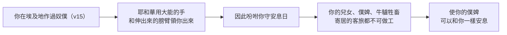
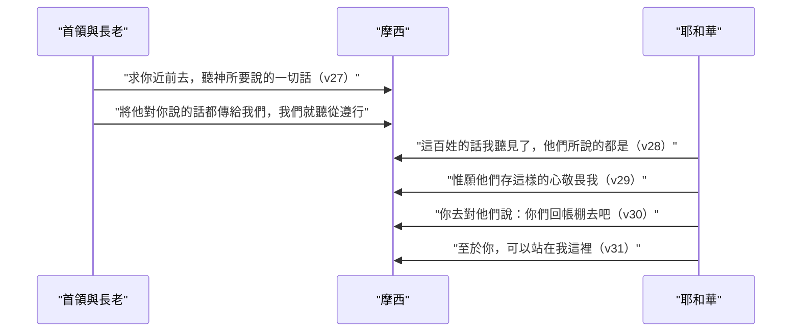

# 申命記 第5章

<!-- chapter-navigation:start -->
| [前一章](../05%20申命記/第4章.md) | [回目錄](../05%20申命記/全書目錄及綱要.md) | [下一章](../05%20申命記/第6章.md) |
| :--- | :---: | ---: |
<!-- chapter-navigation:end -->

1. [[摩西]]將以色列眾人召了來，對他們說：以色列人哪，我今日曉諭你們的[[律例（choq）|律例]][[典章]]，[[以色列啊你要聽（sha.ma）|你們要聽]]，可以學習，[[遵行|謹守遵行]]。
2. 耶和華─我們的神在[[何烈山]][[西乃之約|與我們立約]]。
3. 這約[[這約是與哪一代人立的|不是與我們列祖立的]]，乃是與我們今日在這裡存活之人立的。
4. 耶和華在山上，從火中，[[面對面見神|面對面]]與你們說話─
5. 那時我[[中保|站在耶和華和你們中間]]，要將耶和華的話傳給你們；因為你們[[百姓懼怕神的顯現|懼怕那火]]，沒有上山─說：
6. [[我是耶和華你的神|我是耶和華─你的神]]，曾將你從[[埃及]]地[[為奴之家]]領出來。
7. 除了我以外，你不可有別的神。
8. [[不可為自己雕刻偶像]]，[[只聽見聲音卻沒有看見形像（te.mu.nah）|也不可做什麼形像]]，彷彿上天、下地和地底下、水中的百物。
9. 不可跪拜那些像，也不可事奉他，因為我耶和華─你的神是[[忌邪的神]]。恨我的，我必追討他的罪，[[追討罪自父及子直到三四代|自父及子，直到三、四代]]；
10. 愛我、守我誡命的，[[發慈愛直到千代|我必向他們發慈愛，直到千代]]。
11. [[不可妄稱耶和華你神的名|不可妄稱耶和華─你神的名]]；因為[[妄稱|妄稱耶和華名的]]，耶和華必不以他為無罪。
12. 當[[十誡中的兩條正面誡命|照耶和華─你神所吩咐的]][[安息日|守安息日為聖日]]。
13. 六日要勞碌做你一切的工，
14. 但第七日是向耶和華─你神當守的[[安息日]]。這一日，你和你的兒女、僕婢、牛、驢、牲畜，並在你城裡[[寄居身分|寄居的客旅]]，無論何工都不可做，使你的僕婢[[安息（第七日的歇息）|可以和你一樣安息]]。
15. 你也要[[「記念」與「守」|記念]]你在[[埃及]]地[[奴僕|作過奴僕]]；耶和華─你神用[[大能的手|大能的手和伸出來的膀臂]][[出埃及|將你從那裡領出來]]。因此，耶和華─你的神[[當記念安息日守為聖日|吩咐你守安息日]]。
16. 當[[十誡中的兩條正面誡命|照耶和華─你神所吩咐的]][[當孝敬父母|孝敬父母]]，使你[[得福（ya.tav）|得福]]，並使你的日子在耶和華─你神所賜你的地上得以長久。
17. [[不可殺人]]。
18. [[不可姦淫]]。
19. [[不可偷盜]]。
20. [[不可作假見證陷害人]]。
21. [[不可貪戀|不可貪戀人的妻子]]；也不可[[貪戀|貪圖]]人的房屋、田地、僕婢、牛、驢，並他一切所有的。
22. [[十誡|這些話]]是耶和華在山上，從火中、[[密雲|雲中]]、[[神住在幽暗中|幽暗中]]，[[雷轟即神的聲音|大聲]]曉諭你們全會眾的；[[不可加添也不可刪減（ya.saph、ga.ra）|此外並沒有添別的話]]。他就把這話寫在[[石版|兩塊石版]]上，交給我了。
23. 那時，火焰燒山，你們聽見從黑暗中出來的聲音；你們支派中所有的首領和[[以色列的長老|長老]]都來就近我，
24. 說：看哪，耶和華─我們神將[[耶和華的榮光|他的榮光]]和他的大能顯給我們看，我們又聽見他的聲音從火中出來。今日我們得見神與人說話，[[曾有何民聽見神在火中說話還能存活|人還存活]]。
25. 現在這[[烈火|大火]]將要燒滅我們，我們何必冒死呢？若再聽見耶和華─我們[[雷轟即神的聲音|神的聲音]]就必死亡。
26. [[凡屬血氣的（ba.sar）|凡屬血氣的]]，曾有何人聽見[[耶和華永生神|永生神]]的聲音從火中出來，像我們聽見[[曾有何民聽見神在火中說話還能存活|還能存活]]呢？
27. [[百姓懼怕神的顯現|求你近前去]]，聽耶和華─我們神所要說的一切話，將他對你說的話都傳給我們，我們就聽從[[遵行]]。
28. 你們對我說的話，耶和華都聽見了。耶和華對我說：這百姓的話，我聽見了；他們所說的都是。
29. [[惟願（mi yi.ten）|惟願]]他們存這樣的心[[敬畏神|敬畏我]]，常遵守我的一切誡命，使他們和他們的子孫永遠[[得福（ya.tav）|得福]]。
30. 你去對他們說：你們回帳棚去吧！
31. 至於你，可以站在我這裡，我要將一切誡命、[[律例（choq）|律例]]、[[典章]]傳給你；你要教訓他們，使他們在我賜他們為業的地上[[遵行]]。
32. 所以，你們要照耶和華─你們神所吩咐的[[遵行|謹守遵行]]，[[不可偏離左右]]。
33. 耶和華─你們神所吩咐你們行的，你們都要去行，使你們可以存活[[得福（ya.tav）|得福]]，並使你們的日子在所要承受的地上得以長久。

---

## 本章知識節點

### 人物
- [[摩西]]

### 地點
- [[何烈山]]
- [[埃及]]

### 歷史
- [[出埃及]]

### 背景
- [[摩西的第二篇講章]]

### 事件
- [[神頒布十誡]]
- [[百姓懼怕神的顯現]]

### 互文
- [[申5：6-21|申5：6-21 申命記版十誡與出20 的異同]]

### 神學
- [[西乃之約]]
- [[亞伯拉罕之約]]
- [[我是耶和華你的神]]
- [[十誡]]
- [[十誡的條分法]]
- [[十誡的解釋原理]]
- [[定言式法律]]
- [[典章]]
- [[中保]]
- [[面對面見神]]
- [[不可為自己雕刻偶像]]
- [[只聽見聲音卻沒有看見形像（te.mu.nah）]]
- [[忌邪的神]]
- [[追討罪自父及子直到三四代]]
- [[發慈愛直到千代]]
- [[不可妄稱耶和華你神的名]]
- [[安息日]]
- [[當記念安息日守為聖日]]
- [[當孝敬父母]]
- [[不可殺人]]
- [[不可姦淫]]
- [[不可偷盜]]
- [[不可作假見證陷害人]]
- [[不可貪戀]]
- [[密雲]]
- [[神住在幽暗中]]
- [[耶和華的榮光]]
- [[耶和華永生神]]
- [[寄居身分]]
- [[敬畏神]]
- [[大能的手]]
- [[雷轟即神的聲音]]

### 文化
- [[石版]]
- [[以色列的長老]]

### 主題
- [[為奴之家]]
- [[律法與恩典]]
- [[曾有何民聽見神在火中說話還能存活]]
- [[十誡中的兩條正面誡命]]
- [[不可偏離左右]]

### 原文
- [[律例（choq）]]
- [[奴僕]]
- [[妄稱]]
- [[貪戀]]
- [[「記念」與「守」]]
- [[安息（第七日的歇息）]]
- [[遵行]]
- [[烈火]]
- [[不可加添也不可刪減（ya.saph、ga.ra）]]
- [[事奉與作奴僕同一字根（a.vad）]]
- [[學習與教訓同一字根（la.mad）]]
- [[得福（ya.tav）]]
- [[惟願（mi yi.ten）]]
- [[幽暗與黑暗的兩個字（a.ra.phel、cho.shekh）]]
- [[凡屬血氣的（ba.sar）]]
- [[以色列啊你要聽（sha.ma）]]

### 解經爭議
- [[主日與安息日的關係之爭]]
- [[這約是與哪一代人立的]]

---

## 本章整理

### 四十年前那一天，被說成「你們」的事（v1-5）

[[摩西]]召齊全體以色列人，開口第一個命令是聽。STEP語言資料顯示第1節的「你們要聽」是命令式的 she.Ma'（H8085G），也就是[[以色列啊你要聽（sha.ma）|申命記反覆出現的那個呼喚]]；後面緊接著兩個動作，[[學習與教訓同一字根（la.mad）|可以學習]]與[[遵行|謹守遵行]]。CT 把這三步讀成一套次序：「聆聽是指領受吸收從神來的啟示；學習是指明白其中的意思和內涵；謹守遵行是指我們將所學到、所明白的，在生活中實踐出來」。這是[[摩西的第二篇講章]]的開場，GT《啟導本聖經申命記註釋》說它「用誠懇且親切的呼喚來勖勉新一代」。

接著出現本章最該停下來的一句。第2節說神在[[何烈山]]與「我們」立了[[西乃之約|約]]，第3節卻補上「這約不是與我們列祖立的，乃是與我們今日在這裡存活之人立的」。當年在山下的成年人多半已經死在曠野，站在摩西面前的是四十年後的新一代，[[這約是與哪一代人立的|這句話因此讓四套註釋分成兩路]]。

| 來源 | 「列祖」指誰 | 「不是……乃是」怎麼讀 |
|---|---|---|
| CT | 亞伯拉罕、以撒、雅各 | 死了的列祖過去了，活著的人與約有直接關係 |
| GT《雷氏研讀本》 | 兩種可能並列 | 一是延伸到聽講的這一代，二是與[[亞伯拉罕之約]]作區別 |
| GT《啟導本》 | 族長 | 延伸：這約也給以後的世世代代，對現在存活之人繼續有效 |
| GT《串珠》 | 族長 | 延伸：神不單和列祖立約，並且也和當時的聽眾立約 |
| KC | 亞伯拉罕、以撒、雅各 | 立約對象是一群已蒙救贖的百姓 |
| BH | 列祖，也含倒斃曠野的上一代 | 每一代都要親自進入這約 |

第4至5節把兩件看似互斥的事並排：神從火中[[面對面見神|面對面]]與你們說話，而我站在耶和華和你們中間。GT《聖經精讀本──申命記註解》把分寸講明白：「這並不意味著摩西或百姓們曾親眼見過神的容顏,他們只是看見了神的榮耀」。[[中保]]的位置在本章第一段就先立好了，第23節以後百姓自己開口要求的，不過是把這個位置說出來。

### 十誡前半：獨一、形像、名與日子（v6-15）

第6節不是誡命，是[[我是耶和華你的神|頒令者的自我介紹]]——我是耶和華你的神，曾將你從[[為奴之家|埃及地為奴之家]]領出來。CT 對這個次序的判斷是：「神乃是先把以色列人從埃及地救出來，然後才將律法賜給他們。因此，律法的本身就是一種愛的表示」。GT《聖經精讀本》把它推到定性上：「十誡是基於神之慈愛的『慈愛之約』」。[[律法與恩典]]的先後，在本章開頭就定了。

第7節的「除了我以外」，STEP語言資料是 'al- pa.Na./i，字面是在我的面前；CT 的直譯也走這條路——「直譯『在我面前』或『當我的面』」。接著是[[不可為自己雕刻偶像|第二誡]]，禁止的是為敬拜而造的[[只聽見聲音卻沒有看見形像（te.mu.nah）|形像]]。CT 特別擋掉一種過度應用：神在建造會幕和聖殿時「還特別選拔巧匠」製作基路伯、獅子、牛、棕樹等物件，可見禁令「與敬拜那些形像有關」，不適用於非以敬拜為目的的製作與觀賞。

第9至10節把兩個幅度擺在一起。[[忌邪的神]]會[[追討罪自父及子直到三四代|追討罪到三四代]]，愛祂守誡命的則[[發慈愛直到千代|蒙慈愛直到千代]]。GT《串珠聖經註釋》先把追討的性質限定住：「這裡不是指過犯的本身，而是指罪惡的後果」。KC 則直接比較兩邊的長度：愛神那一邊延伸到千，恨神那一邊只到第三、第四代，愛遠遠超過恨。CT 的結論方向一致——「愛神所引起正面積極的影響，遠超過恨神所引起負面消極的影響」。

[[不可妄稱耶和華你神的名|第三誡]]的[[妄稱|「妄稱」]]，STEP語言資料是 ti.Sa'（H5375G）接 la./Shav'（H7723H）。這個 shav 在本章還會再出現一次——第20節「作假見證」是 'ed Shav'（H7723G），同一個字。GT《雷氏研讀本》把第三誡的範圍講得具體：「即為了錯誤的目的，如操縱人、行法術，或其它自私的欲望」。

第12至15節的[[當記念安息日守為聖日|第四誡]]是本章與出埃及記差最多的地方。GT《聖經精讀本》：「在出20:11中,聖守安息日的誡命是以神在創造天地萬物之後第七日休息的事實為根據,而本書則以以色列民族從埃及得到解放的歷史性救贖事件為根據」。這個換法把[[安息日]]接到了社會安排上。

這條線在原文裡連得更緊。STEP語言資料顯示，第6節的「為奴」、第9節的「事奉」、第13節的「勞碌」、第14節的「僕婢」、第15節的「作過奴僕」全出自[[事奉與作奴僕同一字根（a.vad）|同一個 a.vad 字根]]；CT 的原文字義在第9節與第13節都寫成同一句「工作，服事」。曾經是奴僕的人，如今家裡有[[奴僕|僕婢]]，安息日就是這件事的具體處理。GT《啟導本》講得最省字：「在神面前人人平等，從祂規定僕婢也應休息看出」。連[[寄居身分|寄居的客旅]]也在名單裡——STEP語言資料的字面是在你的城門內。第14節末尾的「一樣安息」用的又是另一個字 ya.Nu.ach（[[安息（第七日的歇息）|H5117]]），和「安息日」的 sha.bat 不同源。至於誡命起頭的動詞，第12節是 sha.Mor（守），本章的「記念」（[[「記念」與「守」|za.khar]]）反而落在第15節的埃及為奴上。

[[申5：6-21|申命記的十誡]]和出埃及記的差異不只這一處。GT 引艾基斯《舊約聖經難題彙編》整段處理過這個問題，結論是「兩者間的差異，只在於措詞有所不同，但其中的基本教訓絕沒有分別」。KC 另外注意到，這裡後五誡之間用「和」串起來，出埃及記沒有。

### 十誡後半：從父母到心裡的念頭（v16-21）

第16節的[[當孝敬父母|孝敬父母]]帶著一項應許：使你[[得福（ya.tav）|得福]]、使你的日子得以長久；CT 說「這是十誡中唯一可得福分的應許」。它和第四誡還有另一個共同點——兩條都用「當照耶和華─你神所吩咐的」起頭，也是[[十誡中的兩條正面誡命|十誡裡僅有的兩條正面誡命]]，其餘八條都作「不可」。這種絕對命令的體裁本身就是[[定言式法律|十誡的形式特徵]]，GT《聖經精讀本》記下十誡的體裁就是當如何、不可如何的句式。

第五誡歸哪一塊石版，本章兩家說法不同，值得並陳。CT 把它劃在前半：父母「象徵神是我們生命的源頭，所以第五誡刻在第一塊石頭，與有關神的第一至第四誡同列」。KC 則從第16節起算第二塊法版，說這裡開始是六條關於待鄰舍的誡命。這個分歧本身就是[[十誡的條分法]]要處理的問題。

| 誡命 | 經文 | STEP語言資料 | 簡要詞典義 |
|---|---|---|---|
| 第六誡 | 不可殺人 | tre.Tzach（H7523） | to murder |
| 第七誡 | 不可姦淫 | tne.'Af（H5003） | to commit adultery |
| 第八誡 | 不可偷盜 | tge.No（H1589） | to steal |
| 第九誡 | 不可作假見證 | 'ed Shav'（H5707＋H7723G） | vanity: false |
| 第十誡 | 不可貪戀／不可貪圖 | tach.Mod（H2530A）／tit.'a.Veh（H183） | to desire／to desire |

[[不可殺人|第六誡]]的動詞在 BH 那裡有明確界定：ratsach 指的是不法的殺害，與戰爭中的殺敵或律法容許的死刑分屬不同的事。CT 也在同一條上加了兩個方向的限制——它涵蓋自殺與墮胎，卻不適用於服兵役、警察自衛與司法判決；並且它不能當成廢除死刑的根據，因為出埃及記二十一章處理違誡的方式裡本來就有死刑。[[不可姦淫|第七誡]]，GT《串珠》提醒它有另一層用法：「先知屢用『淫亂』象徵以色列民對神的不貞」。[[不可偷盜|第八誡]]在 KC 那裡被翻成正面的要求——認識自己福分的人不只是不偷，而是去做相反的事，就是勞力行善、好有東西分給缺乏的人。[[不可作假見證陷害人|第九誡]]，GT《串珠》定在法庭上：「指在法庭上給假口供」；BH 則把「鄰舍」推廣到群體同胞乃至全人類。

[[不可貪戀|第十誡]]的兩個動詞在原文並不相同。STEP語言資料顯示「不可貪戀人的妻子」用 tach.Mod，「也不可貪圖人的房屋」換成 tit.'a.Veh；GT 引艾基斯指出，這正是[[貪戀|申命記與出埃及記的用字差別]]之一——「在申命記五21，『房屋』之前也用了一個與出埃及記不同的動詞『妄想』」，而兩處的次序也對調了。GT《串珠》把這一誡的重心說明白：「重點不在人外在的行為，而在內心的境況」。KC 的講法更進一步：這條誡命讓每個人都看清楚，人靠自己守不住律法。這種由外向內的讀法，正是 GT《聖經精讀本》所列[[十誡的解釋原理|解釋十誡的原理]]之一，它稱之為動機性原理，並以不可姦淫的誡命包括淫念為例。

### 火中說話，與求一個代聽的人（v22-31）

第22節收束十誡：這些話是耶和華從火中、[[密雲|雲中]]、[[神住在幽暗中|幽暗中]][[雷轟即神的聲音|大聲曉諭]]全會眾的，「此外並沒有添別的話」，並[[石版|寫在兩塊石版上]]。這個「添」在 STEP語言資料是 ya.Saf（H3254H），與申命記四章2節[[不可加添也不可刪減（ya.saph、ga.ra）|「不可加添」]]同一個字根。第25節百姓說「若再聽見耶和華─我們神的聲音就必死亡」，那個「再」用的也是這個字根，受詞卻不同：第22節說的是神沒有再添話，第25節說的是百姓不敢再聽下去。

第22節的「幽暗」與第23節的「黑暗」在中文像同義詞，[[幽暗與黑暗的兩個字（a.ra.phel、cho.shekh）|原文卻是兩個字]]：'a.ra.Fel（H6205）與 Cho.shekh（H2822）。CT 的原文字義分得很細，前者是「漆黑，烏黑」，後者是「黑暗，隱密處」。GT《聖經精讀本》另註第23節的火：「此火並不是可燃燒其它東西的自然之火,而是只有形象的超自然之火」。

火在亮處、聲音從暗處出來，[[以色列的長老|支派的首領和長老]]就近前來。他們說的話裡有[[耶和華的榮光|榮光]]與大能，也有一句自己都覺得不可思議的驚訝——[[曾有何民聽見神在火中說話還能存活|今日我們得見神與人說話，人還存活]]。第26節換了一個更重的字：[[凡屬血氣的（ba.sar）|凡屬血氣的]]（ba.Sar，H1320），會朽壞的肉身聽見了[[耶和華永生神|永生神]]的聲音竟然沒死。GT《聖經精讀本》把這份恐懼上溯到起頭：自從亞當犯罪藏在樹蔭底下，「對『凡有血氣者』而言,神的顯現是如同死亡一般令人恐懼的事」。

值得注意的是經文沒有寫摩西轉述這件事——第28節說「你們對我說的話，耶和華都聽見了」，神是自己聽見的。神的回應分兩層。第28節先肯定：「他們所說的都是」——STEP語言資料顯示這個「都是」是 hei.Ti.vu（H3190），與第16、29節的「得福」同一個字，CT 的原文字義給它「美好，喜歡，令人滿意」。第29節接著說出祂真正要的：[[惟願（mi yi.ten）|「惟願」]]在原文是 mi 加 yi.Ten，字面是誰會給，簡要詞典把這個編號直接記成 if only。CT 讀出的是內外之別——「照規定做事，與發自內心而做很不相同」；BH 提醒這裡的[[敬畏神|敬畏]]不是恐怖，而是認識神的能力並委身順服。[[百姓懼怕神的顯現|百姓求人代聽]]，神沒有責備，反而順著這個請求安排下去：百姓回帳棚，摩西留下來領受一切[[律例（choq）|誡命、律例]]與[[典章]]，再去教訓他們。

### 不可偏離左右（v32-33）

最後兩節回到第1節那三個動作，只是加上了方向。[[不可偏離左右|「不可偏離左右」]]的原文是走路的字——STEP語言資料的 ta.Su.ru（H5493I）是轉向、岔開；第33節「你們都要去行」是 te.Le.khu（H1980I，走），而「所吩咐你們行的」在原文是「所吩咐的一切道路」——吩咐是 tzi.Vah（H6680），道路是 ha./De.rekh（H1870G）。CT 解成「完全正直地照所教導的道路去行，不可偏向自己的心意」；GT《聖經精讀本》說得更決：「只有神的話語才是所有人的唯一正道」。KC 把賞罰講清楚：他們在那地的居留與福祉，都繫於這樣的順服。

> [!note] 這一章在申命記裡的位置
> [[神頒布十誡|何烈山頒律]]發生在四十年前，本章是摩西對沒有親歷那一天的一代重講一次。第2至5節把當日說成「你們」的事，第32至33節的要求也直接落在「你們」身上。這正是第3節那句話的實際作用：離開[[埃及]]那一代的[[出埃及|經歷]]，被交到新一代手上。

> [!question] 留下來的問題
> 第四誡的根據從創造改成救贖，這對新約信徒意味著什麼，本章有三家給了答案而且並不一致——CT 用九點主張新約信徒毋須守安息日，GT 引李道生《舊約聖經問題總解》同向作答，KC 則反對把主日當成改頭換面的安息日。相關立場整理在[[主日與安息日的關係之爭]]。

**參考資料**
https://www.ccbiblestudy.org/Old%20Testament/05Deut/05CT05.htm
https://www.ccbiblestudy.org/Old%20Testament/05Deut/05GT05.htm
https://www.kingcomments.com/en/bible-studies/Deu/5
https://biblehub.com/study/deuteronomy/5.htm
https://github.com/STEPBible/STEPBible-Data

<!-- appendix-links:start -->
## 附錄

### 相關地圖
- [[appendix/fhl_maps/maps/025|〈申圖一〉應許之地全圖]]
<!-- appendix-links:end -->

<!-- chapter-navigation:start -->
| [前一章](../05%20申命記/第4章.md) | [回目錄](../05%20申命記/全書目錄及綱要.md) | [下一章](../05%20申命記/第6章.md) |
| :--- | :---: | ---: |
<!-- chapter-navigation:end -->
