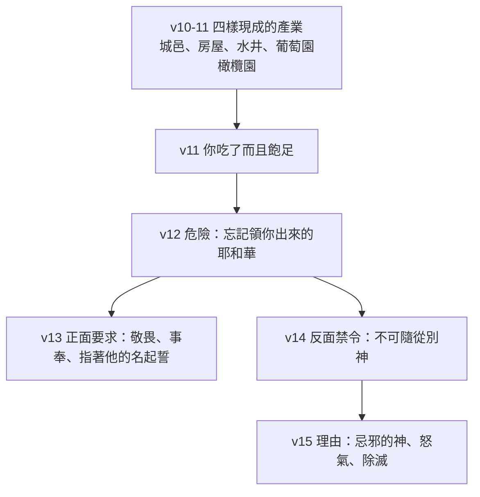
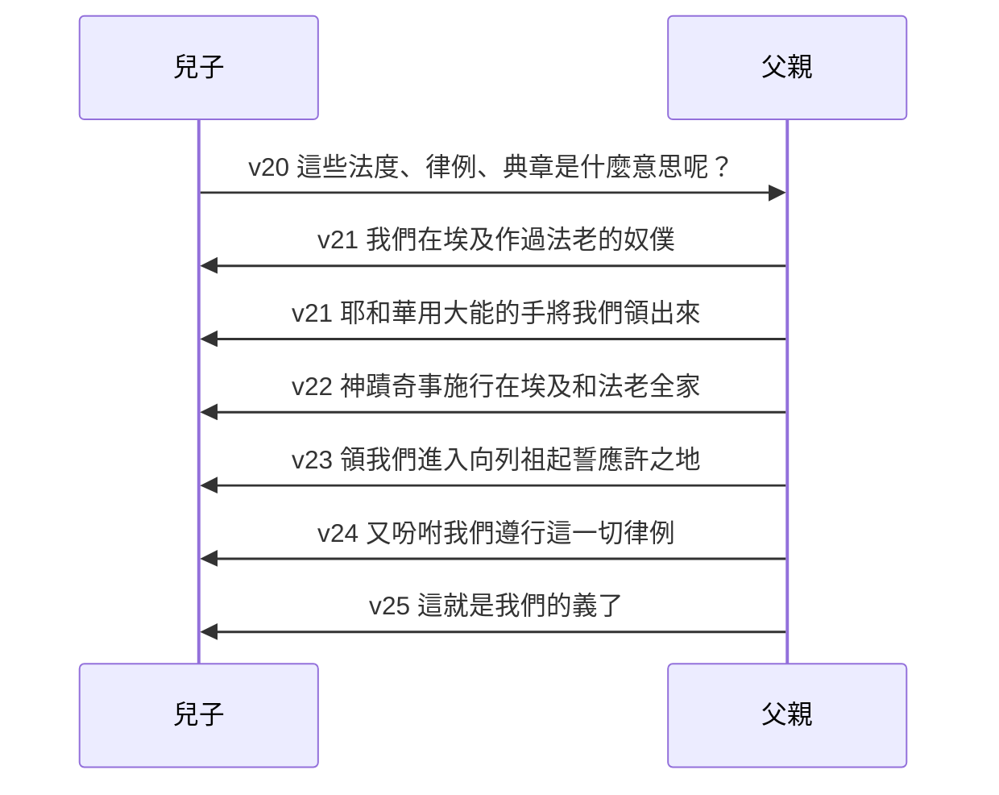

# 申命記 第6章

<!-- chapter-navigation:start -->
| [前一章](../05%20申命記/第5章.md) | [回目錄](../05%20申命記/全書目錄及綱要.md) | [下一章](../05%20申命記/第7章.md) |
| :--- | :---: | ---: |
<!-- chapter-navigation:end -->

1. 這是耶和華─你們神所吩咐[[學習與教訓同一字根（la.mad）|教訓你們的誡命]]、[[律例（choq）|律例]]、[[典章]]，使你們在所要過去得為業的地上[[遵行]]，
2. 好叫你和你子子孫孫一生[[敬畏神|敬畏耶和華]]─你的神，謹守他的一切[[律例（choq）|律例]]誡命，就是我所吩咐你的，使你的日子得以長久。
3. [[以色列啊你要聽（sha.ma）|以色列啊，你要聽]]，要謹守[[遵行]]，使你可以在那[[流奶與蜜之地]][[得福（ya.tav）|得以享福]]，人數極其增多，正如耶和華─你列祖的神所應許你的。
4. [[以色列啊你要聽（sha.ma）|以色列啊，你要聽]]！[[獨一（e.chad）|耶和華─我們神是獨一的主]]。
5. 你要[[你要盡心盡性盡力愛耶和華（a.hav）|盡心、盡性、盡力愛耶和華]]─你的神。
6. 我今日所吩咐你的話都要記在心上，
7. 也要[[殷勤教訓（sha.nan）|殷勤教訓你的兒女]]。無論你坐在家裡，行在路上，躺下，起來，都要談論。
8. 也要[[記號與經文|繫在手上為記號]]，[[記號與經文|戴在額上為經文]]；
9. 又要[[記號與經文|寫在你房屋的門框上]]，並你的城門上。
10. 耶和華─你的神[[進迦南應許|領你進]]他向你列祖[[亞伯拉罕]]、[[以撒]]、[[雅各]]起誓應許給你的地。那裡有城邑，又大又美，[[非你所建造的]]；
11. 有房屋，裝滿各樣美物，[[非你所建造的|非你所裝滿的]]；有鑿成的水井，[[非你所建造的|非你所鑿成的]]；還有葡萄園、橄欖園，[[非你所建造的|非你所栽種的]]；你吃了而且飽足。
12. 那時你要謹慎，免得你忘記將你從埃及地、[[為奴之家]]領出來的耶和華。
13. 你要[[敬畏神|敬畏耶和華]]─你的神，[[事奉與作奴僕同一字根（a.vad）|事奉他]]，[[不可妄稱耶和華你神的名|指著他的名起誓]]。
14. 不可隨從別神，就是你們四圍國民的神；
15. 因為在你們中間的耶和華─你神是[[忌邪的神]]，惟恐耶和華─你神的怒氣向你發作，就把你從地上[[滅盡與除滅的雙同字（sha.mad）|除滅]]。
16. [[神的試驗|你們不可試探耶和華]]─你們的神，像你們在[[瑪撒（Massah）|瑪撒]]那樣試探他。
17. 要留意遵守耶和華─你們神所吩咐的誡命、[[法度（e.dah）|法度]]、[[律例（choq）|律例]]。
18. 耶和華眼中看為正、看為善的，你都要[[遵行]]，[[得福（ya.tav）|使你可以享福]]，並可以進去得耶和華向你列祖起誓應許的那[[美地]]，
19. 照耶和華所說的，從你面前攆出你的一切仇敵。
20. 日後，[[傳於後代|你的兒子問你說]]：耶和華─我們神吩咐你們的這些[[法度（e.dah）|法度]]、[[律例（choq）|律例]]、[[典章]]是什麼意思呢？
21. 你就告訴你的兒子說：我們在埃及[[事奉與作奴僕同一字根（a.vad）|作過法老的奴僕]]；耶和華用[[大能的手]]將我們[[出埃及|從埃及領出來]]，
22. 在我們眼前，將重大可怕的[[十災|神蹟奇事]]施行在埃及地和[[法老]]並他全家的身上，
23. 將我們從那裡領出來，要領我們進入他向我們列祖起誓應許之地，把這地賜給我們。
24. 耶和華又吩咐我們[[遵行]]這一切[[律例（choq）|律例]]，要[[敬畏神|敬畏耶和華]]─我們的神，使我們常得好處，蒙他保全我們的生命，像今日一樣。
25. 我們若照耶和華─我們神所吩咐的一切誡命謹守[[遵行]]，[[遵行誡命是我們的義|這就是我們的義了]]。

---

## 本章知識節點

### 原文
- [[以色列啊你要聽（sha.ma）]]
- [[獨一（e.chad）]]
- [[你要盡心盡性盡力愛耶和華（a.hav）]]
- [[殷勤教訓（sha.nan）]]
- [[學習與教訓同一字根（la.mad）]]
- [[事奉與作奴僕同一字根（a.vad）]]
- [[律例（choq）]]
- [[法度（e.dah）]]
- [[得福（ya.tav）]]
- [[記號與經文]]
- [[滅盡與除滅的雙同字（sha.mad）]]
- [[瑪撒（Massah）]]
- [[遵行]]

### 神學
- [[典章]]
- [[除他以外再無別神]]
- [[忌邪的神]]
- [[敬畏神]]
- [[神的試驗]]
- [[不可妄稱耶和華你神的名]]
- [[流奶與蜜之地]]
- [[大能的手]]
- [[十誡]]
- [[亞伯拉罕之約]]
- [[因信稱義]]
- [[人若遵行律例典章就必因此活著]]
- [[傳於後代]]

### 主題
- [[非你所建造的]]
- [[美地]]
- [[為奴之家]]

### 歷史
- [[出埃及]]
- [[進迦南應許]]
- [[十災]]

### 人物
- [[亞伯拉罕]]
- [[以撒]]
- [[雅各]]
- [[法老]]

### 背景
- [[摩西的第二篇講章]]

### 互文
- [[太22：36-39|太22：36-39 耶穌稱申6:5 為第一且最大的誡命]]
- [[太4：1-11 耶穌在曠野受試探引用申命記]]

### 解經爭議
- [[遵行誡命是我們的義]]

---

## 本章整理

### 講章的總綱：先說目的，再說內容（v1-3）

第五章把十誡整段重述了一次，第六章開頭立刻交代這些條文要拿來做什麼。第1節一口氣列出三種法律用語，CT 的原文字義把它們分開：「誡命」命令；「律例」法規，法令，條例；「典章」判決，案例，公正。它在文意註解裡再各給一句定位——『誡命』指十條誡；『律例』指律法，是神向人的要求；『典章』指審判，是神對人是否遵行律法的判定。這三個詞在本章第17、20節又出現，只是把「典章」換成或補上「法度」，所以整章其實被同一組詞彙扣在一起。

這一段最值得注意的是它的句法：命令之後接的全是目的子句。第2節說好叫你和你子子孫孫一生[[敬畏神|敬畏耶和華]]，使你的日子得以長久；第3節說使你可以在那[[流奶與蜜之地]]得以享福，人數極其增多。STEP語言資料顯示第3節「得以享福」是 yi.Tav（H3190），與第18節「使你可以享福」的 Yi.tav 同一個編號，而第24節的「常得好處」則換成 H2896B——中文讀起來像同一句祝福，原文分成兩組詞（見 [[得福（ya.tav）]]）。GT《啟導本聖經申命記註釋》把這兩層講得很清楚：「敬畏神，謹守祂的律例、誡命，個人可享長壽，國家可享福福祉。」

「以色列啊，你要聽」在第3節先出現一次，第4節再出現一次（見 [[以色列啊你要聽（sha.ma）]]）。GT《聖經精讀本》指出本章是持續到26章的[[摩西的第二篇講章]]的序言，主題是愛耶和華，而這正是接下來幾節要展開的。

| 用語 | CT 原文字義 | CT 文意註解 | 出現節次 |
|---|---|---|---|
| 誡命 | 命令 | 指十條誡 | v1、2、17、25 |
| 律例 | 法規，法令，條例 | 律法，是神向人的要求 | v1、2、17、20、24 |
| 典章 | 判決，案例，公正 | 審判，是神對人是否遵行律法的判定 | v1、20 |
| 法度 | 見證 | 律法的證詞，見證神對人的心意 | v17、20 |

### 示馬：一句話撐住整章（v4-5）

第4節是猶太人稱為示馬的那一句。GT《啟導本》說「本節為舊約的精義」，並說在希伯來文舊約中，本節以 shema 一字開始，意即「聽哪」，猶太人以此為他們的信經，須加背誦。GT《聖經精讀本》把「獨一」的份量說到底：這個字「並非指相對的單一性,而是指絕對的惟一性」，而且本節「同時排斥了多神論,泛神論及單一神論」；它並記下一個抄本細節——「希伯來文聖經本節的第一個單詞與最後一個單詞的結束字母比普通字母大一些」（見 [[獨一（e.chad）]]）。

各家對這句話的譯法並不一致。GT《申命記雷氏研讀本》說「第4節有許多不同的翻譯，但這句話可能是強調耶威的獨一性」，因而主張譯作「耶和華是我們的神，只有耶和華」。這一點值得留意：中文和合本的「獨一的主」讀起來是在陳述神的屬性，而《雷氏》的譯法讀起來更像在宣告效忠對象的唯一。兩種讀法都指向同一個結論，但強調的重心不同。

> [!important]
> 第4節不是一句孤立的信仰口號，而是第5節以下每一條要求的理由。因為神是獨一的，才會要求不分割的愛（v5）；才會禁止隨從四圍國民的神（v14）；才會說祂是[[忌邪的神]]（v15）。

第5節是主耶穌口中第一且最大的誡命的出處。CT 說『盡心、盡性、盡力』意指靈、魂、體全人投入；GT《聖經精讀本》說「“心、性、力”用重複手法表現了一個人的全人格」；GT《串珠聖經註釋》最短：「盡心，盡性，盡力」：即整個人完全投入之意，並補一句「愛」：尤指順從。KC 注意到一件別家沒提的事——命令人去愛，這種事地上的統治者從來不會下；在神面前，敬畏祂與愛祂是連在一起的。這條線索把第2節的敬畏和第5節的愛接了起來，也讓第13節的敬畏不至於被讀成另一回事（見 [[你要盡心盡性盡力愛耶和華（a.hav）]]、[[太22：36-39]]）。

### 從心到門框：話要放到哪裡去（v6-9）

第6至9節是一組往外擴的動作，讀起來像同心圓：先放進心裡，再從口裡出來，再繫在身上，最後寫在建築物上。

這裡有一個中文看不出來的區別。第1節的「教訓」STEP語言資料是 le./la.Med（H3925G，簡要詞典義 la.mad: to learn: teach），第7節的「殷勤教訓」卻是 ve./shi.nan.Ta/m（H8150，簡要詞典義 sha.nan: to sharpen），兩個不同字根被譯成同一個中文詞（見 [[學習與教訓同一字根（la.mad）]]、[[殷勤教訓（sha.nan）]]）。CT 直接把這層意思寫出來：『殷勤』意指不可懈怠；『教訓』原文「磨、使尖利」，意指教導，使其學習。GT《聖經精讀本》說「“殷勤教訓”的希伯來詞意為“使之銳利”或“紮”之意」。所以第7節要求的不是安排一堂課，是反覆地磨。

第7節下半列出四個場合——坐在家裡、行在路上、躺下、起來——CT 對這句的註解只有幾個字：『談論』意指不可離口。後來猶太人把它落實成固定的誦讀：GT《啟導本》說「虔信的人按照字面實行摩西的吩咐，每日將”恭聽篇“一早一晚誦讀兩次」，並註明所指的就是第7節的「躺下」和「起來」。第8、9節的手、額與門框，後世也照字面做成了經文匣與門框經卷（見 [[記號與經文]]）。

> [!note]
> 「照字面做」和「這句話的意思」是兩個層次，不要混起來讀。GT《啟導本》記的是後世的實踐——猶太人確實照字面做了經文匣；GT《聖經精讀本》講的則是經文本身的意旨，它認為這些話並不是讓人按照字面意義去一一奉行，而是象徵性地描述無論行動或內心都不可忘記神的話語，而同一段也記下猶太人按字面解釋並製成衣帶戴在身上。兩者可以同時成立。

### 飽足之後最危險（v10-19）

第10至11節連用四次「非你所…的」，把迦南地形容成一整套現成的產業（見 [[非你所建造的]]）。CT 逐樣給了用途：『城邑』代表安全居住的環境；『非你所建造的』表示坐享其成；『各樣美物』指家具和日用品；『鑿成的水井』指方便的飲水來源；『葡萄園、橄欖園』酒和油的來源，代表生活享受的保證。GT《啟導本》把結論說在前面：「神給人的預備豐富且美好，無論是居住，是飲食，均非人所建造、供應。故人應時刻紀念看顧他的神。」

這四句不是在誇迦南有多好，而是在鋪第12節的警告——那時你要謹慎，免得你忘記那位把你從[[為奴之家]]領出來的耶和華。KC 說得直接：福分是神預備好的，裡面沒有一樣出於人；而人常常忙著享用所得的，就忘了給的那一位。BH 兩次把這幾節連到弗2:8-9，說以色列人承受的是自己沒有付出勞力的產業，這正對應信徒因基督的工作而非自己的行為得著福分。

第13節的三個動作是一組。STEP語言資料顯示「事奉」是 ta.'a.Vod（H5647G），與第12節「為奴之家」、第21節「作過法老的奴僕」同屬 a.vad／e.ved 字根——曾經被迫服事人的，如今要自願服事神（見 [[事奉與作奴僕同一字根（a.vad）]]）。至於「指著他的名起誓」，GT《聖經精讀本》說這是悖論性地強調了第三條誡命的聖名敬畏思想（見 [[不可妄稱耶和華你神的名]]）。第15節的「除滅」在 STEP 是 ve./hish.Mi.de./kha（H8045，sha.mad: to destroy），與 [[滅盡與除滅的雙同字（sha.mad）]] 同一字根。CT 在這裡提醒，這節警告後來真的應驗——以色列南北兩國先後滅亡。

第16節回頭指一件舊事：像你們在瑪撒那樣試探他。CT 說『試探』原意試驗、考驗、驗證，是神試驗祂的子民的用詞，如今反過來，神的子民試圖迫使神照他們的意思伸手作事（見 [[瑪撒（Massah）]]、[[神的試驗]]）。第18節的「看為正、看為善」CT 特別點出與第十二章的對比——不同於人「自己眼中看為正」，而第18節末尾的「那美地」，CT 註明「美」與同節的「善的」原文同字（見 [[美地]]、[[遵行]]）。

### 兒子發問，父親講故事（v20-25）

最後一段換了體裁：不是命令，是一段預先寫好的問答。第20節設想有一天兒子問這些法度、律例、典章是什麼意思，第21至24節給出標準答案——而那個答案是從歷史開始講的。

這個次序值得停一下：父親沒有先回答「規矩是什麼」，而是先講[[出埃及|出埃及的經歷]]——先救贖，後誡命。KC 統計聖經裡有四處記載兒子發問，本章第20節是其中之一，其餘三處分別關乎逾越節、頭生的贖回與過約旦河。GT《串珠聖經註釋》說摩西不厭其煩地複述神在歷史中所施行的恩惠和拯救，為要把神在救贖中的恩典與以色列民應有的生活方式連接起來（見 [[傳於後代]]、[[大能的手]]、[[十災]]）。

第25節是全章最後一句，也是最容易讀出問題的一句：「這就是我們的義了」。CT、GT 的四本子註釋與 BH 各有說法，而且回答的其實不是同一個問題（見 [[遵行誡命是我們的義]]、[[因信稱義]]、[[人若遵行律例典章就必因此活著]]）。

| 來源 | 對「我們的義」的說法 | 它在回答什麼 |
|---|---|---|
| CT | 意指滿足與神所立之『約』的要求，神便以我們為義 | 義的內容，兼及憑基督稱義 |
| GT《雷氏研讀本》 | 遵守律法並不保證有永生，但這樣的順服卻構成得到約之祝福的權利 | 這個義換來什麼 |
| GT《啟導本》 | 「義」是就神與以色列人立約的關係而言 | 義指什麼 |
| GT《串珠聖經註釋》 | 證明我們確實遵行了與神所立的盟約，會得著神的福澤 | 義指什麼 |
| GT《聖經精讀本》 | 這句話決不與保羅所闡明因信稱義的教義相矛盾 | 和憑信得救矛不矛盾 |
| BH | 這種義不是賺得救恩，而是活出反映神聖潔與公義的樣子 | 和憑信得救矛不矛盾 |

KC 沒有註解第25節，所以這一格是空的——不必替他補一個說法。

### 這一章在跨章脈絡裡的位置

本章第10、18、23節三次講到進入那地，而且每次都加上神向列祖起過誓（見 [[亞伯拉罕之約]]、[[進迦南應許]]、[[亞伯拉罕]]、[[以撒]]、[[雅各]]）。KC 特別指出這個重複，並說當神用起誓來確認自己的話，是為了在人的軟弱上加一層確據。

KC 並把聖經裡神起誓的場合整理成四次，而且說每一次都與那地有關：

| 場合 | KC 的說明 |
|---|---|
| 創22:16-18 | 因著應許之子被獻上，神應許亞伯拉罕在應許之地有眾多後裔，並在他的後裔裡使全地得福 |
| 詩95:11 | 百姓若背離神，神起誓他們必不得進入應許之地 |
| 詩110:1,4 | 百姓若不忠，神要在祂右手邊的那一位身上成就祂的應許 |
| 賽45:23 | 基督若在那地掌權，萬膝必向祂跪拜，祂百姓中悔改的餘民必在那地 |

放在一起看，申6 的三次起誓不是孤例，而是同一組語言裡的一段：神用起誓講那地，從創世記講到先知書。第10節指名亞伯拉罕、以撒、雅各，把這一代人和幾百年前的應許接了起來；第21至23節則把[[法老]]與埃及那一段放進同一條線。

本章還有兩節在新約被主耶穌用過。GT《雷氏研讀本》在第13節註明「我們的主受撒但引誘的時候曾引述這節經文，此外還有第六章16節和八章3節」；GT《啟導本》說「祂擊敗魔鬼所用的經文全部來自《申命記》」。有意思的是兩家數的次序不同：KC 按申命記本身的順序稱第13節是第一處引用、第16節是第二處；GT《啟導本》則按馬太的敘事順序，說第16節對應撒但第二次試探、第13節對應太4:10。兩者並不衝突，只是一個按經卷先後、一個按事件先後（見 [[太4：1-11 耶穌在曠野受試探引用申命記]]）。

> [!question]
> 第4節說神是獨一的，第14節卻要禁止隨從「你們四圍國民的神」——如果別神根本不存在，禁令要防的是什麼？本章沒有正面處理這個問題；[[除他以外再無別神]] 在申4:35、39 有更直接的宣告，而本章的重點顯然放在效忠的唯一，而不是形上學的論證。

最後值得記一筆的是本章與[[十誡]]的關係。CT 在第1節與第17節兩次註明「誡命」指十條誡，也就是說第六章不是另立新規，而是替上一章那十條找出一個總原則——那個原則就是第5節。

**參考資料**
https://www.ccbiblestudy.org/Old%20Testament/05Deut/05CT06.htm
https://www.ccbiblestudy.org/Old%20Testament/05Deut/05GT06.htm
https://www.kingcomments.com/en/bible-studies/Deu/6
https://biblehub.com/study/deuteronomy/6.htm
https://github.com/STEPBible/STEPBible-Data

<!-- appendix-links:start -->
## 附錄

### 相關地圖
- [[appendix/fhl_maps/maps/025|〈申圖一〉應許之地全圖]]
<!-- appendix-links:end -->

<!-- chapter-navigation:start -->
| [前一章](../05%20申命記/第5章.md) | [回目錄](../05%20申命記/全書目錄及綱要.md) | [下一章](../05%20申命記/第7章.md) |
| :--- | :---: | ---: |
<!-- chapter-navigation:end -->
