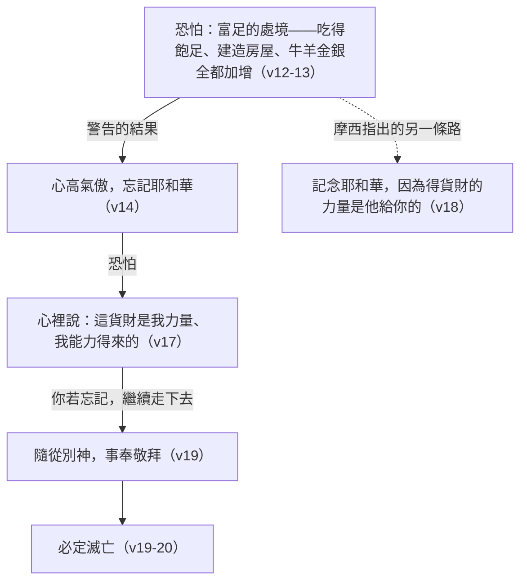

# 申命記 第8章

<!-- chapter-navigation:start -->
| [前一章](../05%20申命記/第7章.md) | [回目錄](../05%20申命記/全書目錄及綱要.md) | [下一章](../05%20申命記/第9章.md) |
| :--- | :---: | ---: |
<!-- chapter-navigation:end -->

1. 我今日所吩咐的一切誡命，你們要謹守[[遵行]]，[[人若遵行律例典章就必因此活著|好叫你們存活]]，人數增多，且進去得耶和華向你們列祖起誓應許的那地。
2. 你也要[[「記念」與「守」|記念]]耶和華─你的神在[[曠野]]引導你[[曠野飄流四十年|這四十年]]，是要[[苦煉（a.nah）|苦煉]]你，[[神的試驗|試驗你]]，要知道你心內如何，肯守他的誡命不肯。
3. 他[[苦煉（a.nah）|苦煉]]你，任你飢餓，將你和你列祖所不認識的[[嗎哪]]賜給你吃，使你知道，[[申8：3 人活著不是單靠食物|人活著不是單靠食物]]，[[太4：1-11 耶穌在曠野受試探引用申命記|乃是靠耶和華口裡所出的一切話]]。
4. [[曠野飄流四十年|這四十年]]，[[神的供應|你的衣服沒有穿破]]，你的腳也沒有腫。
5. 你當心裡思想，耶和華─你神[[苦難與管教|管教]]你，好像人管教兒子一樣。
6. 你要謹守耶和華─你神的誡命，[[遵行]]他的道，[[敬畏神|敬畏他]]。
7. 因為耶和華─你神領你進入[[美地]]，那地[[河、泉、源（na.chal、a.yin、te.hom）|有河，有泉，有源]]，從山谷中流出水來。
8. 那地有[[迦南地的七樣出產|小麥、大麥、葡萄樹、無花果樹、石榴樹、橄欖樹，和蜜]]。
9. 你在那地不缺食物，[[你一無所缺|一無所缺]]。[[鐵礦與銅礦（bar.zel、ne.cho.shet）|那地的石頭是鐵，山內可以挖銅]]。
10. 你吃得飽足，就要[[稱頌（ba.rakh）|稱頌]]耶和華─你的神，因他將那[[美地]]賜給你了。
11. 你要謹慎，免得[[忘記（sha.khach）|忘記]]耶和華─你的神，不守他的誡命、[[典章]]、[[律例（choq）|律例]]，就是我今日所吩咐你的；
12. 恐怕你吃得飽足，建造美好的房屋居住，
13. 你的牛羊加多，你的金銀增添，並你所有的全都加增，
14. 你就[[心高氣傲（rum）|心高氣傲]]，[[忘記（sha.khach）|忘記]]耶和華─你的神，就是將你[[出埃及|從埃及地]][[為奴之家]]領出來的，
15. 引你經過那大而可怕的[[曠野]]，那裡有[[火蛇（saraph）|火蛇]]、[[蠍子（aq.rav）|蠍子]]、乾旱無水之地。他曾為你[[磐石出水|使水從堅硬的磐石中流出來]]，
16. 又在[[曠野]]將你列祖所不認識的[[嗎哪]]賜給你吃，是要[[苦煉（a.nah）|苦煉]]你，[[神的試驗|試驗你]]，叫你終久[[得福（ya.tav）|享福]]；
17. 恐怕你心裡說：這[[貨財（cha.yil）|貨財]]是我力量、我能力得來的。
18. 你要[[「記念」與「守」|記念]]耶和華─你的神，因為[[神賜福賜財富能力 (申8-18)|得貨財的力量是他給你的]]，為要堅定他[[亞伯拉罕之約|向你列祖起誓所立的約]]，像今日一樣。
19. 你若[[忘記（sha.khach）|忘記]]耶和華─你的神，[[除他以外再無別神|隨從別神]]，事奉敬拜，你們必定滅亡；這是我今日警戒你們的。
20. 耶和華在你們面前怎樣使列國的民滅亡，你們也必照樣滅亡，因為你們[[以色列啊你要聽（sha.ma）|不聽從]]耶和華─你們神的話。

---

## 本章知識節點

### 主題
- [[嗎哪]]
- [[美地]]
- [[為奴之家]]
- [[迦南地的七樣出產]]
- [[神的供應]]
- [[你一無所缺]]

### 地點
- [[曠野]]

### 歷史
- [[曠野飄流四十年]]
- [[出埃及]]

### 事件
- [[磐石出水]]

### 文化
- [[鐵礦與銅礦（bar.zel、ne.cho.shet）]]

### 原文
- [[苦煉（a.nah）]]
- [[忘記（sha.khach）]]
- [[貨財（cha.yil）]]
- [[心高氣傲（rum）]]
- [[河、泉、源（na.chal、a.yin、te.hom）]]
- [[稱頌（ba.rakh）]]
- [[蠍子（aq.rav）]]
- [[火蛇（saraph）]]
- [[律例（choq）]]
- [[遵行]]
- [[「記念」與「守」]]
- [[得福（ya.tav）]]
- [[以色列啊你要聽（sha.ma）]]

### 神學
- [[典章]]
- [[敬畏神]]
- [[亞伯拉罕之約]]
- [[神的試驗]]
- [[苦難與管教]]
- [[除他以外再無別神]]
- [[人若遵行律例典章就必因此活著]]

### 互文
- [[申8：3 人活著不是單靠食物]]
- [[太4：1-11 耶穌在曠野受試探引用申命記]]
- [[神賜福賜財富能力 (申8-18)]]

---

## 本章整理

### 一、先把四十年講清楚（v1-6）

這一章開頭像一句口號：「我今日所吩咐的一切誡命，你們要謹守遵行，好叫你們存活」。CT 把前半句拆成兩個動作，說「謹守」是「重在指思想觀念的贊同和一致」，「遵行」則是「重在指行為上的遵照和實施」（見[[遵行]]）。後半句的「存活」也不是修辭；GT《聖經精讀本》講得很硬：「謹守遵行神的誡命，這並不單單是祝福的問題，乃是關乎生死的問題」，並補上一句活生生的證明——上一代因不順服而在曠野四十年間被除滅淨盡（見[[人若遵行律例典章就必因此活著]]）。

第2節是全章的樞紐，它要求百姓做一件事：記念。STEP語言資料顯示這個動詞是 za.khar（H2142），和第18節「你要記念耶和華」是同一個字；而第1、2、6、11節反覆出現的「謹守／守／謹慎」則都出自 sha.mar（H8104）。兩個字在本章交替出現，一個管回頭看，一個管往前走（見[[「記念」與「守」]]）。

四十年要做什麼，經文自己給了答案：苦煉、試驗、要知道你心內如何。[[苦煉（a.nah）|苦煉]]在 STEP 是 H6031B，簡要詞典義 to afflict，本節譯義 to humble you；[[神的試驗|試驗]]是 H5254G（na.sah）。GT《聖經精讀本》特別分辨後面這個字不是惡意的陷阱，說它「並非出於惡意使人掉進陷阱的試探」，而是善意的考試，目的是叫人領悟真理並終得祝福。至於「要知道你心內如何」，GT《啟導本聖經申命記註釋》先擋掉一個誤讀：「這裡不是說神不知道他們的內心」，這裡的知道「是指人的道德情操經過考驗之後所顯出的真情況」。

CT 把整章的試煉目的整理成四項，散在幾處靈意註解裡：

| 節次 | 試煉的目的（CT 的整理） |
| --- | --- |
| 2 | 顯明存心是否肯守神的誡命 |
| 3 | 學會活著靠神口裡所出的一切話 |
| 4-5 | 父神的管教是要我們得益處，在他的聖潔上有分（參來十二10） |
| 15-16 | 叫人終久享福 |

KC 從讀者自己的處境講同一件事，他說我們不是在七日的第一日聚會裡認識自己，而是在日復一日的生活裡認識自己，而那正是曠野的生活；BH 的說法是曠野經歷剝去了以色列的自足，教他們轉而倚靠神。

第3節是全章最有名的一句，神先讓人餓，再賜下列祖所不認識的[[嗎哪]]——CT 在這裡點出順序，說飢餓帶來了嗎哪的供應，可見飢餓並非壞事。這一節後來被耶穌用來抵擋曠野的試探（見[[申8：3 人活著不是單靠食物]]、[[太4：1-11 耶穌在曠野受試探引用申命記]]），CT、GT、KC、BH 四家都指出這個引用。

第4至5節把神的照顧收在兩個小得幾乎會被跳過的細節上：衣服沒有穿破、腳也沒有腫（見[[神的供應]]、[[曠野飄流四十年]]）。第5節接著給出一個關係上的定位——耶和華管教你，好像人管教兒子一樣。STEP語言資料把「管教」標為 ya.sar（H3256）；GT《申命記串珠聖經註釋》給的解釋是「意即訓誨和責備」，並說管教通常意味著對受教者的殷切期望（見[[苦難與管教]]）。第6節把這一段收在三個動作上：謹守誡命、遵行他的道、[[敬畏神|敬畏他]]。

### 二、那地到底好在哪裡（v7-10）

第7節一開始，語氣整個換了。摩西不再講曠野，開始描寫[[美地]]，而且描寫得非常具體。

KC 數過這一段的用字，指出「地」這個字在這段描述裡出現了七次，他認為這表示神在這裡賜下的是完全的祝福。STEP語言資料可以驗證這個數字：7 至 10 節的 'E.retz（H776G）確實是七次——第7節兩次、第8節兩次、第9節兩次、第10節一次。

水源排在第一位，而且原文用了三個不同的字（見[[河、泉、源（na.chal、a.yin、te.hom）|有河，有泉，有源]]）。CT 的文意註解把三者的關係排開：「源指水源，泉指水的湧出，河指水的匯流」。這句話與第15節那個「乾旱無水之地」正好對著讀。

接著是可以數得出來的物產：

| 項目 | STEP語言資料 | 各家補的重點 |
| --- | --- | --- |
| 小麥、大麥 | chit.tah（H2406）、se.o.rah（H8184） | CT 說這兩樣代表供應主食的五穀；BH 說大麥比小麥早收、價格較低，被視為窮人的食物 |
| 葡萄樹 | ge.phen（H1612） | CT 歸為酒的主要來源；BH 說葡萄酒在聖經裡象徵喜樂 |
| 無花果樹、石榴樹 | te.e.nah（H8384）、rim.mon（H7416） | CT 歸為果樹；BH 說無花果代表興盛與平安，石榴因籽多而象徵多結果子並用於聖殿裝飾 |
| 橄欖樹、蜜 | za.yit（H2132H）配 she.men（H8081）、de.vash（H1706） | 原文第六樣是出油的橄欖樹；CT 說蜜代表一切甘甜的汁液 |
| 鐵、銅 | bar.zel（H1270）、ne.cho.shet（H5178A） | CT 說鐵礦多如石頭到處可尋見；GT《啟導本聖經申命記註釋》指「死海南岸和加利利海東岸的亞拉巴地區」產銅鐵、所羅門以前即已開採 |

前四列合起來就是[[迦南地的七樣出產]]，KC 特別數了數目，說這地有七樣而埃及只有六樣，指的是以色列人在曠野懷念的魚、黃瓜、西瓜、韭菜、蔥與蒜（民11:5）。最後一列則常被讀者跳過（見[[鐵礦與銅礦（bar.zel、ne.cho.shet）]]）；KC 在這裡讀出一層意思：礦產是最難發現的資源，要下功夫挖得夠深才找得到，不是所有的祝福都擺在地表上。

第9節那句[[你一無所缺|一無所缺]]把整段收攏，第10節則是這一章真正的轉折：「你吃得飽足，就要稱頌耶和華─你的神」。STEP語言資料把「[[稱頌（ba.rakh）|稱頌]]」標為 ba.rakh（H1288），CT 的原文字義給「祝福，屈膝」；CT 也注意到後世常拿這節作謝飯禱告，但提醒它原本的用意是警告——在所求所想得到滿足的時候，不要忘記神。

### 三、飽足之後才是真正的考驗（v11-18）

第11節一開口就是警告，而且用字很妙。CT 指出「守」在原文和「謹慎」是同一個字，STEP語言資料同樣把兩者標為 H8104（sha.mar）——要守住神的話，先得守住自己。這一節同時列出誡命、[[典章]]、[[律例（choq）|律例]]三樣。

第12節以「恐怕」起頭，先鋪出一個處境，而處境本身沒有一樣是壞事：吃得飽足、建造美好的房屋居住、牛羊加多、金銀增添、所有的全都加增。這句警告要到第14節才落到結果上——你就心高氣傲，忘記耶和華。用的是「恐怕」而不是「必定」，所以不是註定的結局，而且第18節緊接著就給了一條轉回去的路：

這條鏈子裡有一個 STEP 才看得出來的細節：第13節的「加多」「增添」「加增」在原文是同一個動詞（H7235A，ra.vah），而第1節那句應許「人數增多」用的也是它。==同一個字，在第1節是神應許的祝福，到第13節卻成了危險的溫床==——變多的東西本身沒有改變，改變的是心。

第14節的「[[心高氣傲（rum）|心高氣傲]]」在原文只有兩個詞：rum（H7311A，簡要詞典義 to exalt）配 le.vav（H3824，heart），字面是你的心被高舉起來；CT 的原文字義在這裡特別註明「氣傲」原文無此字。GT《聖經精讀本》把這個心態的社會樣貌講出來：人的物質生活稍有餘裕就容易陷進懶惰與放縱，最終掉進提倡物質萬能的驕傲之座。KC 補上一個容易被忽略的角落——連敬虔本身也可以拿來驕傲。

第14到16節接著是一長串回顧，摩西把神做過的事一件件數出來：從埃及地[[為奴之家]]領出來（見[[出埃及]]）、引你經過那大而可怕的[[曠野]]、那裡有[[火蛇（saraph）|火蛇]]、[[蠍子（aq.rav）|蠍子]]、乾旱無水之地、使水從堅硬的磐石中流出來（見[[磐石出水]]）、又在曠野賜下嗎哪，而這一切的目的是「叫你終久享福」（見[[得福（ya.tav）]]）。

第17到18節是全章的針尖（見[[貨財（cha.yil）]]）。GT《聖經精讀本》看出第17節的修辭：「用重複手法表現了驕傲之人的心態」——我力量、我能力，一口氣說了兩次。第18節則把其中的力量、得、貨財三個詞再用一次（沒有再出現「能力」那個字），把力量的來源歸回神；CT 的說法很直接：「說明神是一切力量的源頭，沒有神的賜給，就沒有力量；沒有力量，就沒有財富」。GT《申命記串珠聖經註釋》在第17節只留一句，說「財富使人容易驕傲、忘記神」（參箴30:7、9）；BH 則指出得財富的能力被呈現為神的恩賜，而不只是人的努力或才智的產物，並引代上29:12。這節經文最後接到[[亞伯拉罕之約|向你列祖起誓所立的約]]（見[[神賜福賜財富能力 (申8-18)]]）——神給人賺取的力量，是為了兌現他自己的承諾。

### 四、忘記走到底是什麼（v19-20）

最後兩節把「[[忘記（sha.khach）|忘記]]」推到極端。STEP語言資料顯示第19節把同一個字連著寫了兩次（H7911，前一個標為不定詞絕對式，後一個是未完成式），和合本譯作「你若忘記」。GT《申命記串珠聖經註釋》直接把它定位成十誡的問題，說隨從別神、事奉敬拜「即違背十誡的第一誡」（見[[除他以外再無別神]]）。

第20節的重量在於它把以色列和迦南人放進同一個標準。CT 說：「神並不偏待人，祂不會因以色列人是祂的選民，就縱容他們」；GT《申命記雷氏研讀本》給的對照對象更具體，說以色列若忘記耶和華，就要像西宏和噩所統治下的列國一樣滅亡。滅亡的理由，經文自己寫得清楚：「不聽從耶和華─你們神的話」（見[[以色列啊你要聽（sha.ma）]]）。CT 的文意註解把「聽從」解為順從，「不聽從」就是不遵照神的話去行；BH 也在這裡指出，申命記裡的祝福是有條件的，這條件就是順服。

> [!important]
> 本章從頭到尾沒有叫人不要富足。它警告的是在富足裡忘記富足是誰給的。第10節的稱頌與第18節的記念，是同一個防線的兩種說法。

### 五、把曠野和美地放在一起看

這一章的骨架其實很清楚：先回望曠野（v2-5），再描寫美地（v7-10），第10節的稱頌把祝福轉入第11節開始的警告，而第14到16節又把曠野的記憶再召回來一次。KC 在本章開頭就點出這樣的分工——申命記第7章講的是百姓歸神為聖，第8章講的是神在曠野怎樣待這群人，而百姓自己的不忠要等到第9章才處理。

把兩段路擺在一起，對照就浮出來了：

| | 曠野（v2-5、15-16） | 美地（v7-10） |
| --- | --- | --- |
| 水 | 乾旱無水之地，水要從堅硬的磐石中流出 | 有河，有泉，有源，谷中山上都有 |
| 食物 | 任你飢餓，再賜下嗎哪 | 七樣出產，吃得飽足，一無所缺 |
| 危險 | 火蛇、蠍子 | 心高氣傲、忘記耶和華 |
| 神的動作 | 苦煉、試驗、管教 | 賜下、領進、堅定他的約 |

==兩種環境都是課堂，只是考題不同。==曠野考的是人在缺乏裡還信不信神說的話，美地考的是人在飽足裡還記不記得神。摩西要百姓記念四十年，是因為進了美地之後，那段日子仍是一個持續有效的提醒——本章同時也用誡命與敬畏（v6）、出埃及與為奴之家（v14）、向列祖所立的約（v18）和聽從神的話（v20）在做同一件事。

**參考資料**
https://www.ccbiblestudy.org/Old%20Testament/05Deut/05CT08.htm
https://www.ccbiblestudy.org/Old%20Testament/05Deut/05GT08.htm
https://www.kingcomments.com/en/bible-studies/Deu/8
https://biblehub.com/study/deuteronomy/8.htm
https://github.com/STEPBible/STEPBible-Data

<!-- appendix-links:start -->
## 附錄

### 相關地圖
- [[appendix/fhl_maps/maps/025|〈申圖一〉應許之地全圖]]
<!-- appendix-links:end -->

<!-- chapter-navigation:start -->
| [前一章](../05%20申命記/第7章.md) | [回目錄](../05%20申命記/全書目錄及綱要.md) | [下一章](../05%20申命記/第9章.md) |
| :--- | :---: | ---: |
<!-- chapter-navigation:end -->
