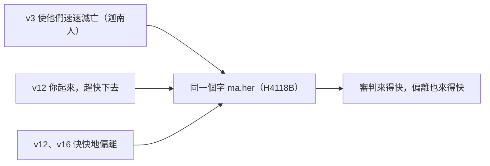

# 申命記 第9章

<!-- chapter-navigation:start -->
| [前一章](../05%20申命記/第8章.md) | [回目錄](../05%20申命記/全書目錄及綱要.md) | [下一章](../05%20申命記/第10章.md) |
| :--- | :---: | ---: |
<!-- chapter-navigation:end -->

1. 以色列啊，[[以色列啊你要聽（sha.ma）|你當聽]]！你今日要過[[約但河]]，進去趕出比你強大的國民，得著廣大堅固、高得頂天的城邑。
2. 那民是[[亞衲族與偉人拿非林|亞衲族]]的人，又大又高，是你所知道的；也曾聽見有人指著他們說：誰能在亞衲族人面前站立得住呢？
3. 你今日當知道，耶和華─你的神在你前面過去，如同[[烈火]]，[[滅盡與除滅的雙同字（sha.mad）|要滅絕]]他們，將他們制伏在你面前。這樣，你就要照耶和華所說的趕出他們，使他們[[快快地（ma.her）|速速滅亡]]。
4. 耶和華─你的神將這些國民從你面前攆出以後，你心裡不可說：耶和華將我領進來得這地是[[不是因你的義（tse.da.qah）|因我的義]]。其實，耶和華將他們從你面前趕出去是[[亞摩利人罪孽滿盈|因他們的惡]]。
5. 你進去得他們的地，[[不是因你的義（tse.da.qah）|並不是因你的義]]，[[遵行誡命是我們的義|也不是因你心裡正直]]，乃是因這些國民的惡，耶和華─你的神將他們從你面前趕出去，又因耶和華要堅定他[[亞伯拉罕之約|向你列祖亞伯拉罕、以撒、雅各起誓所應許的話]]。
6. 你當知道，耶和華─你神將這[[美地]]賜你為業，[[不是因你的義（tse.da.qah）|並不是因你的義]]；你本是[[硬著頸項的百姓]]。
7. 你當[[「記念」與「守」|記念]][[忘記（sha.khach）|不忘]]，你在[[曠野]]怎樣惹耶和華─你神發怒。自從[[出埃及|你出了埃及地的那日]]，直到你們來到這地方，你們時常悖逆耶和華。
8. 你們在[[何烈山]]又惹耶和華發怒；他惱怒你們，[[滅盡與除滅的雙同字（sha.mad）|要滅絕]]你們。
9. [[摩西上山領石版|我上了山]]，要領受[[石版|兩塊石版]]，就是耶和華與你們立約的版。那時我在山上住了[[四十晝夜]]，沒有吃飯，也沒有喝水。
10. 耶和華把那[[石版|兩塊石版]]交給我，[[神的指頭（路11：20）|是神用指頭寫的]]。版上所寫的是照耶和華在[[大會的日子（qa.hal）|大會的日子]]、在山上、從火中對你們[[十誡|所說的一切話]]。
11. 過了[[四十晝夜]]，耶和華把那[[石版|兩塊石版]]，就是約版，交給我。
12. 對我說：你起來，[[快快地（ma.her）|趕快下去]]！因為你從埃及領出來的百姓已經[[敗壞與滅絕同一字根（sha.chat）|敗壞了自己]]；他們[[快快地（ma.her）|快快地]]偏離了我所吩咐的道，[[不可為自己雕刻偶像|為自己鑄成了偶像]]。
13. 耶和華又對我說：我看這百姓是[[硬著頸項的百姓]]。
14. [[你且由著我（ra.phah）|你且由著我]]，我[[滅盡與除滅的雙同字（sha.mad）|要滅絕]]他們，[[從冊上塗抹（生命冊）|將他們的名從天下塗抹]]，使你的後裔比他們成為更大更強的國。
15. 於是我轉身下山，山被火燒著，兩塊約版在我兩手之中。
16. 我一看見你們得罪了耶和華─你們的神，[[金牛犢事件|鑄成了牛犢]]，[[快快地（ma.her）|快快地]]偏離了耶和華所吩咐你們的道，
17. 我就把那兩塊版從我手中扔下去，[[摩西摔碎法版（廢約的象徵）|在你們眼前摔碎了]]。
18. 因你們所犯的一切罪，行了耶和華眼中看為惡的事，惹他發怒，我[[摩西為百姓代求（金牛犢）|就像從前俯伏在耶和華面前]][[四十晝夜]]，沒有吃飯，也沒有喝水。
19. 我因耶和華向你們大發烈怒，[[滅盡與除滅的雙同字（sha.mad）|要滅絕]]你們，就甚害怕；[[摩西代禱熄滅神怒（詩106：23）|但那次耶和華又應允了我]]。
20. 耶和華也向[[亞倫]]甚是發怒，[[滅盡與除滅的雙同字（sha.mad）|要滅絕他]]；那時我又為亞倫祈禱。
21. 我把那叫你們犯罪[[金牛犢事件|所鑄的牛犢用火焚燒]]，又搗碎磨得很細，以致細如灰塵，我就把這灰塵撒在從山上流下來的溪水中。
22. 你們在[[他備拉]]、[[瑪撒（Massah）|瑪撒]]、[[基博羅哈他瓦]]又惹耶和華發怒。
23. 耶和華打發你們離開[[加低斯巴尼亞事件|加低斯巴尼亞]]，說：你們上去得我所賜給你們的地。那時你們違背了耶和華─你們神的命令，不信服他，不聽從他的話。
24. 自從我認識你們以來，你們常常悖逆耶和華。
25. 我因耶和華說[[滅盡與除滅的雙同字（sha.mad）|要滅絕]]你們，就在耶和華面前照舊俯伏[[四十晝夜]]。
26. [[摩西的代求|我祈禱耶和華說]]：主耶和華啊，[[敗壞與滅絕同一字根（sha.chat）|求你不要滅絕你的百姓]]。他們是[[產業（na.cha.lah）|你的產業]]，[[救贖|是你用大力救贖的]]，[[大能的手|用大能從埃及領出來的]]。
27. 求你[[「記念」與「守」|記念]]你的僕人亞伯拉罕、以撒、雅各，不要想念這百姓的頑梗、邪惡、罪過，
28. 免得你領我們出來的那地之人說，耶和華因為不能將這百姓領進他所應許之地，又因恨他們，所以領他們出去，要在曠野殺他們。
29. 其實他們是你的百姓，[[產業（na.cha.lah）|你的產業]]，是你用大能和[[伸出來的膀臂]]領出來的。

---

## 本章知識節點

### 主題
- [[美地]]

### 地點
- [[約但河]]
- [[曠野]]
- [[何烈山]]
- [[他備拉]]
- [[基博羅哈他瓦]]

### 歷史
- [[出埃及]]
- [[加低斯巴尼亞事件]]

### 人物
- [[亞倫]]

### 事件
- [[摩西上山領石版]]
- [[金牛犢事件]]
- [[摩西摔碎法版（廢約的象徵）]]

### 文化
- [[石版]]

### 背景
- [[亞衲族與偉人拿非林]]

### 原文
- [[不是因你的義（tse.da.qah）]]
- [[大會的日子（qa.hal）]]
- [[你且由著我（ra.phah）]]
- [[快快地（ma.her）]]
- [[敗壞與滅絕同一字根（sha.chat）]]
- [[滅盡與除滅的雙同字（sha.mad）]]
- [[以色列啊你要聽（sha.ma）]]
- [[「記念」與「守」]]
- [[忘記（sha.khach）]]
- [[烈火]]
- [[瑪撒（Massah）]]
- [[產業（na.cha.lah）]]

### 神學
- [[硬著頸項的百姓]]
- [[亞摩利人罪孽滿盈]]
- [[亞伯拉罕之約]]
- [[十誡]]
- [[不可為自己雕刻偶像]]
- [[四十晝夜]]
- [[摩西的代求]]
- [[救贖]]
- [[大能的手]]
- [[伸出來的膀臂]]

### 互文
- [[從冊上塗抹（生命冊）]]
- [[神的指頭（路11：20）]]
- [[摩西為百姓代求（金牛犢）]]
- [[摩西代禱熄滅神怒（詩106：23）]]

### 解經爭議
- [[遵行誡命是我們的義]]

---

## 本章整理

### 一、敵人很大，但問題不在敵人（v1-3）

第1節的開場和第8章一樣是一句呼喚：「以色列啊，你當聽！」（見[[以色列啊你要聽（sha.ma）]]）。KC 指出這個開場是申命記的特色，作用是把注意力叫回神要說的話上。

接下來摩西把敵人形容得非常可怕：比你強大的國民、廣大堅固、高得頂天的城邑、又大又高的[[亞衲族與偉人拿非林|亞衲族]]，還加上一句流傳已久的話——誰能在亞衲族人面前站立得住呢？CT 注意到一件事：「『廣大堅固、高得頂天』這句言過其實的話，是引用那十個膽怯的探子所說的」（參申一28）。KC 讀出的重點略有不同，他說摩西之所以用那些不信的探子用過的字眼，是因為敵人的力量本來就是事實，仇敵的力量不可小看，而該倚靠的是更大的那一個力量——神的力量。==兩家都注意到摩西在引用探子的話，但一家看見的是誇張，一家看見的是實情。==

STEP語言資料在第1節給的字是 u./ve.tzu.Rot（H1219）與 ba./sha.Ma.yim（H8064，heaven），也就是「堅固」到「頂天」的那組詞；CT 的〔原文字義〕在這裡把「高得」解作難以進入、「頂天」解作天空。

第3節給出答案：耶和華在你前面過去，如同[[烈火]]。STEP語言資料顯示這是 'esh 'o.khe.Lah（H784 火＋H398 吞吃）；CT 的〔原文字義〕給「烈」是吞噬，文意註解說這火是因迦南原住民拜偶像假神而惹動的忌邪怒火。GT《啟導本聖經申命記註釋》從另一面補：神走在祂的子民前面，與他們一同作戰，取得勝利。

第3節末的「速速滅亡」與申7:22 那句漸漸趕出、不可速速滅盡讀起來像互相打架，兩家各給了一套解法。CT 說兩處並不矛盾，因為申7 講的是不要一下子就將他們滅盡，本節講的是他們的滅亡不會拖延太久。GT《聖經精讀本》提出的兩個方向不同：一是本節或許描繪的是迦南人在神的審判面前的命運，二是逐漸滅亡的對象指迦南居民，而急速滅亡的對象是迦南人的社會或國家體系（見[[快快地（ma.her）]]）。

### 二、三次說「不是因你的義」（v4-6）

第4到6節是全章的論證核心，同一句話講了三次（見[[不是因你的義（tse.da.qah）]]）。第4節是「不可說⋯是因我的義」，第5節是「並不是因你的義，也不是因你心裡正直」，第6節再說一次「並不是因你的義」。

摩西同時給出真正的兩個原因：

| | 真正的原因 | 出處 |
| --- | --- | --- |
| 一 | 這些國民的惡——CT 說他們由於拜偶像的惡行而失去了迦南地的所有權（見[[亞摩利人罪孽滿盈]]） | v4、v5 |
| 二 | 神要堅定他向列祖亞伯拉罕、以撒、雅各起誓所應許的話（見[[亞伯拉罕之約]]） | v5 |

GT《申命記串珠聖經註釋》把整段的意思寫成一句話：神向他們施慈愛「並不是因為他們有什麽好處，而是由於純粹的恩典和神當初所說的應許」。GT《聖經精讀本》再把創15:16 那條線拉出來，說迦南人被滅的根本理由正是他們的罪孽，那是亞伯拉罕領受啟示之後七百年來不斷加增而無法得到赦免的罪。KC 則把這句話直接轉向讀者：不要以為神給我們屬靈的福分是因為我們比周圍的人更好、更忠心。

> [!note]
> 這一段與申6:25 的「這就是我們的義了」要並讀。同一位摩西在兩處講的不是同一件事——申6 講的是遵行誡命的結果，申9 講的是得地的原因（見[[遵行誡命是我們的義]]）。

第6節收在一個判詞上：==你本是[[硬著頸項的百姓]]。== STEP語言資料作 ke.sheh 'O.ref（H7186 severe ＋H6203 neck）；GT《申命記雷氏研讀本》說這比喻來自那拒絕負軛的不聽話的牛，GT《申命記串珠聖經註釋》則說這比喻源於不受制馭的野驢，兩家給的動物不同。這句話在第13節由神親口再說一次。

### 三、悖逆史：從何烈山數起（v7-24）

第7節之後摩西開始舉證。他用的是一個命令：「你當記念不忘」——同一句話裡放了[[「記念」與「守」|記念]]（H2142 za.khar）和[[忘記（sha.khach）|不忘]]（H7911 sha.khach）兩個動詞，而第8章要人記念的是神的恩待，這裡要人記念的是自己的失敗。

這段悖逆史的第一站是[[何烈山]]，也就是領受十誡的那座山。摩西先鋪陳自己上山的經過（見[[摩西上山領石版]]）：領受兩塊[[石版]]、住了[[四十晝夜]]沒有吃飯也沒有喝水；那版是[[神的指頭（路11：20）|神用指頭寫的]]，寫的是耶和華在[[大會的日子（qa.hal）|大會的日子]]從火中所說的[[十誡|一切話]]。

然後第12節把場景切開。神叫摩西趕快下去，理由是百姓已經敗壞了自己、快快地偏離了他所吩咐的道，[[不可為自己雕刻偶像|為自己鑄成了偶像]]（見[[金牛犢事件]]）。這裡有一個 STEP 才看得清楚的細節（見[[快快地（ma.her）]]）：

GT《聖經精讀本》把這個「快」放進時間軸：拜金牛犢的事件發生在百姓聽神親自宣告十誡之後尚未滿四十日的時候。GT《聖經精讀本》另指出第12節神的用語本身就是警訊——他不再稱以色列為我的百姓，而是稱為「你的百姓」，因為拜偶像的罪已經破壞了聖約。

第14節是全章最重的一句話：「[[你且由著我（ra.phah）|你且由著我]]，我要滅絕他們，將他們的名從天下塗抹」（見[[從冊上塗抹（生命冊）]]）。STEP語言資料把「你且由著我」標為 He.ref（H7503 ra.phah，簡要詞典義 to slacken，使役語幹命令式），CT 的〔原文字義〕給「下沉，放鬆」，文意註解直接解作不要為他們求情。KC 說神彷彿是在向摩西請求容許他毀滅這百姓；BH 說這是對摩西代求職分的一種考驗。神同時提出另一個方案：使你的後裔比他們成為更大更強的國。

接下來的動作一件比一件重：摩西轉身下山，[[摩西摔碎法版（廢約的象徵）|在你們眼前摔碎了]]兩塊版。GT《啟導本聖經申命記註釋》給了一個背景上的解釋，說「摩西摔碎法版並非他個人的暴怒行動」，因為古代雙方訂約時如有一方毀約，他方就扔碎書約之石表示作廢；GT《申命記串珠聖經註釋》同樣說摔碎「象徵神和選民所立的盟約即告廢除」。KC 讀的方向一致：摔碎表達的是百姓已經摔碎了他們與耶和華的關係，摩西不過是把這件事蓋上印。

第18到21節是摩西的第一輪處理：俯伏四十晝夜（見[[摩西為百姓代求（金牛犢）]]）、為[[亞倫]]祈禱、把牛犢用火焚燒搗碎磨細撒在溪水中。三家在這裡各補一筆——CT 從金子的比重推想那牛犢並不太大，也注意到出埃及記另記了摩西叫以色列人喝那水；GT《聖經精讀本》說那偶像可能是先用木頭雕出形狀再鍍上金；KC 說代求並不使審判罪惡的行動變成多餘，摩西把牛犢磨到不能再用，這是無限的恩典——神接受偶像被毀滅，代替拜偶像之人被毀滅。第19節記下結果：那次耶和華又應允了摩西（見[[摩西代禱熄滅神怒（詩106：23）]]）。

第22到24節再補三處地名一件事：[[他備拉]]、[[瑪撒（Massah）|瑪撒]]、[[基博羅哈他瓦]]，然後是[[加低斯巴尼亞事件|加低斯巴尼亞]]。GT《啟導本聖經申命記註釋》逐一給出處：他備拉是惡語譭謗神（民十一1～3），瑪撒是因缺乏食水而發怨言（出十七1～7），基博羅哈他瓦是起貪欲埋怨神（民十一31～34）。KC 把加低斯巴尼亞的性質單獨點出來，說那裡講的是不信。CT 在第22節的〔話中之光〕把這串事件歸納成兩類罪：一類是人不要神，要為自己造假神代替真神；另一類是人不信神，要以自己為神。

### 四、摩西的三個理由（v25-29）

最後五節是[[摩西的代求]]的全文。他沒有替百姓找任何可取之處，而是換了三個角度求神：

1. **他們是你的產業**（v26、29）——是你用大力[[救贖]]的，用[[大能的手|大能]]從埃及領出來的（見[[產業（na.cha.lah）]]、[[出埃及]]、[[伸出來的膀臂]]）。
2. **求你記念你的僕人亞伯拉罕、以撒、雅各**（v27）——不要因百姓的過犯而不顧對列祖的應許。
3. **免得那地之人說**（v28）——不要讓外邦人以為耶和華是因為不能、因為恨才把百姓領出來殺在曠野。

CT 把這三項整理成同樣的順序，GT《申命記串珠聖經註釋》給的三條也一樣。KC 注意到第27節那個字：這是他數到的第三次「記念」（申8:2、申9:7、申9:27），而這一次摩西不是對百姓說，是對神說。

> [!important]
> 摩西的三個理由沒有一個建立在百姓身上。第一個講神做過什麼，第二個講神應許過什麼，第三個講神的名。這正好是第4至6節那句「不是因你的義」的實際操作。

### 五、兩個原文字根怎麼串起全章

本章有兩個動詞值得單獨看，它們把散開的段落縫在一起。

第一個是 sha.mad（H8045，見[[滅盡與除滅的雙同字（sha.mad）]]）。STEP語言資料顯示它在本章出現六次，而對象一路在換：

| 節次 | 對象 |
| --- | --- |
| v3 | 迦南人——神要滅絕他們 |
| v8、v14、v19、v25 | 以色列——神要滅絕你們 |
| v20 | 亞倫——神要滅絕他 |

==同一個動詞，第3節還指著迦南人，第8節就轉向以色列自己。==這正是第4至6節那個論證的語言證據：以色列與被趕出的列國，在同一個判決動詞底下並沒有本質差別。

第二個是 sha.chat（H7843，見[[敗壞與滅絕同一字根（sha.chat）]]）。第12節神說「你從埃及領出來的百姓已經敗壞了自己」，第26節摩西說「求你不要滅絕你的百姓」——中文一個是敗壞、一個是滅絕，原文卻是同一個字根。人先毀了自己，摩西才求神不要照著毀下去。

KC 為本章與前一章的分工留了一句話：申命記第8章講的是神在曠野怎樣待這群人，第9章講的才是百姓自己的不忠。兩章合起來，[[曠野]]那四十年就有了兩面——一面是[[美地]]之前的恩待與管教，一面是從[[何烈山]]數到[[加低斯巴尼亞事件|加低斯巴尼亞]]的一長串悖逆。

**參考資料**
https://www.ccbiblestudy.org/Old%20Testament/05Deut/05CT09.htm
https://www.ccbiblestudy.org/Old%20Testament/05Deut/05GT09.htm
https://www.kingcomments.com/en/bible-studies/Deu/9
https://biblehub.com/study/deuteronomy/9.htm
https://github.com/STEPBible/STEPBible-Data

<!-- appendix-links:start -->
## 附錄

### 相關地圖
- [[appendix/fhl_maps/maps/025|〈申圖一〉應許之地全圖]]
<!-- appendix-links:end -->

<!-- chapter-navigation:start -->
| [前一章](../05%20申命記/第8章.md) | [回目錄](../05%20申命記/全書目錄及綱要.md) | [下一章](../05%20申命記/第10章.md) |
| :--- | :---: | ---: |
<!-- chapter-navigation:end -->
