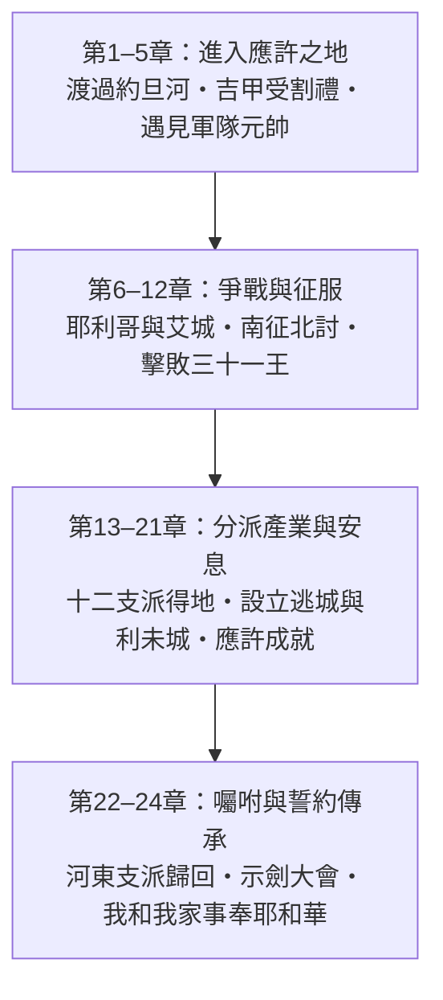
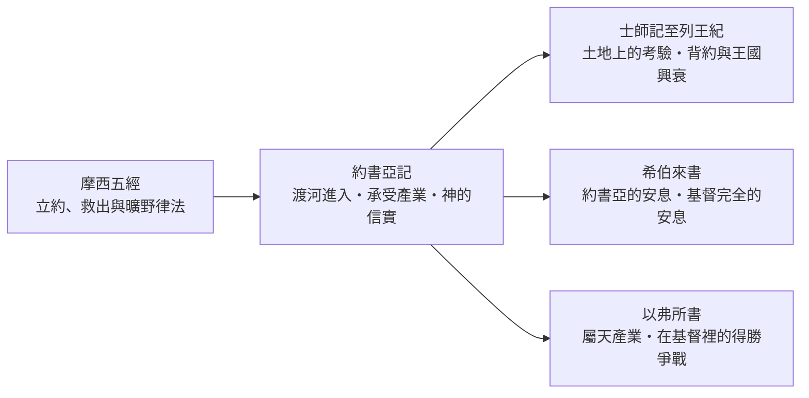

<!-- book-introduction-navigation:start -->
| [[06 約書亞記/全書目錄及綱要|全書目錄及綱要]] | [[06 約書亞記/第1章|開始讀第1章]] |
| :--- | ---: |
<!-- book-introduction-navigation:end -->

---

# 約書亞記

*承受應許美地・爭戰得勝與聖約忠誠*

《約書亞記》緊接摩西五經之後，是舊約歷史書與前先知書的第一卷。摩西在約旦河東離世後，神呼召約書亞帶領以色列新世代起來，走乾地渡過約旦河，進取神向亞伯拉罕、以撒、雅各起誓賜給他們的迦南美地。五經所應許的救贖在此有了具體成就：如果出埃及是「救出」，約書亞記就是「進入」。全書記錄了信靠順服帶來的神蹟得勝、違背聖約所招致的挫敗，以及十二支派分地為業的過程。它最終向每一個讀者發出嚴肅的呼召：面對神的浩大恩典，今日就當定意選擇事奉那獨一真神。

<!-- sources: CT00, GT00, KC0, BH, BIBLEPROJECT -->

---

## 一覽

| 項目 | 資料 |
| --- | --- |
| 位置 | 舊約歷史書／希伯來正典前先知書第一卷；銜接摩西五經與士師時期 |
| 章數 | 24 章（658 節） |
| 希伯來書名 | יְהוֹשֻׁעַ（Yehoshua，「耶和華是救恩／救主」） |
| 希臘／通行書名 | Joshua（源自七十士譯本 Ἰησοῦς，與「耶穌」同名） |
| 傳統作者歸屬 | 約書亞為主要作者；末了去世敘事（24:29–33）傳統視為以利亞撒或非尼哈補寫 |
| 敘事時地 | 晚期青銅時代；約旦河東摩押平原至迦南全境，歷時約二十餘年 |
| 主要形式 | 征服敘事、部族分地邊界清單、逃城法規、臨別講詞與立約更新 |
| 核心宣告 | 耶和華應許賜福的話一句也沒有落空（21:45）；「至於我和我家，我們必定事奉耶和華」（24:15） |

<!-- sources: CT00, GT00, KC0, BH, BIBLEPROJECT, ENTER_THE_BIBLE, YALE -->

---

## 書名與正典位置

本書以主角 **約書亞（יְהוֹשֻׁעַ，Yehoshua）** 命名，希伯來名字由「耶和華」與「拯救」結合，字義為「耶和華是救恩」或「耶和華是救主」。七十士譯本將其譯為希臘文 **Ἰησοῦς（Iēsous）**，即新約「耶穌」的名字。這個名字不僅標明領袖的身分，也指明全書的核心主旨：帶領百姓進地得勝的，不是人有限的才能，而是耶和華親自施行的拯救。

在希伯來聖經正典中，《約書亞記》被列為 **「前先知書」（Former Prophets）** 的第一卷（包含約書亞記、士師記、撒母耳記、列王紀）。這表明猶太傳統並不將它視為單純的客觀軍事編年史，而是帶有先知宣講性質的神學歷史——以摩西律法的聖約標準，回顧與檢視以色列人在這片土地上的成敗。

在七十士譯本與中文聖經傳統中，本書則開啓了十二卷「歷史書」的序列，緊承《申命記》摩西之死，作為出埃及救贖旅程的終點與定居迦南的起點。

> [!note] 「前先知書」的神學眼光
> 將歷史書歸入「先知書」，意味著這些書卷的核心不在於記錄軍事戰術或疆界變更，而在於見證神在歷史中的作為、百姓對聖約的忠誠度，以及違背聖約所招致的歷史命運。

<!-- sources: CT00, GT00, KC0, BH, BIBLEPROJECT, ENTER_THE_BIBLE -->

---

## 作者、成書與背景

猶太教塔木德傳統（《答木德·首要之門》Bava Batra 14b）與早期教會傳統，普遍將本書的主要部分歸於約書亞本人所寫。書中多處出現目擊者視角的敘述，例如「直到我們過去了」（書5:1，部分古卷）與約書亞在示劍將律法與立約話語寫在神律法書上的記載（書24:26）。至於書末記錄約書亞之死、約瑟骸骨埋葬與祭司以利亞撒離世（24:29–33），以及15章若干在後續士師時代才最終完成的地名變遷，傳統觀點通常將其視為祭司以利亞撒或其子非尼哈等後繼者的附筆與修整。

歷史與地理舞台設定在出埃及後的晚期青銅時代。以色列百姓在曠野漂流四十年、舊世代倒斃之後，在摩押平原整隊，面臨從遊牧生活轉入定居農耕的根本轉折。他們所要面對的迦南城邦各自為政，築有堅固城牆，並擁有深厚但高度偶像化與道德腐化的宗教體系。

現代聖經學術研究則提出不同的成書模型。自十九世紀末與二十世紀學者馬丁·諾特（Martin Noth）提出「申命記歷史」（Deuteronomistic History, DH）假說以來，許多研究者將《約書亞記》視為由約書亞至列王紀宏大歷史敘事的一環。該學術模型認為，編者收集了古代戰事歌謠、地方病因學傳說（書中反覆出現的「直到今日」記略）以及部族邊界與利未城邑的官方檔案，並在王國晚期（約西亞王宗教改革時期）及巴比倫被擄時期進行了兩階段主要的編整，用以向失去土地的被擄群體闡明神賜地的信實與守約的必要。

因此，我們應清楚區分不同層次的問題：經文呈現的是「約書亞帶領百姓渡河得地的歷史見證」；而現代學術研究則探討「這些傳統材料如何在漫長世代與被擄危機中被編匯成現有經卷」。兩者回答的關懷不同，並行參照有助於深化我們對經文豐富維度的理解。

| 要分開看的問題 | 本卷導論的處理 |
| --- | --- |
| 故事描寫的時間 | 晚期青銅時代，出埃及與四十年曠野漂流之後約二十餘年 |
| 傳統作者歸屬 | 約書亞為主要作者；末了去世記略與部分地名補記傳統歸於祭司以利亞撒或非尼哈 |
| 現代成書研究 | 常視為「申命記歷史」初篇，匯聚早期戰事、部族名單與傳統，經約西亞期與被擄期編整 |
| 地理舞台 | 約旦河谷、吉甲、中央山地（耶利哥、艾城）、南部低地聯盟與北方加利利湖周邊 |

> [!important] 傳統歸屬與現代研究的分層閱讀
> 傳統觀點著重約書亞作為歷史目擊者的權威見證；現代成書研究則揭示了經文在以色列民族歷史危機（如被擄期）中如何向讀者持續說話。二者並非互相排斥的零和結論，而是探討文本不同維度的互補視角。

<!-- sources: CT00, GT00, KC0, BH, ENTER_THE_BIBLE, YALE -->

---

## 主旨與神學焦點

《約書亞記》最鮮明的主旨是 **「神的信實與應許的實現」**。神曾向亞伯拉罕、以撒、雅各應許賜迦南美地為業（創12:7；出3:8），歷經埃及四百年的為奴與曠野四十年的試煉，這項跨越數百年的古老應許終於在本卷全盤應驗。全書的高峰宣告正在於此：「耶和華應許賜福給以色列家的話，一句也沒有落空，都應驗了。」（書21:45）

然而，得地絕非以色列人的軍事功績，而是 **「聖約的恩典與神的爭戰」**。第五章約書亞在耶利哥城外遇見「耶和華軍隊的元帥」，當約書亞詢問對方「是幫助我們還是幫助敵人」時，元帥的回答竟是震撼的「不是」（書5:14）。這表明神不是任人驅使的軍事盟友，祂自己就是至高統帥；真正的問題從來不是神是否站在以色列這邊，而是以色列人是否站在神那一邊。

全書透過耶利哥與艾城的鮮明對比，刻劃出順服與罪的代價：耶利哥之戰百姓完全不憑兵器，繞城吹角信靠神而城牆倒塌；艾城之戰卻因亞干一人私藏當滅之物，導致全軍在小城前敗退。這說明了聖約群體的命運休戚與共，唯有保持聖潔與完全順服，才能承受應許之地的祝福。

> [!summary] 得地的屬靈原則
> 迦南美地是神主權賞賜的恩典產業，而非以色列人靠己力奪取的戰利品。進入土地是救恩的成就，但在土地上能否長久安居，完全取決於對神的敬畏與忠誠。

<!-- sources: CT00, GT00, KC0, BH, BIBLEPROJECT, ENTER_THE_BIBLE -->

---

## 本書的重要性與特色

《約書亞記》在聖經救贖歷史中具有無可取代的樞紐地位。如果沒有本書，摩西五經所描述的曠野飄流就失去了落腳點，以色列將永遠停留在應許之外的邊界；如果沒有本書，後續士師時代的定居生活、大衛王國的領土輪廓，乃至列王時代的先知評斷，都將失去地理與制度的基石。

全書在敘事張力與神學呈現上，展現了幾項極為突出的特色，既豐富了我們對舊約歷史的認識，也對今日信徒的信仰實踐帶來深遠的啟發。

**「奪了那全地」與「還有許多未得之地」的雙重張力**  
書11:23宣告「約書亞奪了那全地……於是國中太平沒有爭戰了」，然而13:1神卻對年老的約書亞說「還有許多未得之地」。這種宏觀戰略的決定性勝利與微觀各支派具體佔領的並存，生動展現了信仰上「已然但未全然」（already but not yet）的張力。

**突破血緣界限的救贖恩典**  
在滅絕迦南風俗的整體審判中，耶利哥城的外邦妓女喇合因聽見耶和華的大作為而心生敬畏，挺身隱藏探子，最終全家獲救並被編入基督的家譜（太1:5）；基遍人亦藉著求和進入神的會幕服事。與之相對，猶大支派血統純正的亞干卻因貪婪倒斃。恩典與審判的依歸在於信心，而非種族血統。

**古代近東戰爭記敘與滅絕令（herem）的倫理理解**  
經文中將迦南城邑「盡行殺滅」（herem）的命令常使現代讀者感到道德困惑。結合古代背景可知：迦南宗教充滿獻兒女為祭與極度淫亂，此審判具有神聖司法的防護性質；同時古代戰役常使用修辭性誇張（hyperbole，如全滅無存，但後文仍見迦南人存在），其核心焦點在於堅決剷除罪惡偶像的污染，而非現代意義的種族滅絕。

**逃城與利未城邑的恩典制度**  
土地分配並非單純的財富劃分。設立六座逃城展現了對生命與誤殺人者的公義庇護；利未人不分地業、分散居住在四十八座城邑，使神的話語和敬拜如鹽一般滲入以色列全境，確保信仰社群的聖潔。

<!-- sources: CT00, GT00, BH, BIBLEPROJECT, ENTER_THE_BIBLE, YALE -->

---

## 全書結構

全書共二十四章，結構嚴整、脈絡分明，整體敘事沿著「跨河進地 → 戰勝強敵 → 分派地業 → 臨別誓約」四個主要樂章推進。前半部（1–12章）充滿動態的軍事進展與神蹟敘事，後半部（13–21章）詳實記錄各支派的土地邊界，最後以深沉感人的立約交棒（22–24章）作結。

| 範圍 | 段落 | 內容重點 |
| --- | --- | --- |
| 1–5章 | 第一部分：跨河進地與屬靈預備 | 摩西死後約書亞蒙召接任、二探子受喇合拯救、以色列全體踏乾地過約旦河、吉甲立石與行割禮守節、約書亞遇見耶和華軍隊的元帥。 |
| 6–12章 | 第二部分：征戰與征服迦南 | 繞城七日耶利哥倒塌、亞干取物艾城初敗、清查罪孽轉敗為勝、以巴路山宣讀律法、基遍人求和立約、擊潰南方五王聯軍（日月停住）、消滅北方同盟、三十一個王的名單總結。 |
| 13–21章 | 第三部分：分派產業與得享安息 | 劃定各支派地界清單、迦勒專心跟從得希伯崙、猶大與以法蓮等各得其地、示羅會幕設立與其餘支派掣籤、設立六座逃城保障公義、分配利未人城邑、神大獲全勝並賜下安息。 |
| 22–24章 | 第四部分：囑咐、立約更新與傳承 | 河東二支派半返鄉與築壇爭端平息、約書亞臨終前召集領袖嚴肅勸勉、示劍全民聚集回顧救恩史、呼召百姓今日定意選擇、立大石為證更新盟約、約書亞之死與安葬。 |

<!-- sources: CT00, GT00, BH, BIBLEPROJECT, ENTER_THE_BIBLE, YALE -->

---

## 鑰節、鑰字與核心主題

《約書亞記》以一系列鏗鏘有力的詞彙與金句，串聯起整部得地與定居的史詩。反覆出現的動詞如 **「賜給」、「為業」、「剛強壯膽」、「聽從」**，刻畫了以色列在神引導下的行動準則；而全書在示劍立石前那句響徹千古的誓言，更成為古往今來神子民家庭信仰的最高典範。

| 經文 | 在全書中的位置 |
| --- | --- |
| 書1:8–9 | 律法書不可離口，晝夜思想謹守遵行；神吩咐約書亞當剛強壯膽，應許無論往哪裡去必與他同在。 |
| 書5:13–15 | 耶和華軍隊的元帥向約書亞顯現，宣告神聖統帥權；爭戰成敗在於敬拜降服，而非人為力量。 |
| 書11:23 | 約書亞照耶和華吩咐奪了那全地分給各支派為業，國中太平沒有爭戰；征服大業的總結里程碑。 |
| 書21:43–45 | 耶和華照起誓應許的一切話使他們四境平安，應許賜福給以色列家的話一句也沒有落空，都應驗了；全書神學巔峰。 |
| 書24:14–15 | 約書亞在示劍向全體百姓發出抉擇挑戰：「今日就可以選擇所要事奉的……至於我和我家，我們必定事奉耶和華。」 |

**鑰字／重複線索：** 賜給（natan / 恩典的主動賜予）、為業／產業（nachalah / yerushah / 約中的基業）、剛強壯膽（chazaq / amats / 基於神同在的勇氣）、滅絕令（herem / 奉獻分別歸神與徹底毀滅）、安息（nuach / menuchah / 仇敵止息的平安境地）、記念／立石（以實物銘刻神的奇妙拯救）、謹守聽從（shema / shamar / 遵行妥拉的承諾）

- **神守約的絕對信實**：數百年來向亞伯拉罕許下的後裔與地業之約，在人的軟弱與歷史風浪中毫無差錯地全面實現。
- **聖約群體的信心與順服**：爭戰的得勝從不在於人數與裝備，而取決於百姓是否聽從神的話、是否在營中除淨當滅之罪。
- **真正的統帥與神的爭戰**：戰事屬於耶和華；祂在空中降大冰雹、使日月在天上停留，親自為以色列爭戰，擊潰頑抗的勢力。
- **信仰傳承與嚴肅抉擇**：祖先的奇蹟不能代替當下的決志；每個世代與家庭都必須親自站在神面前，立定心志專一事奉祂。

<!-- sources: CT00, GT00, KC0, BH, BIBLEPROJECT, ENTER_THE_BIBLE, YALE -->

---

## 與其他書卷及整本聖經的關係

《約書亞記》在整部正典救贖敘事中起著至關重要的結構性作用。它不僅是摩西五經所期盼之「得地為業」的圓滿結局，也直接引出了後續歷史書卷的宏大舞台。沒有約書亞記，創世記的應許便懸而未決；有了約書亞記，以色列人才正式擁有了踐行律法、建立社群的現實空間。

本書與緊隨其後的《士師記》形成了尖銳而深刻的呼應與對照。約書亞記以得勝、合一、忠心分地與誓約更新結束，百姓「在約書亞在世和約書亞死後的日子都事奉耶和華」；然而到了士師記，當知曉耶和華作為的世代過去，以色列旋即陷入離棄真神、拜巴力、各自任意而行的黑暗循環。這更加反襯出約書亞時代那種集體敬畏與忠誠的無比寶貴。

在新約聖經中，《約書亞記》更被賦予豐富的預表與神學共鳴：耶穌的名字正源自約書亞，摩西（律法）無法將人帶入最終的美地，唯有耶穌基督引領信徒跨過死亡、勝過黑暗權勢，承受屬天的基業；希伯來書第3至4章深入探討本書的「安息」，指出約書亞雖使百姓在迦南享安息，但還有一個更深、更終極的安息日安息為神的子民存留；以弗所書更將基督徒的屬天福氣與屬靈爭戰（穿戴全副軍裝抵抗空中屬靈惡魔），生動呼應了約書亞爭戰得地的屬靈實質。

<!-- sources: CT00, GT00, KC0, BH, BIBLEPROJECT, ENTER_THE_BIBLE, YALE -->

---

> [!info]- 本頁來源與方法
>
> 本頁以 **CT00 的書卷提要節奏作為編排參考**；CT00、GT00、KC0、BH 是四套既有註釋來源，BibleProject、Enter the Bible、Yale 屬補強層，不加入四家共識票數。
>
> - **CT00**｜[CCBibleStudy 約書亞記提要](https://www.ccbiblestudy.org/Old%20Testament/06Josh/06CT00.htm)
> - **GT00**｜[CCBibleStudy 約書亞記導論拾穗](https://www.ccbiblestudy.org/Old%20Testament/06Josh/06GT00.htm)
> - **KC0**｜[KingComments — Joshua Introduction](https://www.kingcomments.com/en/bible-studies/Jos/0)
> - **BH**｜[BibleHub — Joshua Summary and Study Bible](https://biblehub.com/joshua/)
> - **BIBLEPROJECT**｜[BibleProject — Book of Joshua Guide](https://bibleproject.com/guides/book-of-joshua/)
> - **ENTER_THE_BIBLE**｜[Enter the Bible — Joshua](https://enterthebible.org/courses/joshua/)
> - **YALE**｜[Yale Bible Study — Joshua and Judges](https://yalebiblestudy.org/courses/joshua-and-judges/)
>
> GT00 是多家導論與研讀資料的合輯，使用其中個別觀點時必須保留子來源；BibleHub 即使整合多種底層資料，在本專案仍只算一個 BH 來源維度。約書亞帶領進地的敘事傳統、傳統作者歸屬與現代文本形成研究按不同問題層次並列。

---

<!-- book-introduction-navigation:start -->
| [[06 約書亞記/全書目錄及綱要|全書目錄及綱要]] | [[06 約書亞記/第1章|開始讀第1章]] |
| :--- | ---: |
<!-- book-introduction-navigation:end -->
