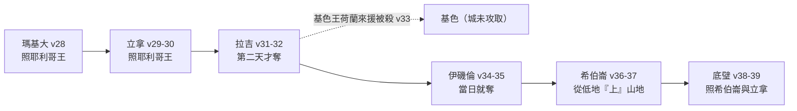

# 約書亞記 第10章

<!-- chapter-navigation:start -->
| [前一章](../06%20約書亞記/第9章.md) |  | [下一章](../06%20約書亞記/第11章.md) |
| :--- | :---: | ---: |
<!-- chapter-navigation:end -->

1. [[耶路撒冷]]王[[亞多尼洗德]]聽見[[約書亞]]奪了[[艾|艾城]]，[[滅絕（herem）|盡行毀滅]]，怎樣待[[耶利哥]]和耶利哥的王，也照樣待艾城和艾城的王，又聽見[[基遍]]的居民與以色列人立了和約，住在他們中間，
2. 就甚懼怕；因為[[基遍]]是一座大城，如都城一般，比[[艾|艾城]]更大，並且城內的人都是勇士。
3. 所以[[耶路撒冷]]王[[亞多尼洗德]]打發人去見[[希伯崙]]王何咸、[[耶末]]王毘蘭、[[拉吉]]王雅非亞，和[[伊磯倫]]王底璧，說：
4. 求你們上來幫助我，我們好攻打[[基遍]]，因為他們與[[約書亞]]和以色列人立了和約。
5. 於是[[亞摩利五王|五個亞摩利王]]，就是[[耶路撒冷]]王、[[希伯崙]]王、[[耶末]]王、[[拉吉]]王、[[伊磯倫]]王，大家聚集，率領他們的眾軍上去，對著[[基遍]]安營，攻打基遍。
6. [[基遍]]人就打發人往[[吉甲]]的營中去見[[約書亞]]，說：你不要袖手不顧你的僕人，求你速速上來拯救我們，幫助我們，因為住山地[[亞摩利人]]的諸王都聚集攻擊我們。
7. 於是[[約書亞]]和他一切兵丁，並大能的勇士，都從[[吉甲]]上去。
8. 耶和華對[[約書亞]]說：不要怕他們；因為我已將他們交在你手裡，他們無一人能在你面前站立得住。
9. [[約書亞]]就終夜從[[吉甲]]上去，猛然臨到他們那裡。
10. 耶和華使他們在以色列人面前[[潰亂（ha.mam）|潰亂]]。[[約書亞]]在[[基遍]]大大的殺敗他們，追趕他們，在[[伯和崙]]的上坡路擊殺他們，直到[[亞西加]]和[[瑪基大]]。
11. 他們在以色列人面前逃跑，正在[[伯和崙]]下坡的時候，耶和華從天上降[[大冰雹原文作大石頭（ba.rad）|大冰雹]]在他們身上（冰雹原文作石頭），直降到[[亞西加]]，打死他們。[[約伯記 38-22-23（神所存留的冰雹）|被冰雹打死的]]，比以色列人用刀殺死的還多。
12. 當耶和華將[[亞摩利人]]交付以色列人的日子，[[約書亞]]就禱告耶和華，在以色列人眼前說：[[日頭停住月亮止住的解釋之爭|日頭啊，你要停在基遍]]；月亮啊，你要止在[[亞雅崙谷]]。
13. 於是[[日頭停住月亮止住的解釋之爭|日頭停留]]，[[祭司站定與河水停住（a.mad）|月亮止住]]，直等國民向敵人報仇。這事豈不是寫在[[雅煞珥書]]上嗎？日頭在天當中停住，不急速下落，約有一日之久。
14. 在這日以前，這日以後，耶和華聽人的禱告，沒有像這日的，是因[[耶和華是戰士|耶和華為以色列爭戰]]。
15. [[約書亞]]和以色列眾人回到[[吉甲]]的營中。
16. [[亞摩利五王|那五王]]逃跑，[[瑪基大洞裡的五王|藏在瑪基大洞裡]]。
17. 有人告訴[[約書亞]]說：[[亞摩利五王|那五王]]已經找到了，都[[瑪基大洞裡的五王|藏在瑪基大洞裡]]。
18. [[約書亞]]說：你們把幾塊[[堆石頭作記號|大石頭]]滾到洞口，派人看守，
19. 你們卻不可耽延，要追趕你們的仇敵，擊殺他們儘後邊的人，不容他們進自己的城邑，因為耶和華─你們的神已經把他們交在你們手裡。
20. [[約書亞]]和以色列人大大殺敗他們，直到將他們滅盡；其中剩下的人都進了堅固的城。
21. 眾百姓就安然回[[瑪基大]]營中，到[[約書亞]]那裡。沒有一人敢向以色列人饒舌。
22. [[約書亞]]說：打開洞口，將[[亞摩利五王|那五王]]從洞裡帶出來，領到我面前。
23. 眾人就這樣行，將[[亞摩利五王|那五王]]，就是[[耶路撒冷]]王、[[希伯崙]]王、[[耶末]]王、[[拉吉]]王、[[伊磯倫]]王，從洞裡帶出來，領到[[約書亞]]面前。
24. 帶出[[亞摩利五王|那五王]]到[[約書亞]]面前的時候，約書亞就召了以色列眾人來，對那些和他同去的軍長說：你們近前來，[[腳踏在王的頸項上|把腳踏在這些王的頸項上]]。他們就近前來，把腳踏在這些王的頸項上。
25. [[約書亞]]對他們說：你們不要懼怕，也不要驚惶。應當[[勉勵他使他膽壯（cha.zaq、a.mats）|剛強壯膽]]，因為耶和華必這樣待你們所要攻打的一切仇敵。
26. 隨後[[約書亞]]將[[亞摩利五王|這五王]]殺死，[[掛在木頭上_懸屍示眾|掛在五棵樹上]]。他們就在樹上直掛到晚上。
27. 日頭要落的時候，[[約書亞]]一吩咐，人就把屍首從樹上取下來，丟在他們藏過的洞裡，把幾塊[[堆石頭作記號|大石頭]]放在洞口，[[直到今日|直存到今日]]。
28. 當日，[[約書亞]]奪了[[瑪基大]]，用刀擊殺城中的人和王；將其中一切人口[[滅絕（herem）|盡行殺滅]]，沒有留下一個。他待瑪基大王，像從前待[[耶利哥王]]一樣。
29. [[約書亞]]和以色列眾人從[[瑪基大]]往[[立拿]]去，攻打立拿。
30. 耶和華將[[立拿]]和立拿的王也交在以色列人手裡。[[約書亞]]攻打這城，用刀擊殺了城中的一切人口，沒有留下一個。他待立拿王，像從前待[[耶利哥王]]一樣。
31. [[約書亞]]和以色列眾人從[[立拿]]往[[拉吉]]去，對著拉吉安營，攻打這城。
32. 耶和華將[[拉吉]]交在以色列人的手裡。第二天[[約書亞]]就奪了拉吉，用刀擊殺了城中的一切人口，是照他向[[立拿]]一切所行的。
33. 那時[[基色]]王荷蘭上來幫助[[拉吉]]，[[約書亞]]就把他和他的民都擊殺了，沒有留下一個。
34. [[約書亞]]和以色列眾人從[[拉吉]]往[[伊磯倫]]去，對著伊磯倫安營，攻打這城。
35. 當日就奪了城，用刀擊殺了城中的人。那日，[[約書亞]]將城中的一切人口[[滅絕（herem）|盡行殺滅]]，是照他向[[拉吉]]一切所行的。
36. [[約書亞]]和以色列眾人從[[伊磯倫]]上[[希伯崙]]去，攻打這城，
37. 就奪了[[希伯崙]]和屬希伯崙的諸城邑，用刀將城中的人與王，並那些城邑中的人口，都擊殺了，沒有留下一個，是照他向[[伊磯倫]]所行的，把城中的一切人口[[滅絕（herem）|盡行殺滅]]。
38. [[約書亞]]和以色列眾人回到[[底璧（城）|底璧]]，攻打這城，
39. 就奪了[[底璧（城）|底璧]]和屬底璧的城邑，又擒獲底璧的王，用刀將這些城中的人口[[滅絕（herem）|盡行殺滅]]，沒有留下一個。他待底璧和底璧王，像從前待[[希伯崙]]和[[立拿]]與立拿王一樣。
40. 這樣，[[約書亞]]擊殺全地的人，就是山地、[[南地]]、[[高原（Shephelah）|高原]]、山坡的人，和那些地的諸王，沒有留下一個。將凡有氣息的[[滅絕（herem）|盡行殺滅]]，正如耶和華─以色列的神所吩咐的。
41. [[約書亞]]從[[加低斯|加低斯巴尼亞]]攻擊到[[迦薩]]，又攻擊[[歌珊（迦南南部）|歌珊]]全地，直到[[基遍]]。
42. [[約書亞]]一時殺敗了這些王，並奪了他們的地，因為耶和華─以色列的神[[耶和華是戰士|為以色列爭戰]]。
43. 於是[[約書亞]]和以色列眾人回到[[吉甲]]的營中。

---

## 本章知識節點

### 人物
- [[約書亞]]
- [[亞多尼洗德]]
- [[亞摩利五王]]
- [[亞摩利人]]
- [[耶利哥王]]

### 地點
- [[基遍]]
- [[吉甲]]
- [[伯和崙]]
- [[亞西加]]
- [[瑪基大]]
- [[亞雅崙谷]]
- [[立拿]]
- [[拉吉]]
- [[基色]]
- [[伊磯倫]]
- [[底璧（城）]]
- [[耶末]]
- [[歌珊（迦南南部）]]

### 事件
- [[瑪基大洞裡的五王]]

### 原文
- [[潰亂（ha.mam）]]
- [[大冰雹原文作大石頭（ba.rad）]]
- [[祭司站定與河水停住（a.mad）]]
- [[勉勵他使他膽壯（cha.zaq、a.mats）]]

### 文化
- [[腳踏在王的頸項上]]

### 歷史
- [[掛在木頭上_懸屍示眾]]

### 神學
- [[耶和華是戰士]]
- [[滅絕（herem）]]

### 主題
- [[堆石頭作記號]]
- [[直到今日]]

### 背景
- [[雅煞珥書]]

### 解經爭議
- [[日頭停住月亮止住的解釋之爭]]

### 互文
- [[約伯記 38-22-23（神所存留的冰雹）]]
- [[啟示錄 16-21（末世大冰雹）]]

---

## 本章整理

### 一座選擇和平的城，換來五王的圍攻（v1-5）

本章開頭的動詞是「聽見」。GT《綜合解讀》指出書九、十、十一章原文都以「聽見」開始，形成一個完整的文學結構。[[亞多尼洗德]]這一次聽見的是三件事連在一起：[[艾|艾城]]被奪、被盡行毀滅，處置的方式和[[耶利哥]]一樣，而[[基遍]]竟然跟以色列人立了和約。前兩件是戰報，第三件才是真正讓他坐不住的——GT《丁道爾聖經注釋》說亞多尼洗德不僅財產受到了威脅、連性命也可能不保，而以色列人對基遍的態度與對耶利哥和艾城截然不同。

丁道爾把他的處境擺成兩條路：抗拒，就是抗拒神所定規以色列人的進展，必然和耶利哥與艾城一樣落入神的審判之下；求和，就能在以色列人當中存活，只不過必須成為奴隸。他選了第一條。

第2節解釋他為什麼怕：基遍是一座大城，如都城一般，比艾城更大，城內的人都是勇士。CT 說「如都城一般」意指好像有王治理的城一般，暗示基遍並沒有王、是由長老治理的。BH 也說基遍雖由長老治理而非以王為首，卻具有王城等級的地位、力量與影響力。GT《綜合解讀》從地圖上看：基遍離耶路撒冷只有13公里，扼守從約旦河谷經中央山地向西到沿海平原的東西大道，不但控制著迦南地的東西要道而且直接威脅到耶路撒冷。

於是有了[[亞摩利五王]]這支聯軍。要留意 CT 提醒的一件事：「五個亞摩利王」可能是山地諸城之統治者的泛稱，因為耶路撒冷居民多為耶布斯人、[[希伯崙]]居民為赫人；GT《聖經精讀本》也說亞多尼洗德屬於耶布斯族，被列在亞摩利五王之內是因與他們毗鄰而居。所以「[[亞摩利人]]」在這裡是一個地理與勢力範圍的說法，不是嚴格的族譜分類。

| 城 | 王 | 名字字義（CT／GT） | 位置線索 | 本章結局 |
| --- | --- | --- | --- | --- |
| [[耶路撒冷]] | 亞多尼洗德 | 我主是公義 | 五城中地勢最高 | 王被殺，城未攻取 |
| [[希伯崙]] | 何咸 | 耶和華所催促的／群眾之主 | 耶路撒冷西南約30公里 | 城被攻取（v36-37） |
| [[耶末]] | 毘蘭 | 像一頭野驢 | 耶路撒冷以西約26公里 | 王被殺，城未攻取 |
| [[拉吉]] | 雅非亞 | 照耀 | 希伯崙以西約23公里 | 城被攻取（v31-32） |
| [[伊磯倫]] | 底璧 | 似小牛 | 拉吉西方約10公里 | 城被攻取（v34-35） |

這張名單本身也是年代線索。GT《丁道爾聖經注釋》說這些王的名字和亞多尼洗德一樣，都可以在約主前一五五○~一一○○年巴勒斯坦一帶的文字記錄和人名中找到，就是約書亞記自稱各樣事蹟所發生的時期。GT《約書亞記研經資料》另外注意到編排：書10:3、5、23 列出的名單順序大致是照字母順序，10:31~37 則是按照攻擊順序記載。

### 徹夜行軍，與那個不是人打贏的早晨（v6-15）

基遍人求援的話說得急：你不要袖手不顧你的僕人，求你速速上來拯救我們。CT 說「袖手不顧」意指放任自生自滅，表示立約雙方不僅互不侵犯、且負有彼此支援保護的責任。BH 說基遍人的訴求靠的是條約的約束力，不是自己的實力或配得。

[[約書亞]]沒有拖。CT 在話中之光說他和首領受基遍人欺騙以後本可以慢慢地前往援救，但是他們仍立刻趕去施援，顯出他的正直。距離不短——GT《約書亞記研經資料》說耶利哥到基遍直線距離大約25公里、走山路大約30公里，而書九17 記載以色列人由[[吉甲]]行軍到了第三天才到基遍。這一次他們一個晚上就到了。

接下來的事，經文用四個動作交代，而主詞在第10節換了人。

第9節是人做的，第10節第一個字就換成神做的。STEP 顯示[[潰亂（ha.mam）|潰亂]]是 va/y.hu.Me/m（H2000，簡要詞典義 ha.mam: to confuse，本節逐字解 he routed them），而且它是第10節的第一個字、主詞是耶和華。GT《約書亞記研經資料》說這個動詞舊約總共出現13次，多數用來記載神使仇敵混亂，古代近東的戰爭記錄中也常用到這個字、描述敵軍陷於驚恐害怕中。GT《綜合解讀》把因果講清楚：雖然以色列人一夜急行軍已經非常疲憊，但由於他們在夜間突然出現，神就使迦南人潰亂，讓疲憊的以色列人仍然能大大地殺敗他們。

戰場的形狀由[[伯和崙]]決定。GT《綜合解讀》說從海拔250米的亞雅崙平原沿著山脊上到海拔770米的基遍被稱為「伯·和侖的上坡路」，這是當時從沿海平原通往中央山地的必經之路。STEP 也把這條路的兩個名字擺在一起：第10節是 ma.'a.Leh（H4608，ma.a.leh: ascent），第11節是 be./mo.Rad（H4174，mo.rad: descent），同一條路，一個上、一個下。

然後是[[大冰雹原文作大石頭（ba.rad）|大冰雹]]。和合本自己在括號裡註明「冰雹原文作石頭」，而 STEP 顯示第11節前半的字面就是從天上扔下大石頭（hish.Likh H7993 加 'a.va.Nim ge.do.Lot H68G＋H1419A 加 min- ha./sha.Ma.yim H8064），後半才換成冰雹的石頭（be./'av.Nei ha./ba.Rad，H68G＋H1259，ba.rad: hail）。GT《丁道爾聖經注釋》指出一個容易跳過的接點：這個字後面還會再出現一次——冰雹也預示了後來用來封住盟軍首領洞口的大石頭，第18節那幾塊大石頭在希伯來文是同一個字。KC 則把它接到別處的經文：耶和華在冰雹裡有祂自己的兵器，並引[[約伯記 38-22-23（神所存留的冰雹）|伯38:22-23]]與出9:24-25，再指向[[啟示錄 16-21（末世大冰雹）|啟16:21]]末世從天而降的大雹。

> [!important] 第11節下半句是本章的判詞
> 「被冰雹打死的，比以色列人用刀殺死的還多。」CT 說這意指戰爭的勝利歸於神，並在話中之光說表明決定爭戰勝敗的是神而不是人。這一句與第14、42節的「[[耶和華是戰士|耶和華為以色列爭戰]]」互相呼應，把整章的歸屬講定。

接著是[[日頭停住月亮止住的解釋之爭|日頭停住、月亮止住]]。這是全章最受爭論的三節，而爭論的一部分其實來自原文：STEP 顯示第12節約書亞說的「停」是命令式 Dom（H1826A，da.mam: to silence: stationary），第13節「日頭停留」是同一個字，但「月亮止住」是 'a.Mad（H5975G，a.mad: to stand: stand）。GT《約書亞記研經資料》說得直接：「停在」、「止在」、「停留」原文都是同一個字，「止住」原文只有「站立」、「停留」的意思——也就是上面 STEP 給的 H1826A 與 H5975G 這兩個編號。後面那個字在本章一共出現四次——第8節神應許「無一人能在你面前站立得住」、第13節兩次、第19節約書亞吩咐「不可耽延」；GT《丁道爾聖經注釋》因此說天上的星體、地上的軍隊，都聽從了約書亞的命令。這也正是[[祭司站定與河水停住（a.mad）|書三16-17 河水停住與祭司站定]]所用的同一個動詞。

| 解釋方向 | 提出者 | 要點 |
| --- | --- | --- |
| 只是詩句、當作比喻 | CT 所列第一說 | 這段是引用[[雅煞珥書]]的詩，不必當成天文事件 |
| 地球自轉暫停或減慢 | CT 第二說；GT《研經資料》判為較可能；GT《雷氏研讀本》第一類 | 白晝實際延長，多出約一日 |
| 光線屈折或雲層遮蔽 | CT 第三、四、五說；GT《雷氏研讀本》第二類 | 一天的長度不變，只是可用的光照時間變長或酷熱被擋住 |
| 求的是「長夜」不是「長日」 | GT 所收艾基斯引白曉 | 把 dom 讀成祈求太陽不要散發熱力；但艾基斯自己說參看第13節就知道這類解釋無多大真確性 |
| 天文曆少算一天 | CT 第六說；GT 所收艾基斯引嚴夏利、白加榮、托頓 | 從曆法回推支持「長日」 |

CT 的結論很坦白：各種解釋都不能令人滿意，只能說這是出於神的神蹟奇事。GT《聖經精讀本》也說我們無法知曉在上述見解中正確的是哪一個。KC 換一個角度：這不是科學語言，而是日常說法；它並指出巴力是太陽神、亞斯她錄是月神，敵人以為日月站在他們那邊，如今日月被定在原處。BH 說被周圍民族當作神明敬奉的天體，在此顯明是耶和華的僕役。至於第14節那句「耶和華聽人的禱告，沒有像這日的」，四家沒有分歧。

### 洞口的石頭：五王的監牢與墳墓（v16-27）

[[瑪基大洞裡的五王]]是一段自成首尾的插敘。GT《丁道爾聖經注釋》說「藏在瑪基大洞裡」這句話出現了兩次，而動詞「藏」在本段落的最後一節中再度出現，將整個故事框住；GT《約書亞記研經資料》補上另一層框架——[[瑪基大]]是第10節三個主要戰場之一，[[亞西加]]和伯和崙已經在11至15節出現過，第16節輪到瑪基大，故事就此收口。

約書亞的處置順序值得看。他先叫人把幾塊大石頭滾到洞口、派人看守，然後立刻把注意力轉回戰場：不可耽延，要追趕仇敵，不容他們進自己的城邑。GT《約書亞記研經資料》說當時有些傳統故事的內容是把大石頭滾到仇敵躲藏的洞口、目的是要把仇敵餓死，而此處約書亞吩咐封石後派人看守的原因，是要其餘的人繼續去追擊敵人以殲滅之，而不要受找到敵國君王事件的影響。BH 說得一樣：約書亞沒有讓擒獲君王這件事分散全軍完成更大戰役的注意力。

KC 把這一段讀成光與暗：因為太陽持續照耀，諸王逃離光、尋找洞穴的黑暗來躲藏；他們自己找來的安全，先成了他們的監牢，然後成了他們的墳墓。GT《聖經精讀本》從地質面說同一件事：巴勒斯坦的地表多由石灰岩形成、自然會有很多洞穴，這些洞穴常用來作墳墓、避難所、谷倉或飼養家畜的房子，而五王作為避難所躲藏的洞穴竟成了他們的墳墓。

審判的場面分成三個動作。第一個是[[腳踏在王的頸項上]]：約書亞召了以色列眾人來，叫和他同去的軍長近前來把腳踏在五王頸項上。STEP 顯示「軍長」在原文是三個字，ke.tzi.Nei（H7101 qa.tsin: chief）'an.Shei（H582）ha./mil.cha.Mah（H4421 mil.cha.mah: battle）；GT《約書亞記研經資料》說這是「戰爭指揮官」，也是聖經中第一次提到以色列人中有「戰場指揮官」這個職務。GT《啟導本》說考古學在埃及、亞述發現很多古代浮雕，證明古時確有此風俗。KC 提醒這個動作的兩面：諸王必須被羞辱，而這看起來可能像是過度自信；但在這裡，它是對百姓的鼓勵。

第二個動作是第25節的勉勵。約書亞把神在第8節對他說的話原封不動轉給部下：不要懼怕，也不要驚惶，[[勉勵他使他膽壯（cha.zaq、a.mats）|應當剛強壯膽]]。STEP 顯示這裡是兩個並列的命令式 chiz.Ku（H2388G cha.zaq）與 ve./'im.Tzu（H553 a.mats），與書一9 神對約書亞說的是同一組用語。GT《綜合解讀》說一個屬靈的領袖，應該借一切機會把從神而來的信心傳遞出去。

第三個動作是[[掛在木頭上_懸屍示眾|掛在五棵樹上]]。GT《約書亞記研經資料》強調五王是首先被殺、然後才掛在樹上，可見這與處死無關而是對待屍首的方法；GT《華爾頓約書亞記背景注釋》說曝屍代表最後一次的侮辱和褻瀆，因為古代大部分民族都認為埋葬得體及時能夠影響死者來生的幸福。但約書亞在日落前就把屍首取下來——CT 說這是以色列人的慣例，不將屍首掛在樹上過夜（申21:23）。GT《綜合解讀》說即使是在歡慶得勝的時候，約書亞也沒有忘記順服神的命令。最後屍首被丟回他們藏過的洞裡，洞口再一次[[堆石頭作記號|放上幾塊大石頭]]，[[直到今日|直存到今日]]。BH 說那些石頭立起了一個可見的紀念，宣告人的力量無法推翻神的旨意。

### 一城照一城的南征清單（v28-39）

第28節起，敘事換成一種近乎清單的節奏：到某城、攻打、耶和華交在手裡、盡行殺滅、沒有留下一個、待某王像從前待某王一樣。KC 注意到反覆出現的一個片語——「約書亞和以色列眾人」，在第29、31、34、36、38、43節都出現。

這條路線有幾個值得停下來的點。[[立拿]]自己只佔兩節，卻成了後面兩座城的參照——第32節說攻[[拉吉]]是照他向立拿一切所行的，第39節說待[[底璧（城）|底璧]]像從前待希伯崙和立拿與立拿王一樣。拉吉是唯一花了兩天的城，GT《綜合解讀》說拉吉是迦南地南方的主要堡壘、最為堅固，所以第二天才攻取，其他各城大都是當日攻取的；CT 的解釋不同，說拉吉的軍隊早已傷亡殆盡故輕易地被以色列人攻佔。[[基色]]則是全章唯一一個王被殺、城卻沒有被攻下的例子——GT《綜合解讀》說基色扼守亞雅崙谷西面的入口、並不在約書亞進軍的路線上，基色王前來幫助拉吉所以約書亞消滅了他們，但並沒有立刻前去攻佔他的城市；BH 說基色有一段時間仍是迦南人的地。

「盡行殺滅」在本章反覆出現。GT《約書亞記研經資料》數過：這個字在第10章總共出現六次（10:1、28、35、37、39、40）。GT《綜合解讀》說這一次又一次的重複，表明約書亞和百姓不折不扣地遵行了神的命令。但這裡也有一個必須並陳的分歧：GT《華爾頓約書亞記背景注釋》說在征服的敘述中用誇張的字眼形容毀滅的徹底是很平常的事，並舉書15:13~16 提到希伯崙和底璧仍有居民為證，說本節具有誇飾成分，法老梅雷他的碑文宣稱以色列的後裔沒有一人存留、米沙碑文形容以色列徹底永遠滅亡，用的也是這種渲染手法，而這並不表示記述有失准、欺騙、誤導的意思。BH 這一邊則把重量放在性質上：這是神命定的判決，是嚴肅的神聖審判、不是後世列國或戰爭的樣板。GT《約書亞記研經資料》另提供一個時間尺度——神容忍約但河西的亞摩利人已達四百多年之久（創15:16），目的是要他們悔改。這幾家講的是不同層面的事：[[滅絕（herem）|盡行殺滅]]是什麼性質的行動，和這句話在古代戰報裡是怎樣的一種說法，可以同時成立。

### 四個地名圍出來的南方（v40-43）

第40至42節是總結。第40節列出四種地形：山地、[[南地]]、[[高原（Shephelah）|高原]]、山坡。GT《綜合解讀》說「高原」原文是「低地」，特指猶大山地和沿海平原之間的丘陵地帶示非拉，是後來以色列人與非利士人長期爭戰的地方；GT《串珠聖經注釋》也說「高原」應作「低地」，即山地與沿海之間的山麓。CT 這裡給的方位不同，說「高原」或翻作「低原」、「丘陵」，指耶路撒冷以北的迦南地中部丘陵地帶。

第41節則用四個地名把戰役範圍圍成一圈：從[[加低斯|加低斯巴尼亞]]到[[迦薩]]，又攻擊[[歌珊（迦南南部）|歌珊]]全地，直到基遍。CT 說前兩個代表此次戰役的西界，歌珊代表東界最南面、基遍代表東界最北面；GT《華爾頓約書亞記背景注釋》說加低斯巴尼亞與迦薩這兩個地點形成應許之地西南方的疆界，而歌珊與基遍合起來代表征服之地的東界。

> [!note] 這個「歌珊」不是埃及的歌珊
> 四套註釋在這一點上完全一致。CT 說它是死海東面、山地南面的一塊地區；GT《丁道爾聖經注釋》說它不是以色列人離開埃及之前所住的那片地，而是書十一16 的歌珊；GT《華爾頓約書亞記背景注釋》說它是猶大山地的一個區域；BH 說它是南迦南境內的一個地區，與雅各家住過的埃及之地不同。

全章結束在它開始的地方。第15節和第43節都寫「約書亞和以色列眾人回到吉甲的營中」。GT《綜合解讀》說9至15節是概述南方戰役、16至43節是詳述南方戰役，兩者都是以回到吉甲為結束。GT《丁道爾聖經注釋》說以色列人是從吉甲出發的，現在他們返回聖所所在之地。KC 則從吉甲的內容說：軍隊總是留在吉甲，在那裡他們總是被提醒割禮這件事，而這是為下一場爭戰得力所必需的。

**參考資料**
https://www.ccbiblestudy.org/Old%20Testament/06Josh/06CT10.htm
https://www.ccbiblestudy.org/Old%20Testament/06Josh/06GT10.htm
https://www.kingcomments.com/en/bible-studies/Jos/10
https://biblehub.com/study/joshua/10.htm
https://github.com/STEPBible/STEPBible-Data

<!-- appendix-links:start -->
## 附錄

### 相關地圖
- [[appendix/fhl_maps/maps/028|〈書圖一〉過約但河及征服南方諸王]]
<!-- appendix-links:end -->

<!-- chapter-navigation:start -->
| [前一章](../06%20約書亞記/第9章.md) |  | [下一章](../06%20約書亞記/第11章.md) |
| :--- | :---: | ---: |
<!-- chapter-navigation:end -->
