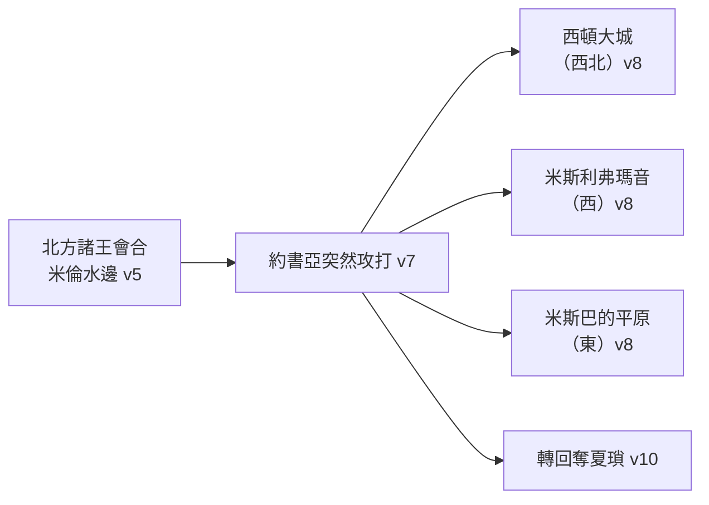

# 約書亞記 第11章

<!-- chapter-navigation:start -->
| [前一章](../06%20約書亞記/第10章.md) |  | [下一章](../06%20約書亞記/第12章.md) |
| :--- | :---: | ---: |
<!-- chapter-navigation:end -->

1. [[夏瑣]]王[[耶賓]]聽見這事，就打發人去見[[瑪頓]]王約巴、[[伸崙]]王、[[押煞]]王，
2. 與北方山地、[[基尼烈湖|基尼烈]]南邊的[[亞拉巴]][[高原（Shephelah）|高原]]，並西邊[[多珥|多珥山岡]]的諸王；
3. 又去見東方和西方的[[迦南人]]，與山地的[[亞摩利人]]、[[赫人]]、[[比利洗人]]、[[耶布斯人]]，並[[黑門山]]根[[米斯巴|米斯巴地]]的[[希未人]]。
4. 這些王和他們的眾軍都出來，人數多如海邊的沙，並有許多[[馬匹車輛]]。
5. 這諸王會合，來到[[米倫水]]邊，一同安營，要與以色列人爭戰。
6. 耶和華對[[約書亞]]說：你不要因他們懼怕。明日這時，我必將他們交付以色列人全然殺了。你要[[砍斷馬的蹄筋與焚燒車輛|砍斷他們馬的蹄筋]]，[[砍斷馬的蹄筋與焚燒車輛|用火焚燒他們的車輛]]。
7. 於是[[約書亞]]率領一切兵丁，在[[米倫水]]邊突然向前攻打他們。
8. 耶和華將他們交在以色列人手裡，以色列人就擊殺他們，追趕他們到[[西頓|西頓大城]]，到[[米斯利弗瑪音]]，直到東邊[[米斯巴|米斯巴的平原]]，將他們擊殺，沒有留下一個。
9. [[約書亞]]就照耶和華所吩咐他的去行，[[砍斷馬的蹄筋與焚燒車輛|砍斷他們馬的蹄筋]]，[[砍斷馬的蹄筋與焚燒車輛|用火焚燒他們的車輛]]。
10. 當時，[[約書亞]]轉回奪了[[夏瑣]]，用刀擊殺夏瑣王。（素來夏瑣在這諸國中是為首的。）
11. 以色列人用刀擊殺城中的人口，將他們[[滅絕（herem）|盡行殺滅]]；凡有氣息的沒有留下一個。[[約書亞]]又用火焚燒[[夏瑣]]。
12. [[約書亞]]奪了這些王的一切城邑，擒獲其中的諸王，用刀擊殺他們，將他們[[滅絕（herem）|盡行殺滅]]，正如耶和華僕人[[摩西]]所吩咐的。
13. 至於[[荒堆（tel）|造在山岡上的城]]，除了[[夏瑣]]以外，以色列人都沒有焚燒。[[約書亞]]只將夏瑣焚燒了。
14. 那些城邑所有的財物和牲畜，以色列人都取為自己的[[艾城准取掠物的轉變|掠物]]；惟有一切人口都用刀擊殺，直到殺盡；凡有氣息的沒有留下一個。
15. 耶和華怎樣吩咐他僕人[[摩西]]，摩西就照樣吩咐[[約書亞]]，約書亞也照樣行。凡耶和華所吩咐摩西的，約書亞沒有一件懈怠不行的。
16. [[約書亞]]奪了那全地，就是山地、[[南地|一帶南地]]、[[歌珊（迦南南部）|歌珊]]全地、[[高原（Shephelah）|高原]]、[[亞拉巴]]、以色列的山地，和山下的高原。
17. 從上西珥的[[哈拉山]]，直到[[黑門山]]下[[利巴嫩]]平原的[[巴力迦得]]，並且擒獲那些地的諸王，將他們殺死。
18. [[約書亞]]和這諸王爭戰了許多年日。
19. 除了[[基遍]]的[[希未人]]之外，沒有一城與以色列人講和的，都是以色列人爭戰奪來的。
20. 因為耶和華的意思是要使他們[[勉勵他使他膽壯（cha.zaq、a.mats）|心裡剛硬]]，來與以色列人爭戰，好叫他們盡被殺滅，不蒙憐憫，正如耶和華所吩咐[[摩西]]的。
21. 當時[[約書亞]]來到，將住山地、[[希伯崙]]、[[底璧（城）|底璧]]、[[亞拿伯]]、猶大山地、以色列山地所有的[[亞衲族與偉人拿非林|亞衲族人]][[剪除]]了。約書亞將他們和他們的城邑盡都毀滅。
22. 在以色列人的地沒有留下一個[[亞衲族與偉人拿非林|亞衲族人]]，只在[[迦薩]]、[[迦特]]，和[[亞實突]]有留下的。
23. 這樣，[[約書亞]]照著耶和華所吩咐[[摩西]]的一切話奪了那全地，就按著以色列支派的[[家室與宗族|宗族]]將地分給他們[[產業（na.cha.lah）|為業]]。於是[[國中太平（sha.qat）|國中太平]]，沒有爭戰了。

---

## 本章知識節點

### 人物
- [[約書亞]]
- [[耶賓]]
- [[摩西]]
- [[亞摩利人]]
- [[赫人]]
- [[比利洗人]]
- [[耶布斯人]]
- [[迦南人]]

### 地點
- [[夏瑣]]
- [[米倫水]]
- [[瑪頓]]
- [[伸崙]]
- [[押煞]]
- [[多珥]]
- [[西頓]]
- [[米斯利弗瑪音]]
- [[巴力迦得]]
- [[哈拉山]]
- [[亞拿伯]]
- [[迦特]]
- [[亞實突]]
- [[基尼烈湖]]
- [[亞拉巴]]
- [[黑門山]]
- [[利巴嫩]]
- [[基遍]]

### 歷史
- [[希未人]]

### 背景
- [[亞衲族與偉人拿非林]]

### 主題
- [[砍斷馬的蹄筋與焚燒車輛]]
- [[艾城准取掠物的轉變]]
- [[家室與宗族]]

### 文化
- [[馬匹車輛]]

### 原文
- [[國中太平（sha.qat）]]
- [[荒堆（tel）]]
- [[剪除]]
- [[米斯巴]]
- [[產業（na.cha.lah）]]
- [[勉勵他使他膽壯（cha.zaq、a.mats）]]

### 神學
- [[滅絕（herem）]]
- [[法老心剛硬]]

---

## 本章整理

### 一封信把整個北方拉進戰場（v1-5）

第1節又是「聽見」。CT 指出九至十一章原文都以「聽見」開始，形成一個完整的文學結構，描述了以色列人橫掃整個迦南地的爭戰——書9 是基遍人聽見、書10 是耶路撒冷王聽見、本章是[[夏瑣]]王[[耶賓]]聽見。GT《綜合解讀》記下同一個觀察。三次「聽見」，三種反應：求和、南方結盟、北方結盟。

這一次的規模不同。南方是五個王，北方則是一張從內陸畫到海岸的名單。

| 節次 | 加入的人 | 方位線索 |
| --- | --- | --- |
| v1 | [[夏瑣]]王耶賓、[[瑪頓]]王約巴、[[伸崙]]王、[[押煞]]王 | 由胡拉湖一帶往西南到近地中海岸 |
| v2 | 北方山地、[[基尼烈湖]]南邊的[[亞拉巴]]、[[多珥]]山岡的諸王 | 山地、河谷、低地、海岸各一 |
| v3 | 東西兩邊的[[迦南人]]，山地的[[亞摩利人]]、[[赫人]]、[[比利洗人]]、[[耶布斯人]]，[[黑門山]]根、[[米斯巴]]地的[[希未人]] | 迦南七族中列了六族 |

CT 點出第3節這張族群名單的兩件事：迦南七族中這裡共列了六族、僅缺革迦撒人；而相較於南方的戰事對手僅限亞摩利五王，北方的戰事則涉及各族聯軍、人數也遠遠超過南方。GT《丁道爾聖經注釋》說得更簡潔：南方的聯盟被稱為是亞摩利人，但北方則不同，是由不同的種族組成。

真正讓這一戰看起來無望的是裝備。第4節說他們「人數多如海邊的沙，並有許多[[馬匹車輛]]」。GT《研經資料》給了形制：此時的迦南戰車是由兩匹馬拖拉的，幾乎沒有裝甲，輪子有四輻；埃及、亞述的戰車每車有兩個馬兵，赫人的戰車每車有三個馬兵。CT 說當時的以色列人尚無馬匹和戰車。BH 指出一層對照：這支「多如海邊的沙」的大軍，用的正是神應許亞伯拉罕後裔的那句話。

### 一夜之間翻盤，然後把戰利品毀掉（v6-9）

神的話只有一句：不要因他們懼怕。GT《綜合解讀》把這條線接起來——雖然神早已賜下得勝的應許（一6）、也早已宣告「你當剛強壯膽！不要懼怕，也不要驚惶」（一9），但在每次爭戰之前，神都要重新勉勵約書亞「不要因他們懼怕」（六節；八1；十8）。這與書10:25 [[勉勵他使他膽壯（cha.zaq、a.mats）|剛強壯膽]]那組動詞是同一條線索。

[[約書亞]]的打法也和前一章一樣。CT 指出第7節的『突然向前攻打』與書10:9 的「猛然臨到」同字，形容出其不意、致令敵軍陷入措手不及的狀態。GT《綜合解讀》說無論是艾城之戰、基遍之戰還是[[米倫水]]之戰，約書亞都是「突然」進攻，一面是完全倚靠神、一面是竭盡全力。

追擊分成幾個方向。CT 說[[西頓|西頓大城]]是迦南地的西北界、[[米斯利弗瑪音]]是西界、[[米斯巴|米斯巴的平原]]是東北界。GT《綜合解讀》給的是相對位置：米斯利弗·瑪音在米倫水的西面，米斯巴的平原在米倫水的東面，以色列人向東西兩面追趕敵軍。GT《丁道爾聖經注釋》甚至把整條路線重建成一圈順時針的行軍。

然後是本章最反直覺的一道命令：[[砍斷馬的蹄筋與焚燒車輛|砍斷他們馬的蹄筋，用火焚燒他們的車輛]]。四家的解釋一致指向同一個方向。CT 說有人認為這樣作的結果是叫以色列人不靠車馬而單純倚靠神；GT《雷氏研讀本》說這樣以色列人便不會把信心放在馬匹和戰車上；KC 說神不要祂的百姓用世界的手段去得勝，免得世界可以宣稱得勝的榮耀。GT《綜合解讀》算出這道命令的長度：因為約書亞忠實執行，以色列人一直到大衛王的時候都沒有使用「馬匹車輛」。

### 只燒一座城（v10-15）

第13節特別交代：造在山岡上的城，除了夏瑣以外都沒有焚燒。STEP 顯示「造在山岡上」是 ha./'o.me.dOt 'al- ti.La/m（H5975G 加 H8510，[[荒堆（tel）|tel: mound]]），字面就是站立在它們的土堆上。GT《綜合解讀》說其他城市沒有被燒，是因為神要把這些城市作為白白的恩典賜給百姓，並引申6:10-12；[[艾城准取掠物的轉變|財物和牲畜]]也照樣歸以色列人（第14節）。

夏瑣是例外。GT《約書亞記研經資料》把三座被燒的城列成一張對照：

| | 耶利哥 | 艾城 | 夏瑣 |
| --- | --- | --- | --- |
| 攻城背景 | 進迦南的第一道防線 | 前次戰役大勝、心高氣傲 | 北方諸王之首、有馬匹戰車 |
| 特殊事蹟 | 繞城七天 | 亞干犯罪、第一次攻城失敗 | 米倫水邊發動奇襲 |
| [[滅絕（herem）]] | 有（六17） | 有（八26） | 有（十一12） |
| 戰利品 | 金屬器皿歸耶和華、不留牲畜（六19、21、24） | 財物、牲畜可歸己用（八2） | 財物、牲畜可歸己用（十一14） |
| 焚城 | 有（六24） | 有（八19、28） | 有（十一11、13） |

CT 為這三座城各給一句理由：耶利哥是獻給神的初熟果子；艾城是用徹底的得勝來恢復失敗的百姓；而夏瑣是「在這諸國中是為首的」，是迦南惡俗的象徵，必須被徹底清除。KC 從另一頭說：因為這是一座強大的城，人的理性也許會推論它適合作以色列的京城，但神不容世上權勢與影響力的所在成為祂百姓的所在。

第15節把整段收在一句話上：凡耶和華所吩咐[[摩西]]的，約書亞沒有一件懈怠不行的。GT《綜合解讀》說這正是他每一次得勝的秘訣。

### 許多年日，與四十年前那個名字（v16-23）

第18節說「約書亞和這諸王爭戰了許多年日」。CT 算出約七年：迦勒窺探迦南地時正四十歲（十四7），約書亞分配產業時迦勒是八十五歲（十四10），扣除窺探後又在曠野飄流的三十八年，所餘的七年就是爭戰的年日。KC 給的是六到七年，BH 說大約七年。

> [!important] 快與慢在同一章裡
> GT《綜合解讀》把兩種節奏並排：是神安排「日頭停留，月亮止住」（十13）、「從天上降大冰雹」（十11），用閃電戰消滅五王聯軍；也是神吩咐百姓「不可把他們速速滅盡，恐怕野地的獸多起來害你」（申七22），所以才「和這諸王爭戰了許多年日」。

第20節解釋為什麼沒有第二個基遍：耶和華的意思是要使他們[[法老心剛硬|心裡剛硬]]。STEP 顯示這裡的動詞是 le./cha.Zek（H2388G cha.zaq）——與神堅固約書亞的心用的是同一個字，只是受詞換成了迦南諸王。GT《綜合解讀》說他們就像法老一樣自己心裡剛硬，所以神就任憑他們繼續心裡剛硬；KC 說得更明白：God hardens a heart only if someone has hardened his heart first（神只在人先剛硬了自己的心之後才使他剛硬）。而[[基遍]]仍然是唯一的例外——第19節說除了基遍的[[希未人]]之外，沒有一城與以色列人講和的。

第21至22節回到四十年前。約書亞[[剪除]]了住[[希伯崙]]、[[底璧（城）|底璧]]、[[亞拿伯]]與猶大、以色列山地的[[亞衲族與偉人拿非林|亞衲族人]]。GT《綜合解讀》說他們在四十多年前曾叫老一代的以色列人恐懼退縮（民十三），唯有約書亞和迦勒沒有懼怕；KC 說 Without God we are nothing and we lose to dwarves. With God we can do everything and giants are nothing（沒有神我們什麼都不是，連侏儒都贏不了；有神我們什麼都能做，巨人也不算什麼）。但第22節立刻補一句：只在[[迦薩]]、[[迦特]]和[[亞實突]]有留下的。KC 說他們的後裔之一將是歌利亞。

全章結束在第23節：約書亞按著[[家室與宗族|以色列支派的宗族]]將地分給他們[[產業（na.cha.lah）|為業]]，於是[[國中太平（sha.qat）|國中太平]]，沒有爭戰了。KC 指出這句「地得安息」在全卷出現三次——此處與約書亞、書14:15 與迦勒、書21:44 與利未人的產業。GT《研經資料》提醒這個太平只是暫時的，同一個字在士師記中每一段短暫的太平也反覆使用。

**參考資料**
https://www.ccbiblestudy.org/Old%20Testament/06Josh/06CT11.htm
https://www.ccbiblestudy.org/Old%20Testament/06Josh/06GT11.htm
https://www.kingcomments.com/en/bible-studies/Jos/11
https://biblehub.com/study/joshua/11.htm
https://github.com/STEPBible/STEPBible-Data

<!-- appendix-links:start -->
## 附錄

### 相關地圖
- [[appendix/fhl_maps/maps/029|〈書圖二〉征服北方諸王]]
- [[appendix/fhl_maps/maps/030|〈書圖三〉已得和未得之地]]
<!-- appendix-links:end -->

<!-- chapter-navigation:start -->
| [前一章](../06%20約書亞記/第10章.md) |  | [下一章](../06%20約書亞記/第12章.md) |
| :--- | :---: | ---: |
<!-- chapter-navigation:end -->
