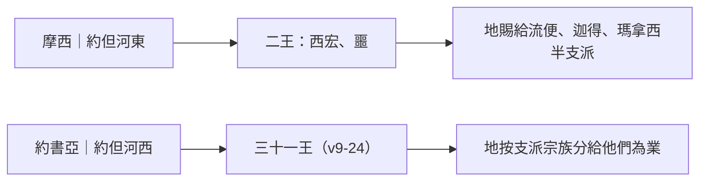

# 約書亞記 第12章

<!-- chapter-navigation:start -->
| [前一章](../06%20約書亞記/第11章.md) |  | [下一章](../06%20約書亞記/第13章.md) |
| :--- | :---: | ---: |
<!-- chapter-navigation:end -->

1. 以色列人在[[約但河]]外向日出之地擊殺二王，得他們的地，就是從[[亞嫩河|亞嫩谷]]直到[[黑門山]]，並東邊的全[[亞拉巴]]之地。
2. 這二王，有住[[希實本]]、[[亞摩利人]]的王[[西宏]]。他所管之地是從[[亞嫩河|亞嫩谷]]邊的[[亞羅珥]]和谷中的城，並[[基列]]一半，直到[[亞捫人]]的境界，[[雅博河]]
3. 與[[約但河]]東邊的[[亞拉巴]]，直到[[基尼烈湖|基尼烈海]]，又到亞拉巴的海，就是[[鹽海]]，通[[伯耶西末]]的路，以及南方，直到[[瑣腓田與毘斯迦山頂|毘斯迦]]的山根。
4. 又有[[巴珊王噩]]。他是[[利乏音人]]所剩下的，住在[[亞斯她錄]]和[[以得來]]。
5. 他所管之地是[[黑門山]]、[[撒迦]]、[[巴珊]]全地，直到[[基述人和瑪迦人]]的境界，並[[基列]]一半，直到[[希實本]]王[[西宏]]的境界。
6. 這二王是耶和華僕人[[摩西]]和以色列人所擊殺的；耶和華僕人摩西將他們的地[[賜給（na.tan）|賜給]][[兩支派半求河東之地為業|流便人、迦得人，和瑪拿西半支派的人]][[為業（ye.ru.shah）|為業]]。
7. [[約書亞]]和以色列人在[[約但河]]西擊殺了諸王。他們的地是從[[利巴嫩]]平原的[[巴力迦得]]，直到上西珥的[[哈拉山]]。約書亞就將那地按著以色列支派的[[家室與宗族|宗族]]分給他們[[為業（ye.ru.shah）|為業]]，
8. 就是[[赫人]]、[[亞摩利人]]，[[迦南人]]、[[比利洗人]]、[[希未人]]、[[耶布斯人]]的山地、[[高原（Shephelah）|高原]][[亞拉巴]]、[[山坡（a.she.dah）|山坡]]、[[曠野]]，和[[南地]]。
9. 他們的王：一個是[[耶利哥王]]，一個是靠近[[伯特利]]的[[艾城王]]，
10. 一個是[[耶路撒冷]]王，一個是[[希伯崙]]王，
11. 一個是[[耶末]]王，一個是[[拉吉]]王，
12. 一個是[[伊磯倫]]王，一個是[[基色]]王，
13. 一個是[[底璧（城）|底璧]]王，一個是[[基德]]王，
14. 一個是[[迦南大敗直到何珥瑪|何珥瑪]]王，一個是[[戰勝亞拉得王|亞拉得]]王，
15. 一個是[[立拿]]王，一個是[[亞杜蘭]]王，
16. 一個是[[瑪基大]]王，一個是[[伯特利]]王，
17. 一個是[[他普亞]]王，一個是[[希弗]]王，
18. 一個是[[亞弗]]王，一個是[[拉沙崙]]王，
19. 一個是[[瑪頓]]王，一個是[[夏瑣]]王，
20. 一個是[[伸崙|伸崙米崙]]王，一個是[[押煞]]王，
21. 一個是[[他納]]王，一個是[[米吉多]]王，
22. 一個是[[基低斯]]王，一個是靠近[[迦密]]的[[約念]]王，
23. 一個是[[多珥]]山岡的多珥王，一個是[[吉甲的戈印]]王，
24. 一個是[[得撒]]王；共計[[三十一個王的名單|三十一個王]]。

---

## 本章知識節點

### 人物
- [[約書亞]]
- [[摩西]]
- [[西宏]]
- [[巴珊王噩]]
- [[亞摩利人]]
- [[赫人]]
- [[比利洗人]]
- [[耶布斯人]]
- [[迦南人]]
- [[亞捫人]]
- [[利乏音人]]
- [[基述人和瑪迦人]]
- [[耶利哥王]]
- [[艾城王]]

### 地點
- [[希實本]]
- [[亞羅珥]]
- [[亞嫩河]]
- [[雅博河]]
- [[基列]]
- [[亞拉巴]]
- [[基尼烈湖]]
- [[鹽海]]
- [[伯耶西末]]
- [[瑣腓田與毘斯迦山頂]]
- [[巴珊]]
- [[亞斯她錄]]
- [[以得來]]
- [[撒迦]]
- [[黑門山]]
- [[約但河]]
- [[利巴嫩]]
- [[巴力迦得]]
- [[哈拉山]]
- [[高原（Shephelah）]]
- [[曠野]]
- [[南地]]
- [[基德]]
- [[他普亞]]
- [[希弗]]
- [[亞弗]]
- [[拉沙崙]]
- [[他納]]
- [[米吉多]]
- [[基低斯]]
- [[迦密]]
- [[約念]]
- [[吉甲的戈印]]
- [[得撒]]

### 歷史
- [[希未人]]
- [[迦南大敗直到何珥瑪]]
- [[戰勝亞拉得王]]

### 主題
- [[三十一個王的名單]]
- [[家室與宗族]]

### 原文
- [[為業（ye.ru.shah）]]
- [[賜給（na.tan）]]
- [[山坡（a.she.dah）]]

### 事件
- [[兩支派半求河東之地為業]]

---

## 本章整理

### 河東二王：他們管的是地區，不是城（v1-6）

這一章沒有戰事，只有清單。CT 把它分成兩半：[[摩西]]在[[約但河]]東殺二王（第1至6節），[[約書亞]]在河西殺三十一王（第7至24節）。GT《綜合解讀》說本章總結了神在約但河兩岸賜給百姓的得勝，為十三至二十一章的分配地業作準備。

兩半的性質並不一樣。GT《丁道爾聖經注釋》點出關鍵的差別：約但河東的王與河西的王不一樣，他們是控制一片地區，而不是一座城，這裡將各地按著以色列的勝利順序列出來。GT《綜合解讀》把同一件事寫成對比——河西諸王只是控制一座城和周邊的鄉村，河東二王卻控制著廣闊的地區，比河西諸王更強大。所以河東只有兩個名字，卻花了五節去描界；河西三十一個名字，一節可以塞下兩個。

| | [[西宏]] | [[巴珊王噩]] |
| --- | --- | --- |
| 都城 | [[希實本]] | [[亞斯她錄]]、[[以得來]] |
| 南界 | [[亞嫩河]]邊的[[亞羅珥]] | [[雅博河]] |
| 北界 | 雅博河，即[[亞捫人]]的境界 | [[黑門山]] |
| 西界 | [[約但河]]東的[[亞拉巴]]，北抵[[基尼烈湖]]、南抵[[鹽海]] | 約但河邊的[[巴珊]]與[[基列]] |
| 東界 | 曠野的亞捫 | [[撒迦]] |
| 身分註記 | 住希實本的亞摩利人的王 | [[利乏音人]]所剩下的 |

第3節那一串界線裡還夾著兩個容易滑過去的地名：[[伯耶西末]]與[[瑣腓田與毘斯迦山頂|毘斯迦]]的山根。GT《華爾頓約書亞記背景注釋》說西宏統治的地區據稱從雅博河以北延伸到基尼烈湖，南面則直達死海的東北岸，包括耶利哥對面毘斯迦山脈的山坡——也就是說，這幾個地名合起來畫的是一條沿著約但河谷的西界。

第6節把這一半收在一句人事交代上：這二王是耶和華僕人摩西和以色列人所擊殺的，而摩西把他們的地[[賜給（na.tan）|賜給]][[兩支派半求河東之地為業|流便人、迦得人，和瑪拿西半支派的人]][[為業（ye.ru.shah）|為業]]。STEP 語言資料顯示這裡的「為業」是 ye.ru.Shah（H3425，簡要詞典義 ye.rush.shah: possession），與書11:23 分地時所用的 na.cha.lah（H5159）不是同一個字。

KC 在這一段讀出另一層區別：這兩個王所管的地並不在應許之地裡面，是不必過約但河就能得到的地；第24節的三十一個王也不把他們算進去。

### 從最北到最南：河西的界線與地形（v7-8）

河西那一半用兩個地標開場：從[[利巴嫩]]平原的[[巴力迦得]]，直到上西珥的[[哈拉山]]。GT《啟導本》說這是從黎巴嫩的巴力迦得（在北方）到哈拉山（在南方沙漠），一南一北，代表約但河西全境。GT《研經資料》補上這句話為什麼要在書11:16-17 之後再寫一次：這裡綜述了河西的戰績，詳細內容就是書6至11章，列出約但河西所征服的土地，為要按照創15:18-21 所立的約，強調以色列對這地的擁有權，並且「作為各支派分地的根據」。

第8節接著把「那全地」拆成人與地兩排。人是六族：[[赫人]]、[[亞摩利人]]、[[迦南人]]、[[比利洗人]]、[[希未人]]、[[耶布斯人]]。CT 指出迦南七族中這裡共列了六族，僅缺革迦撒人；為什麼缺，兩家的答案方向一致——GT《聖經精讀本》說這是因為此民族早已被周邊民族吞併，GT《綜合解讀》說可能他們當時已經被周邊民族同化了，或者已經遷走了。

地是五種地形：山地、[[高原（Shephelah）|高原]][[亞拉巴]]、[[山坡（a.she.dah）|山坡]]、[[曠野]]、[[南地]]。GT《聖經精讀本》比對出這份清單與書10:40-42 及書11:16-17 相符合，只是此處新添加了「曠野」這一詞，指亞拉巴東南部的不毛之地。STEP 語言資料在這裡給了一個中文看不出來的分別：第8節的「山坡」是 'a.she.Dot（H794，簡要詞典義 a.she.dah: slope），而第3節「毘斯迦的山根」是 'ash.Dot（H798，簡要詞典義 ash.dot hap.pis.gah: Slopes (of Pisgah)）——兩個不同的 Extended Strong，一個是普通名詞，一個是與毘斯迦連著的專名。

### 三十一個名字（v9-24）

從第9節起，經文改用一種近乎報帳的句法，每一行都以「一個是」起頭，一路數到第24節的「共計三十一個王」。

各家對這份名單的切法不完全一樣，但都同意它大致照著征服的先後排。CT 分成南方十六王與北方十五王；GT《研經資料》再把南方前面的兩個獨立出來，成為中部、南方、北方三段。真正值得留意的是最後一欄：名單上有十五個王，前面書6至11章的戰役敘事根本沒有寫過。

| 分段 | 節次 | 王數 | 前面戰役敘事沒寫過的 |
| --- | --- | --- | --- |
| 中部 | v9 | 2 | 無 |
| 南方 | v10-16 | 14 | [[基德]]、[[迦南大敗直到何珥瑪]]、[[戰勝亞拉得王]]、[[亞杜蘭]] |
| 北方 | v17-24 | 15 | [[他普亞]]、[[希弗]]、[[亞弗]]、[[拉沙崙]]、[[他納]]、[[米吉多]]、[[基低斯]]、[[約念]]、[[多珥]]、[[吉甲的戈印]]、[[得撒]] |

GT《丁道爾聖經注釋》早在書11:18 就替這個現象作了說明：那裡所列被征服之王的清單中，有一些沒有出現在約書亞的爭戰中——換句話說，「爭戰了許多年日」裡發生的事，比敘事寫下來的多。反方向也有缺口：GT《綜合解讀》注意到有些城如示劍、多坍沒有列在其中，可能這些城沒有王。

至於三十一這個數字本身，兩家都由它讀出迦南的分裂，只是尺寸算法不同。GT《綜合解讀》說在長約300公里、寬約100公里的迦南地居住著6個民族，居然有「三十一個王」，一面說明迦南確實是「流奶與蜜之地」，一面也說明人際關係的錯綜複雜；這些王代表各城不同的利益，彼此各持己見、爭鬥不休，只有在抵擋神的事上才能「同心合意」。GT《聖經精讀本》給的是另一組數字——長196.5公里、寬78.6公里的迦南地裡居住著七個民族，其君王最多應是七名，然而這裡卻有三十一個君王來治理。

> [!quote] 這份名單是誰記的
> KC 指出列出這份名單的是耶和華自己，這顯示祂不忘記我們靠祂的能力所得的每一次得勝；每一次個別的得勝都被記下，就是那反覆出現的「one」。

### 兩個人，一件工作

GT《SDA聖經註釋》把兩岸合起來算：他們有31人，加上約旦河東的2個，共有33個王。GT《綜合解讀》算出同樣的數字，並接著說明表面與實際的差別——表面上，河東的爭戰是在摩西的帶領下，河西的爭戰是在約書亞的帶領下，約書亞完成了摩西所開始的工作；但實際上，摩西是神的僕人，約書亞也是神的僕人，真正為百姓爭戰的乃是神自己。

CT 的〔話中之光〕把這一點推到人事安排上：神在不同的時代，不同的地方，使用不同的人；不論摩西如何為神重用，他的年日在神手中，神定規他所能征服的地界，至於征服約但河西的土地，神定規是約書亞的工作。CT 並提醒不要拿兩人比較——並不是摩西的軍事天才不如約書亞，也不是說他缺乏統御術，而是神有一定的旨意，誰應該作哪一部分的工作；如果沒有摩西領以色列人出埃及，約書亞甚麼都不能作。

CT 另從記帳方式讀出一句安慰：數算得勝的記錄時是計算結果，而不記錄失敗——以色列人在迦南地的爭戰中並不是沒有失敗，至少有在艾城的那一次，在經過上是有失敗，但結果仍然是得勝。

> [!important] 名單是下一段的開場白
> GT《研經資料》說書12:7-8 列出約但河西所征服的土地，是「作為各支派分地的根據」，所以「這邊預示了書 13 到書 22 中土地的分配」。第7節末尾那句「約書亞就將那地按著以色列支派的[[家室與宗族|宗族]]分給他們為業」因此不是本章的結語，而是接下來十章的開場白。

**參考資料**
https://www.ccbiblestudy.org/Old%20Testament/06Josh/06CT12.htm
https://www.ccbiblestudy.org/Old%20Testament/06Josh/06GT12.htm
https://www.kingcomments.com/en/bible-studies/Jos/12
https://biblehub.com/study/joshua/12.htm
https://github.com/STEPBible/STEPBible-Data

<!-- appendix-links:start -->
## 附錄

### 相關地圖
- [[appendix/fhl_maps/maps/030|〈書圖三〉已得和未得之地]]
- [[appendix/fhl_maps/maps/031|〈書圖四〉以色列人所征服應許地的諸王]]
<!-- appendix-links:end -->

<!-- chapter-navigation:start -->
| [前一章](../06%20約書亞記/第11章.md) |  | [下一章](../06%20約書亞記/第13章.md) |
| :--- | :---: | ---: |
<!-- chapter-navigation:end -->
