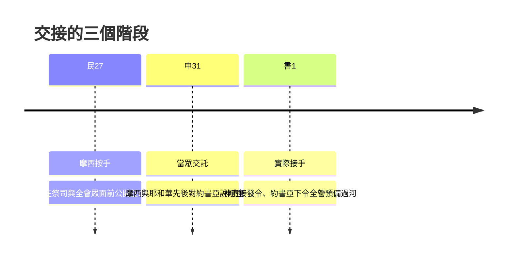

# 約書亞記 第1章

<!-- chapter-navigation:start -->
|  | [回目錄](../06%20約書亞記/全書目錄及綱要.md) | [下一章](../06%20約書亞記/第2章.md) |
| :--- | :---: | ---: |
<!-- chapter-navigation:end -->

1. [[耶和華的僕人摩西（e.ved 與 al pi）|耶和華的僕人摩西]]死了以後，耶和華曉諭摩西的[[侍立事奉（a.mad、sha.rat）|幫手]]，[[約書亞承接摩西|嫩的兒子約書亞]]，說：
2. 我的僕人[[摩西]]死了。現在你要起來，和眾百姓過這[[約但河]]，往我所要[[賜給（na.tan）|賜給]]以色列人的地去。
3. 凡你們[[腳掌可踏之處|腳掌所踏之地]]，我都照著我所應許[[摩西]]的話[[賜給（na.tan）|賜給]]你們了。
4. 從[[曠野]]和這[[利巴嫩]]，直到[[伯拉大河]]，[[赫人]]的全地，又到[[大海（地中海）|大海]]日落之處，都要作你們的[[應許之地的四至|境界]]。
5. 你平生的日子，必無一人能在你面前站立得住。我怎樣與[[摩西]]同在，也必照樣[[神的同在|與你同在]]；我[[必不撇下你，也不丟棄你（ra.phah 與 a.zav）|必不撇下你，也不丟棄你]]。
6. 你當[[勉勵他使他膽壯（cha.zaq、a.mats）|剛強壯膽]]！因為你必使這百姓[[產業（na.cha.lah）|承受那地為業]]，就是我向他們列祖起誓應許[[賜給（na.tan）|賜給]]他們的地。
7. 只要剛強，大大壯膽，謹守遵行我僕人[[摩西]]所吩咐你的一切律法，不可偏離左右，使你無論往哪裡去，都可以[[亨通與順利（tsa.lech 與 sa.khal）|順利]]。
8. 這[[律法書放在約櫃旁|律法書]]不可離開你的口，總要[[晝夜思想（ha.gah）|晝夜思想]]，好使你謹守遵行這書上所寫的一切話。如此，你的道路就可以[[亨通與順利（tsa.lech 與 sa.khal）|亨通]]，凡事[[亨通與順利（tsa.lech 與 sa.khal）|順利]]。
9. 我豈沒有吩咐你嗎？你當[[勉勵他使他膽壯（cha.zaq、a.mats）|剛強壯膽]]！不要懼怕，也不要驚惶；因為你無論往哪裡去，耶和華─你的神必[[神的同在|與你同在]]。
10. 於是，[[約書亞]]吩咐百姓的[[以色列人的官長|官長]]說：
11. 你們要走遍營中，吩咐百姓說：[[過河前當預備食物|當預備食物]]；因為[[三日之內與差派探子的先後之爭|三日之內]]你們要過這[[約但河]]，進去得耶和華─你們神賜你們[[為業（ye.ru.shah）|為業]]之地。
12. [[約書亞]]對[[流便]]人、[[迦得（萬幸）|迦得]]人，和[[瑪拿西]][[兩支派半求河東之地為業|半支派]]的人說：
13. 你們要追念[[耶和華的僕人摩西（e.ved 與 al pi）|耶和華的僕人摩西]]所吩咐你們的話說：耶和華─你們的神使你們[[得享平安（nu.ach）|得享平安]]，也必將這地[[賜給（na.tan）|賜給]]你們。
14. 你們的妻子、孩子，和牲畜都可以留在[[約但河]]東、[[摩西]]所給你們的地；但你們中間一切[[勇士（cha.yil）|大能的勇士]]都要[[帶著兵器（cha.mush）|帶著兵器]]在你們的弟兄前面過去，幫助他們，
15. 等到耶和華使你們的弟兄像你們一樣[[得享平安（nu.ach）|得享平安]]，並且得著耶和華─你們神所賜他們[[為業（ye.ru.shah）|為業]]之地，那時才可以回你們所得之地，承受為業，就是[[耶和華的僕人摩西（e.ved 與 al pi）|耶和華的僕人摩西]]在[[約但河]]東、向日出之地所給你們的。
16. 他們回答[[約書亞]]說：你所吩咐我們行的，我們都必行；你所差遣我們去的，我們都必去。
17. 我們從前在一切事上怎樣聽從[[摩西]]，現在也必照樣聽從你；惟願耶和華─你的神[[神的同在|與你同在]]，像與摩西同在一樣。
18. 無論什麼人[[違背命令（ma.rah）|違背]]你的命令，不聽從你所吩咐他的一切話，就必治死他。你只要[[勉勵他使他膽壯（cha.zaq、a.mats）|剛強壯膽]]！

---

## 本章知識節點

### 人物
- [[約書亞]]
- [[摩西]]
- [[赫人]]
- [[以色列人的官長]]
- [[流便]]
- [[迦得（萬幸）]]
- [[瑪拿西]]

### 事件
- [[約書亞承接摩西]]
- [[兩支派半求河東之地為業]]

### 原文
- [[耶和華的僕人摩西（e.ved 與 al pi）]]
- [[侍立事奉（a.mad、sha.rat）]]
- [[腳掌可踏之處]]
- [[賜給（na.tan）]]
- [[勉勵他使他膽壯（cha.zaq、a.mats）]]
- [[必不撇下你，也不丟棄你（ra.phah 與 a.zav）]]
- [[晝夜思想（ha.gah）]]
- [[亨通與順利（tsa.lech 與 sa.khal）]]
- [[得享平安（nu.ach）]]
- [[勇士（cha.yil）]]
- [[帶著兵器（cha.mush）]]
- [[違背命令（ma.rah）]]
- [[為業（ye.ru.shah）]]
- [[產業（na.cha.lah）]]

### 地點
- [[約但河]]
- [[曠野]]
- [[利巴嫩]]
- [[伯拉大河]]
- [[大海（地中海）]]

### 主題
- [[應許之地的四至]]
- [[律法書放在約櫃旁]]
- [[過河前當預備食物]]

### 神學
- [[神的同在]]

### 解經爭議
- [[三日之內與差派探子的先後之爭]]

---

## 本章整理

### 交棒的第一句話（v1-5）

全卷從一則死訊開始：「耶和華的僕人摩西死了以後，耶和華曉諭摩西的幫手，嫩的兒子約書亞」。[[約書亞]]接手的方式不是自薦，也不是會眾推舉，而是神直接開口。這一節裡並排著兩個不同的服事身分：[[摩西]]是[[耶和華的僕人摩西（e.ved 與 al pi）|耶和華的僕人]]，STEP 語言資料把這個字標為 'E.ved（H5650）；約書亞是摩西的「幫手」，STEP 標為 me.sha.Ret（H8334），是與利未人[[侍立事奉（a.mad、sha.rat）|侍立事奉]]同一個字根的分詞形態。CT 說幫手指在身邊服侍、聽候差遣的人。

神在第2節換了稱呼——「我的僕人摩西死了」——然後才發命令：起來，和眾百姓過這[[約但河]]。CT 在這裡讀出一個安排：神向約書亞說的第一句話是把他從眼見的環境帶回神面前，也向百姓確認神所揀選的屬靈領袖。KC 則說在進地之前，摩西的死是必要的，因為神的心意不是讓百姓在律法的關係下承受福分。

第3節接著把地說成已經給出去的。[[腳掌可踏之處|凡你們腳掌所踏之地]]，神說「我都照著我所應許摩西的話賜給你們了」；GT 指出這個[[賜給（na.tan）|賜給]]在原文是完成式，百姓還沒過河，地卻已經給了。第4節列出[[應許之地的四至|地界]]。GT《串珠聖經注釋》與《啟導本》都把它讀成四個方位：

| 界標 | GT《串珠》《啟導本》所給的方位 | 補充說明 |
|---|---|---|
| [[曠野]] | 南界 | GT《啟導本》說包括南地與西奈半島；GT《串珠》說也許是指東南的阿拉伯曠野 |
| [[利巴嫩]] | 北界 | GT《約書亞記研經資料》說是位於以色列北方的一座多樹木的山 |
| [[伯拉大河]] | 東界 | GT《串珠》說即今日的幼發拉底河 |
| [[大海（地中海）]] | 西界 | 「大海日落之處」，GT《啟導本》說就是今地中海 |
| [[赫人]]的全地 | 未歸入四方 | CT 指今敘利亞的北面；GT《綜合解讀》說是代稱整個迦南地 |

GT《舊約背景註釋》的華爾頓畫法不同：他說曠野包圍了這地南面和東面的疆界，而黎巴嫩和幼發拉底河是北界的東西兩端。赫人的全地也有分歧，GT《雷氏研讀本》指出學者常認為它是指敘利亞北面，但這句子在七十士譯本和申命記十一24 都沒有出現；GT《啟導本》說赫人退居北疆一隅已數百年，迦南仍稱為赫人之地。

==這片地什麼時候真的到手，是另一個問題。==GT《啟導本》說以色列人要到所羅門王時代才得到此廣大土地；GT《雷氏研讀本》說這應許要到千禧年的時候才能完全實現；GT《聖經精讀本》說大衛王時期版圖曾擴張至接近上述地界，但以色列百姓卻未曾確保這一切地界；KC 更直接說按第4節所呈現的樣子，以色列從來沒有擁有過。第3節的完成式講的是應許的確定，與整片疆域在歷史上的實際佔有並不是同一件事。

第5節則把保證講完：神應許無人能站立得住，並說[[必不撇下你，也不丟棄你（ra.phah 與 a.zav）|我必不撇下你，也不丟棄你]]，CT 說這兩句是同義的，並列是為了強調。

### 剛強壯膽與律法書（v6-9）

「[[勉勵他使他膽壯（cha.zaq、a.mats）|剛強壯膽]]」在本章出現四次，STEP 顯示都是同一組動詞 cha.Zak（H2388G）加 ve./'e.Matz（H553）。==四次裡有三次出自神，最後一次出自百姓。==

| 節次 | 說話的人 | 和合本用語 | 緊接著給的內容 |
|---|---|---|---|
| 6 | 耶和華 | 你當剛強壯膽 | 你必使這百姓承受那地為業 |
| 7 | 耶和華 | 只要剛強，大大壯膽 | 謹守遵行摩西所吩咐的一切律法 |
| 9 | 耶和華 | 你當剛強壯膽 | 耶和華你的神必與你同在 |
| 18 | 河東二支派半 | 你只要剛強壯膽 | 全章最後一句話 |

GT《綜合解讀》把三次的根據分開來說：神的應許是剛強壯膽的根據，神的律法是指引，神的[[神的同在|同在]]是力量。神對約書亞的要求其實只有兩樣，一樣是剛強壯膽，另一樣是遵行律法，而第8節把後者說得很具體——[[律法書放在約櫃旁|這律法書]]不可離開你的口，總要[[晝夜思想（ha.gah）|晝夜思想]]。STEP 把「思想」標為 ve./ha.Gi.ta（H1897），簡要詞典義是低聲出聲的動作，而同一節前半正好講到「口」。GT《雷氏研讀本》說這包括大聲朗讀和反複誦讀神的話，KC 則提醒這不是靈修時讀一節然後整天帶著當護身符，而是神的話對整個生活的全面管理。

這兩節的結尾是[[亨通與順利（tsa.lech 與 sa.khal）|亨通與順利]]。BH 把範圍界定得清楚：這裡的亨通指的是成就神立約的心意，得地、使以色列安然立定、活在神的祝福之下，而不是個人的財富或成就。CT 在第7節的話中之光也說，世人以為順利亨通來自有權有勢，神在第6至8節教約書亞的路卻正好相反。

### 三日之內：第一道命令（v10-11）

約書亞聽完神的話沒有回一句，直接發令。命令的傳遞路線是層層下達的：

[[以色列人的官長|官長]]這個環節不是新設的：GT《啟導本》說當為摩西在各支派中所立的千夫長、百夫長等管理百姓的人。真正令人意外的是命令的內容——不是集結軍隊，而是[[過河前當預備食物|預備食物]]。GT《綜合解讀》把它與出埃及對比：出埃及時神沒有讓百姓預備乾糧，只讓他們帶著沒有發起的生面烤成無酵餅；過約但河卻要百姓自己預備，因為這一次是承受應許，神要人與祂同工。KC 說得更直接，這食物不是官長給的，百姓自己必須張羅。BH 則提醒嗎哪要繼續降下，直到以色列吃了迦南地的出產，但這不能成為忽略實際順服的理由。

至於「[[三日之內與差派探子的先後之爭|三日之內]]」到底怎麼算，四套註釋沒有一致答案：CT 與《雷氏研讀本》都認為探子的差遣排在這道命令之前，《啟導本》提出這或許就是書3:2 所說的三天，《串珠》則認為只是約數。

### 河東二支派半的舊約定（v12-15）

接下來約書亞轉向一群身分特殊的人：[[流便]]人、[[迦得（萬幸）|迦得]]人和[[瑪拿西]]半支派。他們[[兩支派半求河東之地為業|已經在約但河東拿到地]]，而按摩西當初的約定，取得那塊地的條件本來就是要與弟兄一同過河爭戰。約書亞沒有為了討好他們而改條件，而是要他們「追念耶和華的僕人摩西所吩咐你們的話」。

| 留在河東 | 過河作戰 |
|---|---|
| 妻子、孩子、牲畜 | 一切大能的勇士（見 [[勇士（cha.yil）]]） |
| 摩西所給你們的地 | 帶著兵器走在弟兄前面（見 [[帶著兵器（cha.mush）]]） |
| — | 直到弟兄也得享平安、得著地業，才可以回來承受自己所得之地為業（見 [[為業（ye.ru.shah）]]） |

兩家對河東這塊地的定位判斷不同。KC 說約但河曠野那一邊不是應許之地，也不是約書亞攻取的地，這兩個半支派滿足於此並不合乎神的心意。BH 則說河東的地是神向亞伯拉罕、以撒、雅各守約信實的一部分，是真正的產業，只是得了地並不解除他們對全體百姓的責任。兩家對經文的要求沒有異議：能打仗的都要過河。

這裡有兩個原文細節值得留意。「[[得享平安（nu.ach）|得享平安]]」在 STEP 是 me.Ni.ach（H5117），GT 說原文作休息，型態是單數陽性分詞，並說「得享平安」原文是「得享安息」。「帶著兵器」是 cha.mu.Shim（H2571），本節譯義作列陣備戰；GT《綜合解讀》與《聖經精讀本》都說這個字派生於指數字五的詞根，並推測當時可能採五人一組的戰鬥隊形。第6節神說約書亞要使百姓[[產業（na.cha.lah）|承受那地為業]]，用的則是另一個字根的使役形態 tan.Chil（H5157）。

### 百姓的回應（v16-18）

回答分成三句應許加一句咒詛。他們說凡吩咐的都必行、凡差遣的都必去、從前怎樣聽從摩西現在也照樣聽從，然後加上一句約書亞根本沒有要求的話：「無論什麼人[[違背命令（ma.rah）|違背]]你的命令……就必治死他。」

GT《丁道爾聖經注釋》指出這個「違背」在約書亞記只出現這一次，而申命記正是用它描述以色列在加低斯巴尼亞的背叛與忤逆之子的死罪——他們用來形容背叛新領袖的字，就是摩西當年用來形容以色列背叛神的那一個。GT《研經資料》從處境上說明這個回應的份量：摩西剛死，兩支派半已經取得土地，大可以不理會舊約定，他們卻主動把服從寫成死刑條款，使其他可能的競爭者很難取得比約書亞更有利的地位。KC 對回答的人是誰保留，說這裡的話似乎是全體百姓說的、不只是兩個半支派。

### 從摩西到約書亞（跨章脈絡）

本章是[[約書亞承接摩西|交接]]真正生效的一章。神的說法一路對照著摩西：我怎樣與摩西同在也必照樣與你同在（v5），謹守遵行我僕人摩西所吩咐你的一切律法（v7），追念耶和華的僕人摩西所吩咐你們的話（v13）。百姓的說法也一樣：從前怎樣聽從摩西現在也照樣聽從你，惟願耶和華與你同在像與摩西同在一樣（v17）。

> [!note]
> KC 通篇以預表讀本章：他把約但河讀成死亡之河、指向主耶穌的死與復活，把迦南讀成屬天的境界，並說以弗所書是約書亞記的新約對應書卷。他對河東二支派半的評價也是從這個進路來的。這是 KC 的解讀進路，不是本章經文明言的內容；CT 在書1:3 的話中之光另以「過約旦河是過信心的關」作類似的屬靈應用，說這是憑神的話爭戰得著一城再一城。

**參考資料**
https://www.ccbiblestudy.org/Old%20Testament/06Josh/06CT01.htm
https://www.ccbiblestudy.org/Old%20Testament/06Josh/06GT01.htm
https://www.kingcomments.com/en/bible-studies/Jos/1
https://biblehub.com/study/joshua/1.htm
https://github.com/STEPBible/STEPBible-Data

<!-- appendix-links:start -->
## 附錄

### 相關地圖
- [[appendix/fhl_maps/maps/028|〈書圖一〉過約但河及征服南方諸王]]
<!-- appendix-links:end -->

<!-- chapter-navigation:start -->
|  | [回目錄](../06%20約書亞記/全書目錄及綱要.md) | [下一章](../06%20約書亞記/第2章.md) |
| :--- | :---: | ---: |
<!-- chapter-navigation:end -->
