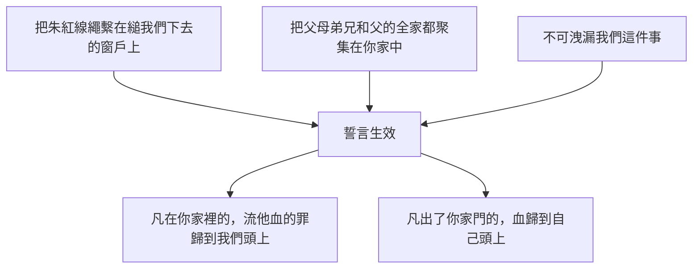
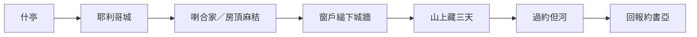

# 約書亞記 第2章

<!-- chapter-navigation:start -->
| [前一章](../06%20約書亞記/第1章.md) | [回目錄](../06%20約書亞記/全書目錄及綱要.md) | [下一章](../06%20約書亞記/第3章.md) |
| :--- | :---: | ---: |
<!-- chapter-navigation:end -->

1. 當下，嫩的兒子[[約書亞]]從[[什亭（亞伯什亭）|什亭]]暗暗打發兩個人作探子，吩咐說：你們去窺探那地和[[耶利哥]]。於是二人去了，來到一個妓女名叫[[喇合]]的家裡，就在那裡躺臥。
2. 有人告訴[[耶利哥王]]說：今夜有以色列人來到這裡窺探此地。
3. [[耶利哥王]]打發人去見[[喇合]]說：那來到你這裡、進了你家的人要交出來，因為他們來窺探全地。
4. 女人將二人隱藏，就回答說：那人果然到我這裡來；他們是哪裡來的[[喇合說謊是否蒙神認可之爭|我卻不知道]]。
5. 天黑、要關城門的時候，他們出去了，往哪裡去[[喇合說謊是否蒙神認可之爭|我卻不知道]]。你們快快地去追趕，就必追上。
6. （先是女人領二人上了房頂，將他們藏在那裡所擺的[[麻秸（pish.teh 與 ets）|麻秸]]中。）
7. 那些人就往[[約但河]]的渡口追趕他們去了。追趕他們的人一出去，城門就關了。
8. 二人還沒有躺臥，女人就上房頂，到他們那裡，
9. 對他們說：我知道耶和華已經把這地[[賜給（na.tan）|賜給]]你們，並且因你們的緣故我們都[[使天下萬民驚恐懼怕|驚慌]]了。這地的一切居民在你們面前[[心消化（ma.sas）|心都消化]]了；
10. 因為我們聽見你們出埃及的時候，耶和華怎樣在你們前面使[[海（紅海）|紅海]]的水乾了，並且你們怎樣待[[約但河]]東的兩個[[亞摩利人|亞摩利王]][[以色列戰勝亞摩利王西宏互文（申2：24-37；3：1-7；詩135：10-12；136：17-22）|西宏和噩]]，將他們盡行毀滅。
11. 我們一聽見這些事，[[心消化（ma.sas）|心就消化]]了。因你們的緣故，並無一人有[[使天下萬民驚恐懼怕|膽氣]]。耶和華─你們的神本是[[上天下地的神是否一神信仰之爭|上天下地的神]]。
12. 現在我既是恩待你們，求你們指著耶和華向我起誓，也要恩待我父家，並給我一個實在的證據，
13. 要救活我的父母、弟兄、姊妹，和一切屬他們的，拯救我們性命不死。
14. 二人對他說：你若不洩漏我們這件事，我們情願替你們死。耶和華將這地[[賜給（na.tan）|賜給]]我們的時候，我們必以[[慈愛誠實]]待你。
15. 於是女人用繩子將二人從窗戶裡縋下去；因他的房子是在[[建在城牆上的房子|城牆邊上]]，他也住在城牆上。
16. 他對他們說：你們且往山上去，恐怕追趕的人碰見你們；要在那裡隱藏[[三日之內與差派探子的先後之爭|三天]]，等追趕的人回來，然後才可以走你們的路。
17. 二人對他說：你要這樣行。不然，你叫我們所起的誓就與我們無干了。
18. 我們來到這地的時候，你要把這條[[朱紅線繩（chut ha.sha.ni）|朱紅線繩]]繫在縋我們下去的窗戶上，並要使你的父母、弟兄，和你父的全家都聚集在你家中。
19. 凡出了你家門往街上去的，他的罪（原文是血）[[他的血要歸到他身上|必歸到自己的頭上]]，與我們無干了。凡在你家裡的，若有人下手害他，流他血的罪就歸到我們的頭上。
20. 你若洩漏我們這件事，你叫我們所起的誓就與我們無干了。
21. 女人說：照你們的話行吧！於是打發他們去了，又把[[朱紅線繩（chut ha.sha.ni）|朱紅線繩]]繫在窗戶上。
22. 二人到山上，在那裡住了[[三日之內與差派探子的先後之爭|三天]]，等著追趕的人回去了。追趕的人一路找他們，卻找不著。
23. 二人就下山回來，過了河，到嫩的兒子[[約書亞]]那裡，向他述說所遭遇的一切事；
24. 又對[[約書亞]]說：耶和華果然將那全地交在我們手中；那地的一切居民在我們面前[[心消化（ma.sas）|心都消化]]了。

---

## 本章知識節點

### 人物
- [[約書亞]]
- [[喇合]]
- [[耶利哥王]]
- [[亞摩利人]]

### 地點
- [[什亭（亞伯什亭）]]
- [[耶利哥]]
- [[約但河]]
- [[海（紅海）]]

### 事件
- [[十二探子窺探迦南地]]

### 歷史
- [[紅海分開]]

### 互文
- [[以色列戰勝亞摩利王西宏互文（申2：24-37；3：1-7；詩135：10-12；136：17-22）]]

### 原文
- [[賜給（na.tan）]]
- [[慈愛誠實]]
- [[心消化（ma.sas）]]
- [[使天下萬民驚恐懼怕]]
- [[他的血要歸到他身上]]
- [[朱紅線繩（chut ha.sha.ni）]]
- [[麻秸（pish.teh 與 ets）]]

### 文化
- [[建在城牆上的房子]]

### 解經爭議
- [[三日之內與差派探子的先後之爭]]
- [[上天下地的神是否一神信仰之爭]]
- [[喇合說謊是否蒙神認可之爭]]

---

## 本章整理

### 暗暗打發的兩個探子（v1）

[[約書亞]]接任後的第二件事，是從[[什亭（亞伯什亭）|什亭]]打發兩個人去窺探[[耶利哥]]。和合本用了「暗暗」兩個字，STEP 標的是 Che.resh（H2791A，簡要詞典義 silently），而「探子」是 me.ra.ge.Lim（H7270 ra.gal: to spy）。

各家都把這一趟與[[十二探子窺探迦南地|三十八年前那一次]]放在一起讀，而且對比的項目相當一致。

| 項目 | 民13 那一次 | 本章這一次 |
|---|---|---|
| 人數 | 十二人，每支派一人 | 兩人 |
| 公開程度 | GT《綜合解讀》說是大張旗鼓的公開行為 | 暗暗打發 |
| 範圍 | 走遍迦南地東西南北 | GT《啟導本》說只窺探即將攻打的耶利哥城 |
| 回報 | 十人報惡信 | 兩人都說耶和華果然將那全地交在我們手中 |

至於為什麼要保密，GT《雷氏研讀本》說約書亞既從加低斯巴尼亞的事件吸取了重要的教訓，便向以色列人隱瞞派探子查探的實情，這樣即使得到不利的回報，也不會讓百姓氣餒。KC 則從另一頭問：進地的決定書1:11 已經下了，為什麼還要窺探？他的答案是神要用祂自己的人作器皿，人的責任並沒有被取消。

### 藏在麻秸底下（v2-7）

探子的身分很快暴露。CT 推測可能是因為他們的衣著和口音不同於當地人；[[耶利哥王]]接到通報就派人上門要人。喇合的應對分成兩段：她先把人藏起來，再把追兵指向[[約但河]]的渡口。

第6節是一句插敘，補出她把人藏在哪裡——房頂上[[麻秸（pish.teh 與 ets）|所擺的麻秸]]。這個細節同時說了三件事：亞麻是她的日常生計，房頂是當地房屋的曬場，而亞麻正在曬乾表示時序是春天。GT《綜合解讀》據此說此時正是逾越節前夕，當地的大麥和亞麻同時成熟了，並認為這種細節不瞭解當時、當地情況的人是很難編造的。

她說的那兩句「我卻不知道」，[[喇合說謊是否蒙神認可之爭|四套來源都停下來討論]]。沒有一家說聖經稱讚說謊，分歧在於怎麼衡量它：CT 並列四種解釋而不裁決，GT 收錄的《艾基斯舊約聖經難題彙編》要求把處境算進來但不赦免，KC 說神容許她說謊卻不倚靠這個謊來拯救探子，GT《聖經精讀本》乾脆只評估效果——若她堅持沒有看到探子，或許其家會遭到搜索。

第7節城門一關，探子就出不去了。GT《丁道爾聖經注釋》說這個細節再一次襯托出探子的險境，和他們何等倚賴喇合的保護；[[建在城牆上的房子|她的房子建在城牆上]]，因此成了唯一的出口。

### 我知道（v8-11）

探子還沒躺下，喇合就上了房頂。CT 注意到一組對照：她對王的使者說的是「不知道」，對探子說的第一句話卻是「我知道耶和華已經把這地[[賜給（na.tan）|賜給]]你們」。

她接著報告全城的狀態，用的詞在原文裡不只一個。

| 節次 | 和合本 | STEP 原文 | Extended Strong |
|---|---|---|---|
| 9 | 心都消化了 | na.Mo.gu | H4127（mug: to melt） |
| 11 | 心就消化了 | va/i.yi.Mas | H4549（ma.sas: to melt） |
| 24 | 心都消化了 | na.Mo.gu | H4127 |

中文三次一樣，原文換過一次字（見 [[心消化（ma.sas）]]）。同段還有兩個詞：第9節的「驚慌」是 na.fe.Lah 'ei.mat./Khem，GT 收錄的約書亞記研經資料（蔡哲民等）直譯為「對你們的驚駭落在我們身上」；第11節的「並無一人有膽氣」是 ve./lo'- Ka.mah od Ru.ach be./'Ish，同一份來源譯作「人裡面的心靈不再立得住」。GT《雷氏研讀本》要讀者參看申2:25 的應許（見 [[使天下萬民驚恐懼怕]]）。

她說她聽見的是兩件事：[[紅海分開|耶和華使紅海的水乾了]]，以及以色列人怎樣待河東的[[亞摩利人|兩個亞摩利王]]（見 [[以色列戰勝亞摩利王西宏互文（申2：24-37；3：1-7；詩135：10-12；136：17-22）]]）。GT《丁道爾聖經注釋》指出這兩件事正是以色列在曠野飄流的開頭與結尾。

這一段的最後一句是全章分歧最大的地方：「耶和華─你們的神本是[[上天下地的神是否一神信仰之爭|上天下地的神]]」。CT、GT《聖經精讀本》、KC 與 BH 都把它讀成信仰的轉向；GT《舊約背景註釋》的華爾頓卻說她的話遠非一神信仰的表示，她沒有宣稱放棄舊神，只是向祂求助。

### 起誓與朱紅線繩（v12-21）

喇合開口求的不是自己，是全家。她用的字是 Cha.sed（H2617A），第14節探子回她的也是同一個字，並且加上 'e.Met（見 [[慈愛誠實]]）。她要的還有一個看得見的憑據——'ot 'e.Met，實在的證據。

探子給的條件有三項，缺一不可：

第19節這兩句話是同一個法律套語的兩面（見 [[他的血要歸到他身上]]），STEP 為 da.M/o ve./ro.Sh/o；「與我們無干」則是 ne.ki.Yim（H5355A na.qi: innocent）。

[[朱紅線繩（chut ha.sha.ni）|那條朱紅線繩]]是否就是第15節縋探子下去的繩子，各家不一致：CT 說兩者原文不同字，線繩比繩子較細、不足承載人的重量；GT《聖經精讀本》從指示代詞「這」判斷是同一條；GT《綜合解讀》說「可能」就是那根。功能上倒是一致——GT《雷氏研讀本》說它能讓入侵的以色列人認出他們要放過的房子，GT《啟導本》與 BH 都把它與逾越節的血並列。

==第21節值得留意：她沒有等到以色列人來攻城才繫上，打發探子走了就繫上了。==

### 三天之後的回報（v22-24）

探子照她的話往山上去，[[三日之內與差派探子的先後之爭|住了三天]]才下山過河。GT《聖經精讀本》從這裡讀出耶利哥王的恐懼有多深：從耶利哥城到約但河不過十三公里，走路約用三個小時，追兵卻花了三天仔細搜索路口。

他們帶回約書亞的話只有兩句，而且都是從喇合口中聽來的：耶和華果然將那全地交在我們手中，那地的一切居民在我們面前心都消化了。KC 說得直接——探子向約書亞作的見證，就是他們從喇合口中所聽見、在她行動中所看見的。

### 一個迦南女子撐起整章（跨章脈絡）

本章名義上是軍事偵察，實際的內容卻幾乎都發生在一戶人家裡。KC 注意到這一點：兩個人進城要看敵人的勢力，看到的卻是神在[[喇合]]身上的作為，他們沒有再往城裡深入。

從書卷結構看，本章接的是書1:11 那道「三日之內你們要過這約但河」的命令，接下去是書3 的渡河。而喇合的話正好把書1:3 神說的那句「賜給你們了」從敵方的口中再說一次——神說已經給了，城裡的人也已經知道了。

> [!note]
> KC 通篇把本章讀成外邦人得以進入神百姓的預表，並把喇合連到弗2:11-12 所說那些在肉身上作外邦人的。這是他的解讀進路，不是本章經文明言的內容；四套來源在事實層面一致的是另外三件事：她保護了探子、她說出了那段告白、她全家因朱紅線繩得救（書6:22-25）。

**參考資料**
https://www.ccbiblestudy.org/Old%20Testament/06Josh/06CT02.htm
https://www.ccbiblestudy.org/Old%20Testament/06Josh/06GT02.htm
https://www.kingcomments.com/en/bible-studies/Jos/2
https://biblehub.com/study/joshua/2.htm
https://github.com/STEPBible/STEPBible-Data

<!-- appendix-links:start -->
## 附錄

### 相關地圖
- [[appendix/fhl_maps/maps/028|〈書圖一〉過約但河及征服南方諸王]]
<!-- appendix-links:end -->

<!-- chapter-navigation:start -->
| [前一章](../06%20約書亞記/第1章.md) | [回目錄](../06%20約書亞記/全書目錄及綱要.md) | [下一章](../06%20約書亞記/第3章.md) |
| :--- | :---: | ---: |
<!-- chapter-navigation:end -->
