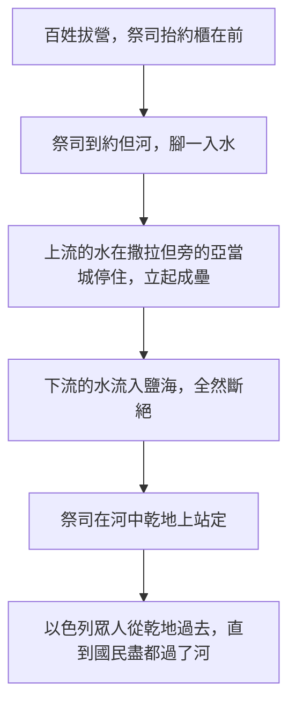

# 約書亞記 第3章

<!-- chapter-navigation:start -->
| [前一章](../06%20約書亞記/第2章.md) | [回目錄](../06%20約書亞記/全書目錄及綱要.md) | [下一章](../06%20約書亞記/第4章.md) |
| :--- | :---: | ---: |
<!-- chapter-navigation:end -->

1. [[約書亞]][[清早起來]]，和以色列眾人都離開[[什亭（亞伯什亭）|什亭]]，來到[[約但河]]，就住在那裡，等候過河。
2. [[三日之內與差派探子的先後之爭|過了三天]]，[[以色列人的官長|官長]]走遍營中，
3. 吩咐百姓說：你們看見耶和華─你們神的[[約櫃]]，又見祭司利未人抬著，就要離開所住的地方，跟著約櫃去。
4. 只是你們和[[約櫃]]相離要量[[和約櫃相離二千肘|二千肘]]，不可與約櫃相近，使你們知道所當走的路，因為這條路你們向來沒有走過。
5. [[約書亞]]吩咐百姓說：你們要[[自潔]]，因為明天耶和華必在你們中間行奇事。
6. [[約書亞]]又吩咐祭司說：你們抬起[[約櫃]]，[[約櫃前行尋安歇（書3：3-6）|在百姓前頭過去]]。於是他們抬起約櫃，在百姓前頭走。
7. 耶和華對[[約書亞]]說：從今日起，我必使你在以色列眾人眼前[[使你尊大（ga.dal）|尊大]]，使他們知道我怎樣與[[摩西]]同在，也必照樣[[神的同在|與你同在]]。
8. 你要吩咐抬[[約櫃]]的祭司說：你們到了[[約但河]]的水邊上，就要在約但河水裡站住。
9. [[約書亞]]對以色列人說：你們近前來，聽耶和華─你們神的話。
10. [[約書亞]]說：看哪，[[普天下主（a.don kol ha.a.retz）|普天下主]]的[[約櫃]]必在你們前頭過去，到[[約但河]]裡，因此你們就知道在你們中間有[[耶和華永生神|永生神]]；並且他必在你們面前[[為業（ye.ru.shah）|趕出]][[迦南人]]、[[赫人]]、[[希未人]]、[[比利洗人]]、[[革迦撒人]]、[[亞摩利人]]、[[耶布斯人]]。
11. 併於上節。
12. 你們現在要從以色列支派中揀選十二個人，每支派一人，
13. 等到抬[[普天下主（a.don kol ha.a.retz）|普天下主]]耶和華[[約櫃]]的祭司把腳站在[[約但河]]水裡，約但河的水，就是從上往下流的水，必然斷絕，[[立起成壘（ned）|立起成壘]]。
14. 百姓離開帳棚要過[[約但河]]的時候，抬[[約櫃]]的祭司乃在百姓的前頭。
15. 他們到了[[約但河]]，[[腳一入水（ta.val）|腳一入水]]（原來約但河水在收割的日子漲過兩岸），
16. 那從上往下流的水便在極遠之地、[[亞當城與撒拉但|撒拉但旁的亞當城]]那裡[[祭司站定與河水停住（a.mad）|停住]]，[[立起成壘（ned）|立起成壘]]；那往[[亞拉巴]]的海，就是[[鹽海]]，下流的水[[約但河斷流的自然解釋之爭|全然斷絕]]。於是百姓在[[耶利哥]]的對面過去了。
17. 抬耶和華[[約櫃]]的祭司在[[約但河]]中的乾地上[[祭司站定與河水停住（a.mad）|站定]]，以色列眾人都從乾地上過去，直到國民盡都過了約但河。

---

## 本章知識節點

### 人物
- [[約書亞]]
- [[摩西]]
- [[以色列人的官長]]
- [[迦南人]]
- [[赫人]]
- [[比利洗人]]
- [[革迦撒人]]
- [[亞摩利人]]
- [[耶布斯人]]

### 歷史
- [[希未人]]
- [[紅海分開]]
- [[雲柱火柱]]

### 地點
- [[什亭（亞伯什亭）]]
- [[約但河]]
- [[鹽海]]
- [[亞拉巴]]
- [[耶利哥]]
- [[亞當城與撒拉但]]

### 主題
- [[約櫃]]
- [[和約櫃相離二千肘]]
- [[清早起來]]

### 神學
- [[自潔]]
- [[耶和華永生神]]
- [[神的同在]]

### 背景
- [[迦南七族（迦南地原住民）]]

### 原文
- [[為業（ye.ru.shah）]]
- [[普天下主（a.don kol ha.a.retz）]]
- [[立起成壘（ned）]]
- [[祭司站定與河水停住（a.mad）]]
- [[腳一入水（ta.val）]]
- [[使你尊大（ga.dal）]]

### 解經爭議
- [[三日之內與差派探子的先後之爭]]
- [[約但河斷流的自然解釋之爭]]

### 互文
- [[約櫃前行尋安歇（書3：3-6）]]

---

## 本章整理

### 拔營到河邊（v1-2）

[[清早起來|約書亞清早起來]]，帶著以色列眾人離開[[什亭（亞伯什亭）|什亭]]，來到[[約但河]]邊住下等候過河。STEP 顯示「清早起來」是 va/i.yash.Kem ba./Bo.ker（H7925 sha.kham 加 H1242 bo.qer）；GT《約書亞記綜合解讀》說這句話在舊約中有特殊的意義，通常表示急切、堅決的態度。

從什亭到河邊只有大約十公里，GT《研經資料》說什亭距離約旦河還有8到9公里。GT《丁道爾聖經注釋》給了實務上的理由：一旦領受了詳細的指示，知道要如何過河之後，以色列人就必須遷移到河旁邊，這樣過河的那天才不會浪費時間。

第2節「[[三日之內與差派探子的先後之爭|過了三天]]」，[[以色列人的官長|官長]]走遍營中傳令。GT《綜合解讀》說這三天可能就是兩個探子窺探耶利哥的那三天（書2:22）。

### 跟著約櫃走，但要離它二千肘（v3-6）

指示的核心只有一件事：看見[[約櫃]]起行，就離開所住的地方跟著走。KC 數過，在書3 至書4 這兩章裡約櫃被提到十六次。GT《啟導本》說約櫃是神的座位，約櫃先行表示神的同在與引導。GT《綜合解讀》另指出一個轉換——在曠野裡百姓跟隨[[雲柱火柱]]，如今卻改成跟著約櫃去。GT《丁道爾聖經注釋》則提醒這個安排並不新：以色列人還沒有離開西乃山之前就已經規定了行伍的秩序，民10:33 說約櫃要走在百姓的前頭、領他們到安歇之所（見 [[約櫃前行尋安歇（書3：3-6）]]），要過約但河的百姓可能也知道這個指示。

抬約櫃的人也換了。GT《雷氏研讀本》與《啟導本》都說在曠野時抬約櫃的是哥轄的子孫（民四15），但在這個特殊時刻由擔任祭司的利未人來抬。

接著是全章唯一一條帶數字的規定：[[和約櫃相離二千肘|你們和約櫃相離要量二千肘]]。經文自己給的理由不是敬畏，是視線——「使你們知道所當走的路，因為這條路你們向來沒有走過」。各家換算不一，從889公尺到1000公尺都有，並在經文的理由之外補上敬畏、禮儀等說明。

第5節約書亞要百姓[[自潔]]，因為「明天耶和華必在你們中間行奇事」。STEP 為 hit.ka.Da.shu（H6942G qa.dash）加 nif.la.'ot（H6381 pa.la）；GT《丁道爾》把它連到西乃山下的潔淨（出19:10-15），並推測百姓在河邊還等了一段時間可能與此有關。

### 兩個宣告：神在營中，神管全地（v7-13）

第7節神先對約書亞說了一句與河無關的話：[[使你尊大（ga.dal）|從今日起，我必使你在以色列眾人眼前尊大]]，並接上「我怎樣與摩西同在，也必照樣[[神的同在|與你同在]]」。這句話把書1:5 給[[摩西]]繼任者的應許往前推了一步：那裡神說必與他同在，這裡神說要讓全以色列看見。

第9至13節約書亞轉向百姓，一次給了兩個名稱。

| 節次 | 名稱 | 原文 | 各家重點 |
|---|---|---|---|
| 3:10 | 永生神（見 [[耶和華永生神]]） | 'el chai（H410G＋H2416A） | CT 說意指又真又活的神、是生命的源頭；BH 說祂不像迦南無能的偶像 |
| 3:11、13 | 普天下主（見 [[普天下主（a.don kol ha.a.retz）]]） | 'a.Don kol- ha./'A.retz | GT《綜合解讀》說原文是「全地的主」；GT《啟導本》說這是地權問題 |

==一個講神在營中，一個講神在全地；兩件事都在百姓下水之前先講明。==GT《啟導本》把第二個名稱讀成主權宣告：以色列人越過迦南的天然邊界前，必須確切知道誰有權主張這片土地，也必須讓迦南人知道誰是真的神。

第12節在這裡插進一句看似岔開的吩咐：從以色列支派中揀選十二個人，每支派一人。GT 收錄的《約書亞記研經資料》（蔡哲民等）點出，這時還沒有提及目的何在，但在稍後4:2-9 就有交代，是為了要他們拾取記念的石頭。CT 與 GT《聖經精讀本》都把重點放在數目上：十二個人在此代表全以色列人。

同一段還列出神要趕出的七族（見 [[迦南七族（迦南地原住民）]]）：[[迦南人]]、[[赫人]]、[[希未人]]、[[比利洗人]]、[[革迦撒人]]、[[亞摩利人]]、[[耶布斯人]]。這裡的「趕出」STEP 是 ve./ho.Resh yo.Rish（H3423H），與書1:11、15 說以色列「得」那地是同一個字根（見 [[為業（ye.ru.shah）]]），只是換成使役語態、主詞換成神。

### 腳先下水，水才停住（v14-17）

順序是這一段的重點。[[腳一入水（ta.val）|祭司的腳先浸到水裡]]，水才停住；而括號裡那句「原來約但河水在收割的日子漲過兩岸」把這一步的代價寫清楚了。CT 說百姓在水斷絕之前必須先舉足涉水，並提醒約櫃十分沉重、在曠野長大的祭司們很可能都不會游泳；BH 說信心在看見供應之前先順服命令。

水停的地方遠在幾十公里外的[[亞當城與撒拉但|撒拉但旁的亞當城]]，下流的水一路流進[[亞拉巴]]的海，也就是[[鹽海]]，全然斷絕，百姓就在[[耶利哥]]的對面過去了。GT《串珠》提醒，百姓當場其實看不見水停在哪裡。

原文在這幾節裡做了兩組對應（見 [[祭司站定與河水停住（a.mad）]]）：

| 河水 | 百姓／祭司 | 原文 |
|---|---|---|
| 3:16 水「停住」 | 3:17 祭司「站定」 | 同為 va/i.ya.'am.Du（H5975G a.mad） |
| 3:16 下流的水「全然」斷絕 | 3:17 國民「盡都」過河 | 同為 ta.mam（H8552） |

而水立起來的樣子叫作[[立起成壘（ned）|一堆]]——GT 指出這個字與過紅海時大水直立如「壘」（出15:8）是同一個，第17節的「乾地」也與出14:21 的用字相同（見 [[紅海分開]]）。

### 這是不是可以用自然機制解釋（主題）

四套來源在這一點上正面交鋒（見 [[約但河斷流的自然解釋之爭]]）。GT《啟導本》、GT《舊約背景註釋》與 GT 收錄的《李道生舊約聖經問題總解》都舉出約但河歷史上因地震或山泥傾瀉而斷流的實例，最近一次在1927年。GT《雷氏研讀本》提出反證：其它支流不可能同時被堵住，也不可能馬上堵住之後又馬上暢通。GT《研經資料》另列出五項把它視為神蹟的理由。

GT《丁道爾聖經注釋》不選邊，而是把問題轉個方向：約書亞記中並沒有講到地震；無論間接的原因是什麼，直接的目的總是高舉以色列的神與祂的子民。

> [!note]
> KC 通篇把過約但河與過紅海讀成主耶穌之死的兩面：紅海是出口，約但河是入口。他並列出兩次過水的差異——一次在夜間、一次在白天，一次是敵人追在後面的逃跑、一次是向著敵人從容前進，一次走在兩道水牆之間、一次水被遠遠隔開而中間只見約櫃。這是 KC 的解讀進路，本章經文只記下事情怎麼發生。

**參考資料**
https://www.ccbiblestudy.org/Old%20Testament/06Josh/06CT03.htm
https://www.ccbiblestudy.org/Old%20Testament/06Josh/06GT03.htm
https://www.kingcomments.com/en/bible-studies/Jos/3
https://biblehub.com/study/joshua/3.htm
https://github.com/STEPBible/STEPBible-Data

<!-- appendix-links:start -->
## 附錄

### 相關地圖
- [[appendix/fhl_maps/maps/028|〈書圖一〉過約但河及征服南方諸王]]
<!-- appendix-links:end -->

<!-- chapter-navigation:start -->
| [前一章](../06%20約書亞記/第2章.md) | [回目錄](../06%20約書亞記/全書目錄及綱要.md) | [下一章](../06%20約書亞記/第4章.md) |
| :--- | :---: | ---: |
<!-- chapter-navigation:end -->
