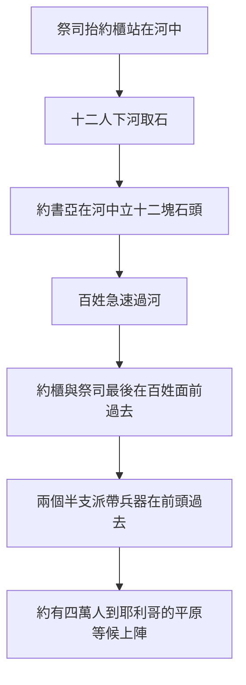

# 約書亞記 第4章

<!-- chapter-navigation:start -->
| [前一章](../06%20約書亞記/第3章.md) |  | [下一章](../06%20約書亞記/第5章.md) |
| :--- | :---: | ---: |
<!-- chapter-navigation:end -->

1. 國民盡都過了[[約但河]]，耶和華就對[[約書亞]]說：
2. 你從民中要揀選十二個人，每支派一人，
3. 吩咐他們說：你們從這裡，從[[約但河]]中、祭司腳站定的地方，取[[十二塊石頭]]帶過去，放在你們今夜要住宿的地方。
4. 於是，[[約書亞]]將他從以色列人中所預備的那十二個人，每支派一人，都召了來。
5. 對他們說：你們下[[約但河]]中，[[希伯來人_過河的人|過到]]耶和華─你們神的[[約櫃]]前頭，按著以色列人十二支派的數目，每人取一塊石頭扛在肩上。
6. 這些石頭在你們中間可以作為[[作為證據的記號（ot）|證據]]。日後，[[傳於後代|你們的子孫問你們說]]：這些石頭是什麼意思？
7. 你們就對他們說：這是因為[[約但河]]的水在耶和華的[[約櫃]]前斷絕；約櫃過約但河的時候，約但河的水就斷絕了。這些石頭要作以色列人[[永遠的紀念（zi.ka.ron）|永遠的紀念]]。
8. 以色列人就照[[約書亞]]所吩咐的，按著以色列人支派的數目，從[[約但河]]中取了[[十二塊石頭]]，都遵耶和華所吩咐約書亞的行了。他們把石頭帶過去，到他們所住宿的地方，就放在那裡。
9. [[約書亞]][[約但河中的十二塊石頭是另一堆還是同一堆|另把十二塊石頭]]立在[[約但河]]中，在抬[[約櫃]]的祭司腳站立的地方；[[直到今日]]，那石頭還在那裡。
10. 抬[[約櫃]]的祭司站在[[約但河]]中，等到耶和華曉諭[[約書亞]]吩咐百姓的事辦完了，[[摩西吩咐約書亞的話出處不明|是照摩西所吩咐約書亞的一切話]]。於是百姓急速過去了。
11. 眾百姓盡都過了河，耶和華的[[約櫃]]和祭司就在百姓面前過去。
12. [[流便]]人、[[迦得（萬幸）|迦得人]]、[[瑪拿西|瑪拿西半支派]]的人都照[[摩西]]所吩咐他們的，[[帶著兵器（cha.mush）|帶著兵器]]在以色列人前頭過去。
13. [[過河的四萬人與留守的七萬人|約有四萬人]]都準備打仗，在耶和華面前過去，到[[耶利哥]]的平原，[[迦南人未趁渡河攻擊的原因|等候上陣]]。
14. 當那日，耶和華使[[約書亞]]在以色列眾人眼前[[使你尊大（ga.dal）|尊大]]。在他平生的日子，百姓[[敬畏神|敬畏]]他，[[摩西與約書亞的權柄差異|像從前敬畏摩西一樣]]。
15. 耶和華曉諭[[約書亞]]說：
16. 你吩咐抬[[約櫃|法櫃]]的祭司從[[約但河]]裡上來。
17. [[約書亞]]就吩咐祭司說：你們從[[約但河]]裡上來。
18. 抬耶和華[[約櫃]]的祭司從[[約但河]]裡上來，腳掌剛落旱地，約但河的水就流到原處，仍舊漲過兩岸。
19. [[正月初十日（過河日期）|正月初十日]]，百姓從[[約但河]]裡上來，就在[[吉甲]]，在[[耶利哥]]的東邊安營。
20. 他們從[[約但河]]中取來的那[[十二塊石頭]]，[[約書亞]]就立在[[吉甲]]，
21. 對以色列人說：日後[[傳於後代|你們的子孫問他們的父親說]]：這些石頭是什麼意思？
22. 你們就告訴他們說：以色列人曾走乾地過這[[約但河]]；
23. 因為耶和華─你們的神在你們前面使[[約但河]]的水[[使水乾了（ho.vish）|乾了]]，等著你們過來，就如耶和華─你們的神從前在我們前面使[[紅海分開|紅海]]乾了，等著我們過來一樣，
24. 要使地上萬民都知道，[[耶和華的手]]大有能力，也要使你們永遠[[敬畏神|敬畏耶和華]]─你們的神。

---

## 本章知識節點

### 人物
- [[約書亞]]
- [[摩西]]
- [[流便]]
- [[迦得（萬幸）]]
- [[瑪拿西]]

### 地點
- [[約但河]]
- [[吉甲]]
- [[耶利哥]]

### 主題
- [[約櫃]]
- [[十二塊石頭]]
- [[直到今日]]
- [[摩西與約書亞的權柄差異]]
- [[過河的四萬人與留守的七萬人]]

### 原文
- [[永遠的紀念（zi.ka.ron）]]
- [[作為證據的記號（ot）]]
- [[使水乾了（ho.vish）]]
- [[使你尊大（ga.dal）]]
- [[帶著兵器（cha.mush）]]
- [[希伯來人_過河的人]]

### 神學
- [[傳於後代]]
- [[敬畏神]]
- [[耶和華的手]]

### 歷史
- [[紅海分開]]
- [[逾越節]]

### 背景
- [[正月初十日（過河日期）]]
- [[迦南人未趁渡河攻擊的原因]]

### 解經爭議
- [[瑪拿西半支派為何留在河東]]
- [[約但河中的十二塊石頭是另一堆還是同一堆]]
- [[摩西吩咐約書亞的話出處不明]]

### 互文
- [[西2：11-12 與基督同死同復活]]

---

## 本章整理

### 全國都過來了，然後神說要撿石頭（v1-8）

第1節用一句話交代了整件大事：「國民盡都過了約但河。」GT《研經資料》說原文開頭有一個「當」字，和合本沒有譯出來，這個字告訴讀者，接下來要記的事都發生在眾民過河之後。二十四節的篇幅裡，渡河只佔一句，其餘全在講一堆石頭。

神的吩咐分兩層。先揀選十二個人，每支派一人——這批人在書3:12 就已經選好了，[[約書亞]]這時只是把他們召來。然後叫他們回到[[約但河]]河床上、[[約櫃]]前頭祭司站定的地方，各扛[[十二塊石頭|一塊石頭]]上岸。

石頭有多大，經文沒說，但用了「扛在肩上」。CT 由這個動作推斷石頭相當大、需要用肩扛，並記下一則猶太人的傳說：每塊石頭上寫有本支派的名字。有意思的是，同一位註釋者到第20節又從同一個細節推回相反的方向——既然是人用肩扛過去的，就不會很大，在耶利哥平原其實很不起眼。

GT《研經資料》注意到一個文法上的呼應：第3、8節的「經過」是使役型態，意思是石頭被人帶過河，正如以色列人是被神帶過約但河一樣。STEP語言資料可以印證這個形態差異——第3節「帶過去」是 ve./ha.'a.var.Tem（H5674C，Hiphil），第13節記百姓自己「過去」則是 'a.ve.Ru（H5674A，Qal）。CT 另外指出，第5節「過到」的字根與「[[希伯來人_過河的人|希伯來人]]」相同，而這個字根在書3、書4 兩章一共出現二十二次。

第6節說明用途：這些石頭要在他們中間作[[作為證據的記號（ot）|證據]]。CT 的原文字義給「證據」的就是「記號」，並說這是指具有意義的記號。GT《研經資料》把聖經裡幾件同類的東西並排出來——民17:10 亞倫的杖留在法櫃前作記號、賽55:13 松樹與番石榴向那國度作記號、出12:13 逾越節以血為記號。第7節再往前一步，說這些石頭要作以色列人[[永遠的紀念（zi.ka.ron）|永遠的紀念]]；GT《研經資料》指出這個希伯來字在約書亞記中只出現這一次。

### 河中那一堆，看不見的紀念碑（v9-10）

第9節突然轉向：約書亞另把十二塊石頭立在約但河中，祭司腳站立的地方，「[[直到今日]]，那石頭還在那裡」。這一句在約書亞記裡是固定寫法，GT《綜合解讀》把它的用法分成兩種——有時解釋某件事物的來歷（書4:9、書6:25、書7:26、書8:28、書9:27、書13:13、書14:14、書15:63、書16:10），有時應用到當時的讀者身上（書22:3、書22:17、書23:9）；GT《聖經精讀本》則說「今日」指的是記錄本書之時。

這一堆石頭到底是不是另一堆，各家並不一致（見 [[約但河中的十二塊石頭是另一堆還是同一堆]]）：

| 讀法 | 主張的來源 | 理由 |
|---|---|---|
| 兩堆，河中另立一座 | GT《雷氏研讀本》、GT《串珠聖經注釋》、BH | 經文字面如此，立石地方有兩處 |
| 同一堆，句子該譯成「約書亞將本來在約但河中的十二塊石頭立起來」 | GT《丁道爾聖經注釋》、GT《綜合解讀》引英文NIV版 | 第8至10節是重複回顧的筆法；希伯來文法不會半路只提一次新題目 |
| 記成兩件事，但註明有另一種學者意見 | GT《研經資料》 | 自己讀成兩件事，並說「不過大部分譯本不持這樣的看法」 |

CT 承認經文留了空白：石頭是堆壘在一起還是有秩序安放，另外這十二塊又是從哪裡取來的，聖經都沒有說。KC 讀到的是另一面——這座紀念碑一旦水流回來就再也看不見了；而約書亞在這裡所做的，看來並不是神吩咐他的。

第10節收尾時補了一句「是照[[摩西吩咐約書亞的話出處不明|摩西所吩咐約書亞的一切話]]」。CT 直說聖經並未記載[[摩西]]曾吩咐約書亞如何渡過約但河；GT《研經資料》同樣說找不到出處，並補上一條版本線索：七十士譯本中沒有這句話。

### 兩個半支派走在最前面（v11-14）

第11節說約櫃和祭司「在百姓面前過去」——最先下水的，最後上岸。KC 由此說，水能不能流回來取決於約櫃在哪裡：約櫃進去，水就讓路；約櫃離開，水就流回；百姓的安全繫於約櫃的位置。

[[流便]]人、[[迦得（萬幸）|迦得]]人、[[瑪拿西|瑪拿西半支派]]的人[[帶著兵器（cha.mush）|帶著兵器]]走在以色列人前頭，履行他們在摩西面前立過的約。GT《研經資料》說「帶著兵器」原文是「列以戰陣」，並說這意味著他們在迦南爭戰的開始。人數是[[過河的四萬人與留守的七萬人|約有四萬人]]，而照民26:2 所記，這三個支派能打仗的戰士共有十一萬零五百八十人——過河的大約只有三分之一（見 [[瑪拿西半支派為何留在河東]]）。GT《綜合解讀》說「都準備打仗」原文是「裝備好的軍隊」，表明這些人是特選的精銳；GT《丁道爾聖經注釋》乾脆把和合本的「四萬人」讀為四十個「帶兵器的部隊」。

他們到了[[耶利哥]]的平原就「等候上陣」，而對岸的迦南人整場都沒有出手（見 [[迦南人未趁渡河攻擊的原因]]）。GT《丁道爾聖經注釋》給了三個可能的理由：以色列人的行動十分突然，過河地點在亞當城以南、出人意外且不易涉水，加上晚銅時期迦南人口集中的地方不多，耶利哥並不是主要聚居之地。CT 的說法簡短一些：時間、地點和方式都出人意外，迦南人沒有來得及阻擊。

第14節是全章的一個小高峰：「當那日，耶和華使約書亞在以色列眾人眼前[[使你尊大（ga.dal）|尊大]]。」GT《丁道爾聖經注釋》說這裡應驗了神在書3:7 的應許，所用的言辭也類似，是整段過河敘事的結語。==經文接著補的那半句才是重點：百姓[[敬畏神|敬畏]]他，像從前敬畏摩西一樣。==這句話把整章反覆出現的「照摩西所吩咐」收攏起來（見 [[摩西與約書亞的權柄差異]]）。

### 約櫃一上岸，水就回來了（v15-19）

第15至18節把第11節再講一次，這回從祭司的角度。神吩咐約書亞、約書亞吩咐祭司、祭司照著上來——GT《丁道爾聖經注釋》說整個過河事件由祭司開始、也由祭司結束，被放進神所命定的儀式情境裡。第16節這裡不叫約櫃而叫「法櫃」，STEP語言資料顯示是 'a.Ron ha./'e.Dut（H5715，簡要詞典義 e.dut: testimony）。

水回得極快。祭司「腳掌剛落旱地，約但河的水就流到原處，仍舊漲過兩岸」。CT 由此推斷，停在上游亞當城附近的河水早已適時奔流而下。

第19節給了確切日期：[[正月初十日（過河日期）|正月初十日]]，百姓上岸，在[[吉甲]]、[[耶利哥]]東邊安營。CT 說這是[[逾越節]]前的第四天，也是挑選逾越節羔羊的日子（出12:3、出12:6）；KC 說神安排他們在必須開始為逾越節作預備的那一天進入迦南。至於年份，GT《綜合解讀》從申1:3、申32:50、申34:8 倒推，算出是摩西去世之後一個多月、出埃及第四十一年，大約主前1407年陽曆三至四月間；GT《研經資料》走同一條路卻算成摩西去世之後兩個月，並記下另有學者認為是摩西去世之後過一年兩個月才過約但河。

### 石頭立在吉甲，等孩子開口問（v20-24）

石頭最後立在吉甲。第21至24節把第6至7節的問答重述一次，內容卻換了重心：前面的答案講約櫃前的水怎麼斷絕，這裡的答案講「以色列人曾走乾地過這約但河」，並且立刻接上紅海。

> [!important]
> 第24節給出兩個目的，一個向外、一個向內：「要使地上萬民都知道，[[耶和華的手]]大有能力，也要使你們永遠敬畏耶和華─你們的神。」GT《丁道爾聖經注釋》把這兩層講得很清楚，並指出後半用的是第二人稱複數「你們」，對象是所有聽約書亞講話的以色列人。

這一段的重量落在教養上（見 [[傳於後代]]）。GT《聖經精讀本》說古代以色列還沒有系統的教育體系，家庭教育所佔的比例相當大，家庭就是傳承信仰的所在。KC 把話說得更直接：這些真理屬於基督徒家庭，父親必須能解釋主耶穌的死與住在那地有什麼關係，不該把這件事丟給教會裡的教師。BH 則把責任連到申6:6-9，說孩子的提問正是父親宣告神作為的機會。

### 三個「乾」字，兩代人（主題）

和合本在本章用「旱地」「乾地」「乾了」翻譯的，原文並不是同一個字。STEP語言資料顯示：

| 節 | 和合本 | 原文 | 簡要詞典義 |
|---|---|---|---|
| 4:18 | 腳掌剛落旱地 | he./cha.ra.Vah（H2724） | cha.ra.vah，dry ground |
| 4:22 | 曾走乾地過這約但河 | ba/i.ya.ba.Shah（H3004） | yab.ba.shah，dry land |
| 4:23 | 使約但河的水乾了 | ho.Vish（H3001） | ya.vesh，to wither |

前兩個是名詞，說的是腳踩到的地面；第三個是動詞而且是使役型態，說的是神對水做的事（見 [[使水乾了（ho.vish）]]）。第23節裡這個動詞用了兩次，一次給約但河，一次給紅海。

GT《丁道爾聖經注釋》在這裡注意到兩件事。其一，雖然出埃及的記錄中沒有用到「乾了」這個動詞，但喇合提到過紅海時曾用到（書2:10）。其二，第23節的人稱換了：講過約但河用「你們」，講[[紅海分開|過紅海]]卻改用「我們」，指約書亞和他那一代曾親身經歷的人；丁道爾說這個改變與書5:6 所提曠野四十年的飄流相符合。STEP語言資料顯示這一節的兩個動詞後綴確實不同。

> [!note]
> KC 與 CT 都把本章的兩堆石頭讀成信徒與基督同死、同復活的表徵，並引歌羅西書2:11-12（見 [[西2：11-12 與基督同死同復活]]）。這是新約神學的讀法；本章經文自己只記石頭在哪裡、為什麼立、以後要怎麼向孩子解釋。

**參考資料**
https://www.ccbiblestudy.org/Old%20Testament/06Josh/06CT04.htm
https://www.ccbiblestudy.org/Old%20Testament/06Josh/06GT04.htm
https://www.kingcomments.com/en/bible-studies/Jos/4
https://biblehub.com/study/joshua/4.htm
https://github.com/STEPBible/STEPBible-Data

<!-- appendix-links:start -->
## 附錄

### 相關地圖
- [[appendix/fhl_maps/maps/028|〈書圖一〉過約但河及征服南方諸王]]
<!-- appendix-links:end -->

<!-- chapter-navigation:start -->
| [前一章](../06%20約書亞記/第3章.md) |  | [下一章](../06%20約書亞記/第5章.md) |
| :--- | :---: | ---: |
<!-- chapter-navigation:end -->
