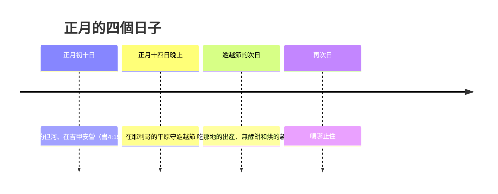

# 約書亞記 第5章

<!-- chapter-navigation:start -->
| [前一章](../06%20約書亞記/第4章.md) |  | [下一章](../06%20約書亞記/第6章.md) |
| :--- | :---: | ---: |
<!-- chapter-navigation:end -->

1. [[約但河]]西[[亞摩利人]]的諸王和靠海[[迦南人]]的諸王，聽見耶和華在以色列人前面使約但河的水乾了，等到我們過去，他們的心因以色列人的緣故就[[心消化（ma.sas）|消化了]]，不再有膽氣。
2. 那時，耶和華吩咐[[約書亞]]說：你製造[[火石刀]]，[[「第二次給以色列人行割禮」的含義之爭|第二次給以色列人行割禮]]。
3. [[約書亞]]就製造了[[火石刀]]，在[[除皮山（吉比亞特哈拉羅）|除皮山]]那裡給以色列人行[[割禮之約|割禮]]。
4. [[約書亞]]行[[割禮之約|割禮]]的緣故，是因為從埃及出來的眾民，就是一切能打仗的男丁，出了埃及以後，都死在曠野的路上。
5. 因為出來的眾民都受過[[割禮之約|割禮]]；惟獨出埃及以後、在曠野的路上所生的眾民都沒有受過割禮。
6. 以色列人[[曠野飄流四十年|在曠野走了四十年]]，等到國民，就是出埃及的兵丁，[[都消滅與都受完（ta.mam）|都消滅了]]，因為他們沒有聽從耶和華的話。耶和華曾向他們起誓，必不容他們看見耶和華向他們列祖起誓、應許賜給我們的地，就是[[流奶與蜜之地]]。
7. 他們的子孫，就是耶和華所興起來接續他們的，都沒有受過[[割禮之約|割禮]]；因為在路上沒有給他們行割禮，[[約書亞]]這才給他們行了。
8. 國民[[都消滅與都受完（ta.mam）|都受完了割禮]]，就住在營中自己的地方，[[戰前行割禮的軍事風險|等到痊癒了]]。
9. 耶和華對[[約書亞]]說：我今日將[[埃及的羞辱]]從你們身上滾去了。因此，那地方名叫[[吉甲]]（吉甲就是滾的意思），直到今日。
10. 以色列人在[[吉甲]]安營。正月十四日晚上，在[[耶利哥]]的平原守[[逾越節]]。
11. [[逾越節]]的次日，他們就吃了[[那地的出產與烘的穀|那地的出產]]；正當那日吃[[無酵餅]]和[[那地的出產與烘的穀|烘的穀]]。
12. 他們吃了[[那地的出產與烘的穀|那地的出產]]，第二日[[嗎哪]]就止住了，以色列人也不再有嗎哪了。那一年，他們卻吃[[迦南地]]的出產。
13. [[約書亞]]靠近[[耶利哥]]的時候，舉目觀看，不料，有一個人手裡有拔出來的刀，對面站立。約書亞到他那裡，問他說：你是幫助我們呢，是幫助我們敵人呢？
14. 他回答說：不是的，我來是要作[[耶和華軍隊的元帥]]。[[約書亞]]就俯伏在地下拜，說：我主有什麼話吩咐僕人。
15. [[耶和華軍隊的元帥]]對[[約書亞]]說：[[脫鞋與聖地|把你腳上的鞋脫下來]]，因為你所站的地方是聖的。約書亞就照著行了。

---

## 本章知識節點

### 人物
- [[約書亞]]
- [[亞摩利人]]
- [[迦南人]]

### 地點
- [[約但河]]
- [[吉甲]]
- [[耶利哥]]
- [[迦南地]]
- [[除皮山（吉比亞特哈拉羅）]]

### 原文
- [[心消化（ma.sas）]]
- [[「割禮」原文意義]]
- [[都消滅與都受完（ta.mam）]]
- [[無酵餅]]
- [[那地的出產與烘的穀]]

### 文化
- [[火石刀]]
- [[脫鞋與聖地]]

### 神學
- [[割禮之約]]
- [[割禮的意義]]
- [[流奶與蜜之地]]
- [[神的軍兵]]

### 歷史
- [[曠野飄流四十年]]
- [[逾越節]]

### 主題
- [[嗎哪]]
- [[戰前行割禮的軍事風險]]
- [[埃及的羞辱]]
- [[耶和華軍隊的元帥]]

### 背景
- [[古代近東割禮背景]]

### 解經爭議
- [[「第二次給以色列人行割禮」的含義之爭]]
- [[耶和華的使者是否為神顯現]]

---

## 本章整理

### 仗還沒打，對手先垮了（v1）

第1節先交代對面的情況：[[亞摩利人]]的諸王和[[迦南人]]的諸王聽見耶和華使[[約但河]]的水乾了，「他們的心因以色列人的緣故就[[心消化（ma.sas）|消化了]]，不再有膽氣」。

STEP語言資料顯示這一句有兩個並排的說法：「消化」是 va/i.yi.Mas le.va.Va/m（H4549 ma.sas 加 H3824 le.vav），「不再有膽氣」則是說他們裡面再沒有 ru.ach（H7307G，簡要詞典義 spirit）。CT 的原文字義給「膽氣」的是氣、風、靈，並說前一句形容恐懼戰兢的心態，後一句意指失去鬥志。

GT《約書亞記綜合解讀》把兩次神跡接起來：過紅海的神跡已經使迦南人的「心都消化了」（書2:9），過約旦河的神跡更讓諸王連天然屏障都失去了。GT《雷氏研讀本》說迦南的居民一直倚靠約但河作為以色列人入侵的屏障；GT《啟導本》說以色列人能在河水如此洶湧的情況下輕易越過敵方的天塹，難怪全地的人聞風膽喪。

KC 讀出一個分別：同樣是神的能力，在喇合那樣的人身上生出敬畏，在外邦人身上卻是憎惡的戰慄——不是內心的歸向，而是抵抗；他們退回堅固城裡去防守。

### 神給的第一道命令不是攻城（v2-7）

==按軍事常理，這是攻打[[耶利哥]]的最好時機；神卻叫百姓做一件完全相反的事。==第2節：「你製造[[火石刀]]，第二次給以色列人行割禮。」

火石刀在那個時代已經不是必需品。GT《啟導本》說以色列人此時生活在銅器時代、已有金屬刀可用，用火石刀行割禮或亦含有忌金屬之意（出20:25），此外也比金屬刀鋒利且衛生；GT《丁道爾聖經注釋》說最佳的解釋是一種黑曜石，並引米拉德指出古代近東許多地方都用黑曜石刀，即使在金屬刀發明之後仍然通用（見 [[古代近東割禮背景]]）。

「第二次」這三個字引起的問題比它解決的多（見 [[「第二次給以色列人行割禮」的含義之爭]]）。GT《研經資料》指出七十士譯本把它譯成「坐下」，並列出幾種讀法後說「此處正確的意義為何，我們已經不容易確定」；CT 與 GT《啟導本》則採較單純的算法——出埃及的一代都受過割禮，曠野出生的一代沒有，所以算第二次。

行禮的地點另有其名：[[除皮山（吉比亞特哈拉羅）|除皮山]]。CT 說原文是「包皮山」，大概在[[吉甲]]附近的一處高地，並猜測男子在那裡集中行割禮可能是為了避開婦女的眼目。

第4至7節解釋原因，而經文的重心不在割禮本身，在一整代人的結局：出埃及的男丁都死在[[曠野飄流四十年|曠野]]的路上，因為他們沒有聽從耶和華的話，神起誓不容他們看見那[[流奶與蜜之地]]。[[「割禮」原文意義|行割禮]]這個動作，是接在這段判詞後面的。

### 同一個字，兩代人的兩種「完了」（v6、v8）

第6節說老一代「都消滅了」，第8節說新一代「都受完了割禮」。中文看起來毫不相干，原文卻是同一組詞（見 [[都消滅與都受完（ta.mam）]]）。

| 節 | 和合本 | 原文（STEP語言資料） |
|---|---|---|
| 5:6 | 等到國民……都消滅了 | tom kol- ha./Goy（H8552 ta.mam 加 H1471A goy） |
| 5:8 | 國民都受完了割禮 | Ta.mu khol- ha./Goy（同一組詞） |

CT 在第8節的話中之光說這是鮮明的對比：老一代是在不順服中而「都死完了」，新一代卻是在順服中「都完成了」神的命令。GT《丁道爾聖經注釋》把它讀成一個文學結構——第7至8節是 A－B－A'－B' 的交錯，而差異由動詞 tmm 的雙關語加強，同一個字在書4:1、4:10、4:11 也起同樣作用。

### 最沒有戰力的那幾天（v8-9）

受完割禮之後，全營「住在營中自己的地方，等到痊癒了」（見 [[戰前行割禮的軍事風險]]）。這幾天的處境很清楚：KC 說這道命令意味著百姓完全失去作戰能力，有幾天他們無力抵擋任何攻擊；GT《研經資料》提醒創34:24-26 記載以色列的先祖就曾經利用割禮的疼痛攻擊過示劍人。

GT《綜合解讀》把該問的問題都問出來——為什麼不在河東的安全地帶行割禮？為什麼不分批行割禮？它的回答是，在人看來這是很不明智的自殘行動，以色列人也很清楚，但他們毫無保留地執行了命令。KC 的說法比較短：但神從不急促，祂知道自己在做什麼。

第9節神說話了：「我今日將[[埃及的羞辱]]從你們身上滾去了」，那地方因此叫吉甲。這句「羞辱」到底指什麼，各家給的不只一種：

| 讀法 | 主張的來源 |
|---|---|
| 出了埃及卻進不了迦南、死在曠野 | CT、GT《啟導本》、GT《雷氏研讀本》 |
| 前一代的不順服，以致飄流多年、倒斃曠野 | GT《丁道爾聖經注釋》 |
| 埃及人譏笑神領他們到曠野是要殺戮他們（出32:12；申9:28） | GT《串珠聖經注釋》 |
| 做奴隸、沒有自己國土的狀況，或指未受割禮的情況 | GT《研經資料》列為可能 |

> [!note]
> [[割禮之約]]與[[割禮的意義]]在本章是兩層事。前者是身分：CT 說割禮是神與亞伯拉罕立約的證據（創17:9-14），不受割禮就沒有資格守逾越節（出12:48）。後者是 KC 一路展開的讀法——火石是人手造不出來的材料，刀是把東西割去的器具，這指向神對人罪性的審判（羅8:3），而信徒的割禮是心裡的割禮（羅2:28-29）。這是 KC 的解經進路，本章經文只記下他們照做了。

### 逾越節、新食物、嗎哪止住（v10-12）

[[逾越節]]的次數各家算法不同：GT《綜合解讀》說這是第三次守、也是在應許之地第一次守，前兩次是出埃及那天（出12:11）和出埃及第二年離開西奈山之前（民9:1-5）；GT《串珠》說這次是離開埃及後第二次守；GT《聖經精讀本》說這是以色列百姓40年來第一次守逾越節。KC 注意到地點——就在耶利哥城牆前面守，耶和華在他們敵人面前為他們擺設筵席（詩23:5）。

第11節他們吃[[無酵餅]]和[[那地的出產與烘的穀|烘的穀]]。GT《研經資料》指出一個中文譯文蓋掉的細節：「烘的穀」原文沒有「穀」，這裡只是介紹加工的方法，是用「烘的」；GT《啟導本》與《串珠》都把它連到獻初熟之物的素祭（利2:14；利23:9-14）。STEP語言資料另顯示第11節與第12節的「出產」其實是兩個不同的字——'a.Vur（H5669）與 te.vu.'At（H8393）。

然後[[嗎哪]]止住了。CT 說嗎哪突然消失無蹤，也是一項神蹟奇事。KC 從供應的角度看這件事：神在祂的護理中供應嗎哪直到不再需要為止，有了正常的供應，神蹟就停下來。那一年他們吃的是[[迦南地]]的出產。

### 手裡拿刀的人（v13-15）

最後一段沒有戰術，只有一次相遇（見 [[耶和華軍隊的元帥]]）。[[約書亞]]靠近耶利哥，抬頭看見一個人手裡拿著拔出來的刀，就上前問：「你是幫助我們呢，是幫助我們敵人呢？」

回答是「不是的」。BH 說約書亞把眼前的事看成兩軍對壘、只等有人選邊，而元帥指出真正的問題是以色列願不願意順服耶和華的權柄。CT 在話中之光講同一件事：祂不是來幫忙的配角，而是來統帥的主角。

「元帥」在 STEP語言資料是 sar（H8269，簡要詞典義 ruler）加 tze.va'（H6635A，簡要詞典義 army）。GT《研經資料》說原文是「領袖」、而且是單數型態；GT《綜合解讀》把整句直譯成「我是耶和華軍隊的元帥，現在我來了」，並把這位單數的來者連到出23:23 神應許差在前面行的使者。至於[[神的軍兵|耶和華軍隊]]包括誰，CT 說指天使天軍、在此也可指以色列人的軍隊，GT《綜合解讀》說包括肉眼看不見的天使（創32:1-2；王下6:17）和以色列人（出12:41）。

他是誰，各家沒有一致答案（見 [[耶和華的使者是否為神顯現]]）。GT《啟導本》並列幾種看法：有解經家認為是神藉人形親自顯現，甚至有人解釋為道成肉身前的基督，但神也常常差遣天使，有的是統率天軍的天使長（但10:13；12:1）。GT《綜合解讀》給了三條理由主張是聖子；CT 在文意註解裡也加了「以人形顯現的神大概就是子神基督」的備註；BH 說他的權柄與接受敬拜的舉動指向道成肉身前的基督。

收尾的命令是[[脫鞋與聖地|把腳上的鞋脫下來]]，因為所站之地是聖的。GT《聖經精讀本》點出重點所在：並不是摩西與約書亞聽到此命令的地方本身聖潔，而是神所臨在之所皆為聖潔。GT《串珠》說約書亞這次經歷類似摩西在何烈山上的遭遇（出3:1-5）。

### 四件事的次序（主題）

本章的四件事排得很整齊，而且沒有一件是打仗。KC 把它列成征服迦南的四項預備：行割禮、守逾越節、吃烘的穀、以及站到耶和華軍隊元帥的權下。

更值得注意的是誰在動作。前三件都是百姓做的，而且每一件都讓他們更沒有戰鬥能力——先是幾天不能動，再是停下來守節，然後換掉吃了四十年的糧食。到第四件，動作的人換成神，而攻城的命令要到書6:2 才下。CT 在第2節的話中之光把這個次序的道理說了出來：屬靈的爭戰不在乎人做了多少準備，乃在乎人與神之間是否恢復了正確的關係。

**參考資料**
https://www.ccbiblestudy.org/Old%20Testament/06Josh/06CT05.htm
https://www.ccbiblestudy.org/Old%20Testament/06Josh/06GT05.htm
https://www.kingcomments.com/en/bible-studies/Jos/5
https://biblehub.com/study/joshua/5.htm
https://github.com/STEPBible/STEPBible-Data

<!-- appendix-links:start -->
## 附錄

### 相關地圖
- [[appendix/fhl_maps/maps/028|〈書圖一〉過約但河及征服南方諸王]]
<!-- appendix-links:end -->

<!-- chapter-navigation:start -->
| [前一章](../06%20約書亞記/第4章.md) |  | [下一章](../06%20約書亞記/第6章.md) |
| :--- | :---: | ---: |
<!-- chapter-navigation:end -->
