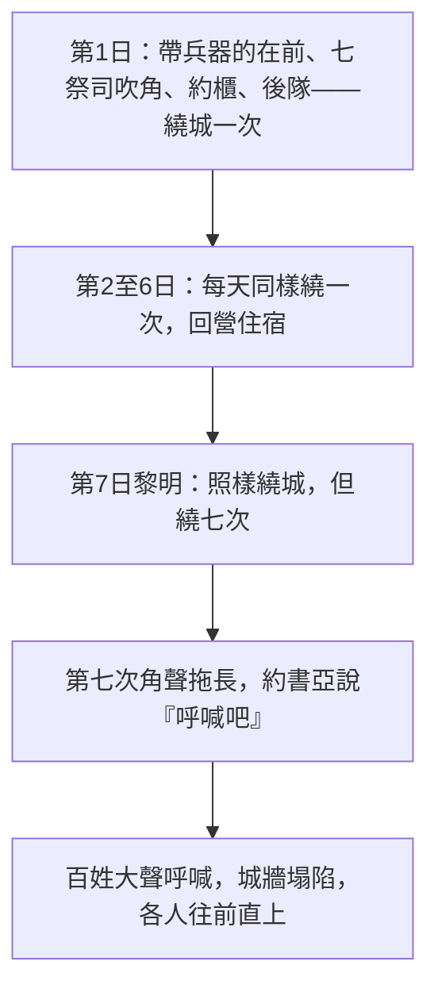

# 約書亞記 第6章

<!-- chapter-navigation:start -->
| [前一章](../06%20約書亞記/第5章.md) |  | [下一章](../06%20約書亞記/第7章.md) |
| :--- | :---: | ---: |
<!-- chapter-navigation:end -->

1. [[耶利哥]]的城門因以色列人就[[關得嚴緊（sa.gar）|關得嚴緊]]，無人出入。
2. 耶和華曉諭[[約書亞]]說：看哪，我已經把[[耶利哥]]和[[耶利哥王|耶利哥的王]]，並大能的勇士，都交在你手中。
3. 你們的一切兵丁要圍繞這城，[[繞城七日的攻城指示|一日圍繞一次]]，六日都要這樣行。
4. 七個祭司要拿七個羊角走在[[約櫃]]前。到第七日，你們要繞城七次，祭司也要吹角。
5. 他們吹的角聲拖長，你們聽見角聲，眾百姓要[[吹角的日子（te.ru.'Ah）|大聲呼喊]]，城牆就必塌陷，各人都要往前直上。
6. 嫩的兒子[[約書亞]]召了祭司來，吩咐他們說：你們抬起[[約櫃]]來，要有七個祭司拿七個羊角走在耶和華的約櫃前；
7. 又對百姓說：你們前去繞城，[[帶兵器（cha.lats）|帶兵器的]]要走在耶和華的[[約櫃]]前。
8. [[約書亞]]對百姓說完了話，七個祭司拿七個羊角走在耶和華面前吹角；耶和華的[[約櫃]]在他們後面跟隨。
9. [[帶兵器（cha.lats）|帶兵器的]]走在吹角的祭司前面，後隊隨著[[約櫃]]行。祭司一面走一面吹。
10. [[約書亞]]吩咐百姓說：你們不可呼喊，不可出聲，連一句話也不可出你們的口，等到我吩咐你們呼喊的日子，那時才可以呼喊。
11. 這樣，他使耶和華的[[約櫃]]繞城，把城繞了一次；眾人回到營裡，就在營裡住宿。
12. [[約書亞]]清早起來，祭司又抬起耶和華的[[約櫃]]。
13. 七個祭司拿七個羊角在耶和華的[[約櫃]]前，時常行走吹角；[[帶兵器（cha.lats）|帶兵器的]]在他們前面走，後隊隨著耶和華的約櫃行。祭司一面走一面吹。
14. 第二日，眾人把城繞了一次，就回營裡去。六日都是這樣行。
15. 第七日清早，黎明的時候，他們起來，照樣繞城七次；惟獨這日把城繞了七次。
16. 到了第七次，祭司吹角的時候，[[約書亞]]吩咐百姓說：呼喊吧，因為耶和華已經把城交給你們了！
17. 這城和其中所有的都要在耶和華面前[[滅絕（herem）|毀滅]]；只有妓女[[喇合]]與他家中所有的可以存活，因為他隱藏了我們所打發的使者。
18. 至於你們，務要謹慎，不可取那[[滅絕（herem）|當滅的物]]，恐怕你們取了那當滅的物就連累以色列的全營，使全營受咒詛。
19. 惟有金子、銀子，和銅鐵的器皿都要[[歸耶和華為聖的金銀銅鐵|歸耶和華為聖]]，必入耶和華的庫中。
20. 於是百姓呼喊，祭司也吹角。百姓聽見角聲，便[[吹角的日子（te.ru.'Ah）|大聲呼喊]]，[[耶利哥城陷落的考古與年代之爭|城牆就塌陷]]，百姓便上去進城，各人往前直上，將城奪取。
21. 又將城中所有的，不拘男女老少，牛羊和驢，[[殺盡耶利哥居民的道德難題|都用刀殺盡]]。
22. [[約書亞]]吩咐窺探地的兩個人說：你們進那妓女的家，照著你們向他所起的誓，將那女人和他所有的都從那裡帶出來。
23. 當探子的兩個少年人就進去，將[[喇合]]與他的父母、弟兄，和他所有的，並他一切的親眷，都帶出來，安置在以色列的營外。
24. 眾人就用火將城和其中所有的焚燒了；惟有金子、銀子，和銅鐵的器皿都放在耶和華殿的庫中。
25. [[約書亞]]卻把妓女[[喇合]]與他父家，並他所有的，都救活了；因為他隱藏了約書亞所打發窺探[[耶利哥]]的使者，他就住在以色列中，直到今日。
26. 當時，[[約書亞]]叫眾人起誓說：有興起[[重建耶利哥的咒詛|重修這耶利哥城]]的人，當在耶和華面前受咒詛。他立根基的時候，必喪長子，安門的時候，必喪幼子。
27. [[神的同在|耶和華與約書亞同在]]，約書亞的聲名傳揚遍地。

---

## 本章知識節點

### 人物
- [[約書亞]]
- [[耶利哥王]]
- [[喇合]]

### 地點
- [[耶利哥]]

### 主題
- [[約櫃]]
- [[繞城七日的攻城指示]]
- [[歸耶和華為聖的金銀銅鐵]]
- [[重建耶利哥的咒詛]]

### 原文
- [[關得嚴緊（sa.gar）]]
- [[帶兵器（cha.lats）]]
- [[吹角的日子（te.ru.'Ah）]]
- [[禧年（第五十年）]]

### 文化
- [[建在城牆上的房子]]

### 背景
- [[古代近東的圍城戰與營壘]]

### 神學
- [[安息日]]
- [[滅絕（herem）]]
- [[初熟果子]]
- [[神的同在]]

### 解經爭議
- [[迦南滅絕命令的歷史範圍]]
- [[耶利哥城陷落的考古與年代之爭]]
- [[殺盡耶利哥居民的道德難題]]

### 互文
- [[來十一30 因信城牆倒塌]]

---

## 本章整理

### 一扇關死的城門（v1）

全章從對手的動作開始：「[[耶利哥]]的城門因以色列人就[[關得嚴緊（sa.gar）|關得嚴緊]]，無人出入。」

STEP語言資料顯示這裡是同一個字根連用兩次——so.Ge.ret u./me.su.Ge.ret，都是 H5462（sa.gar），前一個是 Qal 主動分詞、後一個是 Pual 分詞。CT 因此標成「關得嚴緊(原文雙同字)」，並說意指不僅關上、且用閂鎖緊；GT《研經資料》給的中文更直接：原文是「關閉關閉」，用連續兩個關閉來加強語氣。

這一節同時說了兩件事。GT《研經資料》說它一方面顯示防禦的狀況，另一方面也一語雙關地暗示了耶利哥人的恐懼；BH 說這樣的防禦顯出的是懼怕而不是自信。GT《綜合解讀》把它接回前面：耶利哥人已經聽說了神的大能（書2:10），但城門卻關得嚴緊，表明他們的心對神也關閉了——整個城裡只有喇合的窗戶是向著神敞開的。

### 一套不像攻城法的攻城法（v2-10）

第2節神先宣告結果：「我已經把耶利哥和[[耶利哥王|耶利哥的王]]，並大能的勇士，都交在你手中。」CT 說這是勝利的宣告——實際的戰爭還沒有開始，卻「已經」宣告得勝。KC 說這一節是所謂的預言性完成式，神說的不是將要做，而是已經做成——「I've done it, the city is all in your power, as sure as if it already is in your possession」。

接著是[[繞城七日的攻城指示|指示本身]]，內容全是走路、吹角和喊一聲：

這套方法之所以刺眼，是因為它不是當時的常規（見 [[古代近東的圍城戰與營壘]]）。GT《研經資料》直說：合理攻佔耶利哥城的方式是圍城，但以色列人沒有時間採用這樣的方式；GT《啟導本》說以此城的防禦工事之堅固，只長於遊牧的以色列人是難攻破的。KC 注意到一件事——本章沒有拔出一把刀，並引林後10:4 說我們爭戰的兵器本不是屬血氣的。

隊伍的排法也把重點寫了出來。[[帶兵器（cha.lats）|帶兵器的]]走在前面，七個祭司吹角，[[約櫃]]跟著，後隊隨在約櫃後面。CT 說吹角的祭司和約櫃位於隊伍的中心；GT《綜合解讀》說這就像他們在曠野中行軍的隊形一樣（民10:14-28）；KC 說重點不在百姓而在約櫃，百姓一切的力量只在約櫃那裡找得到。

第10節還加了一道命令：不可呼喊、不可出聲，連一句話也不可出口。CT 說只聞角聲、絲毫沒有人聲，含意是屏息靜待神的行動；BH 說以色列在曠野常因懼怕的抱怨與不信的言語犯罪，如今被召在神的引導下安靜等候。

### 羊角、第七日與安息（v4、v15）

角的種類值得停一下。STEP語言資料顯示「羊角」是 shof.Rot hai./yov.Lim（H7782 sho.phar 加 H3104），而 H3104 的簡要詞典義正是 yo.vel: jubilee/horn。KC 據此說公羊角宣告的是[[禧年（第五十年）|禧年]]——第五十年，奴僕得釋放、地業歸回原主（利25:8-13），用這種角攻城顯示這件事與其說是軍事的，不如說是宗教的。GT《啟導本》也把第七日繞城七次、吹長號、大聲呼喊連到利25:8-10 的禧年號角。

第七日本身也有講究。CT 說據推算這日是[[安息日]]，本來安息日不可作工（申16:8），但「不作工」是指不辦自己的私事、不隨自己的私意、不說自己的私話（賽58:13），遵照神的吩咐作工是可以的（太12:5）。GT《綜合解讀》說這一日同時是無酵節的第七日、嚴肅會，並給出同樣的分辨。

### 呼喊與塌陷（v16-20）

第16節約書亞說「呼喊吧，因為耶和華已經把城交給你們了」——城牆還立著。STEP語言資料顯示這個呼喊是 ya.Ri.'u ... [[吹角的日子（te.ru.'Ah）|te.ru.'Ah]] ge.do.Lah（H7321 ru.a 加 H8643）；GT《研經資料》說這個字可以指戰爭中的呼喊，也可以指宗教節慶中的呼喊，此處可能是一語雙關。

==四套來源在這一點上完全一致：喊聲發在城牆倒下之前，所以那是信心的動作，不是勝利之後的歡呼。==CT 說這是一個敢在毫無勝利徵兆的時候、單憑神的話向神索取所應許之勝利的信心；KC 說這顯示我們在得勝發生之前就已經為所賜的得勝感謝；BH 與 KC 都反覆引來11:30 作為新約的判語（見 [[來十一30 因信城牆倒塌]]）。

城牆怎麼倒的、哪一年倒的，反而沒有共識（見 [[耶利哥城陷落的考古與年代之爭]]）：

| 立場 | 主張的來源 |
|---|---|
| 主前1400年左右，加斯唐的發掘可證 | GT《聖經精讀本》、GT《李道生舊約聖經問題總解》 |
| 甘仁（Kenyon）的反對建立在「以色列人於主前一二五O年佔領迦南」的預設上 | GT《艾基斯舊約聖經難題彙編》 |
| 大部分學者與考古證據傾向西元前十三世紀出埃及 | GT《研經資料》 |
| 沒有任何一個遺址被確定是約書亞傾倒，仍是未解問題 | GT《研經資料》 |
| 可能是地震，但那樣的地震時間就充滿奇蹟和局限性 | GT《雷氏研讀本》 |

### 全城歸神，只有一家例外（v17-25）

第17至19節把處置寫得很清楚：全城要[[滅絕（herem）|在耶和華面前毀滅]]，不可取那當滅的物，只有金銀銅鐵[[歸耶和華為聖的金銀銅鐵|歸耶和華為聖]]、入耶和華的庫中。GT《綜合解讀》說第17節的「毀滅」與第18節的「當滅」原文是同一個字，意思是完全地奉獻、完全地毀壞。耶利哥之所以全毀，各家一致指向它是[[初熟果子|迦南地的初熟果子]]；而後來的城不再照這個規格，這個前後差異各家也都注意到了（見 [[迦南滅絕命令的歷史範圍]]）。

> [!note]
> 第21節「都用刀殺盡」是本章最多註釋要處理的一節（見 [[殺盡耶利哥居民的道德難題]]）。CT、GT《綜合解讀》《艾基斯》《聖經精讀本》《靈修版》與 KC 各自給了理由，而好幾份來源都主動補上界線：CT 說新約時代的信徒並非靠著肉體為神打仗（林後10:4-5），GT《綜合解讀》說神並沒有命令新約的信徒發動聖戰、我們應當先用公義來省察自己。

例外只有一家。[[喇合]]和她全家被兩個探子帶出來、安置在營外。她的房子[[建在城牆上的房子|建在城牆上]]，而那一段城牆沒有倒——CT 說耶利哥城牆約有十公尺高、且是雙重城牆，若非神的作為不容易多處塌陷，而她家所在的城牆卻完好無恙；GT《研經資料》坦白說聖經並沒有特別說明或記載她家如何得救。CT 說她後來成了探子之一撒門的妻子，有分於主耶穌的家譜（太1:5）。

### 一句不准重建的誓（v26-27）

打下一座城，收尾卻是禁止重建（見 [[重建耶利哥的咒詛]]）。各家一致把咒詛限定在軍事設防上：CT 說指修造使成為堅固的軍事設防城，非指修建供平民居住。GT《研經資料》解釋兩個時間點——「立根基」是工程的開始階段，「安城門」是最後階段；GT《綜合解讀》讀出其中的分量：立根基時已經嚴重警告，那人卻不顧咒詛堅持到安門。CT 說這咒詛於主前870年應驗在伯特利人希伊勒身上（王上16:34）。

最後一節把全章收在一句話上：「耶和華與[[約書亞]]同在，約書亞的聲名傳揚遍地」（見 [[神的同在]]）。KC 說約書亞的成功不在於他傑出的軍事領導，而在於耶和華與他同在，並說沒有什麼比「神與他同在」這個確據更能高舉一個人。

### 這一章沒有做的事（主題）

把本章缺席的東西列出來，比列出發生的事更能看出它的形狀：沒有雲梯、沒有撞城錘、沒有圍城斷糧、沒有談判、也沒有任何一場短兵相接的描寫。經文花了十九節寫怎麼走路、什麼時候可以出聲，然後用一節寫城牆倒了。

KC 把這件事說成一個次序：以色列不必做什麼就能讓城牆倒下，但這不表示他們可以待在家裡；他們奉命繞城，而繞城本身也沒有促成城牆倒塌。CT 從另一頭說同一件事：只有神的權能可以使耶利哥的城垣塌陷，但是以色列人必須繞著城走。

第2節與第16節是同一句話的兩次出現——神先說「我已經把耶利哥和耶利哥的王，並大能的勇士，都交在你手中」，約書亞在第七圈之後說「耶和華已經把城交給你們了」。中間隔著的，正是那七天。

**參考資料**
https://www.ccbiblestudy.org/Old%20Testament/06Josh/06CT06.htm
https://www.ccbiblestudy.org/Old%20Testament/06Josh/06GT06.htm
https://www.kingcomments.com/en/bible-studies/Jos/6
https://biblehub.com/study/joshua/6.htm
https://github.com/STEPBible/STEPBible-Data

<!-- appendix-links:start -->
## 附錄

### 相關地圖
- [[appendix/fhl_maps/maps/028|〈書圖一〉過約但河及征服南方諸王]]
<!-- appendix-links:end -->

<!-- chapter-navigation:start -->
| [前一章](../06%20約書亞記/第5章.md) |  | [下一章](../06%20約書亞記/第7章.md) |
| :--- | :---: | ---: |
<!-- chapter-navigation:end -->
