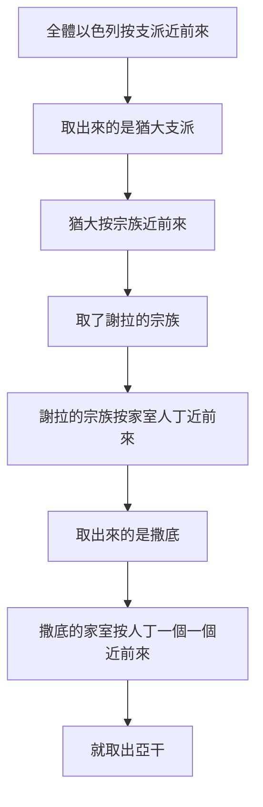

# 約書亞記 第7章

<!-- chapter-navigation:start -->
| [前一章](../06%20約書亞記/第6章.md) |  | [下一章](../06%20約書亞記/第8章.md) |
| :--- | :---: | ---: |
<!-- chapter-navigation:end -->

1. 以色列人在[[滅絕（herem）|當滅的物]]上[[犯了罪（ma.al）|犯了罪]]；因為[[猶大支派]]中，[[謝拉]]的曾孫，撒底的孫子，迦米的兒子[[亞干]]取了當滅的物；[[一人犯罪全營受累|耶和華的怒氣就向以色列人發作]]。
2. 當下，[[約書亞]]從[[耶利哥]]打發人往[[伯特利]]東邊、靠近[[伯亞文]]的[[艾|艾城]]去，吩咐他們說：你們上去窺探那地。他們就上去窺探艾城。
3. 他們回到[[約書亞]]那裡，對他說：眾民不必都上去，[[攻艾城失敗的原因|只要二三千人上去]]就能攻取[[艾|艾城]]；不必勞累眾民都去，因為那裡的人少。
4. 於是民中約有三千人上那裡去，竟在[[艾|艾城]]人面前逃跑了。
5. [[艾|艾城]]的人擊殺了他們三十六人，從城門前追趕他們，直到[[示巴琳]]，在下坡殺敗他們；眾民的心就[[心消化（ma.sas）|消化如水]]。
6. [[約書亞]]便[[古代哀悼習俗|撕裂衣服]]；他和[[以色列的長老]][[古代哀悼習俗|把灰撒在頭上]]，在耶和華的[[約櫃]]前俯伏在地，直到晚上。
7. [[約書亞]]說：哀哉！主耶和華啊，你為什麼竟領這百姓過[[約但河]]，將我們交在[[亞摩利人]]的手中，使我們滅亡呢？我們不如住在約但河那邊倒好。
8. 主啊，以色列人既在仇敵面前轉背逃跑，我還有什麼可說的呢？
9. [[迦南人]]和這地一切的居民聽見了就必圍困我們，將我們的名從地上除滅。那時[[你為你的大名要怎樣行呢]]？
10. 耶和華吩咐[[約書亞]]說：起來！你為何這樣俯伏在地呢？
11. 以色列人[[犯了罪（ma.al）|犯了罪]]，違背了我所吩咐他們的約，取了[[滅絕（herem）|當滅的物]]；又偷竊，又行詭詐，又把那當滅的放在他們的家具裡。
12. 因此，以色列人在仇敵面前站立不住。他們在仇敵面前轉背逃跑，是因成了被咒詛的；你們若不把當滅的物從你們中間除掉，我就不再與你們同在了。
13. 你起來，叫百姓[[自潔]]，對他們說：你們要自潔，預備明天，因為耶和華─以色列的神這樣說：以色列啊，你們中間有[[滅絕（herem）|當滅的物]]，你們若不除掉，在仇敵面前必站立不住！
14. 到了早晨，你們要按著支派近前來；耶和華所取的支派，要按著宗族近前來；耶和華所取的宗族，要按著家室近前來；耶和華所取的家室，要按著人丁，一個一個的近前來。
15. 被取的人有當滅的物在他那裡，他和他所有的必被火焚燒；因他違背了耶和華的約，又因他在以色列中行了愚妄的事。
16. 於是，[[約書亞]]清早起來，使以色列人按著支派近前來，取出來的是[[猶大支派]]；
17. 使[[猶大支派]]（原文是宗族）近前來，就取了[[謝拉]]的宗族；使謝拉的宗族，按著家室人丁，一個一個的近前來，取出來的是撒底；
18. 使撒底的家室，按著人丁，一個一個的近前來，就取出[[猶大支派]]的人[[謝拉]]的曾孫，撒底的孫子，迦米的兒子[[亞干]]。
19. [[約書亞]]對[[亞干]]說：我兒，我勸你[[將榮耀歸給耶和華]]─以色列的神，在他面前[[認罪]]，將你所做的事告訴我，不要向我隱瞞。
20. [[亞干]]回答[[約書亞]]說：我實在得罪了耶和華─以色列的神。我所做的事如此如此：
21. 我在所奪的財物中看見一件美好的[[示拿|示拿衣服]]，二百[[舍客勒]]銀子，[[一條金子（le.shon za.hav）|一條金子]]重五十舍客勒，我就[[貪戀|貪愛]]這些物件，[[亞干犯罪的四個步驟|便拿去了]]。現今藏在我帳棚內的地裡，銀子在衣服底下。
22. [[約書亞]]就打發人跑到[[亞干]]的帳棚裡。那件衣服果然藏在他帳棚內，銀子在底下。
23. 他們就從帳棚裡取出來，拿到[[約書亞]]和以色列眾人那裡，放在耶和華面前。
24. [[約書亞]]和以色列眾人把[[謝拉]]的曾孫[[亞干]]和那銀子、那件衣服、那條金子，並[[亞干的兒女為何同受刑罰|亞干的兒女]]、牛、驢、羊、帳棚，以及他所有的，都帶到[[亞割谷]]去。
25. [[約書亞]]說：你為什麼連累我們呢？今日耶和華必叫你受連累。於是以色列眾人[[石刑|用石頭打死他]]，將石頭扔在其上，又用火焚燒他所有的（他所有的原文作他們）。
26. 眾人在[[亞干]]身上[[堆石頭作記號|堆成一大堆石頭]]，直存到今日。於是耶和華轉意，不發他的烈怒。因此那地方名叫[[亞割谷]]（亞割就是連累的意思），[[直到今日]]。

---

## 本章知識節點

### 人物
- [[約書亞]]
- [[亞干]]
- [[猶大支派]]
- [[謝拉]]
- [[亞摩利人]]
- [[迦南人]]

### 地點
- [[艾]]
- [[伯特利]]
- [[伯亞文]]
- [[耶利哥]]
- [[約但河]]
- [[示巴琳]]
- [[示拿]]
- [[亞割谷]]

### 主題
- [[約櫃]]
- [[認罪]]
- [[直到今日]]
- [[攻艾城失敗的原因]]
- [[亞干犯罪的四個步驟]]
- [[將榮耀歸給耶和華]]
- [[堆石頭作記號]]

### 原文
- [[犯了罪（ma.al）]]
- [[心消化（ma.sas）]]
- [[一條金子（le.shon za.hav）]]
- [[舍客勒]]
- [[貪戀]]
- [[烏陵和土明]]

### 文化
- [[以色列的長老]]

### 背景
- [[石刑]]
- [[古代哀悼習俗]]

### 神學
- [[滅絕（herem）]]
- [[自潔]]
- [[一人犯罪全營受累]]
- [[你為你的大名要怎樣行呢]]

### 解經爭議
- [[亞干的兒女為何同受刑罰]]

### 互文
- [[申24：16|申24：16 不可因子殺父也不可因父殺子]]
- [[何2：15 亞割谷成為指望的門]]

---

## 本章整理

### 一個人動手，整個民族被點名（v1）

本章第一節就把結論寫在最前面，而且用了兩種主語：先說「以色列人在當滅的物上犯了罪」，接著才說是[[亞干]]取了當滅的物，最後說「耶和華的怒氣就向以色列人發作」。動手的是一個人，被追究的是全體（見 [[一人犯罪全營受累]]）。

STEP語言資料顯示，「[[犯了罪（ma.al）|犯了罪]]」在這裡是同一個字根的動詞加名詞連用——va/i.yim.'a.Lu 加 Ma.'al（H4603 與 H4604，簡要詞典義都作 ma.al，分別是 be unfaithful 與 unfaithfulness）。GT《丁道爾聖經注釋》從這裡讀出一個刻意的安排：這三個希伯來字母也出現在前一節「他的聲名傳揚遍地」一語中，順序也相同，「這是刻意的對比」——約書亞因為耶利哥而威名遠播，以色列的不忠卻惹動了神的忿怒。

四套來源在一個人的罪為什麼算在全民頭上這件事上沒有分歧，只是各自從不同角度說。CT 說這是一人連累眾人，顯明屬神的人乃是一個共同體、禍福與共；GT《聖經精讀本》說以色列不僅是血緣的共同體，還是共同侍奉一位神的立約共同體；KC 說我們其中一個人所做的事，對別人不會沒有後果；BH 說雖然只有一個人犯罪，立約的百姓卻要以一個身體的身分被追究。

亞干的身分被寫得特別詳細。GT《約書亞記研經資料》說約書亞記中僅有亞干被列出四代家譜；CT 在話中之光指出這份家譜的反諷——家譜本是亞干承受產業的依據，現在卻成為神定罪他的根據。他所屬的[[猶大支派]]與祖先[[謝拉]]也因此被寫進記錄；BH 說猶大是雅各祝福中得王權的支派（創49:10），如今卻因罪進入其中而受查驗。

### 一場不該輸的敗仗（v2-5）

[[約書亞]]從[[耶利哥]]打發人去窺探[[艾|艾城]]——那城在[[伯特利]]東邊、靠近[[伯亞文]]。探子回報「眾民不必都上去，只要二三千人上去就能攻取艾城」，結果三千人上去，反而在艾城人面前逃跑，被殺三十六人。

各家對敗因的歸納不完全一樣，值得並排看（見 [[攻艾城失敗的原因]]）：

| 來源 | 給的原因 |
|---|---|
| GT《啟導本聖經約書亞記註釋》 | 亞干犯罪連累全民（主因）、只派少數軍隊攻城的輕敵、攻城前不像耶利哥戰役那樣尋求神的指引 |
| GT《聖經精讀本》 | 亞干隱藏戰利品的罪惡，加上百姓陶醉於勝利、驕傲地從戰而沒有求問耶和華 |
| CT | 輕敵不是主因；主因是以色列軍隊的元帥在這次攻擊戰中沒有發出命令，主帥的沉默使進攻沒有根據 |
| GT《丁道爾聖經注釋》 | 這場戰役的描述可謂獨一無二，只有這裡沒有提到約書亞在率領 |
| KC | 約書亞下令時沒有求問耶和華，而且是從耶利哥、不是從吉甲打發人出去 |
| BH | 沒有記載約書亞在攻艾之前求問耶和華 |

「那裡的人少」這個判斷本身就是錯的。CT 回頭用書8:25 校正：艾城的居民有一萬二千人。CT 在話中之光把兩代探子放在一起看——三十八年前窺探迦南的十個探子過於自卑，認為「自己就如蚱蜢一樣」（民13:33），現在這些探子卻過於自信。

敗退的終點叫[[示巴琳]]。CT 說它位於艾城與耶利哥之間，字義「缺口」，可能指坡地上的一處凹陷的地方；GT《綜合解讀》說得更貼切——艾城守軍居高臨下追擊，一直追到示巴琳，而「示巴琳」的意思是「缺口」，正如以色列人中間也出現了缺口。地勢也是實在的：CT 說艾城的海拔約800公尺、耶利哥僅約300公尺，故地勢呈下坡。

最後半句寫的是士氣。STEP語言資料顯示「眾民的心就[[心消化（ma.sas）|消化如水]]」是 va/i.yi.Mas le.vav- ha./'Am va/y.Hi le./Ma.yim（H4549，簡要詞典義 ma.sas: to melt）。CT 說這形容士氣渙散、失去勇氣；KC 注意到方向反了過來——這一次融化的是神百姓的心，不是仇敵的心。

### 撕裂衣服，和一句關於神名的問話（v6-9）

約書亞的反應是整套哀悼的動作：[[古代哀悼習俗|撕裂衣服]]，他和[[以色列的長老]]把灰撒在頭上，在耶和華的[[約櫃]]前俯伏在地直到晚上。GT《聖經精讀本》說當希伯來人陷入極大的痛苦與苦惱時，他們便會撕裂衣服並把灰撒在頭上；GT《研經資料》說「直到晚上」顯示約書亞的哀痛不是短時間的情緒表現，並指出「以色列的長老」原文是複數型態，應該是指各支派的領袖。KC 另外注意到一個對比：攻取耶利哥時約櫃佔中心位置，攻打艾城時卻完全沒有提到約櫃，戰敗之後約書亞才回到約櫃前自卑。

他的話分兩層。前半是質問：「你為什麼竟領這百姓過[[約但河]]，將我們交在[[亞摩利人]]的手中」——CT 說『亞摩利人』身材高大，居住在約但河兩岸高地，GT《研經資料》說這個名字是「山居者」之意、泛指迦南地的原住民。KC 直說這段禱告帶著一點責備，好像神要為這場敗仗負責，這不是出於信心。

後半才是重點：「[[迦南人]]和這地一切的居民聽見了就必圍困我們，將我們的名從地上除滅。那時[[你為你的大名要怎樣行呢]]？」STEP語言資料顯示這一節出現兩次同一個字 shem（H8034）：一次是「我們的名」，一次是「你的大名」。CT 說以色列的名聲關係到神的大名，並直說約書亞最怕的還是耶和華的名受羞辱；BH 說他是訴諸耶和華在列國中的尊榮，正如摩西在西乃之後所做的（出32:11-14）。

### 神的答覆：五項罪與一道程序（v10-15）

神的第一句話是打斷：「起來！你為何這樣俯伏在地呢？」接著把問題講明白。第11節一口氣列出五項：

1. 違背了我所吩咐他們的約
2. 取了當滅的物
3. 又偷竊
4. 又行詭詐
5. 又把那當滅的放在他們的家具裡

STEP語言資料顯示這五項在原文之間各有一個 ve./Gam（H1571，簡要詞典義 gam: also）串起來，動詞依序是 'a.ve.Ru、la.ke.Chu、ga.ne.Vu（H1589，to steal）、ki.cha.Shu（H3584，to deceive）與 Sa.mu（H7760H）。反覆出現的關鍵字是「當滅的物」（見 [[滅絕（herem）]]）——GT《綜合解讀》說原文是「被奉獻的東西、完全獻上」，特指必須被奉獻給神的東西；第12節說以色列「成了被咒詛的」，GT《研經資料》指出這個「被咒詛的」原文就是「當滅之物」。KC 把這件事說得很直白：本該歸耶和華的東西被亞干拿去歸了自己，東西在耶利哥人手上是放錯了地方，在亞干手上同樣是放錯了地方。

除罪的程序從[[自潔]]開始。STEP語言資料顯示第13節的兩個動詞是同一個字根（H6942G，簡要詞典義 qa.dash: to consecrate），先是命令約書亞使百姓成聖，再是命令百姓自己成聖。CT 說「自潔」指沐浴洗身、洗衣服（出19:10）；GT《丁道爾聖經注釋》則從情境判斷，按約書亞記的處境與以下幾節的戰爭用語來看，這裡應當是指為打仗而自潔；BH 提醒這道吩咐讓人想起書3:5 過約但河之前的自潔。

### 從十二支派縮到一個人（v14-18）

第14節給的辦法是一層一層縮小範圍，第16至18節則照樣執行了一次：

經文沒有說「取」是怎麼取的。GT《雷氏研讀本》直接說是抽籤；GT《啟導本》說可能是抽籤，舊約時代常用此法尋求神旨（撒上10:20；14:41），所用工具或為掛在大祭司胸牌裡的[[烏陵和土明]]；GT《串珠聖經注釋》說這裡沒有說明用什麼方法取出，可能是用烏陵和土明（出28:30；撒上28:6）。GT《華爾頓約書亞記背景注釋》給的意見最保留——經文並沒有說明辦法，部分譯本加上「拈鬮」字樣，但在以色列拈鬮通常是在答案有隨機成分之時才用得著，而這時他們所尋求的是神諭；鑒於事先的自潔程式，他們可能不是用任何方法，而是直接領受神的訊息。BH 說很可能是藉著擲聖籤。

### 「我兒」（v19-21）

找到人之後，約書亞沒有立刻行刑。他說：「我兒，我勸你[[將榮耀歸給耶和華]]─以色列的神，在他面前[[認罪]]，將你所做的事告訴我，不要向我隱瞞。」CT 說『我兒』是以父執身分勸諭晚輩的稱呼，而『將榮耀歸與……神』意指承認神是無所不知、無所不能的，在祂面前是不能掩蓋、隱藏的。GT《丁道爾聖經注釋》指出這個說法別處從未出現過，只有瑪拉基書2:2 有一個類似的句子。KC 從兩面讀這一句：一面是約書亞沒有咒罵亞干、也沒有稱他為賊，顯出他把自己看得與亞干相連；另一面是這與其說是請求不如說是命令，因為全部真相被承認時神就得著尊榮。

亞干的供詞把一件罪拆成四拍（見 [[亞干犯罪的四個步驟]]）：看見、貪愛、拿去、藏。STEP語言資料顯示這四個動作在原文各有其字，其中「貪愛」是 va./'ech.me.De/m（H2530A，簡要詞典義 cha.mad: to desire）——CT 與 GT《丁道爾聖經注釋》都指出這正是十誡中「[[貪戀|不可貪戀]]」所用的那個動詞（出20:17；申5:21）。GT《丁道爾》又把第一步接回伊甸園：亞干的罪起於他看見一件美好的東西，而在伊甸園女人犯罪時也是用同一個字描述（創3:6）。

他拿的三樣東西各有背景。「[[示拿]]衣服」是巴比倫的舶來品，CT 說它以金線和絲線為材料、用精細手工編織而成，價款不貲；銀子二百[[舍客勒]]，GT《綜合解讀》換算成2.28公斤，說大約是當時一個雇工17年的工資；「[[一條金子（le.shon za.hav）|一條金子]]」的「條」在原文是 la.shon（H3956I，簡要詞典義 la.shon: tongue: bar），GT《雷氏研讀本》說這樣的金條已經出土，尺寸為10 x 1 x 0.5英寸。

### 亞割谷（v22-26）

贓物被起出來、放在耶和華面前，然後亞干和他所有的都被帶到[[亞割谷]]。約書亞的判詞與地名是同一個字根——STEP語言資料顯示第25節的「連累」是 'a.khar.Ta./nu 與 ya'.kor./Kha（H5916，簡要詞典義 a.khar: to trouble），第26節的地名是 'E.mek a.Khor（H6010G 加 H5911）。CT 在話中之光說兩個詞的字根相同，是雙關語；GT《丁道爾聖經注釋》說得一樣。經文自己也在括號裡註明了：「亞割就是連累的意思」。

行刑用的是[[石刑]]，而 CT 注意到石頭被動用了兩次——第一次是扔石打死，第二次是扔石掩蓋。STEP語言資料也顯示第25節前後用了兩個不同的動詞（H7275 ra.gam 與 H5619 sa.qal），中間夾著火焚。最後留下的是一個記號（見 [[堆石頭作記號]]）：眾人在亞干身上堆成一大堆石頭。CT 說這是堆石作記號（參創31:51-52）；BH 說石堆的持續存在表示這件事已經進入以色列被記住的歷史，並把它連回書4:9 約書亞在約但河中所立的十二塊石頭。兩處都用「[[直到今日]]」收尾。

> [!question]
> 第24節把亞干的兒女一併帶到亞割谷，而[[申24：16|申24:16]] 明說「不可因子殺父，也不可因父殺子」。各家給的理由並不相同（見 [[亞干的兒女為何同受刑罰]]）：CT、GT《雷氏研讀本》《啟導本》《串珠》與 KC 都認為家人知情或同謀；GT《聖經精讀本》把四種看法並列，其中一種是加爾文認為亞干的家族與耶利哥居民受到了同樣的懲罰；GT《研經資料》指出七十士譯本沒有第24節這些文字，並說到底亞干的兒女有沒有被殺、我們不是很確定；GT《靈修版聖經注釋》則說聖經雖然沒有說他們同謀犯罪，但是古時把家族當作一個整體。BH 在同一節下提醒，以色列的律法同樣維持個人在神面前的責任。

### 這一章在約書亞記裡的位置（主題）

KC 把第六章與第七章的關係說成一組對照：第六章看見的是神的能力，第七章看見的是人的軟弱，連信徒也一樣。GT《研經資料》說約書亞記大部分是記載成功的書卷，書7 卻是例外的一章。

收尾的那一句話值得注意：「於是耶和華轉意，不發他的烈怒。」CT 說『轉意』意指不再紀念以色列人的過錯。而這個以災禍命名的谷，後來被先知重新指定了用途——CT、GT《啟導本》《聖經精讀本》、KC 與 BH 都把它接到[[何2：15 亞割谷成為指望的門|何2:15「又賜她亞割谷作為指望的門」]]；KC 的說法是，在施行審判的地方，通往有盼望之將來的門就開了。

==本章從一個人手裡的三樣贓物開始，最後停在一個地名上。== 中間發生的每一件事——敗仗、哀求、自潔、掣籤、行刑——都是為了把那三樣東西從營中除掉。

**參考資料**
https://www.ccbiblestudy.org/Old%20Testament/06Josh/06CT07.htm
https://www.ccbiblestudy.org/Old%20Testament/06Josh/06GT07.htm
https://www.kingcomments.com/en/bible-studies/Jos/7
https://biblehub.com/study/joshua/7.htm
https://github.com/STEPBible/STEPBible-Data

<!-- appendix-links:start -->
## 附錄

### 相關地圖
- [[appendix/fhl_maps/maps/028|〈書圖一〉過約但河及征服南方諸王]]
<!-- appendix-links:end -->

<!-- chapter-navigation:start -->
| [前一章](../06%20約書亞記/第6章.md) |  | [下一章](../06%20約書亞記/第8章.md) |
| :--- | :---: | ---: |
<!-- chapter-navigation:end -->
