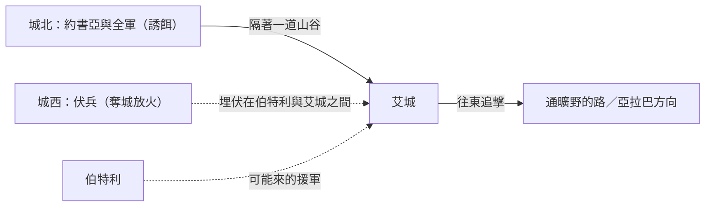
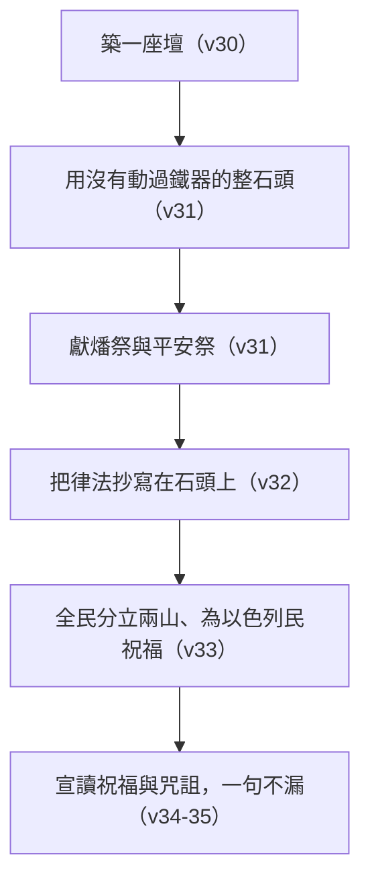

# 約書亞記 第8章

<!-- chapter-navigation:start -->
| [前一章](../06%20約書亞記/第7章.md) |  | [下一章](../06%20約書亞記/第9章.md) |
| :--- | :---: | ---: |
<!-- chapter-navigation:end -->

1. 耶和華對[[約書亞]]說：不要懼怕，也不要驚惶。你起來，率領一切兵丁上[[艾|艾城]]去，我已經把[[艾城王|艾城的王]]和他的民、他的城，並他的地，都交在你手裡。
2. 你怎樣待[[耶利哥]]和耶利哥的王，也當照樣待[[艾|艾城]]和[[艾城王|艾城的王]]。只是城內所奪的財物和牲畜，你們可以取為自己的[[艾城准取掠物的轉變|掠物]]。你要在城後設下[[伏兵（a.rav）|伏兵]]。
3. 於是，[[約書亞]]和一切兵丁都起來，要上[[艾|艾城]]去。約書亞選了[[三萬與五千伏兵人數之爭|三萬大能的勇士]]，夜間打發他們前往，
4. 吩咐他們說：你們要在城後[[伏兵（a.rav）|埋伏]]，不可離城太遠，都要各自準備。
5. 我與我所帶領的眾民要向城前往。城裡的人像初次出來攻擊我們的時候，我們就在他們面前逃跑，
6. 他們必出來追趕我們，直到我們[[詐敗誘敵|引誘他們離開城]]；因為他們必說：這些人像初次在我們面前逃跑。所以我們要在他們面前逃跑，
7. 你們就從[[伏兵（a.rav）|埋伏]]的地方起來，奪取那城，因為耶和華─你們的神必把城交在你們手裡。
8. 你們奪了城以後，就放火燒城，要照耶和華的話行。這是我吩咐你們的。
9. [[約書亞]]打發他們前往，他們就上[[伏兵（a.rav）|埋伏]]的地方去，住在[[伯特利]]和[[艾|艾城]]的中間，就是在艾城的西邊。這夜約書亞卻在民中住宿。
10. [[約書亞]]清早起來，點齊百姓，他和[[以色列的長老]]在百姓前面上[[艾|艾城]]去。
11. 眾民，就是他所帶領的兵丁，都上去，向前直往，來到城前，在[[艾|艾城]]北邊安營。在[[約書亞]]和艾城中間有一山谷。
12. 他挑了[[三萬與五千伏兵人數之爭|約有五千人]]，使他們[[伏兵（a.rav）|埋伏]]在[[伯特利]]和[[艾|艾城]]的中間，就是在艾城的西邊，
13. 於是安置了百姓，就是城北的全軍和城西的[[伏兵（a.rav）|伏兵]]。這夜[[約書亞]]進入山谷之中。
14. [[艾城王|艾城的王]]看見這景況，就和全城的人，清早急忙起來，[[按所定的時候（mo.ed）|按所定的時候]]，出到[[亞拉巴]]前，要與以色列人交戰；王卻不知道在城後有[[伏兵（a.rav）|伏兵]]。
15. [[約書亞]]和以色列眾人在他們面前[[詐敗誘敵|裝敗]]，往那通[[曠野]]的路逃跑。
16. 城內的眾民都被招聚，追趕他們；[[艾|艾城]]人追趕的時候，就[[詐敗誘敵|被引誘離開城]]。
17. [[艾|艾城]]和[[伯特利]]城沒有一人不出來追趕以色列人的，撇了敞開的城門，去追趕以色列人。
18. 耶和華吩咐[[約書亞]]說：你向[[艾|艾城]]伸出手裡的[[短鎗（ki.don）|短鎗]]，因為我要將城交在你手裡。約書亞就向城伸出手裡的短鎗。
19. 他一伸手，[[伏兵（a.rav）|伏兵]]就從[[伏兵（a.rav）|埋伏]]的地方急忙起來，奪了城，跑進城去，放火焚燒。
20. [[艾|艾城]]的人回頭一看，不料，[[古代近東的戰場傳訊方式|城中煙氣沖天]]，他們就無力向左向右逃跑。那往[[曠野]]逃跑的百姓便轉身攻擊追趕他們的人。
21. [[約書亞]]和以色列眾人見[[伏兵（a.rav）|伏兵]]已經奪了城，[[古代近東的戰場傳訊方式|城中煙氣飛騰]]，就轉身回去，擊殺[[艾|艾城]]的人。
22. [[伏兵（a.rav）|伏兵]]也出城迎擊[[艾|艾城]]人，艾城人就困在以色列人中間，前後都是以色列人。於是以色列人擊殺他們，沒有留下一個，也沒有一個逃脫的，
23. 生擒了[[艾城王|艾城的王]]，將他解到[[約書亞]]那裡。
24. 以色列人在田間和[[曠野]]殺盡所追趕一切[[艾|艾城]]的居民。艾城人倒在刀下，直到滅盡；以色列眾人就回到艾城，用刀殺了城中的人。
25. 當日殺斃的人，連男帶女共有一萬二千，就是[[艾|艾城]]所有的人。
26. [[約書亞]]沒有收回手裡所伸出來的[[短鎗（ki.don）|短鎗]]，直到把[[艾|艾城]]的一切居民[[滅絕（herem）|盡行殺滅]]。
27. 惟獨城中的牲畜和財物，以色列人都取為自己的[[艾城准取掠物的轉變|掠物]]，是照耶和華所吩咐[[約書亞]]的話。
28. [[約書亞]]將[[艾|艾城]]焚燒，使城永為[[荒堆（tel）|高堆]]、荒場，直到今日；
29. 又將[[艾城王]][[掛在木頭上_懸屍示眾|掛在樹上]]，直到晚上。日落的時候，[[約書亞]]吩咐人[[被掛在木頭上與基督被掛在樹上_徒5_30_加3_13|把屍首從樹上取下來]]，丟在[[城門口公共場合|城門口]]，在屍首上堆成一大堆石頭，直存到今日。
30. [[以巴路山立約段落的位置之爭|那時，約書亞在以巴路山上]]為耶和華─以色列的神[[築壇|築一座壇]]，
31. 是用[[土壇|沒有動過鐵器的整石頭]]築的，照著耶和華僕人[[摩西]]所吩咐以色列人的話，正如摩西律法書上所寫的。眾人在這壇上給耶和華奉獻[[燔祭]]和[[平安祭]]。
32. [[約書亞]]在那裡，當著以色列人面前，將[[摩西]]所寫的律法[[立石寫律法的儀式|抄寫在石頭上]]。
33. 以色列眾人，無論是本地人、是[[寄居的]]，和長老、[[以色列人的官長|官長]]，並[[審判官]]，都站在[[約櫃]]兩旁，在抬耶和華約櫃的祭司[[利未支派|利未人]]面前，一半對著[[基利心山與以巴路山|基利心山]]，一半對著[[基利心山與以巴路山|以巴路山]]，[[兩山宣告祝福與咒詛的儀式|為以色列民祝福]]，正如耶和華僕人[[摩西]]先前所吩咐的。
34. 隨後，[[約書亞]]將律法上[[祝福與咒詛|祝福、咒詛的話]]，照著律法書上一切所寫的，都宣讀了一遍。
35. [[摩西]]所吩咐的一切話，[[約書亞]]在以色列全會眾和婦女、孩子，並他們中間[[寄居的]]外人面前，沒有一句不宣讀的。

---

## 本章知識節點

### 人物
- [[約書亞]]
- [[摩西]]
- [[艾城王]]
- [[以色列人的官長]]
- [[利未支派]]

### 地點
- [[艾]]
- [[伯特利]]
- [[耶利哥]]
- [[亞拉巴]]
- [[曠野]]
- [[基利心山與以巴路山]]

### 主題
- [[約櫃]]
- [[詐敗誘敵]]
- [[艾城准取掠物的轉變]]
- [[兩山宣告祝福與咒詛的儀式]]
- [[祝福與咒詛]]
- [[立石寫律法的儀式]]
- [[築壇]]

### 原文
- [[伏兵（a.rav）]]
- [[短鎗（ki.don）]]
- [[按所定的時候（mo.ed）]]
- [[荒堆（tel）]]
- [[寄居的]]
- [[審判官]]

### 神學
- [[滅絕（herem）]]
- [[燔祭]]
- [[平安祭]]
- [[土壇]]

### 文化
- [[以色列的長老]]

### 歷史
- [[掛在木頭上_懸屍示眾]]
- [[城門口公共場合]]

### 背景
- [[古代近東的戰場傳訊方式]]

### 互文
- [[被掛在木頭上與基督被掛在樹上_徒5_30_加3_13|被掛在木頭上與基督被掛在樹上（徒5:30、加3:13）]]

### 解經爭議
- [[三萬與五千伏兵人數之爭]]
- [[以巴路山立約段落的位置之爭]]

---

## 本章整理

### 神先開口，然後才有第二次攻城（v1-2）

上一章結束在亞割谷的石堆下，本章第一句就是神主動說話：「不要懼怕，也不要驚惶。」CT 指出這已經是神第三次叫[[約書亞]]「起來」——前兩次（書七10、13）是要他停止哀傷、對付敗因，這一次是要他積極進取。GT《約書亞記研經資料》把這句話接回全書的開頭，說它「讓人想起神在一開始 1：9 給約書亞的應許」。CT 另外解釋約書亞在怕什麼：「一則害怕以色列軍心渙散(參書七8)，二則恐怕迦南七族的人聯軍來犯(參書七9)」。

神的吩咐裡有三件與上一次不同的事。第一是規模：這次要「率領一切兵丁」。GT《聖經精讀本──約書亞記註解》認為這個用詞是刻意的，「似乎是為了與探子『只要二、三千人上去』的輕率報告(7：3)進行對比」。第二是保證：GT《研經資料》指出「交」在你手裏的語氣是完成式，「強調『一定會給』」。第三是戰術——神親口指示「你要在城後設下[[伏兵（a.rav）|伏兵]]」，這是耶利哥那一戰沒有出現過的東西。

神同時預先交代了戰後怎麼分（見 [[艾城准取掠物的轉變]]）：人口照[[耶利哥]]的辦法處理，財物和牲畜卻可以「取為自己的掠物」。KC 在本章開頭給了一句總結性的觀察：罪可以被赦免，但罪的後果仍然要承擔；回到蒙福的路上所花的力氣，比一開始就避開惡要多。GT《研經資料》還注意到一個容易略過的細節——神連「他的地」都給了，而[[艾|艾城]]不像耶利哥，住進去不會落在書6:26 的咒詛裡。

### 三萬、五千，和兩個晚上（v3-13）

約書亞的部署寫得比全書任何一場戰役都細，但也因此留下一個數字上的難題（見 [[三萬與五千伏兵人數之爭]]）：第3節說他選了三萬大能的勇士夜間前往，第12節卻說他挑了約有五千人埋伏在同一個位置。

| 讀法 | 內容 | 出處 |
|---|---|---|
| 抄寫之誤 | 三萬太大，伏兵應是五千 | GT《串珠聖經注釋》所列第一說 |
| 兩隊伏兵 | 兩支部隊分別埋伏，第二支攔截伯特利的援軍 | GT《串珠》第二說、CT、GT《綜合解讀》 |
| 三十個單位 | 「三十千」應作「三十個首領」 | GT《雷氏研讀本》 |
| 三十隊人馬 | 他選了三十個三千，即三十隊人馬 | GT《丁道爾聖經注釋》 |

夜行軍本身是一個判斷。GT《丁道爾聖經注釋》說「在古代近東很少有晚上作戰的，夜間可以偽裝、突擊，在以寡敵眾的時候，是最佳的辦法」；GT《研經資料》估算伏兵夜間大約走了16公里繞到艾城西邊。埋伏的位置由地形決定，GT《綜合解讀》說艾城西邊有一條比較深的旱溪（Wadi Sheban）可以藏兵，而經文說的「城後」就是「城的西邊」。STEP語言資料在這裡留下一個用字上的轉折：全章的「伏兵」多半是 'o.Rev（H693，簡要詞典義 a.rav: to ambush），只有第13節那句部署總結改用 a.ke.V/o（H6119，簡要詞典義 a.qev: heel，本節逐字解 rearguard/ its），GT《研經資料》正好點出這一點——城西的「伏兵」原文是「腳跟」、「軍隊的後衛」。

約書亞自己的兩個晚上，各家讀法不同。第9節說他「在民中住宿」，GT《綜合解讀》理解為他沒有參與埋伏，而是留在約旦河谷帶領百姓；第13節說他「進入山谷之中」，CT 說這「可能帶領少數親隨，擔任前哨，或為離眾禱告」，GT《綜合解讀》則從戰術上讀，說這樣「可以引誘敵軍居高臨下追擊他們」。至於第10節他和[[以色列的長老]]走在百姓前面，GT《研經資料》說領導人身先士卒「可能是為了平撫上次失敗的恐懼」。

### 王看見了他該看見的（v14-17）

[[艾城王]]的反應快得幾乎像是計畫的一部分。CT 說他看見的「這景況」就是以色列的陣容，可能因此判斷他們是烏合之眾；GT《聖經精讀本》講得更完整：卓越的戰略家看到這種佈局會懷疑內中有詐，他卻因過於相信上一次的勝利經驗而輕易斷定。CT 在話中之光把主導權交還給神——百姓若完全照耶和華的話行，神就負責讓「艾城的王」只看見約書亞所要他看的「城北的全軍」，卻看不見約書亞不讓他看的「城西的伏兵」。

和合本說他「按所定的時候」出戰，聽起來像在講時刻，原文卻另有一層（見 [[按所定的時候（mo.ed）]]）：STEP語言資料的簡要詞典義是 mo.ed: meeting: time appointed，本節逐字解卻作 to the/ appointed place，而 CT 與 GT 兩家都判定這裡指地點，也就是上次打敗以色列人的那塊地。他出到[[亞拉巴]]前——CT 說按原文可譯作「出到面向亞拉巴的路」，即面向約但河谷。

接下來是全章最需要紀律的一段（見 [[詐敗誘敵]]）。以色列人「裝敗」往通[[曠野]]的路逃，STEP語言資料顯示這個字是被動的 va/i.yi.na.ge.'U（H5060，本節逐字解 they were struck），第16節「被引誘離開城」也是被動的 va/i.yi.na.te.Ku（H5423，本節逐字解 they were drawn out）。連[[伯特利]]城也一個不留地出來追趕，「撇了敞開的城門」。KC 提醒這場戲的代價：用整支軍隊去打這座小城本身就是深深的羞辱，一半的百姓還得逃跑，這一次是必須的，因為它合乎神的計畫。

### 一支不放下的短鎗（v18-26）

第18節神再度開口，整場戲就此翻轉：「你向艾城伸出手裡的短鎗，因為我要將城交在你手裡。」STEP語言資料顯示這件兵器是 ba./ki.Don（H3591，簡要詞典義 ki.don: javelin），動詞是 na.tah（H5186, to stretch），而第26節的「沒有收回」是 he.Shiv（H7725G）。

它到底是什麼、又在做什麼，各家並不一致（見 [[短鎗（ki.don）]]）。GT《啟導本聖經約書亞記註釋》說它或為裝有矛頭的標槍，並推測約書亞用矛頭反射日光通知城後的伏兵；GT《華爾頓約書亞記背景注釋》卻說很多學者認為這裡的武器並非短槍，而是著名的彎刀。功能上的分歧更直接：CT 說「短槍在此即指揮棒」，是發出攻城的信號指令；KC 明白表示那並不是給伏兵出來的信號，至少經文沒有這樣說，他注意的是那個一直不收回的姿勢。這個姿勢讓四套來源不約而同想起同一件舊事——GT《聖經精讀本》與《綜合解讀》都連到出17:9-12 摩西舉手與亞瑪力人爭戰，BH 也連到出14:16 摩西向海伸杖。

> [!note]
> 真正被經文寫成信號的是煙（見 [[古代近東的戰場傳訊方式]]）。CT 在第8節與第19節兩次註明放火燒城是「發出信號」，並說第20節的煙氣對艾城人是噩耗、第21節的同一股煙對以色列人是喜訊。GT《研經資料》補上戰場效果：火會讓城外的敵軍一面想抵抗、一面想回去救城，造成軍心與陣勢的混亂。

結局是徹底的（見 [[滅絕（herem）]]）：一萬二千人，連男帶女，全城的人。STEP語言資料顯示第26節「盡行殺滅」是 he.che.Rim（H2763A，簡要詞典義 cha.ram: to devote/destroy）。GT《綜合解讀》連刀都交代了：「刀」原文是「刀口」，以色列人進迦南時使用的是鐮刀形的埃及牛腿刀（Khopesh），只有一面有刃。GT《聖經精讀本》沒有迴避這一段讀起來的難受——它說本節的光景極其淒慘，似乎與神慈愛的屬性背道而馳，並把理由歸到神對罪與拜偶像的厭惡；CT 給的理由相同。

### 高堆、樹上、城門口（v27-29）

三個收尾動作，各自留下一個記號。

第一是城：約書亞把艾城焚燒，「使城永為高堆、荒場，直到今日」。STEP語言資料顯示「高堆」是 tel（H8510，簡要詞典義 tel: mound）（見 [[荒堆（tel）]]）。GT《綜合解讀》說這個字指的是中東常見的山丘狀廢墟——古代居民點歷經摧毀、夷平、重建而逐漸堆高，最後被放棄，今天以色列許多以 Tel 開頭的地名都是這樣來的。

第二是王：[[掛在木頭上_懸屍示眾|掛在樹上直到晚上]]。GT《丁道爾聖經注釋》說這與書10:26-27 亞摩利五王的處置類似，也與古代近東其他征服記錄接近，可以視為戰爭行為與宣傳手法。日落時[[被掛在木頭上與基督被掛在樹上_徒5_30_加3_13|把屍首從樹上取下來]]，照的是申21:22-23——KC 引了整段律法，說艾城的地界是產業的一部分，不可被玷污，並由此接到加3:13：基督為我們成了咒詛。

第三是石堆：屍首丟在[[城門口公共場合|城門口]]，上面堆成一大堆石頭。BH 說城門是公共聚集、司法判決與權柄之處，屍首放在那裡等於宣告這城的統治者再也不能保護或治理它的百姓。==而這已經是隔了一章的第二個石堆——GT《綜合解讀》把它與亞干那一堆並排：兩個都「直存到今日」，一個埋的是營裡犯罪的以色列人，一個埋的是營外抵擋神的迦南王。==

### 從戰場走到兩座山之間（v30-35）

第30節一句「那時」，場景就換到了以巴路山。這個轉折本身是個問題（見 [[以巴路山立約段落的位置之爭]]）：GT《綜合解讀》說[[基利心山與以巴路山|以巴路山]]在艾城北方大約33公里，位於示劍城北；GT《研經資料》說一般認為這一段應該是錯置到此處的，並指出七十士譯本把它放在書9:2 之後、死海古卷的一殘篇則放在書5:2 之前。另一派不必動段落也講得通：GT《雷氏研讀本》說示劍堅固城此時可能已經投降、或被攻取、或表示友善；GT《綜合解讀》說聖經沒有提到示劍的爭戰，可能當地的迦南人已經聞風而逃。CT 與 BH 都順著現有次序讀，CT 說以色列人進入中央山地的第一件事是照著[[摩西]]的吩咐築壇、重申聖約。

[[築壇]]的規格照的是舊命令（見 [[土壇]]）：STEP語言資料顯示「整石頭」是 'a.va.Nim she.le.Mot（H68G 加 H8003，簡要詞典義 sha.lem: complete），「沒有動過鐵器」是 lo'- he.Nif ... bar.Zel（H5130B，簡要詞典義 nuph: to wave）。CT 說這是不可切割、研磨和鑿劈，用意在保持渾然天成；他也承認這樣的壇「外貌一定是很不美觀」，但以色列人認定這是神的定意，就無條件遵行。壇上獻的只有[[燔祭]]和[[平安祭]]，GT《華爾頓約書亞記背景注釋》注意到這裡沒有贖罪祭與贖愆祭，並認為這壇似乎是特別為這一次的慶典築造，不是永久性建築。KC 順著同一個方向讀：這壇未經加工，全然完美。GT《研經資料》另記下考古上的對應——考古學家於以巴路山上挖掘到一座可能是這個祭壇的遺跡，寬7.6公尺、長10.6公尺、厚1.5公尺、高2.7公尺，裡面有動物的骨頭。

接著是文字（見 [[立石寫律法的儀式]]）。STEP語言資料顯示第32節寫的是 mish.Neh to.Rat mo.Sheh（H4932H，本節逐字解 <the> copy of，加 H8451 to.rah）。GT《啟導本》說抄寫的當為律法的精髓，方法是先在石頭上抹石灰再刻字（申27:2-3）；GT《華爾頓》把它放進當時的碑刻傳統——刻著漢摩拉比法典的石碑高達八呎、公開展示以便查閱，王室碑文通常安放在顯眼之處，古代近東的條約則常安置在聖處、一般人無法得見。

最後是人。第33節把在場的每一種身分都點名了：本地人、[[寄居的]]、長老、[[以色列人的官長|官長]]、[[審判官]]，都站在[[約櫃]]兩旁，在抬約櫃的祭司[[利未支派|利未人]]面前，一半對著基利心山、一半對著以巴路山（見 [[兩山宣告祝福與咒詛的儀式]]）。GT《聖經精讀本》說這個「一半……一半」的安排強調了神公義與慈愛的屬性；CT 說這個動作向眾人表明神的祝福是建基在律法的實行上。然後約書亞把律法上[[祝福與咒詛|祝福、咒詛的話]]照著律法書上一切所寫的宣讀一遍，第35節特別註明沒有一句不宣讀，聽的人包括婦女、孩子與寄居的外人。CT 提醒本節裡有兩個「一切」：一切的話，和一切的人。GT《華爾頓》說明了為什麼要念出來——在大部分人都是文盲的文化中，公開宣讀有宗教、文化、政治意義的文件是很重要的，好幾個赫人的條約都包括定期公開宣讀文約的條款。

### 這一章在全書的位置（主題）

KC 把第七、八兩章合起來讀成一課：對自己的審判先於對仇敵的審判；「聖靈的寶劍，就是神的道」必須先在我們自己身上做成潔淨的工作。他也把耶利哥、艾城與基遍三場戰役看作整卷書的三種範式——耶利哥顯出神的能力，艾城顯出人的軟弱，基遍顯出仇敵的狡猾。

兩座城的得勝方式差異，是四套來源都注意到的對照。CT 把它寫成一條原則：在耶利哥賜下得勝的是神，百姓只需要「繞城、呼喊」；在艾城賜下得勝的也是神，但百姓卻需要「埋伏、誘敵」。BH 說得更直接：得勝靠的是順從耶和華當下的吩咐，重複前一次的方法並不保證什麼。KC 則從屬靈經驗提出保留——艾城這一戰有大量人的動作，很能吸引喜歡行動的人，但耶利哥那種安靜的繞城才是把榮耀完全歸給神的。

地理上，這一章也把整卷書的形勢打開了。GT《綜合解讀》說從此百姓從約旦河谷進入了中央山地，切斷了南北大道，可以各個擊破南方（九至十章）和北方（十一章）的迦南諸王。前一章的敗仗停在一個以災禍命名的谷裡，這一章的結尾停在兩座山之間，全民站著聽完了整部律法。

**參考資料**
https://www.ccbiblestudy.org/Old%20Testament/06Josh/06CT08.htm
https://www.ccbiblestudy.org/Old%20Testament/06Josh/06GT08.htm
https://www.kingcomments.com/en/bible-studies/Jos/8
https://biblehub.com/study/joshua/8.htm
https://github.com/STEPBible/STEPBible-Data

<!-- appendix-links:start -->
## 附錄

### 相關地圖
- [[appendix/fhl_maps/maps/028|〈書圖一〉過約但河及征服南方諸王]]
<!-- appendix-links:end -->

<!-- chapter-navigation:start -->
| [前一章](../06%20約書亞記/第7章.md) |  | [下一章](../06%20約書亞記/第9章.md) |
| :--- | :---: | ---: |
<!-- chapter-navigation:end -->
