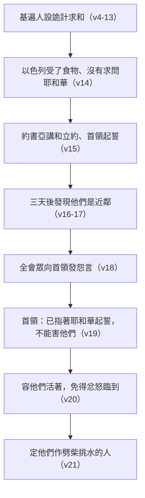

# 約書亞記 第9章

<!-- chapter-navigation:start -->
| [前一章](../06%20約書亞記/第8章.md) |  | [下一章](../06%20約書亞記/第10章.md) |
| :--- | :---: | ---: |
<!-- chapter-navigation:end -->

1. 約但河西，住山地、[[高原（Shephelah）|高原]]，並對著[[利巴嫩]]山沿[[大海（地中海）|大海]]一帶的諸王，就是[[赫人]]、[[亞摩利人]]、[[迦南人]]、[[比利洗人]]、[[希未人]]、[[耶布斯人]]的諸王，聽見這事，
2. 就都聚集，[[迦南諸王結盟|同心合意]]的要與[[約書亞]]和以色列人爭戰。
3. [[基遍]]的居民聽見[[約書亞]]向[[耶利哥]]和[[艾|艾城]]所行的事，
4. 就設[[詭計與謹慎（or.mah）|詭計]]，假充使者，拿舊口袋和破裂縫補的舊皮酒袋馱在驢上，
5. 將補過的舊鞋穿在腳上，把舊衣服穿在身上；他們所帶的餅都是乾的，長了霉了。
6. 他們到[[吉甲]]營中見[[約書亞]]，對他和以色列人說：我們是從遠方來的，現在求你與我們[[立約]]。
7. 以色列人對這些[[希未人]]說：只怕你們是住在我們中間的；若是這樣，怎能和你們[[立約]]呢？
8. 他們對[[約書亞]]說：我們是你的僕人。約書亞問他們說：你們是什麼人？是從哪裡來的？
9. 他們回答說：僕人從極遠之地而來，是因聽見耶和華─你神的名聲和他在埃及所行的一切事，
10. 並他向約但河東的兩個亞摩利王，就是[[希實本]]王西宏和在[[亞斯她錄]]的[[巴珊]]王噩一切所行的事。
11. 我們的長老和我們那地的一切居民對我們說：你們手裡要帶著路上用的食物去迎接以色列人，對他們說：我們是你們的僕人；現在求你們與我們[[立約]]。
12. 我們出來要往你們這裡來的日子，從家裡帶出來的這餅還是熱的；看哪，現在都乾了，長了霉了。
13. 這皮酒袋，我們盛酒的時候還是新的；看哪，現在已經破裂。我們這衣服和鞋，因為道路甚遠，也都穿舊了。
14. 以色列人受了他們些食物，[[沒有求問耶和華|並沒有求問耶和華]]。
15. 於是[[約書亞]]與他們講和，與他們[[立約]]，容他們活著；[[會眾的首領]]也向他們[[指著耶和華起誓的約束力|起誓]]。
16. 以色列人與他們[[立約]]之後，過了三天才聽見他們是近鄰，住在以色列人中間的。
17. 以色列人起行，第三天到了他們的城邑，就是[[基遍]]、[[基非拉]]、[[比錄]]、[[基列耶琳]]。
18. 因為[[會眾的首領]]已經指著耶和華─以色列的神向他們[[指著耶和華起誓的約束力|起誓]]，所以以色列人不擊殺他們；全會眾就向首領[[以色列人的怨言|發怨言]]。
19. [[會眾的首領|眾首領]]對全會眾說：我們已經指著耶和華─以色列的神向他們[[指著耶和華起誓的約束力|起誓]]，現在我們不能害他們。
20. 我們要如此待他們，容他們活著，免得有[[忿怒（qe.tseph）|忿怒]]因我們[[指著耶和華起誓的約束力|所起的誓]]臨到我們身上。
21. [[會眾的首領|首領]]又對會眾說：要容他們活著。於是他們為全會眾作了[[劈柴挑水的人]]，正如首領對他們所說的話。
22. [[約書亞]]召了他們來，對他們說：為什麼欺哄我們說我們離你們甚遠呢？其實你們是住在我們中間。
23. 現在你們是[[咒詛（a.rar 與 qa.vav）|被咒詛的]]！你們中間的人必斷不了作奴僕，為我神的殿作[[劈柴挑水的人]]。
24. 他們回答[[約書亞]]說：因為有人實在告訴你的僕人，耶和華─你的神曾吩咐他的僕人[[摩西]]，把這全地賜給你們，並在你們面前滅絕這地的一切居民，所以我們為你們的緣故甚怕喪命，就行了這事。
25. 現在我們在你手中，你以怎樣待我們為善為正，就怎樣做吧！
26. 於是[[約書亞]]這樣待他們，救他們脫離以色列人的手，以色列人就沒有殺他們。
27. 當日[[約書亞]]使他們在耶和華所要選擇的地方，為會眾和耶和華的壇作[[劈柴挑水的人]]，直到今日。

---

## 本章知識節點

### 人物
- [[約書亞]]
- [[摩西]]
- [[赫人]]
- [[亞摩利人]]
- [[迦南人]]
- [[比利洗人]]
- [[耶布斯人]]
- [[會眾的首領]]

### 地點
- [[基遍]]
- [[基非拉]]
- [[比錄]]
- [[基列耶琳]]
- [[吉甲]]
- [[耶利哥]]
- [[艾]]
- [[利巴嫩]]
- [[大海（地中海）]]
- [[高原（Shephelah）]]
- [[希實本]]
- [[巴珊]]
- [[亞斯她錄]]

### 歷史
- [[希未人]]
- [[以色列人的怨言]]

### 事件
- [[迦南諸王結盟]]

### 主題
- [[立約]]
- [[沒有求問耶和華]]
- [[指著耶和華起誓的約束力]]

### 文化
- [[劈柴挑水的人]]

### 原文
- [[詭計與謹慎（or.mah）]]
- [[忿怒（qe.tseph）]]
- [[咒詛（a.rar 與 qa.vav）]]

---

## 本章整理

### 同一個消息，兩種相反的反應（v1-3）

本章開頭連著寫了兩批人聽見同一件事。第1至2節是[[迦南諸王結盟|諸王]]：住山地、[[高原（Shephelah）|高原]]，並對著[[利巴嫩]]山沿[[大海（地中海）|大海]]一帶的[[赫人]]、[[亞摩利人]]、[[迦南人]]、[[比利洗人]]、[[希未人]]、[[耶布斯人]]的諸王，「聽見這事，就都聚集，同心合意的要與[[約書亞]]和以色列人爭戰」。第3節是[[基遍]]：「基遍的居民聽見約書亞向[[耶利哥]]和[[艾|艾城]]所行的事」，選擇來求和。

STEP語言資料把第2節的兩個動作拆得很清楚：「就都聚集」是 va/i.yit.ka.be.Tzu（H6908，簡要詞典義 qa.vats: to gather）加 yach.Dav（H3162B），「同心合意」則是 peh（H6310G，本節逐字解 mouth）加 'e.Chad（H259）——字面是「一個口」。CT 的原文字義把這兩組都註成雙字，GT《約書亞記研經資料》說得最直接：「同心合意」原文是「同一個口」。

各家都注意到這兩節同時也是後面三章的開場白。GT《研經資料》說書9:1-2 可以看作第九章到第十一章的引言，書9:1-10:43 描述南部的戰役，書11:1-15 提到北部的戰役；GT《綜合解讀》補上一個文學觀察：九至十一章原文都以「聽見」開始。GT《聖經精讀本──約書亞記註解》說這是迦南各族第一次締結同盟的場面，第二次是以夏瑣王為中心的北方同盟。至於為什麼恐懼會變成聯合，CT 的話中之光說只有對神的仇恨能使列國聯合起來；KC 說對神與祂真理的恨意能使神一切的仇敵聯合、忘記他們的分歧與爭吵。

基遍不是小城。CT 說它位於耶路撒冷西北方約9公里，是一座大城；BH 說它是 “a great city, like one of the royal cities”，比艾城大。GT《綜合解讀》推測，它比第1節那些諸王更靠近艾城，很可能就是以色列人的下一個目標。

### 一套做得很細的道具（v4-13）

基遍人的手段，經文用了一個兩端都通的字（見 [[詭計與謹慎（or.mah）]]）。STEP語言資料顯示第4節是 be./'a.re.Mah（H6195，簡要詞典義 or.mah: craftiness，本節逐字解 with/ cunning），「假充使者」是 va/i.yitz.tai.Ya.ru（H6737，本節逐字解 they acted as ambassadors）。CT 說這個字有正反兩面的意思，正面即指「謹慎」，反面意指「陰謀」；GT《研經資料》把分佈數出來——聖經僅出現五次，正面三次都在箴言，負面則是出21:14，而就基遍人而言「這可能是謹慎的一步，因為這是他們惟一自保的方式」。GT《綜合解讀》說他們的行為雖然詭詐，但卻也像那位「不義的管家做事聰明」（路十六8）。

他們準備的證據分成兩組：

| 道具 | 經文 | 要證明的事 |
|---|---|---|
| 舊口袋、破裂縫補的舊皮酒袋 | v4、v13 | 路上顛簸了很久 |
| 補過的舊鞋、舊衣服 | v5、v13 | 走了很長的路 |
| 乾了、長了霉的餅 | v5、v12 | 出門時餅還是熱的 |

講的話則刻意留白。GT《雷氏研讀本》說基遍人很聰明，他們不提以色列人近期的勝利——若他們真的從遠方而來，就不可能知道那些事情。所以第9至10節他們只提埃及、只提[[希實本]]王西宏和在[[亞斯她錄]]的[[巴珊]]王噩，那都是至少一個月以前的事。GT《綜合解讀》注意到這番話與喇合的話相似（書二10-11），兩邊都是因為「聽見」而來投靠。

他們也把姿態壓到最低。第8、11節兩次說「我們是你的僕人」，GT《聖經精讀本》說前來立約的基遍使者為了締結和約，將自己放在極度卑微的地位。而第11節提到「我們的長老」，GT《綜合解讀》指出這是個刻意的細節——當時迦南大部分城邦都是由「王」治理的，基遍卻是由長老治理，這句話等於在強調自己與第1節那些城邦不同。

### 半節話定生死（v14-15）

第14節只有一句：「以色列人受了他們些食物，並沒有求問耶和華。」

STEP語言資料顯示這一節的逐字結構把受詞放在前面：耶和華的口，他們沒有求問——「口」是 pi（H6310I，簡要詞典義 peh: lip: word），「求問」是 sha.'A.lu（H7592，簡要詞典義 sha.al: to ask）。CT 說這是以色列人上當的原因，單看外表，容易受騙；GT《研經資料》說作者特別提到此時以色列人沒有求問神，應該是有「責備」的意思。

以色列並不是完全沒有警覺。第7節他們自己說出了疑問：「只怕你們是住在我們中間的」。GT《綜合解讀》說在勝利面前，以色列人和約書亞並未完全放鬆警惕。問題出在疑問提出來之後沒有拿去問神——GT《丁道爾聖經注釋》說以色列人又與面對艾城時一樣，倚靠自己的看法、不尋求神的引導，並指出以色列的屬靈領袖中沒有一位想到求問神的重要性（見 [[沒有求問耶和華]]）。

KC 把三座城排成一列：耶利哥憑信心被攻取；艾城在百姓把當滅之物除掉之後被攻取；第三座城基遍沒有被攻取，因為百姓沒有求問耶和華的旨意。他並注意到吃餅這個動作本身——以色列人接受了他們的食物，等於在靈裡表達了與他們的相交，回不去了。

於是[[立約]]成了：約書亞講和、立約、容他們活著，[[會眾的首領]]也向他們起誓。

### 被騙之後為什麼還要守（v16-21）

三天就穿幫了。第17節說以色列人起行，第三天到了他們的城邑——[[基非拉]]、[[比錄]]、[[基列耶琳]]，加上基遍，四座城都在便雅憫日後的境內。走三天就到得了的地方，本身就是最有力的反證。

全會眾向首領[[以色列人的怨言|發怨言]]。各家對怨言的內容有兩種讀法：GT《研經資料》說背後原因應該不是為了他們沒詢問神導致放過迦南人，而是沒有殺迦南人就無法奪取戰利品；GT《啟導本聖經約書亞記註釋》則兩種都列——或為害怕未毀滅迦南人招來神的刑罰，也可能因為失去了取得掠物的機會。

首領給的理由只有一個：誓言（見 [[指著耶和華起誓的約束力]]）。

GT《華爾頓約書亞記背景注釋》把這件事放回時代背景：在一個視神明為活躍、有能、可懼的文化中，起誓是很認真的事；誓言若遭違背，奉其名起誓的神祇就會被視為無用無能。他並舉主前十四世紀的赫人君王穆希利相信戰亂和瘟疫是條約被違背的結果。GT《丁道爾聖經注釋》補上一個法律要點：以色列首領起誓時並沒有附帶「基遍人必須要誠實」這個條件，所以謊言被識破後誓言依然有效。GT 所收艾基斯《舊約聖經難題彙編》講得最完整：在正常情況下任何法庭都會裁定以色列人沒有義務遵行協定，然而這個條約並非一般的協定，而是以色列人因著他們的神的名字而作出的莊嚴誓言。

他們怕的是一個很具體的東西（見 [[忿怒（qe.tseph）]]）。STEP語言資料顯示第20節的「忿怒」是 Ke.tzef（H7110A，簡要詞典義 qe.tseph: wrath）；GT《丁道爾聖經注釋》指出這個字在約書亞記另外只出現過一次，即書22:20，那裡追憶的是亞干的罪招來的忿怒。==首領們給的理由不是守約在道德上比較好，是不守約會招來他們兩章前才親眼見過的那一種忿怒。==

### 咒詛、奴僕，與一份長得出奇的後續（v22-27）

約書亞質問「為什麼欺哄我們」，然後宣告：「現在你們是[[咒詛（a.rar 與 qa.vav）|被咒詛的]]！你們中間的人必斷不了作奴僕，為我神的殿作[[劈柴挑水的人]]。」STEP語言資料顯示「被咒詛的」是 'a.ru.Rim（H779，簡要詞典義 a.rar: to curse），與申27、28 那些「必受咒詛」是同一個字。CT 說這指當年挪亞所說迦南當受咒詛給他弟兄作奴僕的話（創九24-27）。

基遍人的回答只講了一件事：他們知道耶和華曾吩咐祂的僕人[[摩西]]，把這全地賜給以色列，並在他們面前滅絕這地的一切居民，「所以我們為你們的緣故甚怕喪命，就行了這事」。（這一節的「滅絕」STEP語言資料作 u./le./hash.Mid，H8045 sha.mad，與本書其他章講當滅之物的 cha.ram 不是同一個字。）

劈柴挑水這份差事，各家的評價分成兩邊。GT《聖經精讀本》說事奉聖所的利未人將又累又髒的活分給基遍人來做，他們被視為是最卑賤的人；KC 說得最不留情：The Gibeonites are as slaves in the house of God, not as sons——他們為壇取柴，自己卻不是獻祭的人；他們打水，自己卻不是靠這水得潔淨的人。另一邊，CT 的話中之光說他們雖然是以色列人的僕役，但他們是屬於耶和華的自由民，因為在侍奉神中最低的職位也是自由的；GT《綜合解讀》說這就像利未人「散住在以色列地中」一樣，都是以咒詛開始，卻以祝福結局。BH 也說他們領受的是卑微的勞役，工作卻把他們放在真神的敬拜近旁。

> [!note]
> 這份差事的地點在本章往前推了一步：第21節是「為全會眾」，第23節變成「為我神的殿」，第27節是「為會眾和耶和華的壇……在耶和華所要選擇的地方」。GT《綜合解讀》說「神的殿」原文是「神的家」，指會幕。CT 說約書亞把他們從為全會眾劈柴挑水，具體變成了代替會眾為祭壇劈柴挑水。

### 這一章之後發生了什麼（主題）

基遍這條線在聖經裡拉得很長。GT《啟導本》說分地時基遍城劃歸便雅憫支派、後來成為利未人城邑，也是歷史上一個重要的宗教中心；GT《綜合解讀》說摩西所造的會幕從掃羅時代開始搬到基遍，直到所羅門聖殿建成，而八百多年後被擄回歸重建聖殿的殿役「尼提寧」就是基遍人的後裔——CT 也記下這個看法，並說希伯來文 nethinim 意思是「奉獻的人」。KC 另舉大衛的勇士以實買雅是基遍人，以及與神的百姓一同從巴比倫歸回、幫助重建耶路撒冷城牆的基遍人米拉提。基列耶琳更成了約櫃停放大約50年的地方。

反過來，毀約的代價也記在同一條線上。CT 說後來掃羅殺了一些基遍人，破壞了與基遍人的誓約，致令以色列人遭神懲罰，一連三年發生饑荒；GT《華爾頓》說撒母耳記下二十一章描述違背本段所起之誓所導致的惡果，明證約書亞視之為聖是正確的作法。

CT 在章末把兩件事並排：在人看，是首領們的疏忽和錯誤；但實際上，神既然允許這事發生，就是要百姓在實際的操練中學習敬畏神，也顯明祂悅納罪人的心意。GT《綜合解讀》引書11:19-20 提醒，全迦南只有基遍的希未人與以色列人講和。而本章的教訓，KC 用一句話收在開頭：在艾城看見的是倚靠自己的力量會有什麼結果，在基遍看見的是倚靠自己的智慧會有什麼結果。

**參考資料**
https://www.ccbiblestudy.org/Old%20Testament/06Josh/06CT09.htm
https://www.ccbiblestudy.org/Old%20Testament/06Josh/06GT09.htm
https://www.kingcomments.com/en/bible-studies/Jos/9
https://biblehub.com/study/joshua/9.htm
https://github.com/STEPBible/STEPBible-Data

<!-- appendix-links:start -->
## 附錄

### 相關地圖
- [[appendix/fhl_maps/maps/028|〈書圖一〉過約但河及征服南方諸王]]
- [[appendix/fhl_maps/maps/031|〈書圖四〉以色列人所征服應許地的諸王]]
<!-- appendix-links:end -->

<!-- chapter-navigation:start -->
| [前一章](../06%20約書亞記/第8章.md) |  | [下一章](../06%20約書亞記/第10章.md) |
| :--- | :---: | ---: |
<!-- chapter-navigation:end -->
