# 歷代志上 1–9 章 人物族譜圖

歷代志上前九章幾乎全是名字，從亞當一路排到被擄歸回、住在耶路撒冷的人。這份圖把這些名字按家族畫出來：先看「總覽」抓大方向，再進各章看細節。

人名、父子關係、引句和數字都照和合本逐字核對過。這裡只整理經文本身寫了什麼；經文說得不清楚的地方，照字面列出，並在「讀經提醒」說明，不替經文補上推論。

> [!info] 怎麼讀這份圖
> - **金色框**（名單裡標 ★）：作者一路追下去的主線，例如大衛王室、大祭司、掃羅家。
> - **藍灰色框**：從前一段接過來的人，方便看出這一段掛在誰底下。
> - `2:10` 這樣的灰字是經節；沒寫書名的都是歷代志上。
> - 一長串單傳的世代收成一行「甲 → 乙 → 丙」，括號裡標代數。
> - 人名一律照和合本；別處經文寫法不同的，見文末「平行經文對照」。

## 總覽

### 從亞當到以色列十二個兒子

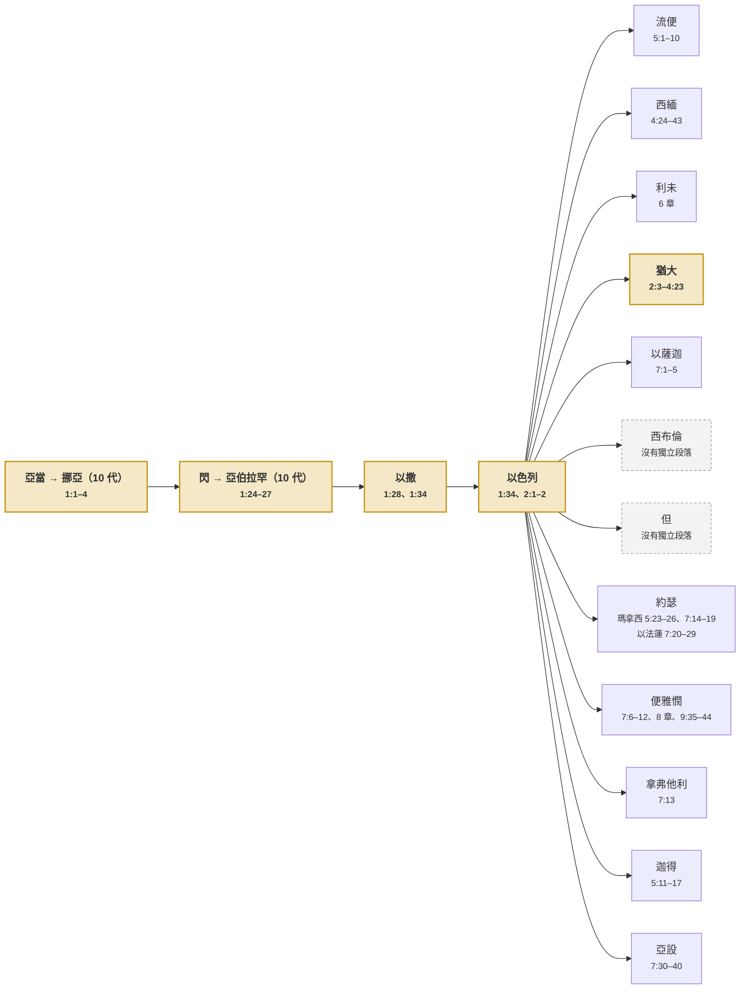
```mermaid
flowchart LR
  s0["亞當 → 挪亞（10 代）<br/><small>1:1–4</small>"]
  s1["閃 → 亞伯拉罕（10 代）<br/><small>1:24–27</small>"]
  s0 --> s1
  s2["以撒<br/><small>1:28、1:34</small>"]
  s1 --> s2
  s3["以色列<br/><small>1:34、2:1–2</small>"]
  s2 --> s3
  t0["流便<br/><small>5:1–10</small>"]
  s3 --> t0
  t1["西緬<br/><small>4:24–43</small>"]
  s3 --> t1
  t2["利未<br/><small>6 章</small>"]
  s3 --> t2
  t3["猶大<br/><small>2:3–4:23</small>"]
  s3 --> t3
  class t3 main
  t4["以薩迦<br/><small>7:1–5</small>"]
  s3 --> t4
  t5["西布倫<br/><small>沒有獨立段落</small>"]
  s3 --> t5
  class t5 none
  t6["但<br/><small>沒有獨立段落</small>"]
  s3 --> t6
  class t6 none
  t7["約瑟<br/><small>瑪拿西 5:23–26、7:14–19<br/>以法蓮 7:20–29</small>"]
  s3 --> t7
  t8["便雅憫<br/><small>7:6–12、8 章、9:35–44</small>"]
  s3 --> t8
  t9["拿弗他利<br/><small>7:13</small>"]
  s3 --> t9
  t10["迦得<br/><small>5:11–17</small>"]
  s3 --> t10
  t11["亞設<br/><small>7:30–40</small>"]
  s3 --> t11
  classDef main fill:#d4a82e44,stroke:#c9971c,stroke-width:2px,font-weight:bold
  classDef none fill:#80808018,stroke:#999,stroke-dasharray:4 3
  class s0,s1,s2,s3 main
```

### 篇幅分給了誰

同樣是以色列的兒子，作者給的篇幅差很多。數一數每段佔幾節，就看得出這份族譜的重心：

```text
猶大　　　 ██████████████████████████████ 100 節
利未　　　 ████████████████████████ 81 節
便雅憫　　 █████████████████ 57 節
列國與列祖 ████████████████ 54 節
歸回的居民 ██████████ 34 節
西緬　　　 ██████ 20 節
亞設　　　 ███ 11 節
瑪拿西　　 ███ 10 節
流便　　　 ███ 10 節
以法蓮　　 ███ 10 節
迦得　　　 ██ 7 節
河東聯軍　 ██ 5 節
以薩迦　　 ██ 5 節
拿弗他利　 █ 1 節
西布倫　　 · 沒有獨立段落
但　　　　 · 沒有獨立段落
```

猶大一支佔了大約一百節，其次是利未的八十一節，大衛王室和祭司、聖殿的家族是這份族譜的兩個重心。便雅憫寫了兩次（第 7 章和第 8 章），第 9 章結尾又重寫一次掃羅家，接到第 10 章掃羅的死。以色列十二個兒子當中，但和西布倫沒有自己的族譜段落。

### 目錄

- **[[#第 1 章　從亞當到以東列王|第 1 章]]**
  - [[#亞當到挪亞|亞當到挪亞]]　`1:1–4`
  - [[#雅弗的後代|雅弗的後代]]　`1:5–7`
  - [[#含的後代|含的後代]]　`1:8–16`
  - [[#閃的後代|閃的後代]]　`1:17–23`
  - [[#閃到亞伯拉罕|閃到亞伯拉罕]]　`1:24–27`
  - [[#亞伯拉罕的兒子|亞伯拉罕的兒子]]　`1:28–34`
  - [[#以掃的後代與西珥人|以掃的後代與西珥人]]　`1:35–42`
  - [[#以東的王和族長|以東的王和族長]]　`1:43–54`
- **[[#第 2 章　猶大（一）：希斯崙的三個兒子|第 2 章]]**
  - [[#以色列的十二個兒子|以色列的十二個兒子]]　`2:1–2`
  - [[#猶大的五個兒子|猶大的五個兒子]]　`2:3–8`
  - [[#蘭到大衛|蘭到大衛]]　`2:9–17`
  - [[#迦勒（基路拜）的一支，和希斯崙晚年的兒子|迦勒（基路拜）的一支，和希斯崙晚年的兒子]]　`2:18–24`
  - [[#耶拉篾的後代|耶拉篾的後代]]　`2:25–41`
  - [[#迦勒的其他後代|迦勒的其他後代]]　`2:42–55`
- **[[#第 3 章　大衛的家|第 3 章]]**
  - [[#大衛的兒子|大衛的兒子]]　`3:1–9`
  - [[#從所羅門到約西亞：猶大的王|從所羅門到約西亞：猶大的王]]　`3:10–16`
  - [[#被擄以後的大衛子孫|被擄以後的大衛子孫]]　`3:17–24`
- **[[#第 4 章　猶大（二）與西緬|第 4 章]]**
  - [[#猶大的其他家族|猶大的其他家族]]　`4:1–23`
  - [[#西緬|西緬]]　`4:24–43`
- **[[#第 5 章　約旦河東的兩個半支派|第 5 章]]**
  - [[#流便|流便]]　`5:1–10`
  - [[#迦得|迦得]]　`5:11–17`
  - [[#河東兩個半支派的戰役|河東兩個半支派的戰役]]　`5:18–22`
  - [[#河東的瑪拿西半支派，以及被擄|河東的瑪拿西半支派，以及被擄]]　`5:23–26`
- **[[#第 6 章　利未|第 6 章]]**
  - [[#大祭司的家系|大祭司的家系]]　`6:1–15`
  - [[#利未三族的其他家系|利未三族的其他家系]]　`6:16–30`
  - [[#大衛派定的三位歌唱領袖|大衛派定的三位歌唱領袖]]　`6:31–48`
  - [[#亞倫子孫的職分|亞倫子孫的職分]]　`6:49–53`
  - [[#利未人的城邑|利未人的城邑]]　`6:54–81`
- **[[#第 7 章　北方各支派|第 7 章]]**
  - [[#以薩迦|以薩迦]]　`7:1–5`
  - [[#便雅憫（第一份名單）|便雅憫（第一份名單）]]　`7:6–12`
  - [[#拿弗他利|拿弗他利]]　`7:13`
  - [[#河西的瑪拿西|河西的瑪拿西]]　`7:14–19`
  - [[#以法蓮，和約書亞的家系|以法蓮，和約書亞的家系]]　`7:20–29`
  - [[#亞設|亞設]]　`7:30–40`
- **[[#第 8 章　便雅憫與掃羅家|第 8 章]]**
  - [[#便雅憫（第二份名單）|便雅憫（第二份名單）]]　`8:1–12`
  - [[#住在耶路撒冷的便雅憫族長|住在耶路撒冷的便雅憫族長]]　`8:13–28`
  - [[#基遍的耶利，和掃羅的家|基遍的耶利，和掃羅的家]]　`8:29–40`
- **[[#第 9 章　歸回後住在耶路撒冷的人|第 9 章]]**
  - [[#歸回以後住在耶路撒冷的人|歸回以後住在耶路撒冷的人]]　`9:1–9`
  - [[#祭司|祭司]]　`9:10–13`
  - [[#利未人和守門的|利未人和守門的]]　`9:14–34`
  - [[#再寫一次掃羅的家|再寫一次掃羅的家]]　`9:35–44`
- **[[#附表|附表]]**
  - [[#平行經文對照|平行經文對照]]
  - [[#同名不同人|同名不同人]]
  - [[#經文記下的人數|經文記下的人數]]
  - [[#利未人的城邑（6:54–81）|利未人的城邑（6:54–81）]]

---

## 第 1 章　從亞當到以東列王

### 亞當到挪亞

`1:1–4`　第一章一開頭就從人類的始祖寫起，十代人只用了四節。

> [!tip] 主線（10 代）
> 亞當 → 塞特 → 以挪士 → 該南 → 瑪勒列 → 雅列 → 以諾 → 瑪土撒拉 → 拉麥 → 挪亞

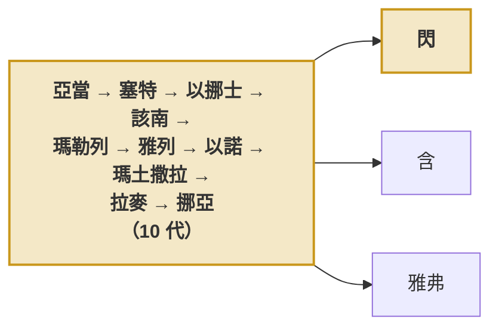
```mermaid
flowchart LR
  n1["亞當 → 塞特 → 以挪士 → 該南 →<br/>瑪勒列 → 雅列 → 以諾 → 瑪土撒拉 →<br/>拉麥 → 挪亞<br/>（10 代）"]
  n2["閃"]
  n1 --> n2
  n3["含"]
  n1 --> n3
  n4["雅弗"]
  n1 --> n4
  classDef main fill:#d4a82e44,stroke:#c9971c,stroke-width:2px,font-weight:bold
  classDef anchor fill:#7a8ca533,stroke:#7a8ca5
  class n1,n2 main
  classDef mom fill:#8a7bb022,stroke:#9a8cc4,stroke-dasharray:3 3,font-size:12px
```

> [!abstract]+ 完整名單（13 人）
> - ★ 亞當 → 塞特 → 以挪士 → 該南 → 瑪勒列 → 雅列 → 以諾 → 瑪土撒拉 → 拉麥 → 挪亞　*（10 代）*　`1:1–4`
>   - ★ 閃　`1:4`
>   - 含　`1:4`
>   - 雅弗　`1:4`

> [!note] 讀經提醒
> - 1:4 照「閃、含、雅弗」的次序列出，接下來卻倒過來寫：先雅弗（1:5–7），再含（1:8–16），最後才是閃（1:17 起）。　`1:4`

[[#目錄|↑ 回到目錄]] · [[#歷代志上 1–9 章 人物族譜圖|回到頂部]]

### 雅弗的後代

`1:5–7`　雅弗的七個兒子和兩支孫輩。

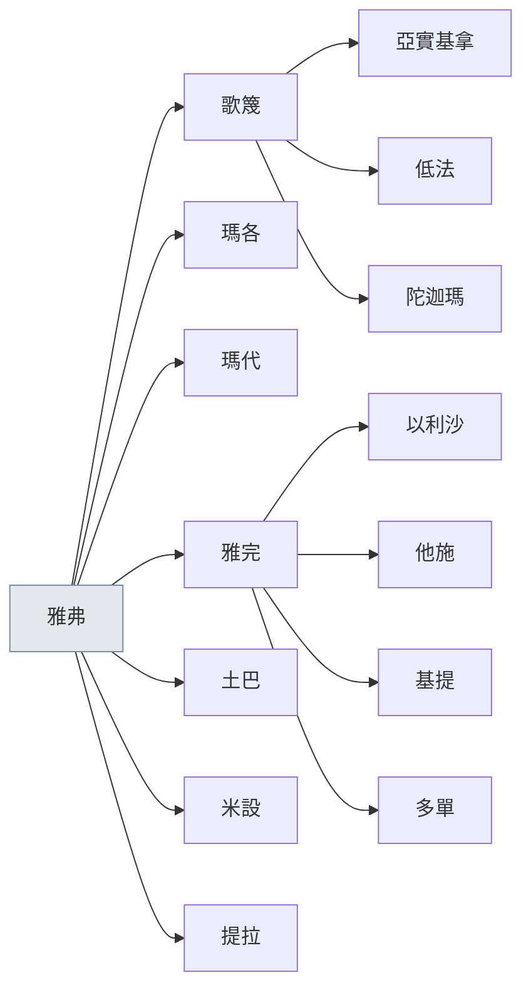
```mermaid
flowchart LR
  n1["雅弗"]
  n2["歌篾"]
  n1 --> n2
  n3["亞實基拿"]
  n2 --> n3
  n4["低法"]
  n2 --> n4
  n5["陀迦瑪"]
  n2 --> n5
  n6["瑪各"]
  n1 --> n6
  n7["瑪代"]
  n1 --> n7
  n8["雅完"]
  n1 --> n8
  n9["以利沙"]
  n8 --> n9
  n10["他施"]
  n8 --> n10
  n11["基提"]
  n8 --> n11
  n12["多單"]
  n8 --> n12
  n13["土巴"]
  n1 --> n13
  n14["米設"]
  n1 --> n14
  n15["提拉"]
  n1 --> n15
  classDef main fill:#d4a82e44,stroke:#c9971c,stroke-width:2px,font-weight:bold
  classDef anchor fill:#7a8ca533,stroke:#7a8ca5
  classDef mom fill:#8a7bb022,stroke:#9a8cc4,stroke-dasharray:3 3,font-size:12px
  class n1 anchor
```

> [!abstract]+ 完整名單（14 人）
> - 雅弗　`1:4`
>   - 歌篾　`1:5`
>     - 亞實基拿　`1:6`
>     - 低法　`1:6`
>     - 陀迦瑪　`1:6`
>   - 瑪各　`1:5`
>   - 瑪代　`1:5`
>   - 雅完　`1:5`
>     - 以利沙　`1:7`
>     - 他施　`1:7`
>     - 基提　`1:7`
>     - 多單　`1:7`
>   - 土巴　`1:5`
>   - 米設　`1:5`
>   - 提拉　`1:5`

[[#目錄|↑ 回到目錄]] · [[#歷代志上 1–9 章 人物族譜圖|回到頂部]]

### 含的後代

`1:8–16`　含的四個兒子：古實、麥西、弗、迦南。麥西和迦南名下列的多半是民族名（「某某人」）。

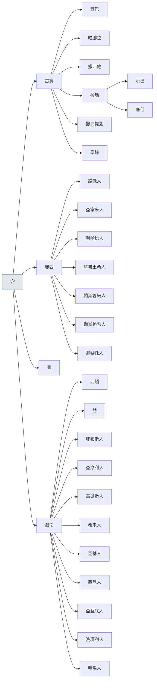
```mermaid
flowchart LR
  n1["含"]
  n2["古實"]
  n1 --> n2
  n3["西巴"]
  n2 --> n3
  n4["哈腓拉"]
  n2 --> n4
  n5["撒弗他"]
  n2 --> n5
  n6["拉瑪"]
  n2 --> n6
  n7["示巴"]
  n6 --> n7
  n8["底但"]
  n6 --> n8
  n9["撒弗提迦"]
  n2 --> n9
  n10["寧錄"]
  n2 --> n10
  n11["麥西"]
  n1 --> n11
  n12["路低人"]
  n11 --> n12
  n13["亞拿米人"]
  n11 --> n13
  n14["利哈比人"]
  n11 --> n14
  n15["拿弗土希人"]
  n11 --> n15
  n16["帕斯魯細人"]
  n11 --> n16
  n17["迦斯路希人"]
  n11 --> n17
  n18["迦斐託人"]
  n11 --> n18
  n19["弗"]
  n1 --> n19
  n20["迦南"]
  n1 --> n20
  n21["西頓"]
  n20 --> n21
  n22["赫"]
  n20 --> n22
  n23["耶布斯人"]
  n20 --> n23
  n24["亞摩利人"]
  n20 --> n24
  n25["革迦撒人"]
  n20 --> n25
  n26["希未人"]
  n20 --> n26
  n27["亞基人"]
  n20 --> n27
  n28["西尼人"]
  n20 --> n28
  n29["亞瓦底人"]
  n20 --> n29
  n30["洗瑪利人"]
  n20 --> n30
  n31["哈馬人"]
  n20 --> n31
  classDef main fill:#d4a82e44,stroke:#c9971c,stroke-width:2px,font-weight:bold
  classDef anchor fill:#7a8ca533,stroke:#7a8ca5
  classDef mom fill:#8a7bb022,stroke:#9a8cc4,stroke-dasharray:3 3,font-size:12px
  class n1 anchor
```

> [!abstract]- 完整名單（30 人）
> - 含　`1:4`
>   - 古實　`1:8`
>     - 西巴　`1:9`
>     - 哈腓拉　`1:9`
>     - 撒弗他　`1:9`
>     - 拉瑪　`1:9`
>       - 示巴　`1:9`
>       - 底但　`1:9`
>     - 撒弗提迦　`1:9`
>     - 寧錄（「他為世上英雄之首」）　`1:10`
>   - 麥西　`1:8`
>     - 路低人　`1:11–12`
>     - 亞拿米人　`1:11–12`
>     - 利哈比人　`1:11–12`
>     - 拿弗土希人　`1:11–12`
>     - 帕斯魯細人　`1:11–12`
>     - 迦斯路希人　`1:11–12`
>     - 迦斐託人　`1:11–12`
>   - 弗　`1:8`
>   - 迦南　`1:8`
>     - 西頓（長子）　`1:13–16`
>     - 赫　`1:13–16`
>     - 耶布斯人　`1:13–16`
>     - 亞摩利人　`1:13–16`
>     - 革迦撒人　`1:13–16`
>     - 希未人　`1:13–16`
>     - 亞基人　`1:13–16`
>     - 西尼人　`1:13–16`
>     - 亞瓦底人　`1:13–16`
>     - 洗瑪利人　`1:13–16`
>     - 哈馬人　`1:13–16`

- 1:12 結尾說：「從迦斐託出來的有非利士人」。　`1:12`

**人物**

- **寧錄**　1:10 說「他為世上英雄之首」。創世記說「他國的起頭是巴別、以力、亞甲、甲尼，都在示拿地」。　`1:10, 創 10:10`

[[#目錄|↑ 回到目錄]] · [[#歷代志上 1–9 章 人物族譜圖|回到頂部]]

### 閃的後代

`1:17–23`　閃的兒子當中，作者後來只沿著亞法撒往下追（1:24–27）。希伯的兒子約坍有十三個兒子。

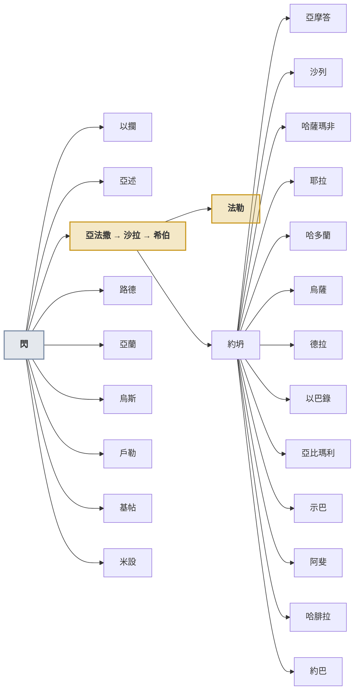
```mermaid
flowchart LR
  n1["閃"]
  n2["以攔"]
  n1 --> n2
  n3["亞述"]
  n1 --> n3
  n4["亞法撒 → 沙拉 → 希伯"]
  n1 --> n4
  n5["法勒"]
  n4 --> n5
  n6["約坍"]
  n4 --> n6
  n7["亞摩答"]
  n6 --> n7
  n8["沙列"]
  n6 --> n8
  n9["哈薩瑪非"]
  n6 --> n9
  n10["耶拉"]
  n6 --> n10
  n11["哈多蘭"]
  n6 --> n11
  n12["烏薩"]
  n6 --> n12
  n13["德拉"]
  n6 --> n13
  n14["以巴錄"]
  n6 --> n14
  n15["亞比瑪利"]
  n6 --> n15
  n16["示巴"]
  n6 --> n16
  n17["阿斐"]
  n6 --> n17
  n18["哈腓拉"]
  n6 --> n18
  n19["約巴"]
  n6 --> n19
  n20["路德"]
  n1 --> n20
  n21["亞蘭"]
  n1 --> n21
  n22["烏斯"]
  n1 --> n22
  n23["戶勒"]
  n1 --> n23
  n24["基帖"]
  n1 --> n24
  n25["米設"]
  n1 --> n25
  classDef main fill:#d4a82e44,stroke:#c9971c,stroke-width:2px,font-weight:bold
  classDef anchor fill:#7a8ca533,stroke:#7a8ca5
  class n1,n4,n5 main
  classDef mom fill:#8a7bb022,stroke:#9a8cc4,stroke-dasharray:3 3,font-size:12px
  class n1 anchor
```

> [!abstract]+ 完整名單（26 人）
> - ★ 閃　`1:4`
>   - 以攔　`1:17`
>   - 亞述　`1:17`
>   - ★ 亞法撒 → 沙拉 → 希伯　`1:17`
>     - ★ 法勒（名字的意思是「分」，「因為那時人就分地居住」）　`1:19`
>     - 約坍　`1:19`
>       - 亞摩答　`1:20–23`
>       - 沙列　`1:20–23`
>       - 哈薩瑪非　`1:20–23`
>       - 耶拉　`1:20–23`
>       - 哈多蘭　`1:20–23`
>       - 烏薩　`1:20–23`
>       - 德拉　`1:20–23`
>       - 以巴錄　`1:20–23`
>       - 亞比瑪利　`1:20–23`
>       - 示巴　`1:20–23`
>       - 阿斐　`1:20–23`
>       - 哈腓拉　`1:20–23`
>       - 約巴　`1:20–23`
>   - 路德　`1:17`
>   - 亞蘭　`1:17`
>   - 烏斯　`1:17`
>   - 戶勒　`1:17`
>   - 基帖　`1:17`
>   - 米設　`1:17`

> [!note] 讀經提醒
> - 1:17 把烏斯、戶勒、基帖、米設直接列在閃的兒子裡；創世記 10:23 說他們是「亞蘭的兒子」。這裡照歷代志上的寫法，掛在閃底下。　`1:17, 創 10:23`

[[#目錄|↑ 回到目錄]] · [[#歷代志上 1–9 章 人物族譜圖|回到頂部]]

### 閃到亞伯拉罕

`1:24–27`　1:24–25 重述閃到法勒的五代，接著一路排到亞伯拉罕。

> [!tip] 主線（10 代）
> 閃 → 亞法撒 → 沙拉 → 希伯 → 法勒 → 拉吳 → 西鹿 → 拿鶴 → 他拉 → 亞伯拉罕

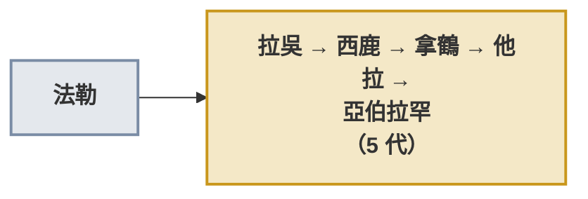
```mermaid
flowchart LR
  n1["法勒"]
  n2["拉吳 → 西鹿 → 拿鶴 → 他拉 →<br/>亞伯拉罕<br/>（5 代）"]
  n1 --> n2
  classDef main fill:#d4a82e44,stroke:#c9971c,stroke-width:2px,font-weight:bold
  classDef anchor fill:#7a8ca533,stroke:#7a8ca5
  class n1,n2 main
  classDef mom fill:#8a7bb022,stroke:#9a8cc4,stroke-dasharray:3 3,font-size:12px
  class n1 anchor
```

> [!abstract]+ 完整名單（5 人）
> - ★ 法勒（名字的意思是「分」，「因為那時人就分地居住」）　`1:19`
>   - ★ 拉吳 → 西鹿 → 拿鶴 → 他拉 → 亞伯拉罕（「亞伯蘭就是亞伯拉罕」）　*（5 代）*　`1:25–27`

**人物**

- **亞伯拉罕**　本名亞伯蘭。神對他說：「你的名不再叫亞伯蘭，要叫亞伯拉罕，因為我已立你作多國的父」。　`1:27, 創 17:5`

[[#目錄|↑ 回到目錄]] · [[#歷代志上 1–9 章 人物族譜圖|回到頂部]]

### 亞伯拉罕的兒子

`1:28–34`　亞伯拉罕的兒子分三組：以撒和以實瑪利、妾基土拉生的六個兒子，最後回到以撒的兩個兒子。

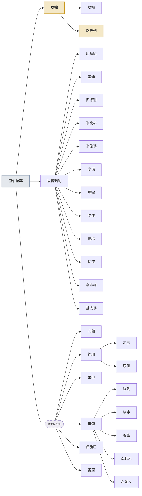
```mermaid
flowchart LR
  n1["亞伯拉罕"]
  n2["以撒"]
  n1 --> n2
  n3["以掃"]
  n2 --> n3
  n4["以色列"]
  n2 --> n4
  n5["以實瑪利"]
  n1 --> n5
  n6["尼拜約"]
  n5 --> n6
  n7["基達"]
  n5 --> n7
  n8["押德別"]
  n5 --> n8
  n9["米比衫"]
  n5 --> n9
  n10["米施瑪"]
  n5 --> n10
  n11["度瑪"]
  n5 --> n11
  n12["瑪撒"]
  n5 --> n12
  n13["哈達"]
  n5 --> n13
  n14["提瑪"]
  n5 --> n14
  n15["伊突"]
  n5 --> n15
  n16["拿非施"]
  n5 --> n16
  n17["基底瑪"]
  n5 --> n17
  n18(["基土拉所生"])
  n1 --- n18
  n19["心蘭"]
  n18 --> n19
  n20["約珊"]
  n18 --> n20
  n21["示巴"]
  n20 --> n21
  n22["底但"]
  n20 --> n22
  n23["米但"]
  n18 --> n23
  n24["米甸"]
  n18 --> n24
  n25["以法"]
  n24 --> n25
  n26["以弗"]
  n24 --> n26
  n27["哈諾"]
  n24 --> n27
  n28["亞比大"]
  n24 --> n28
  n29["以勒大"]
  n24 --> n29
  n30["伊施巴"]
  n18 --> n30
  n31["書亞"]
  n18 --> n31
  classDef main fill:#d4a82e44,stroke:#c9971c,stroke-width:2px,font-weight:bold
  classDef anchor fill:#7a8ca533,stroke:#7a8ca5
  class n1,n2,n4 main
  classDef mom fill:#8a7bb022,stroke:#9a8cc4,stroke-dasharray:3 3,font-size:12px
  class n1 anchor
  class n18 mom
```

> [!abstract]- 完整名單（29 人）
> - ★ 亞伯拉罕（「亞伯蘭就是亞伯拉罕」）　`1:25–27`
>   - ★ 以撒　`1:28`
>     - 以掃　`1:34`
>     - ★ 以色列　`1:34`
>   - 以實瑪利　`1:28`
>     - 尼拜約（長子）　`1:29–31`
>     - 基達　`1:29–31`
>     - 押德別　`1:29–31`
>     - 米比衫　`1:29–31`
>     - 米施瑪　`1:29–31`
>     - 度瑪　`1:29–31`
>     - 瑪撒　`1:29–31`
>     - 哈達　`1:29–31`
>     - 提瑪　`1:29–31`
>     - 伊突　`1:29–31`
>     - 拿非施　`1:29–31`
>     - 基底瑪　`1:29–31`
>   - *基土拉所生*
>     - 心蘭　`1:32`
>     - 約珊　`1:32`
>       - 示巴　`1:32`
>       - 底但　`1:32`
>     - 米但　`1:32`
>     - 米甸　`1:32`
>       - 以法　`1:33`
>       - 以弗　`1:33`
>       - 哈諾　`1:33`
>       - 亞比大　`1:33`
>       - 以勒大　`1:33`
>     - 伊施巴　`1:32`
>     - 書亞　`1:32`

> [!note] 讀經提醒
> - 1:32 稱基土拉是亞伯拉罕的「妾」；創世記 25:1 寫「亞伯拉罕又娶了一妻，名叫基土拉」。　`1:32, 創 25:1`

[[#目錄|↑ 回到目錄]] · [[#歷代志上 1–9 章 人物族譜圖|回到頂部]]

### 以掃的後代與西珥人

`1:35–42`　以掃的五個兒子，接著是西珥的七個兒子和他們的後代。

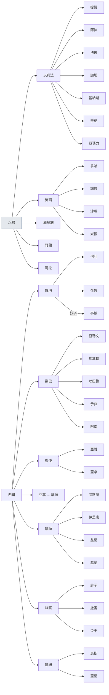
```mermaid
flowchart LR
  n1["以掃"]
  n2["以利法"]
  n1 --> n2
  n3["提幔"]
  n2 --> n3
  n4["阿抹"]
  n2 --> n4
  n5["洗玻"]
  n2 --> n5
  n6["迦坦"]
  n2 --> n6
  n7["基納斯"]
  n2 --> n7
  n8["亭納"]
  n2 --> n8
  n9["亞瑪力"]
  n2 --> n9
  n10["流珥"]
  n1 --> n10
  n11["拿哈"]
  n10 --> n11
  n12["謝拉"]
  n10 --> n12
  n13["沙瑪"]
  n10 --> n13
  n14["米撒"]
  n10 --> n14
  n15["耶烏施"]
  n1 --> n15
  n16["雅蘭"]
  n1 --> n16
  n17["可拉"]
  n1 --> n17
  n18["西珥"]
  n19["羅坍"]
  n18 --> n19
  n20["何利"]
  n19 --> n20
  n21["荷幔"]
  n19 --> n21
  n22["亭納"]
  n19 -->|妹子| n22
  n23["朔巴"]
  n18 --> n23
  n24["亞勒文"]
  n23 --> n24
  n25["瑪拿轄"]
  n23 --> n25
  n26["以巴錄"]
  n23 --> n26
  n27["示非"]
  n23 --> n27
  n28["阿南"]
  n23 --> n28
  n29["祭便"]
  n18 --> n29
  n30["亞雅"]
  n29 --> n30
  n31["亞拿"]
  n29 --> n31
  n32["亞拿 → 底順"]
  n18 --> n32
  n33["底順"]
  n18 --> n33
  n34["哈默蘭"]
  n33 --> n34
  n35["伊是班"]
  n33 --> n35
  n36["益蘭"]
  n33 --> n36
  n37["基蘭"]
  n33 --> n37
  n38["以察"]
  n18 --> n38
  n39["辟罕"]
  n38 --> n39
  n40["撒番"]
  n38 --> n40
  n41["亞干"]
  n38 --> n41
  n42["底珊"]
  n18 --> n42
  n43["烏斯"]
  n42 --> n43
  n44["亞蘭"]
  n42 --> n44
  classDef main fill:#d4a82e44,stroke:#c9971c,stroke-width:2px,font-weight:bold
  classDef anchor fill:#7a8ca533,stroke:#7a8ca5
  classDef mom fill:#8a7bb022,stroke:#9a8cc4,stroke-dasharray:3 3,font-size:12px
  class n1 anchor
```

> [!abstract]- 完整名單（44 人）
> - 以掃　`1:34`
>   - 以利法　`1:35`
>     - 提幔　`1:36`
>     - 阿抹　`1:36`
>     - 洗玻　`1:36`
>     - 迦坦　`1:36`
>     - 基納斯　`1:36`
>     - 亭納　`1:36`
>     - 亞瑪力　`1:36`
>   - 流珥　`1:35`
>     - 拿哈　`1:37`
>     - 謝拉　`1:37`
>     - 沙瑪　`1:37`
>     - 米撒　`1:37`
>   - 耶烏施　`1:35`
>   - 雅蘭　`1:35`
>   - 可拉　`1:35`
> - 西珥　`1:38`
>   - 羅坍　`1:38`
>     - 何利　`1:39`
>     - 荷幔　`1:39`
>     - 〔妹子〕亭納　`1:39`
>   - 朔巴　`1:38`
>     - 亞勒文　`1:40`
>     - 瑪拿轄　`1:40`
>     - 以巴錄　`1:40`
>     - 示非　`1:40`
>     - 阿南　`1:40`
>   - 祭便　`1:38`
>     - 亞雅　`1:40`
>     - 亞拿　`1:40`
>   - 亞拿 → 底順　`1:38`
>   - 底順　`1:38`
>     - 哈默蘭　`1:41`
>     - 伊是班　`1:41`
>     - 益蘭　`1:41`
>     - 基蘭　`1:41`
>   - 以察　`1:38`
>     - 辟罕　`1:42`
>     - 撒番　`1:42`
>     - 亞干　`1:42`
>   - 底珊　`1:38`
>     - 烏斯　`1:42`
>     - 亞蘭　`1:42`

> [!note] 讀經提醒
> - 1:36 把「亭納、亞瑪力」都列為以利法的兒子；創世記 36:12 寫「亭納是以掃兒子以利法的妾；他給以利法生了亞瑪力」。　`1:36, 創 36:12`
> - 1:41「亞拿的兒子是底順。底順的兒子是哈默蘭……」，經文沒有說後一個底順是哪一位。1:39–42 是照西珥七個兒子的次序逐一列出他們的兒子，這裡照這個次序，把哈默蘭等四人掛在西珥的兒子底順名下；照字面也可以讀成亞拿的兒子底順。創世記 36:25–28 的排法相同，同樣沒有說明。　`1:41`

[[#目錄|↑ 回到目錄]] · [[#歷代志上 1–9 章 人物族譜圖|回到頂部]]

### 以東的王和族長

`1:43–54`　「以色列人未有君王治理之先」，以東已經有八個王前後接續。這八人是一個接一個作王，不是父子。王的時代之後，以東由十一個族長分治。

> [!abstract]+ 完整名單（19 人）
> - 比拉（比珥的兒子；京城亭哈巴；以東第一個王）　`1:43`
> - 約巴（波斯拉人謝拉的兒子）　`1:44`
> - 戶珊（提幔地的人）　`1:45`
> - 哈達（比達的兒子；在摩押地殺敗米甸人；京城亞未得）　`1:46`
> - 桑拉（瑪士利加人）　`1:47`
> - 掃羅（大河邊的利河伯人）　`1:48`
> - 巴勒哈南（亞革波的兒子）　`1:49`
> - 哈達（京城巴伊；妻子米希他別是米薩合的孫女、瑪特列的女兒）　`1:50`
> - 亭納　`1:51–54`
> - 亞勒瓦　`1:51–54`
> - 耶帖　`1:51–54`
> - 亞何利巴瑪　`1:51–54`
> - 以拉　`1:51–54`
> - 比嫩　`1:51–54`
> - 基納斯　`1:51–54`
> - 提幔　`1:51–54`
> - 米比薩　`1:51–54`
> - 瑪基疊　`1:51–54`
> - 以蘭　`1:51–54`

- 哈達死後，以東改由族長治理；1:51–54 列出十一個族長，結尾說「這都是以東人的族長」。　`1:51–54`

[[#目錄|↑ 回到目錄]] · [[#歷代志上 1–9 章 人物族譜圖|回到頂部]]

---

## 第 2 章　猶大（一）：希斯崙的三個兒子

### 以色列的十二個兒子

`2:1–2`　先列出十二個兒子，接著跳過老大流便，從第四個兒子猶大寫起。猶大一族寫到 4:23，是全部族譜裡最長的一段。

> [!abstract]+ 完整名單（12 人）
> - ★ 以色列　`1:34`
>   - 流便　`2:1–2`
>   - 西緬　`2:1–2`
>   - 利未　`2:1–2`
>   - ★ 猶大　`2:1–2`
>   - 以薩迦　`2:1–2`
>   - 西布倫　`2:1–2`
>   - 但　`2:1–2`
>   - 約瑟　`2:1–2`
>   - 便雅憫　`2:1–2`
>   - 拿弗他利　`2:1–2`
>   - 迦得　`2:1–2`
>   - 亞設　`2:1–2`

[[#目錄|↑ 回到目錄]] · [[#歷代志上 1–9 章 人物族譜圖|回到頂部]]

### 猶大的五個兒子

`2:3–8`　猶大的五個兒子來自兩個母親。往下追的是法勒斯；謝拉一支只記到兩代。

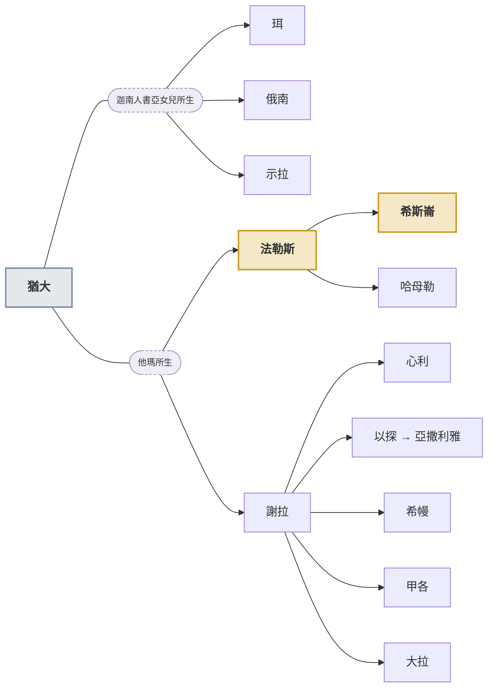
```mermaid
flowchart LR
  n1["猶大"]
  n2(["迦南人書亞女兒所生"])
  n1 --- n2
  n3["珥"]
  n2 --> n3
  n4["俄南"]
  n2 --> n4
  n5["示拉"]
  n2 --> n5
  n6(["他瑪所生"])
  n1 --- n6
  n7["法勒斯"]
  n6 --> n7
  n8["希斯崙"]
  n7 --> n8
  n9["哈母勒"]
  n7 --> n9
  n10["謝拉"]
  n6 --> n10
  n11["心利"]
  n10 --> n11
  n12["以探 → 亞撒利雅"]
  n10 --> n12
  n13["希幔"]
  n10 --> n13
  n14["甲各"]
  n10 --> n14
  n15["大拉"]
  n10 --> n15
  classDef main fill:#d4a82e44,stroke:#c9971c,stroke-width:2px,font-weight:bold
  classDef anchor fill:#7a8ca533,stroke:#7a8ca5
  class n1,n7,n8 main
  classDef mom fill:#8a7bb022,stroke:#9a8cc4,stroke-dasharray:3 3,font-size:12px
  class n1 anchor
  class n2,n6 mom
```

> [!abstract]+ 完整名單（15 人）
> - ★ 猶大　`2:1–2`
>   - *迦南人書亞女兒所生*
>     - 珥（「在耶和華眼中看為惡，耶和華就使他死了」）　`2:3`
>     - 俄南　`2:3`
>     - 示拉　`2:3`
>   - *他瑪所生*
>     - ★ 法勒斯　`2:4`
>       - ★ 希斯崙　`2:5`
>       - 哈母勒　`2:5`
>     - 謝拉　`2:4`
>       - 心利　`2:6`
>       - 以探 → 亞撒利雅　`2:6`
>       - 希幔　`2:6`
>       - 甲各　`2:6`
>       - 大拉　`2:6`
> - 迦米 → 亞干（「在當滅的物上犯了罪，連累了以色列人」）　`2:7`

**人物**

- **珥**　猶大的長子，「在耶和華眼中看為惡，耶和華就使他死了」。　`2:3`
- **亞干**　約書亞時代，「亞干取了當滅的物；耶和華的怒氣就向以色列人發作」。　`2:7, 書 7:1`

> [!note] 讀經提醒
> - 2:7 沒有說迦米是誰的兒子。約書亞記 7:1 稱亞干是「謝拉的曾孫，撒底的孫子，迦米的兒子」，所以這一家屬於謝拉一支。　`2:7, 書 7:1`
> - 2:6 謝拉的兒子以探、希幔、甲各、大拉，列王紀上 4:31 也有同樣一組名字：「以斯拉人以探，並瑪曷的兒子希幔、甲各、達大」。兩處的父親寫法不同。　`2:6, 王上 4:31`

[[#目錄|↑ 回到目錄]] · [[#歷代志上 1–9 章 人物族譜圖|回到頂部]]

### 蘭到大衛

`2:9–17`　希斯崙有三個兒子。這一段先追老二蘭，九代之後到大衛；耶拉篾和迦勒（基路拜）兩支放在後面。

> [!tip] 主線（11 代）
> 猶大 → 法勒斯 → 希斯崙 → 蘭 → 亞米拿達 → 拿順 → 撒門 → 波阿斯 → 俄備得 → 耶西 → 大衛

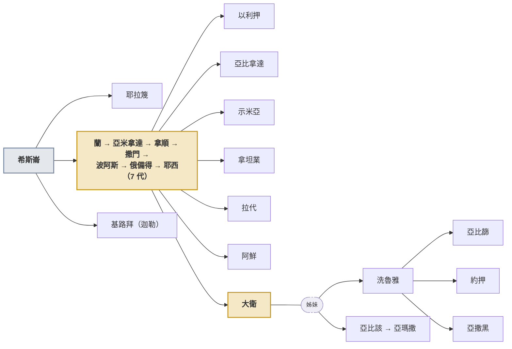
```mermaid
flowchart LR
  n1["希斯崙"]
  n2["耶拉篾"]
  n1 --> n2
  n3["蘭 → 亞米拿達 → 拿順 → 撒門 →<br/>波阿斯 → 俄備得 → 耶西<br/>（7 代）"]
  n1 --> n3
  n4["以利押"]
  n3 --> n4
  n5["亞比拿達"]
  n3 --> n5
  n6["示米亞"]
  n3 --> n6
  n7["拿坦業"]
  n3 --> n7
  n8["拉代"]
  n3 --> n8
  n9["阿鮮"]
  n3 --> n9
  n10["大衛"]
  n3 --> n10
  n11(["姊妹"])
  n10 --- n11
  n12["洗魯雅"]
  n11 --> n12
  n13["亞比篩"]
  n12 --> n13
  n14["約押"]
  n12 --> n14
  n15["亞撒黑"]
  n12 --> n15
  n16["亞比該 → 亞瑪撒"]
  n11 --> n16
  n17["基路拜（迦勒）"]
  n1 --> n17
  classDef main fill:#d4a82e44,stroke:#c9971c,stroke-width:2px,font-weight:bold
  classDef anchor fill:#7a8ca533,stroke:#7a8ca5
  class n1,n3,n10 main
  classDef mom fill:#8a7bb022,stroke:#9a8cc4,stroke-dasharray:3 3,font-size:12px
  class n1 anchor
  class n11 mom
```

> [!abstract]+ 完整名單（22 人）
> - ★ 希斯崙　`2:5`
>   - 耶拉篾　`2:9`
>   - ★ 蘭 → 亞米拿達 → 拿順（「作猶大人的首領」） → 撒門 → 波阿斯 → 俄備得 → 耶西　*（7 代）*　`2:9`
>     - 以利押（長子）　`2:13–15`
>     - 亞比拿達　`2:13–15`
>     - 示米亞（三子）　`2:13–15`
>     - 拿坦業　`2:13–15`
>     - 拉代　`2:13–15`
>     - 阿鮮　`2:13–15`
>     - ★ 大衛（七子）　`2:13–15`
>       - 〔姊妹〕洗魯雅　`2:16`
>         - 亞比篩　`2:16`
>         - 約押　`2:16`
>         - 亞撒黑　`2:16`
>       - 〔姊妹〕亞比該 → 亞瑪撒（父親是「以實瑪利人益帖」）　`2:16`
>   - 基路拜（2:18 起作迦勒）　`2:9`

**人物**

- **波阿斯**　大衛的曾祖父。「波阿斯娶了路得為妻」，生了俄備得。　`2:11-12, 得 4:13`
- **大衛**　耶西的第七個兒子。「在希伯崙作王七年零六個月，在耶路撒冷作王三十三年」。　`2:15, 3:4`
- **亞瑪撒**　押沙龍造反時，「押沙龍立亞瑪撒作元帥，代替約押」；後來被約押所殺。　`2:17, 撒下 17:25, 撒下 20:10`

> [!note] 讀經提醒
> - 2:13–15 列出耶西的七個兒子，大衛排第七；撒母耳記上 17:12 說「耶西有八個兒子」。　`2:13-15, 撒上 17:12`
> - 2:16「他們的姊妹是洗魯雅和亞比該」，是大衛兄弟們的姊妹。撒母耳記下 17:25 說亞比該是「拿轄的女兒」。　`2:16, 撒下 17:25`

[[#目錄|↑ 回到目錄]] · [[#歷代志上 1–9 章 人物族譜圖|回到頂部]]

### 迦勒（基路拜）的一支，和希斯崙晚年的兒子

`2:18–24`　2:9 的基路拜，在 2:18 起稱為迦勒；2:18 說他是「希斯崙的兒子」，2:42 說他是「耶拉篾兄弟」。他的孫子烏利，是造會幕的巧匠比撒列的父親。

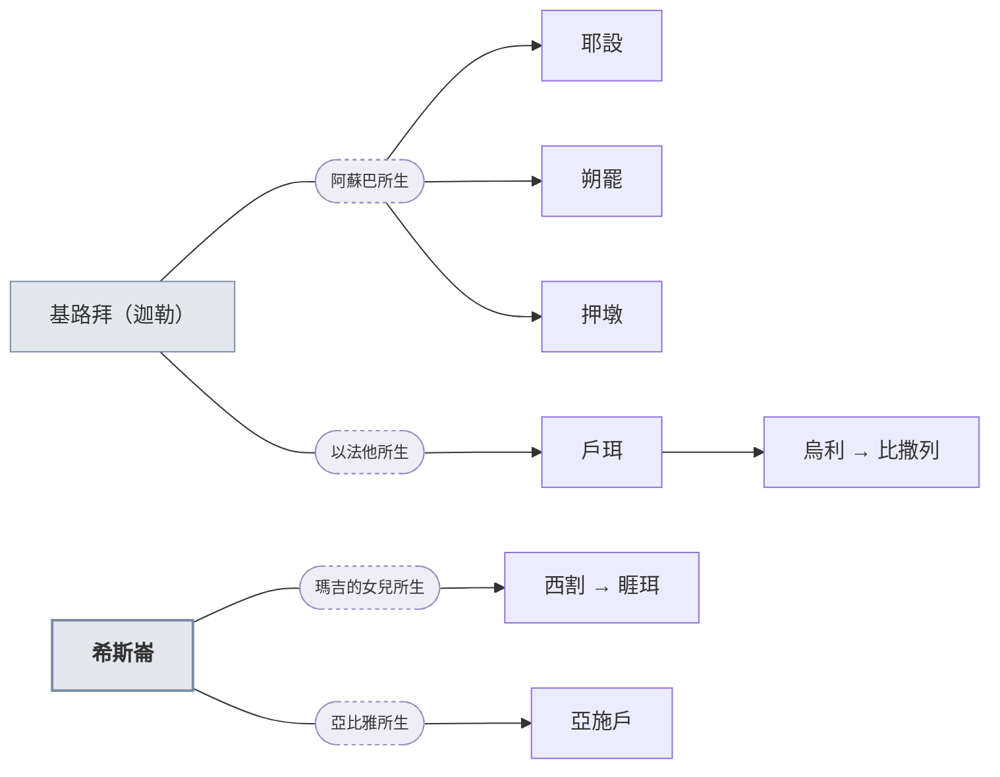
```mermaid
flowchart LR
  n1["基路拜（迦勒）"]
  n2(["阿蘇巴所生"])
  n1 --- n2
  n3["耶設"]
  n2 --> n3
  n4["朔罷"]
  n2 --> n4
  n5["押墩"]
  n2 --> n5
  n6(["以法他所生"])
  n1 --- n6
  n7["戶珥"]
  n6 --> n7
  n8["烏利 → 比撒列"]
  n7 --> n8
  n9["希斯崙"]
  n10(["瑪吉的女兒所生"])
  n9 --- n10
  n11["西割 → 睚珥"]
  n10 --> n11
  n12(["亞比雅所生"])
  n9 --- n12
  n13["亞施戶"]
  n12 --> n13
  classDef main fill:#d4a82e44,stroke:#c9971c,stroke-width:2px,font-weight:bold
  classDef anchor fill:#7a8ca533,stroke:#7a8ca5
  class n9 main
  classDef mom fill:#8a7bb022,stroke:#9a8cc4,stroke-dasharray:3 3,font-size:12px
  class n1,n9 anchor
  class n2,n6,n10,n12 mom
```

> [!abstract]+ 完整名單（9 人）
> - 基路拜（2:18 起作迦勒）　`2:9`
>   - *阿蘇巴所生*
>     - 耶設　`2:18`
>     - 朔罷　`2:18`
>     - 押墩　`2:18`
>   - *以法他所生*
>     - 戶珥　`2:19`
>       - 烏利 → 比撒列　`2:20`
> - ★ 希斯崙　`2:5`
>   - *瑪吉的女兒所生*
>     - 西割（希斯崙正六十歲娶瑪吉的女兒所生） → 睚珥（「在基列地有二十三個城邑」）　`2:21`
>   - *亞比雅所生*
>     - 亞施戶（提哥亞的父親；希斯崙死後才生）　`2:24`

- 「後來基述人和亞蘭人奪了睚珥的城邑，並基納和其鄉村，共六十個」。　`2:23`

**人物**

- **比撒列**　戶珥的孫子、烏利的兒子。造會幕的時候，神說：「猶大支派中，戶珥的孫子、烏利的兒子比撒列，我已經提他的名召他」。　`2:20, 出 31:2`
- **睚珥**　希斯崙和瑪吉的女兒所生的後代，「在基列地有二十三個城邑」。民數記稱他是「瑪拿西的子孫睚珥」，把那些村莊叫作「哈倭特睚珥」。　`2:21-22, 民 32:41`

> [!note] 讀經提醒
> - 2:18 說迦勒「娶阿蘇巴和耶略為妻」，經文只記了阿蘇巴生的三個兒子，沒有記耶略生的。　`2:18`

[[#目錄|↑ 回到目錄]] · [[#歷代志上 1–9 章 人物族譜圖|回到頂部]]

### 耶拉篾的後代

`2:25–41`　希斯崙的長子耶拉篾。值得注意的是示珊一家：示珊沒有兒子，把女兒嫁給埃及僕人耶哈，從此又傳了十三代。

> [!tip] 主線（15 代）
> 示珊 → 女兒 → 亞太 → 拿單 → 撒拔 → 以弗拉 → 俄備得 → 耶戶 → 亞撒利雅 → 希利斯 → 以利亞薩 → 西斯買 → 沙龍 → 耶加米雅 → 以利沙瑪

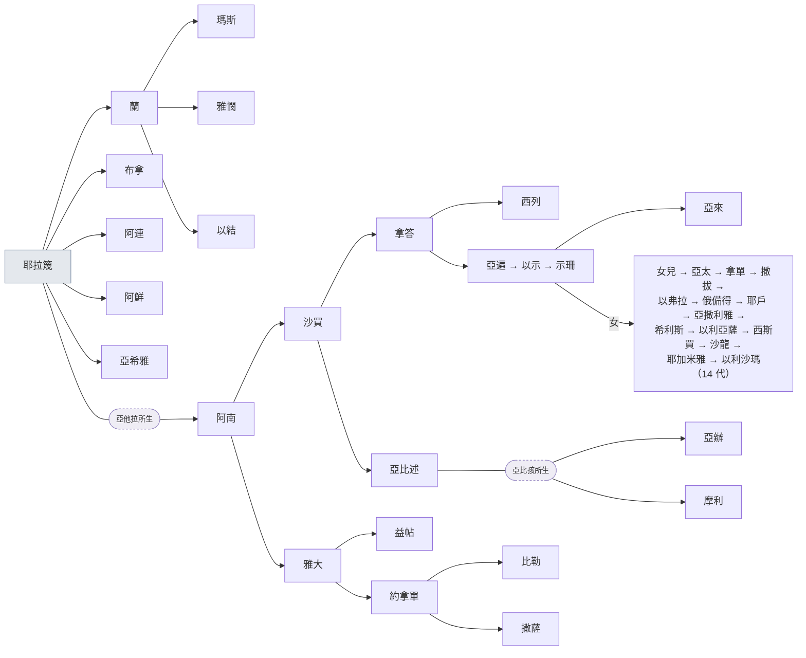
```mermaid
flowchart LR
  n1["耶拉篾"]
  n2["蘭"]
  n1 --> n2
  n3["瑪斯"]
  n2 --> n3
  n4["雅憫"]
  n2 --> n4
  n5["以結"]
  n2 --> n5
  n6["布拿"]
  n1 --> n6
  n7["阿連"]
  n1 --> n7
  n8["阿鮮"]
  n1 --> n8
  n9["亞希雅"]
  n1 --> n9
  n10(["亞他拉所生"])
  n1 --- n10
  n11["阿南"]
  n10 --> n11
  n12["沙買"]
  n11 --> n12
  n13["拿答"]
  n12 --> n13
  n14["西列"]
  n13 --> n14
  n15["亞遍 → 以示 → 示珊"]
  n13 --> n15
  n16["亞來"]
  n15 --> n16
  n17["女兒 → 亞太 → 拿單 → 撒拔 →<br/>以弗拉 → 俄備得 → 耶戶 → 亞撒利雅 →<br/>希利斯 → 以利亞薩 → 西斯買 → 沙龍 →<br/>耶加米雅 → 以利沙瑪<br/>（14 代）"]
  n15 -->|女| n17
  n18["亞比述"]
  n12 --> n18
  n19(["亞比孩所生"])
  n18 --- n19
  n20["亞辦"]
  n19 --> n20
  n21["摩利"]
  n19 --> n21
  n22["雅大"]
  n11 --> n22
  n23["益帖"]
  n22 --> n23
  n24["約拿單"]
  n22 --> n24
  n25["比勒"]
  n24 --> n25
  n26["撒薩"]
  n24 --> n26
  classDef main fill:#d4a82e44,stroke:#c9971c,stroke-width:2px,font-weight:bold
  classDef anchor fill:#7a8ca533,stroke:#7a8ca5
  classDef mom fill:#8a7bb022,stroke:#9a8cc4,stroke-dasharray:3 3,font-size:12px
  class n1 anchor
  class n10,n19 mom
```

> [!abstract]- 完整名單（38 人）
> - 耶拉篾　`2:9`
>   - 蘭（長子）　`2:25`
>     - 瑪斯　`2:27`
>     - 雅憫　`2:27`
>     - 以結　`2:27`
>   - 布拿　`2:25`
>   - 阿連　`2:25`
>   - 阿鮮　`2:25`
>   - 亞希雅　`2:25`
>   - *亞他拉所生*
>     - 阿南　`2:26`
>       - 沙買　`2:28`
>         - 拿答　`2:28`
>           - 西列（「死了沒有兒子」）　`2:30`
>           - 亞遍 → 以示 → 示珊　`2:30`
>             - 亞來　`2:31`
>             - 〔女〕女兒（嫁給埃及僕人耶哈） → 亞太（父親是耶哈） → 拿單 → 撒拔 → 以弗拉 → 俄備得 → 耶戶 → 亞撒利雅 → 希利斯 → 以利亞薩 → 西斯買 → 沙龍 → 耶加米雅 → 以利沙瑪　*（14 代）*　`2:34–35`
>         - 亞比述　`2:28`
>           - *亞比孩所生*
>             - 亞辦　`2:29`
>             - 摩利　`2:29`
>       - 雅大　`2:28`
>         - 益帖（「死了沒有兒子」）　`2:32`
>         - 約拿單　`2:32`
>           - 比勒　`2:33`
>           - 撒薩　`2:33`

- 2:25–33 結尾說：「這都是耶拉篾的子孫」。　`2:33`

**人物**

- **亞太**　示珊沒有兒子，「示珊將女兒給了僕人耶哈為妻，給他生了亞太」；這一家從亞太往下又記了十二代。　`2:34-41`

> [!note] 讀經提醒
> - 2:31 寫「示珊的兒子是亞來」，2:34 卻寫「示珊沒有兒子，只有女兒」。經文沒有解釋兩句的關係，這裡兩句都照列。　`2:31, 2:34`

[[#目錄|↑ 回到目錄]] · [[#歷代志上 1–9 章 人物族譜圖|回到頂部]]

### 迦勒的其他後代

`2:42–55`　回到迦勒，這一段多是「某地之祖」，記下猶大南地和伯利恆一帶的家族怎麼來的。

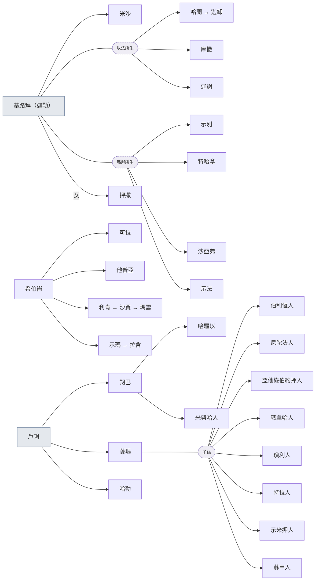
```mermaid
flowchart LR
  n1["基路拜（迦勒）"]
  n2["米沙"]
  n1 --> n2
  n3(["以法所生"])
  n1 --- n3
  n4["哈蘭 → 迦卸"]
  n3 --> n4
  n5["摩撒"]
  n3 --> n5
  n6["迦謝"]
  n3 --> n6
  n7(["瑪迦所生"])
  n1 --- n7
  n8["示別"]
  n7 --> n8
  n9["特哈拿"]
  n7 --> n9
  n10["沙亞弗"]
  n7 --> n10
  n11["示法"]
  n7 --> n11
  n12["押撒"]
  n1 -->|女| n12
  n13["希伯崙"]
  n14["可拉"]
  n13 --> n14
  n15["他普亞"]
  n13 --> n15
  n16["利肯 → 沙買 → 瑪雲"]
  n13 --> n16
  n17["示瑪 → 拉含"]
  n13 --> n17
  n18["戶珥"]
  n19["朔巴"]
  n18 --> n19
  n20["哈羅以"]
  n19 --> n20
  n21["米努哈人"]
  n19 --> n21
  n22["薩瑪"]
  n18 --> n22
  n23(["子孫"])
  n22 --- n23
  n24["伯利恆人"]
  n23 --> n24
  n25["尼陀法人"]
  n23 --> n25
  n26["亞他綠伯約押人"]
  n23 --> n26
  n27["瑪拿哈人"]
  n23 --> n27
  n28["瑣利人"]
  n23 --> n28
  n29["特拉人"]
  n23 --> n29
  n30["示米押人"]
  n23 --> n30
  n31["蘇甲人"]
  n23 --> n31
  n32["哈勒"]
  n18 --> n32
  classDef main fill:#d4a82e44,stroke:#c9971c,stroke-width:2px,font-weight:bold
  classDef anchor fill:#7a8ca533,stroke:#7a8ca5
  classDef mom fill:#8a7bb022,stroke:#9a8cc4,stroke-dasharray:3 3,font-size:12px
  class n1,n18 anchor
  class n3,n7,n23 mom
```

> [!abstract]- 完整名單（46 人）
> - 基路拜（2:18 起作迦勒）　`2:9`
>   - 米沙（西弗之祖；長子）　`2:42`
>   - 〔女〕押撒　`2:49`
>   - *以法所生*
>     - 哈蘭 → 迦卸　`2:46`
>     - 摩撒　`2:46`
>     - 迦謝　`2:46`
>   - *瑪迦所生*
>     - 示別　`2:48–49`
>     - 特哈拿　`2:48–49`
>     - 沙亞弗（麥瑪拿之祖）　`2:48–49`
>     - 示法（抹比拿和基比亞之祖）　`2:48–49`
> - 瑪利沙（希伯崙之祖）　`2:42`
> - 希伯崙　`2:43`
>   - 可拉　`2:43`
>   - 他普亞　`2:43`
>   - 利肯 → 沙買 → 瑪雲（伯夙之祖）　`2:43`
>   - 示瑪 → 拉含（約干之祖）　`2:43`
> - 雅代　`2:47`
>   - 利健　`2:47`
>   - 約坦　`2:47`
>   - 基珊　`2:47`
>   - 毘力　`2:47`
>   - 以法　`2:47`
>   - 沙亞弗　`2:47`
> - 戶珥　`2:19`
>   - 朔巴（基列耶琳之祖）　`2:50–51`
>     - 哈羅以　`2:52`
>     - 米努哈人（一半）　`2:52`
>   - 薩瑪（伯利恆之祖）　`2:50–51`
>     - 〔子孫〕伯利恆人　`2:54–55`
>     - 〔子孫〕尼陀法人　`2:54–55`
>     - 〔子孫〕亞他綠伯約押人　`2:54–55`
>     - 〔子孫〕瑪拿哈人（一半）　`2:54–55`
>     - 〔子孫〕瑣利人　`2:54–55`
>     - 〔子孫〕特拉人（住雅比斯的文士家）　`2:54–55`
>     - 〔子孫〕示米押人　`2:54–55`
>     - 〔子孫〕蘇甲人　`2:54–55`
>   - 哈勒（伯迦得之祖）　`2:50–51`
> - 基列耶琳　`2:53`
>   - 〔諸族〕以帖人　`2:53`
>   - 〔諸族〕布特人　`2:53`
>   - 〔諸族〕舒瑪人　`2:53`
>   - 〔諸族〕密來人　`2:53`
>   - 〔又從這些族中生出〕瑣拉人　`2:53`
>   - 〔又從這些族中生出〕以實陶人　`2:53`

- 2:50 開頭說：「迦勒的子孫就是以法他的長子、戶珥的兒子」。　`2:50–51`
- 2:55 結尾說：「這都是基尼人利甲家之祖哈末所生的」。　`2:54–55`

**人物**

- **押撒**　2:49「迦勒的女兒是押撒」，這位迦勒是希斯崙的兒子。約書亞記另有耶孚尼的兒子迦勒，也說「我就把我女兒押撒給他為妻」，後來嫁給俄陀聶。經文沒有說這兩位押撒是同一人。　`2:49, 書 15:16-17`

> [!note] 讀經提醒
> - 2:42「耶拉篾兄弟迦勒的長子米沙，是西弗之祖瑪利沙的兒子，是希伯崙之祖」句子結構不易斷開。這裡照字面列出米沙（西弗之祖）與瑪利沙（希伯崙之祖）兩人，不硬接他們之間的父子關係；2:43 的希伯崙另起一行。　`2:42-43`
> - 2:49「迦勒的女兒是押撒」。約書亞記 15:16–17 的迦勒（耶孚尼的兒子，見 4:15）也有一個女兒押撒，嫁給「迦勒兄弟基納斯的兒子俄陀聶」。　`2:49, 書 15:16-17`
> - 2:50 稱戶珥是「以法他的長子」，4:4 稱戶珥是「伯利恆之祖以法他的長子」；2:51 則稱戶珥的兒子薩瑪為「伯利恆之祖」。　`2:50-51, 4:4`

[[#目錄|↑ 回到目錄]] · [[#歷代志上 1–9 章 人物族譜圖|回到頂部]]

---

## 第 3 章　大衛的家

### 大衛的兒子

`3:1–9`　大衛在希伯崙生了六個兒子（六個母親），在耶路撒冷生了十三個兒子。

> [!abstract]- 完整名單（20 人）
> - ★ 大衛（七子）　`2:13–15`
>   - *亞希暖所生*
>     - 暗嫩（長子）　`3:1`
>   - *亞比該所生*
>     - 但以利（次子）　`3:1`
>   - *瑪迦所生*
>     - 押沙龍（三子）　`3:2`
>   - *哈及所生*
>     - 亞多尼雅（四子）　`3:2`
>   - *亞比他所生*
>     - 示法提雅（五子）　`3:3`
>   - *以格拉所生*
>     - 以特念（六子）　`3:3`
>   - *拔書亞所生*
>     - 示米亞　`3:5`
>     - 朔罷　`3:5`
>     - 拿單　`3:5`
>     - ★ 所羅門　`3:5`
>   - 益轄　`3:6`
>   - 以利沙瑪　`3:6`
>   - 以利法列　`3:6`
>   - 挪迦　`3:7`
>   - 尼斐　`3:7`
>   - 雅非亞　`3:7`
>   - 以利沙瑪　`3:8`
>   - 以利雅大　`3:8`
>   - 以利法列　`3:8`
>   - 〔女〕他瑪（經文稱「他們的妹子」）　`3:9`

- 「這六人都是大衛在希伯崙生的。大衛在希伯崙作王七年零六個月，在耶路撒冷作王三十三年」。　`3:4`
- 3:9 說「這都是大衛的兒子」，又特別註明「妃嬪的兒子不在其內」。　`3:9`

**人物**

- **暗嫩**　大衛的長子。後來押沙龍吩咐僕人「殺暗嫩」。　`3:1, 撒下 13:28`
- **押沙龍**　大衛的三子，母親是基述王的女兒瑪迦。他起來造反，讓人說「押沙龍在希伯崙作王了」，最後被約押「刺透他的心」。　`3:2, 撒下 15:10, 撒下 18:14`
- **亞多尼雅**　大衛的四子。大衛年老時，他「自尊，說：我必作王」。　`3:2, 王上 1:5`
- **他瑪**　大衛的女兒，押沙龍的同母妹妹。遭暗嫩玷辱以後，「他瑪就孤孤單單地住在他胞兄押沙龍家裡」。　`3:9, 撒下 13:20`
- **拿單**　大衛和拔書亞的兒子。路加福音的家譜經過他：「拿單是大衛的兒子」。　`3:5, 路 3:31`
- **所羅門**　大衛和拔書亞的兒子，接續作王；在「作以色列王第四年」開工建造耶和華的殿。　`3:5, 3:10, 王上 6:1`

> [!note] 讀經提醒
> - 3:6–8 的九個兒子沒有寫母親；名單裡以利沙瑪、以利法列各出現兩次，是同名的兩個人。　`3:6-8`

[[#目錄|↑ 回到目錄]] · [[#歷代志上 1–9 章 人物族譜圖|回到頂部]]

### 從所羅門到約西亞：猶大的王

`3:10–16`　這一段是猶大歷代的王，一代傳一代，到約西亞的兒子們為止。

> [!tip] 主線（16 代）
> 所羅門 → 羅波安 → 亞比雅 → 亞撒 → 約沙法 → 約蘭 → 亞哈謝 → 約阿施 → 亞瑪謝 → 亞撒利雅 → 約坦 → 亞哈斯 → 希西家 → 瑪拿西 → 亞們 → 約西亞

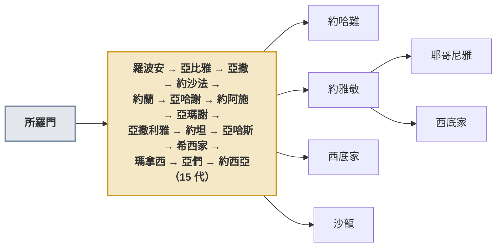
```mermaid
flowchart LR
  n1["所羅門"]
  n2["羅波安 → 亞比雅 → 亞撒 → 約沙法 →<br/>約蘭 → 亞哈謝 → 約阿施 → 亞瑪謝 →<br/>亞撒利雅 → 約坦 → 亞哈斯 → 希西家 →<br/>瑪拿西 → 亞們 → 約西亞<br/>（15 代）"]
  n1 --> n2
  n3["約哈難"]
  n2 --> n3
  n4["約雅敬"]
  n2 --> n4
  n5["耶哥尼雅"]
  n4 --> n5
  n6["西底家"]
  n4 --> n6
  n7["西底家"]
  n2 --> n7
  n8["沙龍"]
  n2 --> n8
  classDef main fill:#d4a82e44,stroke:#c9971c,stroke-width:2px,font-weight:bold
  classDef anchor fill:#7a8ca533,stroke:#7a8ca5
  class n1,n2 main
  classDef mom fill:#8a7bb022,stroke:#9a8cc4,stroke-dasharray:3 3,font-size:12px
  class n1 anchor
```

> [!abstract]+ 完整名單（21 人）
> - ★ 所羅門　`3:5`
>   - ★ 羅波安 → 亞比雅 → 亞撒 → 約沙法 → 約蘭 → 亞哈謝 → 約阿施 → 亞瑪謝 → 亞撒利雅 → 約坦 → 亞哈斯 → 希西家 → 瑪拿西 → 亞們 → 約西亞　*（15 代）*　`3:10–14`
>     - 約哈難（長子）　`3:15`
>     - 約雅敬（次子）　`3:15`
>       - 耶哥尼雅　`3:16`
>       - 西底家　`3:16`
>     - 西底家（三子）　`3:15`
>     - 沙龍（四子）　`3:15`

**人物**

- **約西亞**　「約西亞登基的時候年八歲，在耶路撒冷作王三十一年」。他的四個兒子中有三個先後作王。　`3:14-15, 代下 34:1`
- **耶哥尼雅**　也叫約雅斤。3:17 說「耶哥尼雅被擄」；被擄三十七年後，巴比倫王「使猶大王約雅斤抬頭，提他出監」。　`3:16-17, 王下 25:27`

> [!note] 讀經提醒
> - 3:15 約西亞的三子叫西底家，3:16 約雅敬的兒子也叫西底家，是兩個人。歷代志下 36:10 稱末代王西底家是約雅斤的「叔叔（原文是兄）」。　`3:15-16, 代下 36:10`

[[#目錄|↑ 回到目錄]] · [[#歷代志上 1–9 章 人物族譜圖|回到頂部]]

### 被擄以後的大衛子孫

`3:17–24`　國亡之後，大衛的後代沒有斷，經過被擄歸回的所羅巴伯，一直記到第 3:24 的七個兄弟。

> [!tip] 主線（3 代）
> 耶哥尼雅 → 毘大雅 → 所羅巴伯

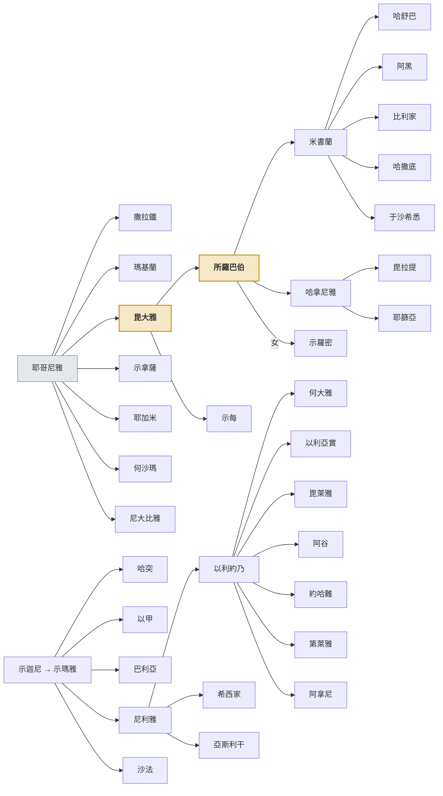
```mermaid
flowchart LR
  n1["耶哥尼雅"]
  n2["撒拉鐵"]
  n1 --> n2
  n3["瑪基蘭"]
  n1 --> n3
  n4["毘大雅"]
  n1 --> n4
  n5["所羅巴伯"]
  n4 --> n5
  n6["米書蘭"]
  n5 --> n6
  n7["哈舒巴"]
  n6 --> n7
  n8["阿黑"]
  n6 --> n8
  n9["比利家"]
  n6 --> n9
  n10["哈撒底"]
  n6 --> n10
  n11["于沙希悉"]
  n6 --> n11
  n12["哈拿尼雅"]
  n5 --> n12
  n13["毘拉提"]
  n12 --> n13
  n14["耶篩亞"]
  n12 --> n14
  n15["示羅密"]
  n5 -->|女| n15
  n16["示每"]
  n4 --> n16
  n17["示拿薩"]
  n1 --> n17
  n18["耶加米"]
  n1 --> n18
  n19["何沙瑪"]
  n1 --> n19
  n20["尼大比雅"]
  n1 --> n20
  n21["示迦尼 → 示瑪雅"]
  n22["哈突"]
  n21 --> n22
  n23["以甲"]
  n21 --> n23
  n24["巴利亞"]
  n21 --> n24
  n25["尼利雅"]
  n21 --> n25
  n26["以利約乃"]
  n25 --> n26
  n27["何大雅"]
  n26 --> n27
  n28["以利亞實"]
  n26 --> n28
  n29["毘萊雅"]
  n26 --> n29
  n30["阿谷"]
  n26 --> n30
  n31["約哈難"]
  n26 --> n31
  n32["第萊雅"]
  n26 --> n32
  n33["阿拿尼"]
  n26 --> n33
  n34["希西家"]
  n25 --> n34
  n35["亞斯利干"]
  n25 --> n35
  n36["沙法"]
  n21 --> n36
  classDef main fill:#d4a82e44,stroke:#c9971c,stroke-width:2px,font-weight:bold
  classDef anchor fill:#7a8ca533,stroke:#7a8ca5
  class n4,n5 main
  classDef mom fill:#8a7bb022,stroke:#9a8cc4,stroke-dasharray:3 3,font-size:12px
  class n1 anchor
```

> [!abstract]- 完整名單（39 人）
> - 耶哥尼雅　`3:16`
>   - 撒拉鐵　`3:17–18`
>   - 瑪基蘭　`3:17–18`
>   - ★ 毘大雅　`3:17–18`
>     - ★ 所羅巴伯　`3:19`
>       - 米書蘭　`3:19`
>         - 哈舒巴　`3:20`
>         - 阿黑　`3:20`
>         - 比利家　`3:20`
>         - 哈撒底　`3:20`
>         - 于沙希悉　`3:20`
>       - 哈拿尼雅　`3:19`
>         - 毘拉提　`3:21`
>         - 耶篩亞　`3:21`
>       - 〔女〕示羅密（經文稱「他們的妹子」）　`3:19`
>     - 示每　`3:19`
>   - 示拿薩　`3:17–18`
>   - 耶加米　`3:17–18`
>   - 何沙瑪　`3:17–18`
>   - 尼大比雅　`3:17–18`
> - 利法雅（經文作「利法雅的眾子」）　`3:21`
> - 亞珥難（經文作「亞珥難的眾子」）　`3:21`
> - 俄巴底亞（經文作「俄巴底亞的眾子」）　`3:21`
> - 示迦尼（經文作「示迦尼的眾子」） → 示瑪雅　`3:21`
>   - 哈突　`3:22`
>   - 以甲　`3:22`
>   - 巴利亞　`3:22`
>   - 尼利雅　`3:22`
>     - 以利約乃　`3:23`
>       - 何大雅　`3:24`
>       - 以利亞實　`3:24`
>       - 毘萊雅　`3:24`
>       - 阿谷　`3:24`
>       - 約哈難　`3:24`
>       - 第萊雅　`3:24`
>       - 阿拿尼　`3:24`
>     - 希西家　`3:23`
>     - 亞斯利干　`3:23`
>   - 沙法　`3:22`

- 3:17：「耶哥尼雅被擄」。　`3:17–18`
- 3:20 和合本作「米書蘭的兒子是哈舒巴、阿黑、比利家、哈撒底、于沙希悉，共五人」。　`3:20`

**人物**

- **所羅巴伯**　被擄歸回的領袖。以斯拉記記他和祭司耶書亞「都起來建築以色列神的壇」。　`3:19, 拉 3:2`
- **哈突**　示瑪雅的兒子。以斯拉記 8:2 列在隨以斯拉回來的人中：「屬大衛的子孫有哈突」；經文沒有說這兩處的哈突是不是同一人。　`3:22, 拉 8:2`

> [!note] 讀經提醒
> - 3:19 說所羅巴伯是「毘大雅的兒子」；以斯拉記 3:2 和馬太福音 1:12 都說他是撒拉鐵的兒子。　`3:19, 拉 3:2, 太 1:12`
> - 3:21 在毘拉提、耶篩亞之後寫「還有利法雅的眾子，亞珥難的眾子，俄巴底亞的眾子，示迦尼的眾子」，沒有交代這四家和上文的關係，所以這裡讓他們各自成行。　`3:21`
> - 3:22 說示瑪雅的兒子「共六人」，實際列出的名字是五個。　`3:22`

[[#目錄|↑ 回到目錄]] · [[#歷代志上 1–9 章 人物族譜圖|回到頂部]]

---

## 第 4 章　猶大（二）與西緬

### 猶大的其他家族

`4:1–23`　這一段補記猶大各地的家族，次序比較零散，夾著雅比斯的禱告。很多名字後面是「某地之祖」，說的是哪個城鎮由這一家開始。

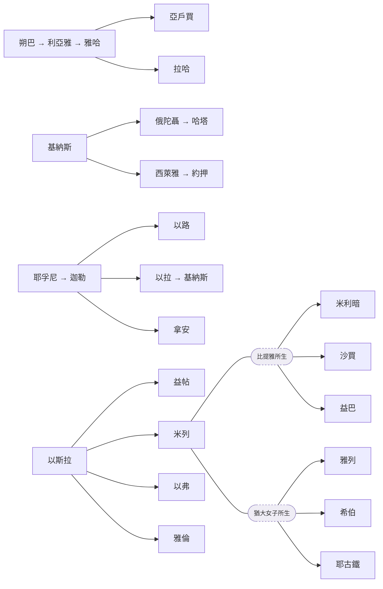
```mermaid
flowchart LR
  n1["朔巴 → 利亞雅 → 雅哈"]
  n2["亞戶買"]
  n1 --> n2
  n3["拉哈"]
  n1 --> n3
  n4["基納斯"]
  n5["俄陀聶 → 哈塔"]
  n4 --> n5
  n6["西萊雅 → 約押"]
  n4 --> n6
  n7["耶孚尼 → 迦勒"]
  n8["以路"]
  n7 --> n8
  n9["以拉 → 基納斯"]
  n7 --> n9
  n10["拿安"]
  n7 --> n10
  n11["以斯拉"]
  n12["益帖"]
  n11 --> n12
  n13["米列"]
  n11 --> n13
  n14(["比提雅所生"])
  n13 --- n14
  n15["米利暗"]
  n14 --> n15
  n16["沙買"]
  n14 --> n16
  n17["益巴"]
  n14 --> n17
  n18(["猶大女子所生"])
  n13 --- n18
  n19["雅列"]
  n18 --> n19
  n20["希伯"]
  n18 --> n20
  n21["耶古鐵"]
  n18 --> n21
  n22["以弗"]
  n11 --> n22
  n23["雅倫"]
  n11 --> n23
  classDef main fill:#d4a82e44,stroke:#c9971c,stroke-width:2px,font-weight:bold
  classDef anchor fill:#7a8ca533,stroke:#7a8ca5
  classDef mom fill:#8a7bb022,stroke:#9a8cc4,stroke-dasharray:3 3,font-size:12px
  class n14,n18 mom
```

> [!abstract]- 完整名單（79 人）
> - 朔巴 → 利亞雅 → 雅哈　`4:2`
>   - 亞戶買　`4:2`
>   - 拉哈　`4:2`
> - 以坦之祖　`4:3`
>   - 耶斯列　`4:3`
>   - 伊施瑪　`4:3`
>   - 伊得巴　`4:3`
>   - 〔女〕哈悉勒玻尼（經文稱「他們的妹子」）　`4:3`
> - 戶珥　`2:19`
>   - 毘努伊勒（基多之祖）　`4:4`
>   - 以謝珥（戶沙之祖）　`4:4`
> - 亞施戶（提哥亞的父親；希斯崙死後才生）　`2:24`
>   - *拿拉所生*
>     - 亞戶撒　`4:5–6`
>     - 希弗　`4:5–6`
>     - 提米尼　`4:5–6`
>     - 哈轄斯他利　`4:5–6`
>   - *希拉所生*
>     - 洗列　`4:5, 4:7`
>     - 瑣轄　`4:5, 4:7`
>     - 伊提南　`4:5, 4:7`
> - 哥斯　`4:8`
>   - 亞諾　`4:8`
>   - 瑣比巴　`4:8`
> - 哈崙 → 亞哈黑（與他的諸族）　`4:8`
> - 雅比斯（「比他眾弟兄更尊貴」）　`4:9–10`
> - 基綠（書哈的弟兄） → 米黑（伊施屯之祖）　`4:11`
> - 伊施屯　`4:12`
>   - 伯拉巴　`4:12`
>   - 巴西亞　`4:12`
>   - 提欣拿（珥拿轄之祖）　`4:12`
> - 基納斯　`4:13`
>   - 俄陀聶 → 哈塔　`4:13`
>   - 西萊雅 → 約押（革夏納欣人之祖）　`4:13`
> - 憫挪太 → 俄弗拉　`4:14`
> - 耶孚尼 → 迦勒　`4:15`
>   - 以路　`4:15`
>   - 以拉 → 基納斯　`4:15`
>   - 拿安　`4:15`
> - 耶哈利勒　`4:16`
>   - 西弗　`4:16`
>   - 西法　`4:16`
>   - 提利　`4:16`
>   - 亞撒列　`4:16`
> - 以斯拉　`4:17–18`
>   - 益帖　`4:17–18`
>   - 米列　`4:17–18`
>     - *比提雅所生*
>       - 米利暗　`4:17–18`
>       - 沙買　`4:17–18`
>       - 益巴（以實提摩之祖）　`4:17–18`
>     - *猶大女子所生*
>       - 雅列（基多之祖）　`4:17–18`
>       - 希伯（梭哥之祖）　`4:17–18`
>       - 耶古鐵（撒挪亞之祖）　`4:17–18`
>   - 以弗　`4:17–18`
>   - 雅倫　`4:17–18`
> - 荷第雅　`4:19`
>   - *拿含的妹子所生*
>     - 基伊拉（迦米人）　`4:19`
>     - 以實提摩之祖（瑪迦人）　`4:19`
> - 示門　`4:20`
>   - 暗嫩　`4:20`
>   - 林拿　`4:20`
>   - 便哈南　`4:20`
>   - 提倫　`4:20`
> - 以示　`4:20`
>   - 梭黑　`4:20`
>   - 便梭黑　`4:20`
> - 示拉　`2:3`
>   - 珥（利迦之祖）　`4:21–22`
>   - 拉大（瑪利沙之祖）　`4:21–22`
>   - 亞實比族（織細麻布的各家）　`4:21–22`
>   - 約敬　`4:21–22`
>   - 哥西巴人　`4:21–22`
>   - 約阿施　`4:21–22`
>   - 薩拉　`4:21–22`
>   - 雅叔比利恆　`4:21–22`

- 4:1「猶大的兒子是法勒斯、希斯崙、迦米、戶珥、朔巴」：照第 2 章，法勒斯是猶大的兒子、希斯崙是法勒斯的兒子，這裡的「兒子」泛指後代。　`4:1`
- 4:2 結尾說：「這是瑣拉人的諸族」。　`4:2`
- 4:5：「提哥亞之祖亞施戶有兩個妻子：一名希拉，一名拿拉」。　`4:5–6`
- 4:12 結尾說：「這都是利迦人」。　`4:12`
- 4:14：「他們都是匠人」。　`4:14`
- 4:22 說約敬等人「就是在摩押地掌權的」，又說「這都是古時所記載的」。　`4:21–22`
- 「這些人都是窯匠，是尼他應和基低拉的居民；與王同處，為王做工」。　`4:23`

**人物**

- **雅比斯**　母親給他取名雅比斯，意思是「我生他甚是痛苦」。他禱告說：「甚願你賜福與我，擴張我的境界，常與我同在，保佑我不遭患難，不受艱苦」，「神就應允他所求的」。　`4:9-10`
- **俄陀聶**　以色列人呼求耶和華，神興起的拯救者就是「迦勒兄弟基納斯的兒子俄陀聶」；之後「國中太平四十年」。　`4:13, 士 3:9, 士 3:11`
- **迦勒**　約書亞時代的探子。「約書亞為耶孚尼的兒子迦勒祝福，將希伯崙給他為業」。這位迦勒和 2:18 起的迦勒（基路拜，希斯崙的兒子）不同人。　`4:15, 書 14:13`
- **米列**　4:17：「米列娶法老女兒比提雅為妻」，又娶了一位猶大女子。　`4:17`

> [!note] 讀經提醒
> - 4:2 的朔巴、4:4 的戶珥接在 4:1 那串名字後面寫；經文沒有明說 4:2 的朔巴就是 2:50 的朔巴，這裡分開列。　`4:1-4`
> - 4:17–18 的經文和合本合成一節（4:18 標「併於上節」）。米列的兩個妻子各生了哪些兒子，照和合本分列。　`4:17-18`

[[#目錄|↑ 回到目錄]] · [[#歷代志上 1–9 章 人物族譜圖|回到頂部]]

### 西緬

`4:24–43`　西緬的家族不大（4:27），住在猶大地的南方。這一段後半記了兩次向外擴張：往基多口找草場，和上西珥山。

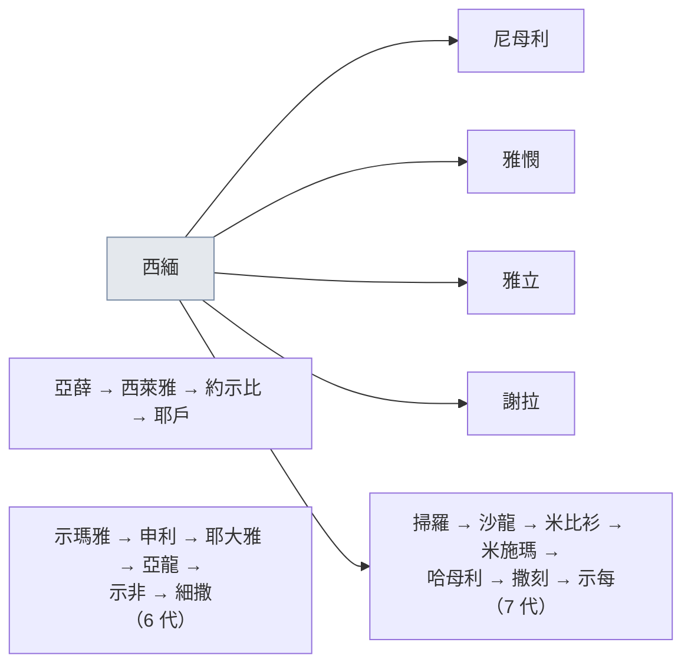
```mermaid
flowchart LR
  n1["西緬"]
  n2["尼母利"]
  n1 --> n2
  n3["雅憫"]
  n1 --> n3
  n4["雅立"]
  n1 --> n4
  n5["謝拉"]
  n1 --> n5
  n6["掃羅 → 沙龍 → 米比衫 → 米施瑪 →<br/>哈母利 → 撒刻 → 示每<br/>（7 代）"]
  n1 --> n6
  n7["亞薛 → 西萊雅 → 約示比 → 耶戶"]
  n8["示瑪雅 → 申利 → 耶大雅 → 亞龍 →<br/>示非 → 細撒<br/>（6 代）"]
  classDef main fill:#d4a82e44,stroke:#c9971c,stroke-width:2px,font-weight:bold
  classDef anchor fill:#7a8ca533,stroke:#7a8ca5
  classDef mom fill:#8a7bb022,stroke:#9a8cc4,stroke-dasharray:3 3,font-size:12px
  class n1 anchor
```

> [!abstract]+ 完整名單（38 人）
> - 西緬　`2:1–2`
>   - 尼母利　`4:24`
>   - 雅憫　`4:24`
>   - 雅立　`4:24`
>   - 謝拉　`4:24`
>   - 掃羅 → 沙龍 → 米比衫 → 米施瑪 → 哈母利 → 撒刻 → 示每　*（7 代）*　`4:24`
> - 米所巴　`4:34`
> - 雅米勒　`4:34`
> - 亞瑪謝 → 約沙　`4:34`
> - 約珥　`4:35`
> - 亞薛 → 西萊雅 → 約示比 → 耶戶　*（4 代）*　`4:35`
> - 以利約乃　`4:36`
> - 雅哥巴　`4:36`
> - 約朔海　`4:36`
> - 亞帥雅　`4:36`
> - 亞底業　`4:36`
> - 耶西篾　`4:36`
> - 比拿雅　`4:36`
> - 示瑪雅 → 申利 → 耶大雅 → 亞龍 → 示非 → 細撒　*（6 代）*　`4:37`
> - 以示　`4:42–43`
>   - 毘拉提　`4:42–43`
>   - 尼利雅　`4:42–43`
>   - 利法雅　`4:42–43`
>   - 烏薛　`4:42–43`

- 「示每有十六個兒子，六個女兒，他弟兄的兒女不多，他們各家不如猶大族的人丁增多」。　`4:27`
- **西緬人住的城邑**：別是巴、摩拉大、哈薩書亞、辟拉、以森、陀臘、彼土利、何珥瑪、洗革拉、伯瑪嘉博、哈薩蘇撒、伯比利、沙拉音　「這些城邑直到大衛作王的時候都是屬西緬人的」。　`4:28–31`
- **另外五個城邑**：以坦、亞因、臨門、陀健、亞珊　「還有屬城的鄉村，直到巴力」。　`4:32–33`
- 4:34–37 這些人，「都是作族長的，他們宗族的人數增多」。　`4:38`
- 他們往「基多口」去找牧羊的草場，在「猶大王希西家年間」攻擊那裡的「含族人」和「米烏尼人」，「就住在他們的地方，直到今日」。　`4:39–41`
- 西緬人中「有五百人上西珥山」，由以示的四個兒子率領，「殺了逃脫剩下的亞瑪力人，就住在那裡直到今日」。　`4:42–43`

**人物**

- **示每**　「示每有十六個兒子，六個女兒」，但他的弟兄兒女不多。　`4:27`

[[#目錄|↑ 回到目錄]] · [[#歷代志上 1–9 章 人物族譜圖|回到頂部]]

---

## 第 5 章　約旦河東的兩個半支派

### 流便

`5:1–10`　流便是長子，經文先解釋為什麼族譜不從他開始，再列出他的兒子和後代。

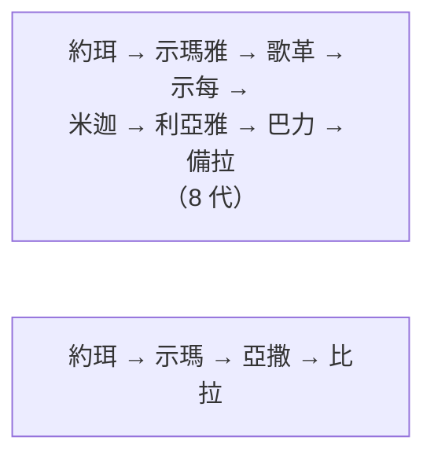
```mermaid
flowchart LR
  n1["約珥 → 示瑪雅 → 歌革 → 示每 →<br/>米迦 → 利亞雅 → 巴力 → 備拉<br/>（8 代）"]
  n2["約珥 → 示瑪 → 亞撒 → 比拉"]
  classDef main fill:#d4a82e44,stroke:#c9971c,stroke-width:2px,font-weight:bold
  classDef anchor fill:#7a8ca533,stroke:#7a8ca5
  classDef mom fill:#8a7bb022,stroke:#9a8cc4,stroke-dasharray:3 3,font-size:12px
```

> [!abstract]+ 完整名單（18 人）
> - 流便　`2:1–2`
>   - 哈諾　`5:3`
>   - 法路　`5:3`
>   - 希斯倫　`5:3`
>   - 迦米　`5:3`
> - 約珥 → 示瑪雅 → 歌革 → 示每 → 米迦 → 利亞雅 → 巴力 → 備拉（流便支派的首領，「被亞述王提革拉毘尼色擄去」）　*（8 代）*　`5:4–6`
> - 耶利（為首）　`5:7`
> - 撒迦利雅　`5:7`
> - 約珥 → 示瑪 → 亞撒 → 比拉　*（4 代）*　`5:8`

- 流便「因他污穢了父親的床，他長子的名分就歸了約瑟」；「猶大勝過一切弟兄，君王也是從他而出；長子的名分卻歸約瑟」。　`5:1–2`
- 5:7：耶利、撒迦利雅和下面的比拉，是備拉的弟兄，「照著宗族，按著家譜作族長」。　`5:7`
- **約珥一家住的地方**：亞羅珥、尼波、巴力免、伯拉河　「因為他們在基列地牲畜增多」。　`5:8–9`
- 「掃羅年間，他們與夏甲人爭戰」，佔了基列東邊的全地。　`5:10`

**人物**

- **備拉**　流便支派的首領，「被亞述王提革拉毘尼色擄去」。　`5:6`

> [!note] 讀經提醒
> - 5:4 的約珥沒有交代是流便哪一個兒子的後代。5:6 被擄的是「備拉」，和 5:8 的「比拉」是兩個人。　`5:4-8`

[[#目錄|↑ 回到目錄]] · [[#歷代志上 1–9 章 人物族譜圖|回到頂部]]

### 迦得

`5:11–17`　迦得的子孫住在巴珊和基列。這一段沒有從迦得本人往下排，而是列出幾位族長，再往上追溯其中一家的祖先。

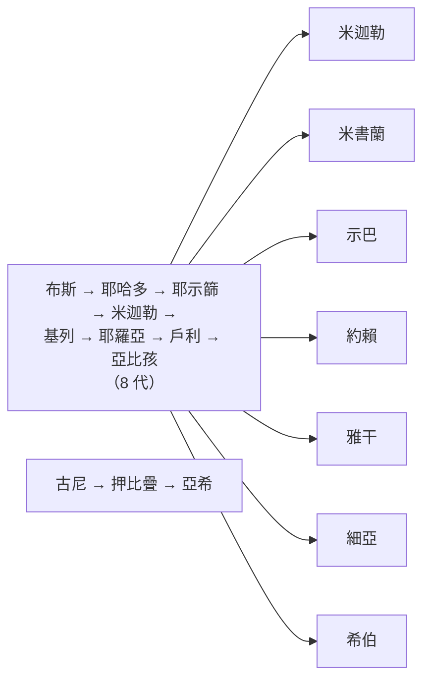
```mermaid
flowchart LR
  n1["布斯 → 耶哈多 → 耶示篩 → 米迦勒 →<br/>基列 → 耶羅亞 → 戶利 → 亞比孩<br/>（8 代）"]
  n2["米迦勒"]
  n1 --> n2
  n3["米書蘭"]
  n1 --> n3
  n4["示巴"]
  n1 --> n4
  n5["約賴"]
  n1 --> n5
  n6["雅干"]
  n1 --> n6
  n7["細亞"]
  n1 --> n7
  n8["希伯"]
  n1 --> n8
  n9["古尼 → 押比疊 → 亞希"]
  classDef main fill:#d4a82e44,stroke:#c9971c,stroke-width:2px,font-weight:bold
  classDef anchor fill:#7a8ca533,stroke:#7a8ca5
  classDef mom fill:#8a7bb022,stroke:#9a8cc4,stroke-dasharray:3 3,font-size:12px
```

> [!abstract]+ 完整名單（22 人）
> - 約珥（族長）　`5:12`
> - 沙番（副族長）　`5:12`
> - 雅乃　`5:12`
> - 沙法（住在巴珊）　`5:12`
> - 布斯 → 耶哈多 → 耶示篩 → 米迦勒 → 基列 → 耶羅亞 → 戶利 → 亞比孩　*（8 代）*　`5:14`
>   - 米迦勒　`5:13–14`
>   - 米書蘭　`5:13–14`
>   - 示巴　`5:13–14`
>   - 約賴　`5:13–14`
>   - 雅干　`5:13–14`
>   - 細亞　`5:13–14`
>   - 希伯　`5:13–14`
> - 古尼 → 押比疊 → 亞希（族長）　`5:15`

- 迦得的子孫「在流便對面，住在巴珊地，延到撒迦」。　`5:11`
- 他們住在「基列與巴珊和巴珊的鄉村，並沙崙的郊野」，「在猶大王約坦並在以色列王耶羅波安年間，都載入家譜」。　`5:16–17`

[[#目錄|↑ 回到目錄]] · [[#歷代志上 1–9 章 人物族譜圖|回到頂部]]

### 河東兩個半支派的戰役

`5:18–22`　流便、迦得和瑪拿西半支派聯手作戰。經文把勝利的原因說得很清楚。

- **對手**：夏甲人、伊突人、拿非施人、挪答人　河東聯軍「共有四萬四千七百六十名」。　`5:18–19`
- 「因為他們在陣上呼求神，倚賴神，神就應允他們」。　`5:20`
- 他們擄掠了大批牲畜和人口（數目見文末〈經文記下的人數〉），「因為這爭戰是出乎神」，就住在敵人的地上，「直到被擄的時候」。　`5:21–22`

[[#目錄|↑ 回到目錄]] · [[#歷代志上 1–9 章 人物族譜圖|回到頂部]]

### 河東的瑪拿西半支派，以及被擄

`5:23–26`　瑪拿西半支派的七個族長，接著是河東各支派被擄的原因和經過。

> [!abstract]+ 完整名單（7 人）
> - 以弗　`5:24`
> - 以示　`5:24`
> - 以列　`5:24`
> - 亞斯列　`5:24`
> - 耶利米　`5:24`
> - 何達威雅　`5:24`
> - 雅疊　`5:24`

- 瑪拿西半支派的人住的地方「從巴珊延到巴力黑們、示尼珥與黑門山」。　`5:23`
- 5:24：這七人「都是大能的勇士，是有名的人，也是作族長的」。　`5:24`
- 他們「得罪了他們列祖的神」，所以神「激動亞述王普勒和亞述王提革拉毘尼色的心」，把流便人、迦得人、瑪拿西半支派的人擄到哈臘、哈博、哈拉與歌散河邊，「直到今日還在那裡」。　`5:25–26`

[[#目錄|↑ 回到目錄]] · [[#歷代志上 1–9 章 人物族譜圖|回到頂部]]

---

## 第 6 章　利未

### 大祭司的家系

`6:1–15`　利未支派一開頭就沿著亞倫的兒子以利亞撒，一代代排到被擄時的約薩答。這是一條父傳子的祭司家系。

> [!tip] 主線（26 代）
> 利未 → 哥轄 → 暗蘭 → 亞倫 → 以利亞撒 → 非尼哈 → 亞比書 → 布基 → 烏西 → 西拉希雅 → 米拉約 → 亞瑪利雅 → 亞希突 → 撒督 → 亞希瑪斯 → 亞撒利雅 → 約哈難 → 亞撒利雅 → 亞瑪利雅 → 亞希突 → 撒督 → 沙龍 → 希勒家 → 亞撒利雅 → 西萊雅 → 約薩答

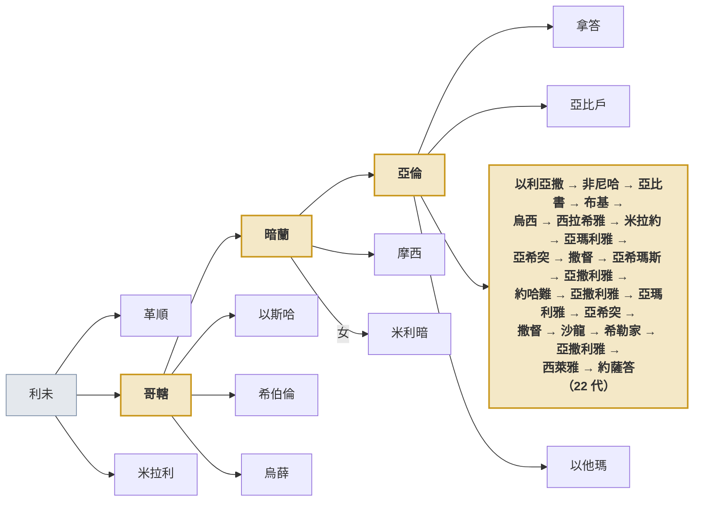
```mermaid
flowchart LR
  n1["利未"]
  n2["革順"]
  n1 --> n2
  n3["哥轄"]
  n1 --> n3
  n4["暗蘭"]
  n3 --> n4
  n5["亞倫"]
  n4 --> n5
  n6["拿答"]
  n5 --> n6
  n7["亞比戶"]
  n5 --> n7
  n8["以利亞撒 → 非尼哈 → 亞比書 → 布基 →<br/>烏西 → 西拉希雅 → 米拉約 → 亞瑪利雅 →<br/>亞希突 → 撒督 → 亞希瑪斯 → 亞撒利雅 →<br/>約哈難 → 亞撒利雅 → 亞瑪利雅 → 亞希突 →<br/>撒督 → 沙龍 → 希勒家 → 亞撒利雅 →<br/>西萊雅 → 約薩答<br/>（22 代）"]
  n5 --> n8
  n9["以他瑪"]
  n5 --> n9
  n10["摩西"]
  n4 --> n10
  n11["米利暗"]
  n4 -->|女| n11
  n12["以斯哈"]
  n3 --> n12
  n13["希伯倫"]
  n3 --> n13
  n14["烏薛"]
  n3 --> n14
  n15["米拉利"]
  n1 --> n15
  classDef main fill:#d4a82e44,stroke:#c9971c,stroke-width:2px,font-weight:bold
  classDef anchor fill:#7a8ca533,stroke:#7a8ca5
  class n3,n4,n5,n8 main
  classDef mom fill:#8a7bb022,stroke:#9a8cc4,stroke-dasharray:3 3,font-size:12px
  class n1 anchor
```

> [!abstract]+ 完整名單（35 人）
> - 利未　`2:1–2`
>   - 革順　`6:1`
>   - ★ 哥轄　`6:1`
>     - ★ 暗蘭　`6:2`
>       - ★ 亞倫　`6:3`
>         - 拿答　`6:3`
>         - 亞比戶　`6:3`
>         - ★ 以利亞撒 → 非尼哈 → 亞比書 → 布基 → 烏西 → 西拉希雅 → 米拉約 → 亞瑪利雅 → 亞希突 → 撒督 → 亞希瑪斯 → 亞撒利雅 → 約哈難 → 亞撒利雅（「在所羅門於耶路撒冷所建造的殿中，供祭司的職分」） → 亞瑪利雅 → 亞希突 → 撒督 → 沙龍 → 希勒家 → 亞撒利雅 → 西萊雅 → 約薩答（耶路撒冷被擄時，「這約薩答也被擄去」）　*（22 代）*　`6:3`
>         - 以他瑪　`6:3`
>       - 摩西　`6:3`
>       - 〔女〕米利暗　`6:3`
>     - 以斯哈　`6:2`
>     - 希伯倫　`6:2`
>     - 烏薛　`6:2`
>   - 米拉利　`6:1`

**人物**

- **亞倫**　他和子孫「在燔祭壇和香壇上獻祭燒香，又在至聖所辦理一切的事，為以色列人贖罪」。　`6:3, 6:49`
- **非尼哈**　亞倫的孫子。神說他「使我向以色列人所發的怒消了」；9:20 記「從前以利亞撒的兒子非尼哈管理他們，耶和華也與他同在」。　`6:4, 民 25:11, 9:20`
- **撒督**　大衛和所羅門時的祭司。「祭司撒督就從帳幕中取了盛膏油的角來，用膏膏所羅門」。　`6:8, 王上 1:39`
- **希勒家**　約西亞時的大祭司，他說：「我在耶和華殿裡得了律法書」。　`6:13, 王下 22:8`
- **西萊雅**　耶路撒冷陷落時，「護衛長拿住大祭司西萊雅」，帶到利比拉擊殺。　`6:14, 王下 25:18, 王下 25:21`

> [!note] 讀經提醒
> - 這條家系裡亞瑪利雅、亞希突、撒督、亞撒利雅都出現不只一次，是同名的不同世代。　`6:7-14`

[[#目錄|↑ 回到目錄]] · [[#歷代志上 1–9 章 人物族譜圖|回到頂部]]

### 利未三族的其他家系

`6:16–30`　回到利未的三個兒子，分別往下排革順、哥轄、米拉利三族，最後一族接到先知撒母耳。

```mermaid
flowchart LR
  n1["革順"]
  n2["立尼 → 雅哈 → 薪瑪 → 約亞 →<br/>易多 → 謝拉 → 耶特賴<br/>（7 代）"]
  n1 --> n2
  n3["示每"]
  n1 --> n3
  n4["米拉利"]
  n5["抹利 → 立尼 → 示每 → 烏撒 →<br/>示米亞 → 哈基雅 → 亞帥雅<br/>（7 代）"]
  n4 --> n5
  n6["母示"]
  n4 --> n6
  n7["哥轄"]
  n8["亞米拿達 → 可拉 → 亞惜 → 以利加拿 →<br/>以比雅撒 → 亞惜 → 他哈 → 烏列 →<br/>烏西雅 → 少羅<br/>（10 代）"]
  n7 --> n8
  n9["以利加拿"]
  n10["亞瑪賽"]
  n9 --> n10
  n11["亞希摩 → 以利加拿 → 瑣菲 → 拿哈 →<br/>以利押 → 耶羅罕 → 以利加拿 → 撒母耳<br/>（8 代）"]
  n9 --> n11
  n12["約珥"]
  n11 --> n12
  n13["亞比亞"]
  n11 --> n13
  classDef main fill:#d4a82e44,stroke:#c9971c,stroke-width:2px,font-weight:bold
  classDef anchor fill:#7a8ca533,stroke:#7a8ca5
  class n7,n11 main
  classDef mom fill:#8a7bb022,stroke:#9a8cc4,stroke-dasharray:3 3,font-size:12px
  class n1,n4,n7 anchor
```

> [!abstract]+ 完整名單（38 人）
> - 革順　`6:1`
>   - 立尼 → 雅哈 → 薪瑪 → 約亞 → 易多 → 謝拉 → 耶特賴　*（7 代）*　`6:17`
>   - 示每　`6:17`
> - 米拉利　`6:1`
>   - 抹利 → 立尼 → 示每 → 烏撒 → 示米亞 → 哈基雅 → 亞帥雅　*（7 代）*　`6:19`
>   - 母示　`6:19`
> - ★ 哥轄　`6:1`
>   - 亞米拿達 → 可拉 → 亞惜 → 以利加拿 → 以比雅撒 → 亞惜 → 他哈 → 烏列 → 烏西雅 → 少羅　*（10 代）*　`6:22–24`
> - 以利加拿　`6:25`
>   - 亞瑪賽　`6:25`
>   - ★ 亞希摩 → 以利加拿 → 瑣菲 → 拿哈 → 以利押 → 耶羅罕 → 以利加拿 → 撒母耳　*（8 代）*　`6:25`
>     - 約珥（長子）　`6:28`
>     - 亞比亞（次子）　`6:28`

- 6:19：「這是按著利未人宗族分的各家」。　`6:19`

**人物**

- **撒母耳**　以利加拿的兒子。「哈拿就懷孕。日期滿足，生了一個兒子，給他起名叫撒母耳」。他的長子約珥，就是歌唱領袖希幔的父親。　`6:27-28, 6:33, 撒上 1:20`

> [!note] 讀經提醒
> - 6:25 的以利加拿，經文沒有說是 6:23 的哪一位以利加拿，這裡另起一行。　`6:23-25`
> - 撒母耳的祖先在本章出現兩次，名字不全相同：6:26–27 是瑣菲、拿哈、以利押，6:34–35 是蘇弗、陀亞、以列。可拉的父親，6:22 寫亞米拿達，6:38 寫以斯哈。兩份名單照各自原文分開列。　`6:22, 6:26-27, 6:34-35, 6:38`
> - 撒母耳記上 1:1 說撒母耳的父親以利加拿是「以法蓮人」；本章把這一家列在利未支派哥轄族。　`6:27, 撒上 1:1`

[[#目錄|↑ 回到目錄]] · [[#歷代志上 1–9 章 人物族譜圖|回到頂部]]

### 大衛派定的三位歌唱領袖

`6:31–48`　約櫃安設以後，大衛派利未人在會幕前歌唱。三族各出一位領袖，經文把每位的祖先一路追回利未：希幔（哥轄族）站中間，亞薩（革順族）在右邊，以探（米拉利族）在左邊。

```mermaid
flowchart LR
  n1["以斯哈"]
  n2["可拉 → 以比雅撒"]
  n1 --> n2
  n3["亞惜 → 他哈 → 西番雅 → 亞撒利雅 →<br/>約珥 → 以利加拿 → 亞瑪賽 → 瑪哈 →<br/>以利加拿 → 蘇弗 → 陀亞 → 以列 →<br/>耶羅罕 → 以利加拿 → 撒母耳 → 約珥 →<br/>希幔<br/>（17 代）"]
  n2 --> n3
  n4["革順"]
  n5["雅哈 → 示每 → 薪瑪 → 以探 →<br/>亞大雅 → 謝拉 → 伊特尼 → 瑪基雅 →<br/>巴西雅 → 米迦勒 → 示米亞 → 比利家 →<br/>亞薩<br/>（13 代）"]
  n4 --> n5
  n6["母示"]
  n7["末力 → 沙麥 → 巴尼 → 暗西 →<br/>希勒家 → 亞瑪謝 → 哈沙比雅 → 瑪鹿 →<br/>亞伯底 → 基示 → 以探<br/>（11 代）"]
  n6 --> n7
  classDef main fill:#d4a82e44,stroke:#c9971c,stroke-width:2px,font-weight:bold
  classDef anchor fill:#7a8ca533,stroke:#7a8ca5
  class n3,n5,n7 main
  classDef mom fill:#8a7bb022,stroke:#9a8cc4,stroke-dasharray:3 3,font-size:12px
  class n1,n4,n6 anchor
```

> [!abstract]+ 完整名單（43 人）
> - 以斯哈　`6:2`
>   - 可拉 → 以比雅撒　`6:33–38`
>     - ★ 亞惜 → 他哈 → 西番雅 → 亞撒利雅 → 約珥 → 以利加拿 → 亞瑪賽 → 瑪哈 → 以利加拿 → 蘇弗 → 陀亞 → 以列 → 耶羅罕 → 以利加拿 → 撒母耳 → 約珥 → 希幔（哥轄族，站在中間）　*（17 代）*　`6:33–38`
> - 革順　`6:1`
>   - ★ 雅哈 → 示每 → 薪瑪 → 以探 → 亞大雅 → 謝拉 → 伊特尼 → 瑪基雅 → 巴西雅 → 米迦勒 → 示米亞 → 比利家 → 亞薩（革順族，「在希幔右邊供職」）　*（13 代）*　`6:39–43`
> - 母示　`6:19`
>   - ★ 末力 → 沙麥 → 巴尼 → 暗西 → 希勒家 → 亞瑪謝 → 哈沙比雅 → 瑪鹿 → 亞伯底 → 基示 → 以探（米拉利族，「在他們左邊供職」）　*（11 代）*　`6:44–47`

- 「約櫃安設之後，大衛派人在耶和華殿中管理歌唱的事」；所羅門建殿以後，「他們便按著班次供職」。　`6:31–32`
- 「他們的族弟兄利未人也被派辦神殿中的一切事」。　`6:48`

**人物**

- **可拉**　民數記 16:1 的可拉是「以斯哈的兒子」，帶頭反對摩西；但「可拉的眾子沒有死亡」，他的後代後來成了聖殿的歌唱者和守門人（6:33–37、9:19）。　`6:37-38, 民 16:1, 民 26:11, 9:19`
- **希幔**　大衛派定的歌唱領袖。「希幔奉神之命作王的先見。神賜給希幔十四個兒子，三個女兒」。　`6:33, 代上 25:5`
- **亞薩**　歌唱領袖，「在希幔右邊供職」。約櫃進城時，「惟有亞薩敲鈸，大發響聲」。詩篇 50 篇標題是「亞薩的詩」。　`6:39, 代上 16:5, 詩 50:1`
- **以探**　米拉利族的歌唱領袖，在左邊供職。大衛「派歌唱的希幔、亞薩、以探敲銅鈸，大發響聲」。　`6:44, 代上 15:19`

> [!note] 讀經提醒
> - 6:33–38 和 6:22–28 都有撒母耳一家，兩份名單有幾個名字不同（見上一段的讀經提醒）。這裡的撒母耳和 6:27 的撒母耳是同一人，因兩份名單無法逐一對齊，所以分開畫。　`6:27-28, 6:33`
> - 亞薩的家系從革順直接接到雅哈（6:43）；6:20 則是革順、立尼、雅哈。　`6:20, 6:43`

[[#目錄|↑ 回到目錄]] · [[#歷代志上 1–9 章 人物族譜圖|回到頂部]]

### 亞倫子孫的職分

`6:49–53`　祭司的工作只屬於亞倫的子孫。6:50–53 重述 6:4–8 的大祭司家系，到撒督的兒子亞希瑪斯為止。

- 亞倫和他的子孫「在燔祭壇和香壇上獻祭燒香，又在至聖所辦理一切的事，為以色列人贖罪」。　`6:49`

[[#目錄|↑ 回到目錄]] · [[#歷代志上 1–9 章 人物族譜圖|回到頂部]]

### 利未人的城邑

`6:54–81`　利未人沒有一塊自己的地，而是散住在各支派中間的城邑。完整城名見文末「利未人的城邑」表。

- 亞倫的子孫先抽籤，得了希伯崙和四圍的郊野；「只是屬城的田地和村莊都為耶孚尼的兒子迦勒所得」。　`6:54–56`
- 哥轄族其餘的人「在瑪拿西半支派的地中得了十座城」，革順族得了「十三座城」，米拉利族得了「十二座城」。　`6:61–63`
- 「以色列人將這些城與其郊野給了利未人」，都是「拈鬮」分配。　`6:64–65`

[[#目錄|↑ 回到目錄]] · [[#歷代志上 1–9 章 人物族譜圖|回到頂部]]

---

## 第 7 章　北方各支派

### 以薩迦

`7:1–5`　以薩迦的記載重點在人數：每一家能出戰的勇士有多少。

```mermaid
flowchart LR
  n1["以薩迦"]
  n2["陀拉"]
  n1 --> n2
  n3["烏西 → 伊斯拉希"]
  n2 --> n3
  n4["米迦勒"]
  n3 --> n4
  n5["俄巴底亞"]
  n3 --> n5
  n6["約珥"]
  n3 --> n6
  n7["伊示雅"]
  n3 --> n7
  n8["利法雅"]
  n2 --> n8
  n9["耶勒"]
  n2 --> n9
  n10["雅買"]
  n2 --> n10
  n11["易伯散"]
  n2 --> n11
  n12["示母利"]
  n2 --> n12
  n13["普瓦"]
  n1 --> n13
  n14["雅述"]
  n1 --> n14
  n15["伸崙"]
  n1 --> n15
  classDef main fill:#d4a82e44,stroke:#c9971c,stroke-width:2px,font-weight:bold
  classDef anchor fill:#7a8ca533,stroke:#7a8ca5
  classDef mom fill:#8a7bb022,stroke:#9a8cc4,stroke-dasharray:3 3,font-size:12px
  class n1 anchor
```

> [!abstract]+ 完整名單（15 人）
> - 以薩迦　`2:1–2`
>   - 陀拉　`7:1`
>     - 烏西 → 伊斯拉希　`7:2`
>       - 米迦勒　`7:3`
>       - 俄巴底亞　`7:3`
>       - 約珥　`7:3`
>       - 伊示雅　`7:3`
>     - 利法雅　`7:2`
>     - 耶勒　`7:2`
>     - 雅買　`7:2`
>     - 易伯散　`7:2`
>     - 示母利　`7:2`
>   - 普瓦　`7:1`
>   - 雅述　`7:1`
>   - 伸崙　`7:1`

- 7:3：伊斯拉希和四個兒子「共五人，都是族長」。　`7:3`
- 他們率領的軍隊「共有三萬六千人，因為他們的妻和子眾多」；以薩迦全族的勇士「共有八萬七千人」。　`7:4–5`

[[#目錄|↑ 回到目錄]] · [[#歷代志上 1–9 章 人物族譜圖|回到頂部]]

### 便雅憫（第一份名單）

`7:6–12`　這裡的便雅憫有三個兒子；第 8 章另有一份不同的名單。

```mermaid
flowchart LR
  n1["便雅憫"]
  n2["比拉"]
  n1 --> n2
  n3["以斯本"]
  n2 --> n3
  n4["烏西"]
  n2 --> n4
  n5["烏薛"]
  n2 --> n5
  n6["耶利摩"]
  n2 --> n6
  n7["以利"]
  n2 --> n7
  n8["比結"]
  n1 --> n8
  n9["細米拉"]
  n8 --> n9
  n10["約阿施"]
  n8 --> n10
  n11["以利以謝"]
  n8 --> n11
  n12["以利約乃"]
  n8 --> n12
  n13["暗利"]
  n8 --> n13
  n14["耶利摩"]
  n8 --> n14
  n15["亞比雅"]
  n8 --> n15
  n16["亞拿突"]
  n8 --> n16
  n17["亞拉篾"]
  n8 --> n17
  n18["耶疊 → 比勒罕"]
  n1 --> n18
  n19["耶烏施"]
  n18 --> n19
  n20["便雅憫"]
  n18 --> n20
  n21["以忽"]
  n18 --> n21
  n22["基拿拿"]
  n18 --> n22
  n23["細坦"]
  n18 --> n23
  n24["他施"]
  n18 --> n24
  n25["亞希沙哈"]
  n18 --> n25
  classDef main fill:#d4a82e44,stroke:#c9971c,stroke-width:2px,font-weight:bold
  classDef anchor fill:#7a8ca533,stroke:#7a8ca5
  classDef mom fill:#8a7bb022,stroke:#9a8cc4,stroke-dasharray:3 3,font-size:12px
  class n1 anchor
```

> [!abstract]- 完整名單（30 人）
> - 便雅憫　`2:1–2`
>   - 比拉　`7:6`
>     - 以斯本　`7:7`
>     - 烏西　`7:7`
>     - 烏薛　`7:7`
>     - 耶利摩　`7:7`
>     - 以利　`7:7`
>   - 比結　`7:6`
>     - 細米拉　`7:8–9`
>     - 約阿施　`7:8–9`
>     - 以利以謝　`7:8–9`
>     - 以利約乃　`7:8–9`
>     - 暗利　`7:8–9`
>     - 耶利摩　`7:8–9`
>     - 亞比雅　`7:8–9`
>     - 亞拿突　`7:8–9`
>     - 亞拉篾　`7:8–9`
>   - 耶疊 → 比勒罕　`7:6`
>     - 耶烏施　`7:10–11`
>     - 便雅憫　`7:10–11`
>     - 以忽　`7:10–11`
>     - 基拿拿　`7:10–11`
>     - 細坦　`7:10–11`
>     - 他施　`7:10–11`
>     - 亞希沙哈　`7:10–11`
> - 以珥　`7:12`
>   - 書品　`7:12`
>   - 戶品　`7:12`
> - 亞黑 → 戶伸　`7:12`

- 7:11 稱他們「都是耶疊的兒子」。　`7:10–11`

> [!note] 讀經提醒
> - 7:6 列便雅憫的兒子是比拉、比結、耶疊；8:1–2 列的是比拉、亞實別、亞哈拉、挪哈、拉法。比拉的兒子兩處也不一樣（7:7 和 8:3–5）。　`7:6-7, 8:1-5`

[[#目錄|↑ 回到目錄]] · [[#歷代志上 1–9 章 人物族譜圖|回到頂部]]

### 拿弗他利

`7:13`　只有一節，列出四個兒子。

> [!abstract]+ 完整名單（4 人）
> - 拿弗他利　`2:1–2`
>   - 雅薛　`7:13`
>   - 沽尼　`7:13`
>   - 耶色　`7:13`
>   - 沙龍　`7:13`

- 7:13：「這都是辟拉的子孫」。　`7:13`

[[#目錄|↑ 回到目錄]] · [[#歷代志上 1–9 章 人物族譜圖|回到頂部]]

### 河西的瑪拿西

`7:14–19`　瑪拿西的兒子瑪吉是「基列之父」。這一段提到西羅非哈只有女兒，和基甸所屬的亞比以謝家。

```mermaid
flowchart LR
  n1["瑪拿西"]
  n2(["妾亞蘭人所生"])
  n1 --- n2
  n3["亞斯列"]
  n2 --> n3
  n4["瑪吉"]
  n1 --> n4
  n5(["瑪迦所生"])
  n4 --- n5
  n6["毘利施"]
  n5 --> n6
  n7["示利施"]
  n4 --> n7
  n8["烏蘭 → 比但"]
  n7 --> n8
  n9["利金"]
  n7 --> n9
  n10["基列"]
  n4 --> n10
  n11["哈摩利吉"]
  n10 -->|妹子| n11
  n12["伊施荷"]
  n11 --> n12
  n13["亞比以謝"]
  n11 --> n13
  n14["瑪拉"]
  n11 --> n14
  n15["西羅非哈"]
  n1 --> n15
  classDef main fill:#d4a82e44,stroke:#c9971c,stroke-width:2px,font-weight:bold
  classDef anchor fill:#7a8ca533,stroke:#7a8ca5
  classDef mom fill:#8a7bb022,stroke:#9a8cc4,stroke-dasharray:3 3,font-size:12px
  class n2,n5 mom
```

> [!abstract]+ 完整名單（19 人）
> - 瑪拿西　`7:14`
>   - *妾亞蘭人所生*
>     - 亞斯列　`7:14`
>   - 瑪吉（基列之父）　`7:14`
>     - *瑪迦所生*
>       - 毘利施　`7:16`
>     - 示利施（經文作「毘利施的兄弟」）　`7:16`
>       - 烏蘭 → 比但　`7:16`
>       - 利金　`7:16`
>     - 基列　`7:17`
>       - 〔妹子〕哈摩利吉　`7:18`
>         - 伊施荷　`7:18`
>         - 亞比以謝　`7:18`
>         - 瑪拉　`7:18`
>   - 西羅非哈（次子；「但有幾個女兒」）　`7:15`
> - 示米大　`7:19`
>   - 亞現　`7:19`
>   - 示劍　`7:19`
>   - 利克希　`7:19`
>   - 阿尼安　`7:19`

- 7:15：瑪吉的妻子叫瑪迦，「是戶品、書品的妹子」。　`7:15`
- 7:17：「這都是基列的子孫。基列是瑪吉的兒子，瑪吉是瑪拿西的兒子」。　`7:17`

**人物**

- **西羅非哈**　7:15：「西羅非哈但有幾個女兒」。民數記記下她們的名字：「瑪拉、挪阿、曷拉、密迦、得撒」。　`7:15, 民 27:1`
- **亞比以謝**　基列的妹妹哈摩利吉的兒子。士師基甸的父親約阿施是「亞比以謝族人」。　`7:18, 士 6:11`

> [!note] 讀經提醒
> - 7:15 說「瑪拿西的次子名叫西羅非哈」；民數記 27:1 說西羅非哈是「瑪拿西的玄孫，瑪吉的曾孫，基列的孫子，希弗的兒子」。　`7:15, 民 27:1`

[[#目錄|↑ 回到目錄]] · [[#歷代志上 1–9 章 人物族譜圖|回到頂部]]

### 以法蓮，和約書亞的家系

`7:20–29`　以法蓮的兒子被迦特人殺害之後，他給新生的兒子取名比利亞。從比利亞往下第十代是約書亞。

> [!tip] 主線（9 代）
> 比利亞 → 利悉 → 他拉 → 他罕 → 拉但 → 亞米忽 → 以利沙瑪 → 嫩 → 約書亞

```mermaid
flowchart LR
  n1["以法蓮"]
  n2["書提拉 → 比列 → 他哈 → 以拉大 →<br/>他哈 → 撒拔 → 書提拉<br/>（7 代）"]
  n1 --> n2
  n3["以謝"]
  n1 --> n3
  n4["以列"]
  n1 --> n4
  n5["比利亞（比利阿）"]
  n1 --> n5
  n6["利法"]
  n5 --> n6
  n7["利悉 → 他拉 → 他罕 → 拉但 →<br/>亞米忽 → 以利沙瑪 → 嫩 → 約書亞<br/>（8 代）"]
  n5 --> n7
  n8["舍伊拉"]
  n1 -->|女| n8
  classDef main fill:#d4a82e44,stroke:#c9971c,stroke-width:2px,font-weight:bold
  classDef anchor fill:#7a8ca533,stroke:#7a8ca5
  class n5,n7 main
  classDef mom fill:#8a7bb022,stroke:#9a8cc4,stroke-dasharray:3 3,font-size:12px
```

> [!abstract]+ 完整名單（21 人）
> - 以法蓮　`7:20–21`
>   - 書提拉 → 比列 → 他哈 → 以拉大 → 他哈 → 撒拔 → 書提拉　*（7 代）*　`7:20–21`
>   - 以謝　`7:21`
>   - 以列　`7:21`
>   - ★ 比利亞（7:25 作比利阿；因為「家裡遭禍」而取這個名字）　`7:23`
>     - 利法　`7:25`
>     - ★ 利悉 → 他拉 → 他罕 → 拉但 → 亞米忽 → 以利沙瑪 → 嫩 → 約書亞　*（8 代）*　`7:25`
>   - 〔女〕舍伊拉（「建築上伯和崙、下伯和崙與烏羨舍伊拉的」）　`7:24`

- 以謝和以列「因為下去奪取迦特人的牲畜，被本地的迦特人殺了」。　`7:21`
- 「他們的父親以法蓮為他們悲哀了多日，他的弟兄都來安慰他」。　`7:22`
- **以法蓮和瑪拿西的住處**：伯特利、拿蘭、基色、示劍、迦薩、伯善、他納、米吉多、多珥　「以色列兒子約瑟的子孫住在這些地方」。　`7:28–29`

**人物**

- **舍伊拉**　以法蓮的女兒，經文記她「建築上伯和崙、下伯和崙與烏羨舍伊拉」。　`7:24`
- **以利沙瑪**　約書亞的祖父。民數記 1:10 記他是曠野時以法蓮的首領：「屬以法蓮的，有亞米忽的兒子以利沙瑪」。　`7:26, 民 1:10`
- **約書亞**　嫩的兒子。摩西死後，神對他說：「現在你要起來，和眾百姓過這約但河」。　`7:27, 書 1:2`

> [!note] 讀經提醒
> - 7:24 說「他的女兒名叫舍伊拉」，這裡照上下文掛在以法蓮名下。7:25 把比利亞寫作「比利阿」。　`7:24-25`

[[#目錄|↑ 回到目錄]] · [[#歷代志上 1–9 章 人物族譜圖|回到頂部]]

### 亞設

`7:30–40`　亞設的四個兒子和一個女兒，往下到希別一家，最後記下能出戰的人數。

```mermaid
flowchart LR
  n1["亞設"]
  n2["音拿"]
  n1 --> n2
  n3["亦施瓦"]
  n1 --> n3
  n4["亦施韋"]
  n1 --> n4
  n5["比利亞"]
  n1 --> n5
  n6["希別"]
  n5 --> n6
  n7["雅弗勒"]
  n6 --> n7
  n8["巴薩"]
  n7 --> n8
  n9["賓哈"]
  n7 --> n9
  n10["亞施法"]
  n7 --> n10
  n11["朔默"]
  n6 --> n11
  n12["亞希"]
  n11 --> n12
  n13["羅迦"]
  n11 --> n13
  n14["耶戶巴"]
  n11 --> n14
  n15["亞蘭"]
  n11 --> n15
  n16["何坦"]
  n6 --> n16
  n17["書雅"]
  n6 -->|女| n17
  n18["希連"]
  n6 --> n18
  n19["瑣法"]
  n18 --> n19
  n20["書亞"]
  n19 --> n20
  n21["哈尼弗"]
  n19 --> n21
  n22["書阿勒"]
  n19 --> n22
  n23["比利"]
  n19 --> n23
  n24["音拉"]
  n19 --> n24
  n25["比悉"]
  n19 --> n25
  n26["河得"]
  n19 --> n26
  n27["珊瑪"]
  n19 --> n27
  n28["施沙"]
  n19 --> n28
  n29["益蘭"]
  n19 --> n29
  n30["比拉"]
  n19 --> n30
  n31["音那"]
  n18 --> n31
  n32["示利斯"]
  n18 --> n32
  n33["亞抹"]
  n18 --> n33
  n34["瑪結"]
  n5 --> n34
  n35["西拉"]
  n1 -->|女| n35
  classDef main fill:#d4a82e44,stroke:#c9971c,stroke-width:2px,font-weight:bold
  classDef anchor fill:#7a8ca533,stroke:#7a8ca5
  classDef mom fill:#8a7bb022,stroke:#9a8cc4,stroke-dasharray:3 3,font-size:12px
  class n1 anchor
```

> [!abstract]- 完整名單（42 人）
> - 亞設　`2:1–2`
>   - 音拿　`7:30`
>   - 亦施瓦　`7:30`
>   - 亦施韋　`7:30`
>   - 比利亞　`7:30`
>     - 希別　`7:31`
>       - 雅弗勒　`7:32`
>         - 巴薩　`7:33`
>         - 賓哈　`7:33`
>         - 亞施法　`7:33`
>       - 朔默　`7:32`
>         - 亞希　`7:34`
>         - 羅迦　`7:34`
>         - 耶戶巴　`7:34`
>         - 亞蘭　`7:34`
>       - 何坦　`7:32`
>       - 〔女〕書雅（經文稱「他們的妹子」）　`7:32`
>       - 希連（經文作「朔默兄弟希連」）　`7:35`
>         - 瑣法　`7:35`
>           - 書亞　`7:36–37`
>           - 哈尼弗　`7:36–37`
>           - 書阿勒　`7:36–37`
>           - 比利　`7:36–37`
>           - 音拉　`7:36–37`
>           - 比悉　`7:36–37`
>           - 河得　`7:36–37`
>           - 珊瑪　`7:36–37`
>           - 施沙　`7:36–37`
>           - 益蘭　`7:36–37`
>           - 比拉　`7:36–37`
>         - 音那　`7:35`
>         - 示利斯　`7:35`
>         - 亞抹　`7:35`
>     - 瑪結（比撒威的父親）　`7:31`
>   - 〔女〕西拉（經文稱「他們的妹子」）　`7:30`
> - 益帖　`7:38`
>   - 耶孚尼　`7:38`
>   - 毘斯巴　`7:38`
>   - 亞拉　`7:38`
> - 烏拉　`7:39`
>   - 亞拉　`7:39`
>   - 漢尼業　`7:39`
>   - 利寫　`7:39`

- 「這都是亞設的子孫，都是族長，是精壯大能的勇士」，能出戰的「共有二萬六千人」。　`7:40`

> [!note] 讀經提醒
> - 7:32 希別的兒子是雅弗勒、朔默、何坦；7:35 又提到「朔默兄弟希連」，這裡掛在希別名下。7:38–39 的益帖和烏拉，經文沒有說是誰的兒子。　`7:32, 7:35, 7:38-39`

[[#目錄|↑ 回到目錄]] · [[#歷代志上 1–9 章 人物族譜圖|回到頂部]]

---

## 第 8 章　便雅憫與掃羅家

### 便雅憫（第二份名單）

`8:1–12`　第 8 章重新寫便雅憫，這一次是五個兒子，最後引到掃羅家。

```mermaid
flowchart LR
  n1["以忽"]
  n2["乃幔"]
  n1 --> n2
  n3["亞希亞"]
  n1 --> n3
  n4["基拉"]
  n1 --> n4
  n5["烏撒"]
  n4 --> n5
  n6["亞希忽"]
  n4 --> n6
  n7["沙哈連"]
  n8(["賀得所生"])
  n7 --- n8
  n9["約巴"]
  n8 --> n9
  n10["洗比雅"]
  n8 --> n10
  n11["米沙"]
  n8 --> n11
  n12["瑪拉干"]
  n8 --> n12
  n13["耶烏斯"]
  n8 --> n13
  n14["沙迦"]
  n8 --> n14
  n15["米瑪"]
  n8 --> n15
  n16(["戶伸所生"])
  n7 --- n16
  n17["亞比突"]
  n16 --> n17
  n18["以利巴力"]
  n16 --> n18
  n19["希伯"]
  n18 --> n19
  n20["米珊"]
  n18 --> n20
  n21["沙麥"]
  n18 --> n21
  classDef main fill:#d4a82e44,stroke:#c9971c,stroke-width:2px,font-weight:bold
  classDef anchor fill:#7a8ca533,stroke:#7a8ca5
  classDef mom fill:#8a7bb022,stroke:#9a8cc4,stroke-dasharray:3 3,font-size:12px
  class n8,n16 mom
```

> [!abstract]- 完整名單（32 人）
> - 便雅憫　`2:1–2`
>   - 亞實別　`8:1–2`
>   - 亞哈拉　`8:1–2`
>   - 挪哈　`8:1–2`
>   - 拉法　`8:1–2`
> - 比拉　`7:6`
>   - 亞大　`8:3–5`
>   - 基拉　`8:3–5`
>   - 亞比忽　`8:3–5`
>   - 亞比書　`8:3–5`
>   - 乃幔　`8:3–5`
>   - 亞何亞　`8:3–5`
>   - 基拉　`8:3–5`
>   - 示孚汛　`8:3–5`
>   - 戶蘭　`8:3–5`
> - 以忽　`8:6–7`
>   - 乃幔　`8:6–7`
>   - 亞希亞　`8:6–7`
>   - 基拉　`8:6–7`
>     - 烏撒　`8:7`
>     - 亞希忽　`8:7`
> - 沙哈連　`8:8–10`
>   - *賀得所生*
>     - 約巴　`8:8–10`
>     - 洗比雅　`8:8–10`
>     - 米沙　`8:8–10`
>     - 瑪拉干　`8:8–10`
>     - 耶烏斯　`8:8–10`
>     - 沙迦　`8:8–10`
>     - 米瑪　`8:8–10`
>   - *戶伸所生*
>     - 亞比突　`8:8, 8:11`
>     - 以利巴力　`8:8, 8:11`
>       - 希伯　`8:12`
>       - 米珊　`8:12`
>       - 沙麥（「建立阿挪和羅德二城與其村莊」）　`8:12`

- 以忽的兒子「作迦巴居民的族長，被擄到瑪拿轄」。　`8:6–7`
- 沙哈連「休他二妻戶伸和巴拉之後，在摩押地生了兒子」。　`8:8–10`

> [!note] 讀經提醒
> - 8:1 稱比拉是「便雅憫的長子」，8:3–5 列的比拉的兒子，和 7:7 列的完全不同。8:3–5 的名單裡有兩個基拉。　`7:7, 8:1-5`

[[#目錄|↑ 回到目錄]] · [[#歷代志上 1–9 章 人物族譜圖|回到頂部]]

### 住在耶路撒冷的便雅憫族長

`8:13–28`　幾個大家族的族長名單，結尾說他們都住在耶路撒冷。

```mermaid
flowchart LR
  n1["比利亞"]
  n2["亞希約"]
  n1 --> n2
  n3["沙煞"]
  n1 --> n3
  n4["伊施班"]
  n3 --> n4
  n5["希伯"]
  n3 --> n5
  n6["以列"]
  n3 --> n6
  n7["亞伯頓"]
  n3 --> n7
  n8["細基利"]
  n3 --> n8
  n9["哈難"]
  n3 --> n9
  n10["哈拿尼雅"]
  n3 --> n10
  n11["以攔"]
  n3 --> n11
  n12["安陀提雅"]
  n3 --> n12
  n13["伊弗底雅"]
  n3 --> n13
  n14["毘努伊勒"]
  n3 --> n14
  n15["耶利末"]
  n1 --> n15
  n16["西巴第雅"]
  n1 --> n16
  n17["亞拉得"]
  n1 --> n17
  n18["亞得"]
  n1 --> n18
  n19["米迦勒"]
  n1 --> n19
  n20["伊施巴"]
  n1 --> n20
  n21["約哈"]
  n1 --> n21
  classDef main fill:#d4a82e44,stroke:#c9971c,stroke-width:2px,font-weight:bold
  classDef anchor fill:#7a8ca533,stroke:#7a8ca5
  classDef mom fill:#8a7bb022,stroke:#9a8cc4,stroke-dasharray:3 3,font-size:12px
```

> [!abstract]- 完整名單（45 人）
> - 比利亞　`8:13`
>   - 亞希約　`8:14–16`
>   - 沙煞　`8:14–16`
>     - 伊施班　`8:22–25`
>     - 希伯　`8:22–25`
>     - 以列　`8:22–25`
>     - 亞伯頓　`8:22–25`
>     - 細基利　`8:22–25`
>     - 哈難　`8:22–25`
>     - 哈拿尼雅　`8:22–25`
>     - 以攔　`8:22–25`
>     - 安陀提雅　`8:22–25`
>     - 伊弗底雅　`8:22–25`
>     - 毘努伊勒　`8:22–25`
>   - 耶利末　`8:14–16`
>   - 西巴第雅　`8:14–16`
>   - 亞拉得　`8:14–16`
>   - 亞得　`8:14–16`
>   - 米迦勒　`8:14–16`
>   - 伊施巴　`8:14–16`
>   - 約哈　`8:14–16`
> - 示瑪　`8:13`
> - 以利巴力　`8:8, 8:11`
>   - 西巴第雅　`8:17–18`
>   - 米書蘭　`8:17–18`
>   - 希西基　`8:17–18`
>   - 伊施米萊　`8:17–18`
>   - 伊斯利亞　`8:17–18`
>   - 約巴　`8:17–18`
> - 示每　`8:19–21`
>   - 雅金　`8:19–21`
>   - 細基利　`8:19–21`
>   - 撒底　`8:19–21`
>   - 以利乃　`8:19–21`
>   - 洗勒太　`8:19–21`
>   - 以列　`8:19–21`
>   - 亞大雅　`8:19–21`
>   - 比拉雅　`8:19–21`
>   - 申拉　`8:19–21`
> - 耶羅罕　`8:26–27`
>   - 珊示萊　`8:26–27`
>   - 示哈利　`8:26–27`
>   - 亞他利雅　`8:26–27`
>   - 雅利西　`8:26–27`
>   - 以利亞　`8:26–27`
>   - 細基利　`8:26–27`

- 比利亞和示瑪「是亞雅崙居民的族長，是驅逐迦特人的」。　`8:13`
- 「這些人都是著名的族長，住在耶路撒冷」。　`8:28`

> [!note] 讀經提醒
> - 8:12 以利巴力的兒子是希伯、米珊、沙麥；8:17–18 又列出以利巴力的七個兒子，其中也有希伯。8:21 的示每、8:27 的耶羅罕，經文沒有說是誰的兒子。　`8:12, 8:17-18, 8:21, 8:27`

[[#目錄|↑ 回到目錄]] · [[#歷代志上 1–9 章 人物族譜圖|回到頂部]]

### 基遍的耶利，和掃羅的家

`8:29–40`　住在基遍的耶利家，其中尼珥的孫子就是以色列第一個王掃羅。掃羅的後代從約拿單一支往下記了十代以上。

> [!tip] 主線（15 代）
> 耶利 → 尼珥 → 基士 → 掃羅 → 約拿單 → 米力巴力 → 米迦 → 亞哈斯 → 耶何阿達 → 心利 → 摩撒 → 比尼亞 → 拉法 → 以利亞薩 → 亞悉

```mermaid
flowchart LR
  n1["耶利"]
  n2["亞伯頓"]
  n1 --> n2
  n3["蘇珥"]
  n1 --> n3
  n4["基士"]
  n1 --> n4
  n5["巴力"]
  n1 --> n5
  n6["拿答"]
  n1 --> n6
  n7["基多"]
  n1 --> n7
  n8["亞希約"]
  n1 --> n8
  n9["撒迦（撒迦利雅）"]
  n1 --> n9
  n10["米基羅 → 示米暗"]
  n1 --> n10
  n11["尼珥 → 基士 → 掃羅"]
  n1 --> n11
  n12["約拿單 → 米力巴力 → 米迦"]
  n11 --> n12
  n13["毘敦"]
  n12 --> n13
  n14["米勒"]
  n12 --> n14
  n15["他利亞"]
  n12 --> n15
  n16["亞哈斯 → 耶何阿達"]
  n12 --> n16
  n17["亞拉篾"]
  n16 --> n17
  n18["亞斯瑪威"]
  n16 --> n18
  n19["心利 → 摩撒 → 比尼亞 → 拉法 →<br/>以利亞薩<br/>（5 代）"]
  n16 --> n19
  n20["亞悉"]
  n19 --> n20
  n21["亞斯利干"]
  n20 --> n21
  n22["波基路"]
  n20 --> n22
  n23["以實瑪利"]
  n20 --> n23
  n24["示亞利雅"]
  n20 --> n24
  n25["俄巴底雅"]
  n20 --> n25
  n26["哈難"]
  n20 --> n26
  n27["以設"]
  n19 --> n27
  n28["烏蘭"]
  n27 --> n28
  n29["耶烏施"]
  n27 --> n29
  n30["以利法列"]
  n27 --> n30
  n31["麥基舒亞"]
  n11 --> n31
  n32["亞比拿達"]
  n11 --> n32
  n33["伊施巴力"]
  n11 --> n33
  classDef main fill:#d4a82e44,stroke:#c9971c,stroke-width:2px,font-weight:bold
  classDef anchor fill:#7a8ca533,stroke:#7a8ca5
  class n11,n12,n16,n19,n20 main
  classDef mom fill:#8a7bb022,stroke:#9a8cc4,stroke-dasharray:3 3,font-size:12px
```

> [!abstract]- 完整名單（43 人）
> - 耶利（基遍的父親；妻子名叫「瑪迦」）　`8:29–31`
>   - 亞伯頓（長子）　`8:30–31`
>   - 蘇珥　`8:30–31`
>   - 基士　`8:30–31`
>   - 巴力　`8:30–31`
>   - 拿答　`8:30–31`
>   - 基多　`8:30–31`
>   - 亞希約　`8:30–31`
>   - 撒迦（9:35–37 作撒迦利雅）　`8:30–31`
>   - 米基羅 → 示米暗　`8:30–31`
>   - ★ 尼珥（8:30–31 的名單沒有尼珥，9:36 有） → 基士 → 掃羅　`9:36`
>     - ★ 約拿單 → 米力巴力 → 米迦　`8:33`
>       - 毘敦　`8:35`
>       - 米勒　`8:35`
>       - 他利亞　`8:35`
>       - ★ 亞哈斯 → 耶何阿達（9:42 作雅拉）　`8:35`
>         - 亞拉篾　`8:36`
>         - 亞斯瑪威　`8:36`
>         - ★ 心利 → 摩撒 → 比尼亞 → 拉法（9:42–43 作利法雅） → 以利亞薩　*（5 代）*　`8:36`
>           - ★ 亞悉　`8:36–37`
>             - 亞斯利干　`8:38`
>             - 波基路　`8:38`
>             - 以實瑪利　`8:38`
>             - 示亞利雅　`8:38`
>             - 俄巴底雅　`8:38`
>             - 哈難　`8:38`
>           - 以設（經文作「亞悉兄弟以設」）　`8:37, 8:39`
>             - 烏蘭（長子）　`8:39`
>             - 耶烏施（次子）　`8:39`
>             - 以利法列（三子）　`8:39`
>     - 麥基舒亞　`8:33`
>     - 亞比拿達　`8:33`
>     - 伊施巴力　`8:33`

- 8:32：「這些人和他們的弟兄在耶路撒冷對面居住」。　`8:32`
- 「烏蘭的兒子都是大能的勇士，是弓箭手，他們有許多的子孫，共一百五十名，都是便雅憫人」。　`8:40`

**人物**

- **掃羅**　以色列第一個王。基利波山一役，「掃羅和他三個兒子，與拿他兵器的人，以及跟隨他的人，都一同死亡」。　`8:33, 撒上 31:6`
- **約拿單**　掃羅的兒子。「約拿單愛大衛，如同愛自己的性命」。　`8:33, 撒上 18:1`
- **米力巴力**　撒母耳記作米非波設。五歲時乳母抱著他逃跑，「孩子掉在地上，腿就瘸了」；大衛對他說「你也可以常與我同席吃飯」。　`8:34, 撒下 4:4, 撒下 9:7`
- **伊施巴力**　撒母耳記作伊施波設。掃羅死後，「掃羅的兒子伊施波設登基的時候年四十歲，作以色列王二年」。　`8:33, 撒下 2:10`

> [!note] 讀經提醒
> - 掃羅的四個兒子當中，約拿單的兒子「米力巴力」，撒母耳記下 4:4 作「米非波設」；「伊施巴力」，撒母耳記下 2:8 作「伊施波設」。　`8:33-34, 撒下 4:4, 撒下 2:8`

[[#目錄|↑ 回到目錄]] · [[#歷代志上 1–9 章 人物族譜圖|回到頂部]]

---

## 第 9 章　歸回後住在耶路撒冷的人

### 歸回以後住在耶路撒冷的人

`9:1–9`　族譜寫到這裡，時間跳到被擄歸回以後。先是猶大和便雅憫的居民。

```mermaid
flowchart LR
  n1["巴尼 → 音利 → 暗利 → 亞米忽 →<br/>烏太<br/>（5 代）"]
  n2["哈西努 → 何達威雅 → 米書蘭 → 撒路"]
  n3["米基立 → 烏西 → 以拉"]
  n4["伊比尼雅 → 流珥 → 示法提雅 → 米書蘭"]
  classDef main fill:#d4a82e44,stroke:#c9971c,stroke-width:2px,font-weight:bold
  classDef anchor fill:#7a8ca533,stroke:#7a8ca5
  classDef mom fill:#8a7bb022,stroke:#9a8cc4,stroke-dasharray:3 3,font-size:12px
```

> [!abstract]+ 完整名單（20 人）
> - 巴尼 → 音利 → 暗利 → 亞米忽 → 烏太（法勒斯的子孫）　*（5 代）*　`9:4`
> - 亞帥雅（示羅的子孫中的「長子」，和他的眾子）　`9:5`
> - 耶烏利（謝拉的子孫；連弟兄「共六百九十人」）　`9:6`
> - 哈西努 → 何達威雅 → 米書蘭 → 撒路（便雅憫人）　*（4 代）*　`9:7`
> - 耶羅罕 → 伊比尼雅　`9:8`
> - 米基立 → 烏西 → 以拉　`9:8`
> - 伊比尼雅 → 流珥 → 示法提雅 → 米書蘭　*（4 代）*　`9:8`

- 「以色列人都按家譜計算，寫在以色列諸王記上。猶大人因犯罪就被擄到巴比倫」。　`9:1`
- 先回來的有「以色列人、祭司、利未人、尼提寧」；住在耶路撒冷的有「猶大人、便雅憫人、以法蓮人、瑪拿西人」。　`9:2–3`
- 便雅憫人「按著家譜計算共有九百五十六名」。　`9:9`

[[#目錄|↑ 回到目錄]] · [[#歷代志上 1–9 章 人物族譜圖|回到頂部]]

### 祭司

`9:10–13`　歸回後在聖殿供職的祭司家族。

```mermaid
flowchart LR
  n1["亞希突 → 米拉約 → 撒督 → 米書蘭 →<br/>希勒家 → 亞薩利雅<br/>（6 代）"]
  n2["瑪基雅 → 巴施戶珥 → 耶羅罕 → 亞大雅"]
  n3["音麥 → 米實利密 → 米書蘭 → 雅希細拉 →<br/>亞第業 → 瑪賽<br/>（6 代）"]
  classDef main fill:#d4a82e44,stroke:#c9971c,stroke-width:2px,font-weight:bold
  classDef anchor fill:#7a8ca533,stroke:#7a8ca5
  classDef mom fill:#8a7bb022,stroke:#9a8cc4,stroke-dasharray:3 3,font-size:12px
```

> [!abstract]+ 完整名單（19 人）
> - 耶大雅　`9:10`
> - 耶何雅立　`9:10`
> - 雅斤　`9:10`
> - 亞希突 → 米拉約 → 撒督 → 米書蘭 → 希勒家 → 亞薩利雅（「管理神殿」）　*（6 代）*　`9:11`
> - 瑪基雅 → 巴施戶珥 → 耶羅罕 → 亞大雅　*（4 代）*　`9:12`
> - 音麥 → 米實利密 → 米書蘭 → 雅希細拉 → 亞第業 → 瑪賽　*（6 代）*　`9:12`

- 他們和眾弟兄「共有一千七百六十人，是善於做神殿使用之工的」。　`9:13`

> [!note] 讀經提醒
> - 9:11 的大祭司家系（亞希突、米拉約、撒督、米書蘭、希勒家），和 6:11–13 的寫法不完全相同。　`6:11-13, 9:11`

[[#目錄|↑ 回到目錄]] · [[#歷代志上 1–9 章 人物族譜圖|回到頂部]]

### 利未人和守門的

`9:14–34`　聖殿的工作分得很細：守門、管器皿、調香、烤餅、預備陳設餅、歌唱，各有專人。

```mermaid
flowchart LR
  n1["哈沙比雅 → 押利甘 → 哈述 → 示瑪雅"]
  n2["亞薩"]
  n3["細基利 → 米迦 → 瑪探雅"]
  n2 --> n3
  n4["耶杜頓 → 迦拉 → 示瑪雅 → 俄巴底"]
  n5["以利加拿 → 亞撒 → 比利家"]
  n6["以比雅撒"]
  n7["可利 → 沙龍 → 瑪他提雅"]
  n6 --> n7
  classDef main fill:#d4a82e44,stroke:#c9971c,stroke-width:2px,font-weight:bold
  classDef anchor fill:#7a8ca533,stroke:#7a8ca5
  class n2,n7 main
  classDef mom fill:#8a7bb022,stroke:#9a8cc4,stroke-dasharray:3 3,font-size:12px
  class n2,n6 anchor
```

> [!abstract]+ 完整名單（25 人）
> - 哈沙比雅 → 押利甘 → 哈述 → 示瑪雅（米拉利的子孫）　*（4 代）*　`9:14`
> - 拔巴甲　`9:15`
> - 黑勒施　`9:15`
> - 迦拉　`9:15`
> - ★ 亞薩（革順族，「在希幔右邊供職」）　`6:39–43`
>   - 細基利 → 米迦 → 瑪探雅　`9:15`
> - 耶杜頓 → 迦拉 → 示瑪雅 → 俄巴底　*（4 代）*　`9:16`
> - 以利加拿 → 亞撒 → 比利家（「住在尼陀法人的村莊」）　`9:16`
> - 以比雅撒　`6:33–38`
>   - ★ 可利 → 沙龍（守門的「沙龍為長」） → 瑪他提雅（長子；「管理盤中烤的物」）　`9:17, 9:19`
> - 亞谷　`9:17`
> - 達們　`9:17`
> - 亞希幔　`9:17`
> - 米施利米雅 → 撒迦利雅（「看守會幕之門的」）　`9:21`

- 9:17：「守門的是沙龍、亞谷、達們、亞希幔，和他們的弟兄」。　`9:17`
- 他們「從前」看守「朝東的王門」；可拉人「都管理使用之工，並守會幕的門」；「從前以利亞撒的兒子非尼哈管理他們，耶和華也與他同在」。　`9:18–20`
- 守門的「共有二百一十二名」，「是大衛和先見撒母耳所派」；東西南北「四方都有守門的」，村莊的弟兄「每七日來與他們換班」；守門的人「要每日早晨開門」。　`9:22–27`
- 有人管理器皿，「按著數目拿出拿入」；有人管理「細麵、酒、油、乳香、香料」；「祭司中有人用香料做膏油」。　`9:28–30`
- 哥轄子孫中有人「管理陳設餅的，每安息日預備擺列」；歌唱的利未族長「住在屬殿的房屋，晝夜供職，不做別樣的工」。　`9:32–34`

**人物**

- **沙龍**　歸回後守門人的首領，「可拉的曾孫、以比雅撒的孫子、可利的兒子」。　`9:17, 9:19`

> [!note] 讀經提醒
> - 9:15 的瑪探雅是「亞薩的曾孫」，這裡接在 6:39 的亞薩名下；9:19 的沙龍是「可拉的曾孫、以比雅撒的孫子」，接在 6:37 的可拉、以比雅撒名下。　`9:15, 9:19, 6:37, 6:39`

[[#目錄|↑ 回到目錄]] · [[#歷代志上 1–9 章 人物族譜圖|回到頂部]]

### 再寫一次掃羅的家

`9:35–44`　第 9 章最後一段，重寫 8:29–38 基遍耶利和掃羅家的名單；緊接著第 10 章就寫掃羅戰死。人物已畫在第 8 章；幾處寫法不同，標在第 8 章的名字旁。

> [!note] 讀經提醒
> - 和第 8 章比較：9:36 多了尼珥；8:31 的「撒迦」在 9:37 作「撒迦利雅」；8:36 的「耶何阿達」在 9:42 作「雅拉」；8:37 的「拉法」在 9:43 作「利法雅」。8:39–40 以設一家沒有重寫。　`8:31, 8:36-37, 9:36-37, 9:42-43`

[[#目錄|↑ 回到目錄]] · [[#歷代志上 1–9 章 人物族譜圖|回到頂部]]

---

## 附表

### 平行經文對照

同一件事、同一個人，在別卷書寫法不同。兩邊的字都照和合本原文：

| 項目 | 歷代志上 | 對照經文 | 說明 |
|---|---|---|---|
| 歌篾的兒子 | 低法　`1:6` | 利法　`創 10:3` |  |
| 烏斯等四人的父親 | 閃的兒子是／烏斯、戶勒、基帖、米設　`1:17` | 亞蘭的兒子是烏斯、戶勒、基帖、瑪施　`創 10:23` | 歷代志上列在閃名下 |
| 亭納和亞瑪力 | 以利法的兒子是／亭納、亞瑪力　`1:36` | 亭納是以掃兒子以利法的妾／他給以利法生了亞瑪力　`創 36:12` |  |
| 基土拉的身分 | 亞伯拉罕的妾基土拉　`1:32` | 亞伯拉罕又娶了一妻，名叫基土拉　`創 25:1` |  |
| 西緬的兒子 | 尼母利、雅憫、雅立、謝拉、掃羅　`4:24` | 耶母利、雅憫、阿轄、雅斤、瑣轄／迦南女子所生的掃羅　`創 46:10` |  |
| 謝拉的兒子 | 以探、希幔、甲各、大拉　`2:6` | 以斯拉人以探／瑪曷的兒子希幔、甲各、達大　`王上 4:31` |  |
| 耶西的兒子 | 三子示米亞／七子大衛　`2:13-15` | 沙瑪／耶西有八個兒子　`撒上 16:9, 撒上 17:12` |  |
| 亞瑪撒的父親 | 以實瑪利人益帖　`2:17` | 以特拉的兒子／拿轄的女兒亞比該　`撒下 17:25` |  |
| 大衛的次子 | 次子但以利　`3:1` | 次子基利押　`撒下 3:3` |  |
| 所羅門的母親 | 亞米利的女兒拔書亞　`3:5` | 以連的女兒，赫人烏利亞的妻拔示巴　`撒下 11:3` |  |
| 拔書亞的長子 | 示米亞　`3:5` | 沙母亞　`撒下 5:14` |  |
| 大衛在耶路撒冷生的兒子 | 以利雅大　`3:8` | 比利雅大　`代上 14:7` |  |
| 約西亞的四子 | 四子是沙龍　`3:15` | 約西亞的兒子沙龍（在王下23：30名約哈斯）　`耶 22:11` |  |
| 末代王西底家 | 三子是西底家／約雅敬的兒子是耶哥尼雅和西底家　`3:15-16` | 約雅斤的叔叔（原文是兄）西底家　`代下 36:10` |  |
| 所羅巴伯的父親 | 毘大雅的兒子是所羅巴伯　`3:19` | 撒拉鐵的兒子所羅巴伯／撒拉鐵生所羅巴伯　`拉 3:2, 太 1:12` |  |
| 被擄的大祭司之子 | 約薩答　`6:14-15` | 約薩達的兒子耶書亞　`拉 3:2` |  |
| 擄走河東支派的亞述王 | 亞述王普勒和亞述王提革拉毘尼色　`5:26` | 亞述王普勒／亞述王提革拉‧毘列色　`王下 15:19, 王下 15:29` | 兩卷的寫法不同 |
| 可拉的父親 | 哥轄的兒子是亞米拿達；亞米拿達的兒子是可拉　`6:22` | 可拉是以斯哈的兒子　`代上 6:38` | 同一章內兩份名單 |
| 撒母耳的祖先 | 以利加拿的兒子是瑣菲；瑣菲的兒子是拿哈／拿哈的兒子是以利押　`6:26-27` | 耶羅罕是以列的兒子；以列是陀亞的兒子／陀亞是蘇弗的兒子　`代上 6:34-35` | 同一章內兩份名單 |
| 撒母耳的父親以利加拿 | 以利加拿的兒子是撒母耳　`6:27` | 以法蓮人，名叫以利加拿　`撒上 1:1` | 歷代志上列在利未支派哥轄族 |
| 便雅憫的兒子 | 比拉、比結、耶疊　`7:6` | 長子比拉，次子亞實別，三子亞哈拉／四子挪哈，五子拉法　`代上 8:1-2` | 同一卷內兩份名單 |
| 西羅非哈的父系 | 瑪拿西的次子名叫西羅非哈　`7:15` | 希弗的兒子西羅非哈　`民 27:1` |  |
| 約拿單的兒子 | 米力巴力　`8:34` | 米非波設　`撒下 4:4` |  |
| 掃羅的兒子 | 伊施巴力　`8:33` | 伊施波設　`撒下 2:8` |  |
| 耶利的兒子 | 撒迦／米基羅　`8:31` | 撒迦利雅／尼珥　`代上 9:36-37` | 9:36 多了尼珥 |
| 亞哈斯的兒子 | 亞哈斯生耶何阿達　`8:36` | 亞哈斯生雅拉　`代上 9:42` |  |
| 比尼亞的兒子 | 比尼亞的兒子是拉法　`8:37` | 比尼亞生利法雅　`代上 9:43` |  |

[[#目錄|↑ 回到目錄]] · [[#歷代志上 1–9 章 人物族譜圖|回到頂部]]

### 同名不同人

名字相同、但在族譜上是不同的人。讀到時先看他掛在誰底下：

| 名字 | 各是誰 |
|---|---|
| 蘭（2 人） | 希斯崙的兒子　`2:9`<br/>耶拉篾的兒子　`2:25` |
| 可拉（4 人） | 以掃的兒子　`1:35`<br/>希伯崙的兒子　`2:43`<br/>亞米拿達的兒子　`6:22-24`<br/>以斯哈的兒子　`6:33-38` |
| 希幔（2 人） | 謝拉的兒子　`2:6`<br/>約珥的兒子　`6:33-38` |
| 以探（3 人） | 謝拉的兒子　`2:6`<br/>薪瑪的兒子　`6:39-43`<br/>基示的兒子　`6:44-47` |
| 掃羅（3 人） | 大河邊的利河伯人　`1:48`<br/>西緬的兒子　`4:24`<br/>基士的兒子　`8:33` |
| 基士（2 人） | 耶利的兒子　`8:30-31`<br/>尼珥的兒子　`8:33` |
| 西底家（2 人） | 約西亞的兒子　`3:15`<br/>約雅敬的兒子　`3:16` |
| 以利沙瑪（4 人） | 耶加米雅的兒子　`2:36-41`<br/>大衛的兒子　`3:6`<br/>大衛的兒子　`3:8`<br/>亞米忽的兒子　`7:25-27` |
| 以利法列（3 人） | 大衛的兒子　`3:6`<br/>大衛的兒子　`3:8`<br/>以設的兒子　`8:39` |
| 拿單（2 人） | 亞太的兒子　`2:36-41`<br/>大衛的兒子　`3:5` |
| 米利暗（2 人） | 米列的兒子　`4:17-18`<br/>暗蘭的女兒　`6:3` |
| 約押（2 人） | 洗魯雅的兒子　`2:16`<br/>西萊雅的兒子　`4:14` |
| 暗嫩（2 人） | 大衛的兒子　`3:1`<br/>示門的兒子　`4:20` |
| 約拿單（2 人） | 雅大的兒子　`2:32`<br/>掃羅的兒子　`8:33` |
| 他拉（2 人） | 拿鶴的兒子　`1:25-27`<br/>利悉的兒子　`7:25-27` |
| 比拉（4 人） | 比珥的兒子；京城亭哈巴　`1:43`<br/>亞撒的兒子　`5:8`<br/>便雅憫的兒子　`7:6`<br/>瑣法的兒子　`7:36-37` |
| 哈達（3 人） | 以實瑪利的兒子　`1:29-31`<br/>比達的兒子；在摩押地殺敗米甸人；京城亞未得　`1:46`<br/>京城巴伊；妻子米希他別是米薩合的孫女、瑪特列的女兒　`1:50` |
| 示巴（4 人） | 拉瑪的兒子　`1:9`<br/>約坍的兒子　`1:20-23`<br/>約珊的兒子　`1:32`<br/>亞比孩的兒子　`5:13-14` |
| 亞撒利雅（7 人） | 以探的兒子　`2:8`<br/>耶戶的兒子　`2:36-41`<br/>亞瑪謝的兒子　`3:10-14`<br/>亞希瑪斯的兒子　`6:4-15`<br/>約哈難的兒子　`6:4-15`<br/>希勒家的兒子　`6:4-15`<br/>西番雅的兒子　`6:33-38` |

[[#目錄|↑ 回到目錄]] · [[#歷代志上 1–9 章 人物族譜圖|回到頂部]]

### 經文記下的人數

| 誰 | 數目 | 經文原句 | 經節 |
|---|---:|---|---|
| 流便、迦得、瑪拿西半支派的勇士 | 44,760 | 四萬四千七百六十名 | `5:18` |
| 擄獲夏甲人的駱駝 | 50,000 | 駱駝五萬 | `5:21` |
| 擄獲夏甲人的羊 | 250,000 | 羊二十五萬 | `5:21` |
| 擄獲夏甲人的驢 | 2,000 | 驢二千 | `5:21` |
| 擄獲的人口 | 100,000 | 又有人十萬 | `5:21` |
| 以薩迦：陀拉一家（大衛年間） | 22,600 | 二萬二千六百名 | `7:2` |
| 以薩迦：烏西一家率領的軍隊 | 36,000 | 三萬六千人 | `7:4` |
| 以薩迦全族的勇士 | 87,000 | 八萬七千人 | `7:5` |
| 便雅憫：比拉的子孫 | 22,034 | 二萬二千零三十四人 | `7:7` |
| 便雅憫：比結的子孫 | 20,200 | 二萬零二百人 | `7:9` |
| 便雅憫：耶疊的子孫 | 17,200 | 一萬七千二百人 | `7:11` |
| 亞設能出戰的子孫 | 26,000 | 二萬六千人 | `7:40` |
| 便雅憫：烏蘭的子孫（弓箭手） | 150 | 一百五十名 | `8:40` |
| 歸回後：謝拉的子孫 | 690 | 六百九十人 | `9:6` |
| 歸回後：便雅憫人 | 956 | 九百五十六名 | `9:9` |
| 歸回後：祭司族長和眾弟兄 | 1,760 | 一千七百六十人 | `9:13` |
| 歸回後：守門的 | 212 | 二百一十二名 | `9:22` |

[[#目錄|↑ 回到目錄]] · [[#歷代志上 1–9 章 人物族譜圖|回到頂部]]

### 利未人的城邑（6:54–81）

標 \* 的是經文在這裡明說的逃城。

| 宗族 | 在哪個支派的地 | 城邑 | 經節 |
|---|---|---|---|
| 亞倫的子孫（祭司） | 猶大、西緬 | 希伯崙\*、立拿、雅提珥、以實提莫、希崙、底璧、亞珊、伯示麥 | `6:55-59` |
| 亞倫的子孫（祭司） | 便雅憫 | 迦巴、阿勒篾、亞拿突 | `6:60` |
| 哥轄族其餘的人 | 以法蓮 | 示劍\*、基色、約緬、伯和崙、亞雅崙、迦特臨門 | `6:66-69` |
| 哥轄族其餘的人 | 瑪拿西半支派 | 亞乃、比連 | `6:70` |
| 革順族 | 瑪拿西半支派（巴珊） | 哥蘭、亞斯她錄 | `6:71` |
| 革順族 | 以薩迦 | 基低斯、大比拉、拉末、亞年 | `6:72-73` |
| 革順族 | 亞設 | 瑪沙、押頓、戶割、利合 | `6:74-75` |
| 革順族 | 拿弗他利 | 加利利的基低斯、哈們、基列亭 | `6:76` |
| 米拉利族 | 西布倫 | 臨摩挪、他泊 | `6:77` |
| 米拉利族 | 流便（約但河東） | 比悉、雅哈撒、基底莫、米法押 | `6:78-79` |
| 米拉利族 | 迦得 | 基列的拉末、瑪哈念、希實本、雅謝 | `6:80-81` |

經文說的數目和實際列出的城名不完全一樣：亞倫的子孫「共十三座」（6:60），6:57–60 列出十一個城名；哥轄族其餘的人「在瑪拿西半支派的地中得了十座城」（6:61），而 6:70 在瑪拿西地只列出亞乃、比連兩城，另外 6:66–69 列出以法蓮地的六座城；革順族「十三座城」（6:62），列出十三個；米拉利族「十二座城」（6:63），列出十個。

[[#目錄|↑ 回到目錄]] · [[#歷代志上 1–9 章 人物族譜圖|回到頂部]]

---

**資料與驗證**：這份頁面由 `appendix/genealogy/歷代志上/` 的資料檔產生（`python appendix/genealogy/build_genealogy.py 歷代志上`），不要直接修改本頁。產生時程式會逐條檢查：每個人名、「某地之祖」、母親的名字、所有「」引句、人數和城名，都必須逐字出現在所引的和合本經節（`raw_scripture/`）；第 1–9 章每一節都要有資料涵蓋。
