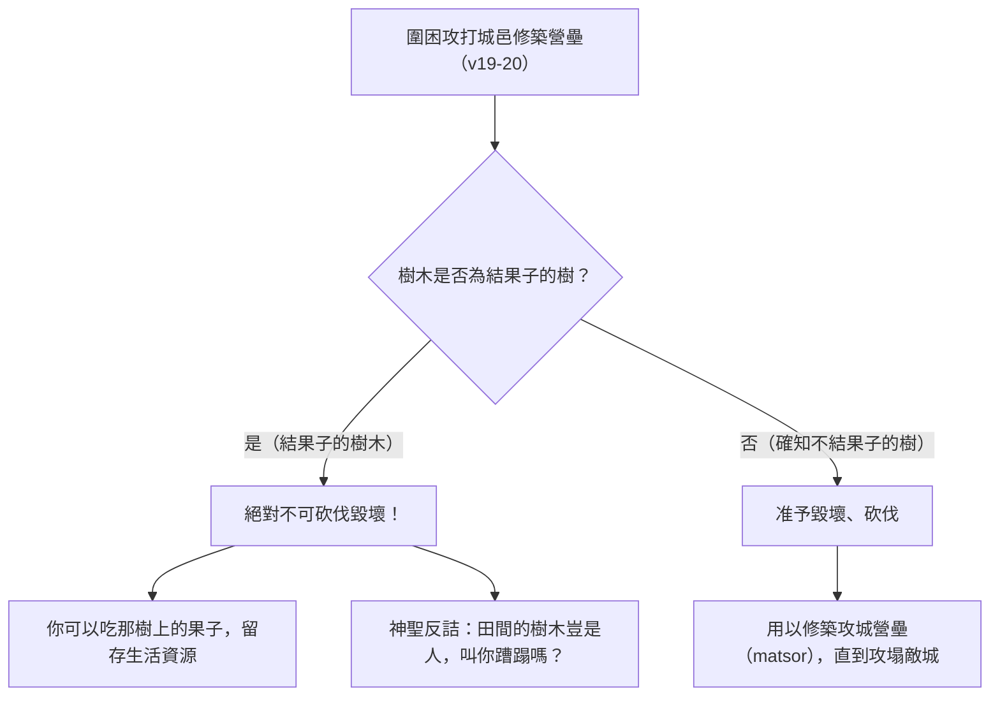

# 圍城不可砍伐果樹的條例

## 定義

申命記第二十章以一條看起來很小的規定收尾：圍城可以圍很久，但不可以拿斧子砍果樹。「你若許久圍困、攻打所要取的一座城，就不可舉斧子砍壞樹木；因為你可以吃那樹上的果子，不可砍伐。田間的樹木豈是人，叫你蹧蹋嗎？」（第19節）

### 為什麼軍隊會想砍樹

因為木材就是攻城器材。CT 說古時攻城的戰術之一「就是堆木石築壘，方便上城牆殺敵」，並列出砍下來的木頭會做成什麼：壘（撒下二十15，即坡道）、戍樓（賽二十三13，即攻城台）、撞城錘（結二十六9）。第20節自己也說明用途——「用以修築營壘」。所以這條禁令不是空泛的環保口號，它擋住的是一個當下就有實際軍事利益的做法。

### 分界線畫在能不能吃

第20節把可砍與不可砍分開：「惟獨你所知道不是結果子的樹木可以毀壞、砍伐」。STEP 顯示這裡的說法是 lo'- 'etz ma.'a.Khal（H3978，ma.a.khal: food），逐字是不是食物之樹；「砍壞」是 tash.Chit（H7843，sha.chat: to ruin），「砍伐」是 tikh.Rot／ve./kha.Ra.ta（H3772G，ka.rat: to cut），「斧子」是 gar.Zen（H1631）。

CT 給的理由很實際：「不許可砍伐果樹之理由，是為預留果林，可供日後生活所需。」GT《串珠》說得更完整：果樹除了即時供應食物之外，日後也可成為以色列民的資源。BH 的說法一致，並指出這是同時照顧圍城部隊與當地居民的實際考量。巴勒斯坦果園多種植於山坡梯田，橄欖樹成材結實需數十年，若任意砍伐將引發戰後幾代人的大饑荒。

### 「田間的樹木豈是人」

這句反問是全段的關鍵。GT《串珠》的解釋只有一句：「不要把樹木當作那應遭毀滅的敵人而把它們砍掉。」BH 說這個反問把人和自然分開，指出樹不是敵人，並認為這反映了戰爭中區分戰鬥人員與非戰鬥人員的倫理，可以視為現代正義戰爭原則的先聲。KC 說的是同一件事：樹木不傷害人，反倒有些樹為人結果子。

STEP 顯示第19節末尾這句是 ki ha./'a.Dam 'etz ha./sa.Deh la./Vo' mi./pa.Nei./kha ba./ma.Tzor（H120G a.dam 加 H6086H ets 加 H7704G sa.deh 加 H935N bo 加 H6440G pa.neh 加 H4692 ma.tsor），逐字是田間的樹木豈是人，要從你面前進入圍城。

### 各家讀出的原則

這一段是本章少數幾處各家講法非常接近的地方，但落點各有不同。

GT《聖經精讀本》把它定位成戰爭倫理：「這裡所記錄的戰爭倫理是要堅決杜絕由憤怒或血氣所引起的魯莽而蓄意性的破壞行為」，例如濫砍對自己有益處的樹木或任意堵住井口；他並由此推論以色列的爭戰不能帶有擴張領土或掠奪錢財的性質。GT《啟導本》講的是後果：「在戰爭中，仍應注意天然環境的保護」，並感嘆要是後來入侵巴勒斯坦的軍隊都肯守這原則，中東的樹木當不致如彼稀少，同時也承認今天中東缺乏森林尚有其他原因。

BH 把它稱為一種保育原則，並說可以視為環境管家職分的早期形式，與創世記二章15節照管伊甸園的託付同一方向。CT 的落點在恩典：神爭戰的目的是要對付撒但和撒但的差役，並不是破壞祂所創造的生態環境，而神在創造的時候就把果樹作為恩典賜給人（參創一29），所以百姓不可蹧蹋神所賞賜的。

KC 加上一層分辨：凡神所造、可作食物因而是好的（提前4:4-5），都要愛惜；即使是無生命之物的毀壞，也要有分辨。他引主耶穌吩咐門徒把剩下的零碎收拾起來、免得有糟蹋的（約6:12）作為同一原則的新約表現。

### 不結果子的樹

第20節允許砍伐不結果子的樹，CT 由此讀出一個對照：「不結果子的樹木，就是白占地土，凡是白占地土，不給人供應的，都可以砍伐。砍伐下來還有一點貢獻，不砍伐下來就是浪費恩典。」KC 的說法接近：只有不結果子、白占地土的樹才該砍。BH 則把果樹與不結果的樹的分別接到主耶穌論好樹結好果子的話（太7:17-19）。

## 按書卷累積

### 申命記

<!-- accumulation:申命記:20:start -->
#### [[05 申命記/第20章|第20章]]
- 本章重點：第19至20節：長期圍城時不可舉斧子砍壞果樹，因為可以吃那樹上的果子；只有確知不結果子的樹才可以毀壞砍伐，用以修築營壘。CT 說古時攻城的戰術之一就是堆木石築壘，並列出壘（撒下二十15）、戍樓（賽二十三13）、撞城錘（結二十六9），又說不許砍果樹是為預留果林可供日後生活所需，並引創一29 說果樹是神給人的恩典；GT《串珠》說不要把樹木當作那應遭毀滅的敵人、果樹日後也可成為以色列民的資源；GT《聖經精讀本》說這段戰爭倫理要杜絕由憤怒或血氣引起的蓄意破壞；GT《啟導本》說戰爭中仍應注意天然環境的保護；KC 引提前4:4-5 與約6:12；BH 說這是保育原則、環境管家職分的早期形式，並把「田間的樹木豈是人」讀成區分戰鬥人員與非戰鬥人員的倫理先聲。STEP 顯示「砍壞」是 tash.Chit（H7843 sha.chat），「砍伐」是 tikh.Rot（H3772G ka.rat），「斧子」是 gar.Zen（H1631），第20節「不是結果子的樹木」是 lo'- 'etz ma.'a.Khal（H3978 ma.a.khal: food）。
- 與本章關聯：這兩節與本章前面的滅絕命令放在一起，界線就顯出來了：對迦南七族是凡有氣息的一個不可存留，對果樹卻連斧子都不可舉。第19節的反問「田間的樹木豈是人」把這條界線說得很明白——受審判的是人，不是地。
<!-- accumulation:申命記:20:end -->

## 相關條目

- [[古代近東的圍城戰與營壘]]
- [[遠方城的招降條例]]
- [[迦南地栽種果樹頭三年果子如未受割禮的條例]]
- [[滅絕（herem）]]

## 來源依據

- 逐節註解（ccbiblestudy CT）: 申二十19-20〔文意註解〕〔話中之光〕——堆木石築壘的攻城戰術、壘與戍樓與撞城錘、預留果林、創一29 的恩典、不結果子的樹木就是白占地土（<https://www.ccbiblestudy.org/Old%20Testament/05Deut/05CT20.htm>）
- 拾穗（ccbiblestudy GT）: 申二十19、19~20、20《申命記串珠聖經註釋》《聖經精讀本──申命記註解》《啟導本聖經申命記註釋》——不要把樹木當作應遭毀滅的敵人、戰爭倫理杜絕蓄意破壞、注意天然環境的保護（<https://www.ccbiblestudy.org/Old%20Testament/05Deut/05GT20.htm>）
- 研經註解（KingComments）: Deuteronomy 20:19-20 — 提前4:4-5 的受造之物、樹木不傷害人、約6:12 收拾零碎（<https://www.kingcomments.com/en/bible-studies/Deu/20>）
- 研經註解（BibleHub Study）: Deuteronomy 20:19-20 — 保育原則與環境管家、創2:15、戰鬥與非戰鬥人員的區分、太7:17-19（<https://biblehub.com/study/deuteronomy/20.htm>）
- 原文資料（STEP Bible）: Deuteronomy 20:19-20 — H7843、H3772G、H1631、H3978、H120G、H6086H、H7704G、H935N、H6440G、H4692 的詞形、morphology 與簡要詞典義（<https://github.com/STEPBible/STEPBible-Data>）
