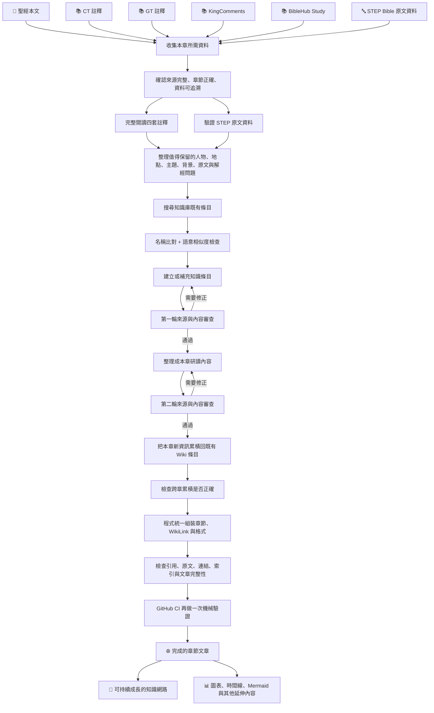

# 專案流程說明

## 一篇 Bible_wiki_zh 的文章，是怎麼誕生的？

Bible_wiki_zh 不是把幾份資料交給模型，再直接產生一篇文章。

一章真正完成以前，會經過資料收集、來源確認、完整閱讀、原文驗證、知識整理、既有條目比對、內容撰寫、獨立審查、跨章累積、程式組裝，以及最後一整套機械檢查。通過之後，才會成為現在在 Obsidian 或網站上看到的章節與知識條目。

先看完整流程：

這份文件要說明的，就是上面每一步到底在做什麼，以及為什麼需要它。

---

# 1. 這個專案最後想做成什麼？

Bible_wiki_zh 是一套以 Markdown / Obsidian 為基礎的繁體中文聖經研讀知識庫。

它不只是「每章一篇文章」，而是把閱讀過程中會遇到的資訊彼此連起來：

- 經文章節
- 人物
- 地點
- 事件
- 歷史與文化背景
- 原文字詞
- 神學主題
- 解經爭議
- 經文之間的互文關係

讀者可以照書卷一路往下讀，也可以從經文中的 `[[wiki-link]]` 跳進某個人物、地點或主題，再透過反向連結、搜尋與圖譜繼續探索。

更重要的是，這些知識條目不是每章各寫各的。同一個人物或主題會隨著後面的章節逐步累積，因此整個知識庫會跟著研讀進度一起成長。

---

# 2. 一章開始以前，資料從哪裡來？

目前每章正式製作時，主要使用聖經本文、四套註釋，以及 STEP Bible 原文資料。

| 資料來源 | 在專案中的角色 |
| --- | --- |
| 聖經本文 | 章節內容與跨經文引用的基礎；經文不由其他資料取代 |
| CT（ccbiblestudy） | 逐節註解、背景、經文解釋與研讀資料 |
| GT（ccbiblestudy） | 彙集不同研經材料與解讀角度，常可看到多種觀察並列 |
| KingComments | 補充段落脈絡、經文發展與整體性的解經觀察 |
| BibleHub Study | 英文研經來源，可與中文來源互相參照 |
| STEP Bible | 原文字形、lemma、Strong、morphology、context gloss、詞義範圍等原文證據 |

其中最需要分清楚的是 **STEP Bible 和四套註釋的角色不同**。

CT、GT、KingComments、BibleHub 主要回答的是：

> 這段經文可以怎麼理解？背景是什麼？不同註釋家看到了什麼？

STEP Bible 回答的則比較接近：

> 原文實際用了哪個字？它的 lemma 是什麼？詞形如何？Strong 編號是什麼？詞典提供哪些可能義域？

所以 STEP 是**原文證據層**，不是第五套註釋，也不會在「四家註釋有幾家同意」時被算成第五票。

另外，STEP 詞典列出的義域只是「這個字可能有哪些意思」，不代表每一個意思都適用於當下那一節；詞形資料本身也不會直接推出神學結論。

---

# 3. 第一步不是寫，而是先把資料收好

每做一章，會先把需要的來源保存到專案本地。

這件事看起來很單純，卻很重要。因為如果每次都臨時上網查，之後很難回答：

- 當時到底使用了哪一份資料？
- 網站後來改版，內容還能不能重現？
- 當時抓到的是完整文章，還是搜尋摘要？
- 某句話究竟來自哪一個來源？
- 下一次檢查時，能不能看到同一份原始資料？

因此專案會把正式來源先落地保存，再由程式建立該章的來源清單。

這張清單不是手動寫的，而是依照實際存在的檔案產生，避免「文件說有，但磁碟上其實沒有」的情況。

---

# 4. 有檔案不代表資料真的可用

來源收回來之後，還要先驗證。

例如需要防止：

- 抓到 404 或錯誤頁面
- 抓到網站目錄而不是正文
- 抓錯書卷或章節
- 檔案存在但內容是空的
- STEP 原文檔與目前章節對不上

也就是說，正式內容開始整理以前，先確認：

> **這一章真正需要的原始材料是否都在，而且確實是這一章的資料。**

這是整個流程最前面的資料品質關卡。

---

# 5. 四套註釋要完整讀過，STEP 則用機器驗證

四套註釋不是搜尋幾個關鍵字，找到幾段相關文字就開始整理。

每一章的 CT、GT、KingComments、BibleHub 都要求完整閱讀一次，並留下閱讀紀錄。閱讀紀錄會保留每個來源的行數與前、中、後段的逐字片段，避免只讀到文件前半部就當作「看完了」。

STEP 的情況不同。

它本身是大量結構化的逐詞資料，如果要求逐字人工閱讀幾百筆資料，不但沒有意義，也更容易流於形式。因此 STEP 改由程式檢查：

- 書卷與章節是否正確
- 節數是否涵蓋
- 是否真的有逐詞資料
- Strong 資料是否存在
- morphology 是否存在
- 原文字元是否存在
- 檔案內容的 SHA-256 是否與驗證紀錄一致

可以簡單理解成：

> **散文資料用完整閱讀確認；結構化原文資料用機器驗證。**

兩邊都通過，才會正式進入內容整理。

---

# 6. 不是來源提到的每一件事都要做成 Wiki

一章的資料裡可能出現非常多資訊，但並不是每個名詞都值得建立知識頁面。

整理時會優先挑出真正具有研讀價值、而且適合跨章累積的內容，例如：

- 重要人物
- 地點
- 事件
- 反覆出現的主題
- 歷史或文化背景
- 關鍵原文字詞
- 值得保留的互文關係
- 不同註釋之間真正存在的解經差異

反過來說，不會因為 STEP 有 Strong 編號，就替每個功能詞建立一頁；也不會因為某個字只出現一次，就硬做成一個沒有後續價值的條目。

這一步做的其實是：

> **從大量資料裡，挑出值得進入知識庫的東西。**

---

# 7. 建新條目前，先確認知識庫裡是不是已經有了

知識庫越做越大之後，很容易出現另一個問題：同一個概念換了一種說法，就被重複建立。

例如：

- 「神所定的邊界」
- 「神為列國所定的疆界」
- 「列國的邊界由神決定」

文字不同，實際上可能是在講同一件事。

所以新候選進來之後，會先做兩層比對：

1. **名稱與別名比對**：看看現有條目是否已經有相同名稱或 alias。
2. **語意相似度比對**：就算名字不同，也找出意思很接近的既有條目。

相似度搜尋只負責把「可能是同一件事」的舊條目找出來，最後還是要判斷：

- 沿用既有條目
- 以既有條目為主再補充
- 或真的建立新的知識節點

這可以避免知識庫慢慢長成一堆彼此重複、只是名稱略有差異的頁面。

---

# 8. 內容整理和內容審查刻意分開

現在的製作流程不讓同一個角色從頭寫到尾，再自己宣告沒有問題。

目前主要分工如下：

| 角色 | 主要工作 |
| --- | --- |
| Claude Opus | 完整閱讀來源、整理候選、撰寫知識條目、本章內容與跨章累積內容 |
| Codex | 流程總控、來源與證據審查、執行程式、最後驗證 |
| Antigravity | Codex 因 quota 或服務問題無法繼續時，從既有進度接手流程與審查 |
| Python 工具 | 負責可以確定性執行的比對、索引、格式、render、state 與各種機械驗證 |
| 人 | 規則真的互相衝突，或證據無法判斷時做最後裁決 |

這樣拆開不是為了增加角色數量，而是避免最常見的問題：

> 同一個系統自己整理、自己審、最後再自己說「正確」。

如果換成 Antigravity 接手，也不會從頭重做。流程狀態、已完成的產物與審查次數都保存在磁碟上，可以直接從原本的進度繼續。

---

# 9. 先做知識條目，再整理整章文章

正式內容大致分成兩個層次。

## 9.1 知識條目

先處理這一章真正值得留下來的知識節點，例如：

- 一個人物是誰
- 某個地名有什麼背景
- 某個希伯來字在本節實際用了什麼詞形
- 某個祭祀制度的重點
- 某個主題在本章有什麼新的發展
- 不同註釋對某節為什麼有不同理解

這些條目之後可以被其他章節繼續引用與累積。

## 9.2 本章整理

等這一章有哪些正式知識節點已經確定，再把整體內容整理成可以順著閱讀的章節文章。

本章整理會依資料實際需要使用：

- 短段落
- bullet point
- 表格
- Mermaid
- 時間線
- WikiLink

重點不是把五份來源各摘要一次再拼起來，而是把真正有研讀價值的資訊整理成一個讀者可以自然閱讀的整體。

---

# 10. 知識條目寫完後，先做第一輪證據審查

知識條目完成後不會直接落地。

審查時會重新回到來源，看幾類最容易出問題的地方：

- 來源真的有這樣說嗎？
- 有沒有把 A 註釋的觀點寫到 B 註釋頭上？
- 有沒有把「可能」寫成「一定」？
- 有沒有把一家註釋的說法寫成四家共識？
- 原文字形、Strong、morphology 是否對得上？
- 有沒有從其他章不小心帶入本章沒有的資料？
- 有沒有漏掉來源明明大量討論、卻沒有建立的重要知識候選？

如果有問題，就回到原內容修正，再重新確認。

審查紀錄會對應到當下那一版內容。只要內容被修改，舊的審查結果就不能假裝仍然適用於新版。

---

# 11. 整章完成後，再做一次不同角度的審查

單一知識條目都正確，不代表把它們組成整章之後一定正確。

第二輪會特別看：

- 本章整理和前面的知識條目有沒有互相矛盾
- 多家註釋的不同立場有沒有被過度壓成單一結論
- 有沒有因為摘要而失去重要限定語
- 原文資料有沒有被解釋得超過證據本身
- 某個小細節有沒有被寫成整章的中心結論

換句話說，第一輪比較偏向「每個零件有沒有寫對」，第二輪則更在意「組成整章之後有沒有變形」。

---

# 12. 新的一章也會回頭改變舊的知識頁

Bible_wiki_zh 和一般章節筆記最大的不同之一，是知識會跨章累積。

假設 `[[摩西]]` 早就存在。做到新的章節時，如果又出現重要的摩西資料，不會再建立「摩西 2」，而是把這一章真正新增的資訊累積回原本的 `[[摩西]]`。

一個成熟的知識條目大致會同時保留三種東西：

- **定義**：這個人物、地點或概念基本上是什麼。
- **逐章累積**：每一章為它增加了什麼資訊。
- **主題發展**：累積到一定程度之後，跨多章整理出的整體發展。

這樣一來，知識頁不是一開始就寫死的百科條目，而是會跟著整個聖經閱讀進度逐步成長。

---

# 13. 跨章累積也要另外檢查

把新資訊寫回舊條目，其實比單獨寫一篇新文章更需要小心。

原因很簡單：如果這一步寫錯，錯誤可能會進入一個已經被很多章節共用的頁面。

因此會特別檢查：

- 本章真的提供了這項新資訊嗎？
- 這是「本章觀察」，還是已經足以寫成「整體定義」？
- 一個單章的解讀有沒有被誤升級成跨章結論？
- 舊條目累積很多章之後，原本的「主題發展」是否已經過時？

如果跨章整體整理已經需要更新，但當下不適合草率重寫，也可以留下 development debt，之後再專門處理，而不是把每一章的內容直接堆進總結裡。

---

# 14. 最後看到的 Markdown，不是靠手動拼格式

前面的內容整理完成後，程式才開始負責最後的組裝。

程式主要處理：

- 經文與節數
- WikiLink
- 知識節點列表
- 本章整理
- 條目頁面
- 固定格式與結構
- 索引與狀態紀錄

這樣做的原因很實際。內容可以由語意判斷來完成，但格式、欄位、連結與檔案結構最好交給確定性的程式處理。

可以把它理解成：

> **內容由閱讀與判斷決定；結構由程式負責穩定落地。**

因此由 pipeline 管理的章節內容，原則上不直接手改最後 render 出來的 Markdown，而是修改來源 payload，再重新組裝。

---

# 15. 引號是一種證據承諾

這個專案對 `「」` 的使用有很嚴格的規則。

如果文章寫：

> 某註釋指出：「……」

那就代表裡面的文字宣稱是可以在正式來源中逐字找到的內容，而不是「意思差不多」的轉述。

因此流程裡會專門檢查引句是否真的存在於來源。

如果只是把英文註釋的意思翻成繁體中文，通常應該寫成具名轉述，而不是把中文翻譯放進引號裡，冒充英文來源的逐字原話。

所以在這裡：

> **引號不是裝飾，而是證據承諾。**

---

# 16. 原文資料也有自己的安全邊界

原文資訊很容易「看起來很專業」，卻也是最容易讓錯誤藏得很深的地方之一。

因此像下面這些內容都需要能回到正式資料：

- 希伯來文／希臘文字形
- lemma
- Strong / Extended Strong
- morphology
- context gloss
- 拉丁音譯
- 詞義範圍

尤其原文類條目的名稱，如果括號裡放了音譯或希伯來字母，必須是本章正式來源實際出現過的拼法，不能只因為另一套工具書常用某種拼法，就自行補進去。

STEP 提供的原文資料會先正面說明它能確認的內容，再和註釋的延伸解讀分開寫。除非真的出現可驗證的字形、Strong、morphology 或 lexical identification 衝突，否則不會因為 STEP 沒列某項資料，就反過來宣判註釋「錯了」。

---

# 17. WikiLink 不只要「能點」，還要確定沒有連錯

文章裡的 WikiLink 會經過多種檢查。

不只看語法正不正確，也會確認：

- 目標條目是否真的存在
- alias 是否能正確解析
- 同名不同人物或地點是否被混在一起
- 新條目是否重複建立
- 某一節明明有候選，最後是否漏掉應有連結
- 新條目是否已經進入 link index
- embedding index 是否和最新知識庫同步

這也是為什麼知識庫不是「文章存進資料夾就算完成」。

一個條目只有真的進入索引、能被後面的章節搜尋、比對與連結，才算真正成為知識網路的一部分。

---

# 18. 完成以前，還有最後一整套機械檢查

內容審查完成後，最後還會交給程式做一批比較適合機器判斷的工作。

大致可以分成幾類：

### 結構與檔案

- 必要 payload、章節檔與條目檔是否存在
- schema 與格式是否正確
- render 結果是否完整

### 來源與引用

- 正式來源是否仍然有效
- 逐字引句是否能回查
- 原文字詞與音譯是否有依據

### Wiki 與知識庫

- 是否有 broken link
- 是否有 invalid / unknown link
- 新條目分類與 alias 是否合理
- 本章應有的節連結有沒有缺漏

### 索引

- link index 是否更新
- embedding index 是否和最新條目同步
- 下一章做相似度搜尋時，能不能真的找到今天新增的知識

### 完整性

- 本章流程應該留下的產物是否全部存在
- 有沒有某個舊檔看起來仍然存在，實際上卻已經 stale
- 本章是否真的達到目前流程要求的完成狀態

其中最後的 chapter file check 特別用來抓「很多前面檢查都綠燈，但某個應有的節連結其實沒生成」這類容易被忽略的問題。

---

# 19. Push 到 GitHub 之後，還要再過 CI

本地全部通過並不代表流程就完全結束。

內容 push 到 GitHub 之後，GitHub Actions 會在另一個乾淨的環境重新執行核心測試與驗證，例如：

- unit tests
- link index 檢查
- knowledge base validation
- link quality check
- broken / invalid / unknown link 檢查
- knowledge base audit

這一層的作用很單純：

> 不只相信剛剛那台機器說「我跑過了」，而是讓另一個環境再驗一次。

當然，機械檢查全部通過，也不代表內容就自動具有完美的解經品質；這也是為什麼前面仍然需要真正回到來源做 evidence review。

---

# 20. 最後，才成為讀者現在看到的作品

走完整個流程之後，原本分散的經文、註釋與原文資料，才會變成幾種真正可以使用的成果。

## 章節文章

可以從頭到尾順著讀，經文、背景、原文與研讀重點放在同一個閱讀脈絡裡。

## Wiki 知識頁

人物、地點、事件、原文、文化、歷史、神學、主題、互文與解經爭議，可以各自形成跨章累積的頁面。

## WikiLink 與反向連結

可以從經文直接跳進相關知識，也可以反過來查看一個條目在哪些章節出現。

## 搜尋與圖譜

在 Obsidian 中可以使用全文搜尋、反向連結、本機圖譜與全域圖譜探索整個知識網路。

## 圖表與視覺整理

當資料本身適合用流程、時間、階層或對照來理解時，章節也可以加入 Mermaid、表格、時間線等視覺化內容。

## 延伸內容

`appendix/` 可以承載圖片、影片與其他延伸材料；同一套 Markdown 知識庫也能進一步發布成網站，讓不使用 Obsidian 的人直接閱讀。

---

# 21. 為什麼需要這麼多步驟？

因為這個專案真正想避免的，不只是「程式跑錯」。

更麻煩的是那些看起來很合理、其實很難察覺的錯誤：

- 記錯來源
- 把單一觀點寫成共同結論
- 把「可能」寫成「一定」
- 引號裡的句子其實不是原文
- 原文字形或音譯看起來專業，來源裡卻根本沒有
- 同一個知識換個名字又建一頁
- 新章資訊錯誤地覆蓋了舊條目的整體定義
- 文章本身看起來正常，但某些 WikiLink、索引或累積其實已經斷掉
- 做到幾十、幾百章之後，早期條目逐漸和後面的內容失去同步

所以這些流程不是為了把專案弄得複雜，而是希望把不同種類的問題交給最適合的方法處理：

- 散文來源靠完整閱讀
- 原文結構資料靠機器驗證
- 內容靠來源證據審查
- 重複知識靠名稱與語意比對
- 格式與索引靠程式
- 最後再由 CI 從另一個環境重跑一次

整個設計最重要的原則可以濃縮成一句話：

> **讓工具幫忙大量閱讀、整理與檢查，但不把「工具說它是對的」本身當作品質保證。**

---

# 22. 已經完成的章節，不會每次都全部重做

上面主要介紹的是一個新章從零開始的完整流程。

但已經完成並驗證過的章節，如果後來發現問題，走的是 maintenance：

> **對的保留，錯的才改；需要補的才補。**

例如後來發現：

- 某個數字錯了
- 某個來源 attribution 有問題
- 原文資料需要補充
- 某個條目漏掉重要內容
- 章節與 Wiki 累積不同步

就只處理受影響的部分，再重跑必要的檢查，不會因為小修正就把整章重新產生一次。

另外，如果只是替舊章補上 STEP Bible infrastructure、receipt 或 audit，也不等於重新開啟整套製作流程。資料基礎的遷移和文章重寫是兩件不同的事情。

---

# 23. 一句話總結

Bible_wiki_zh 的製作方式，可以簡化成下面這條路：

> **先把可靠的原始資料準備好 → 真正讀完並驗證 → 挑出值得留下的知識 → 和既有知識庫比對 → 撰寫 → 回來源獨立審查 → 累積成跨章知識 → 由程式穩定組裝 → 通過連結、原文、索引與完整性檢查 → 再交給 GitHub CI 驗一次 → 最後才成為讀者看到的文章與知識網路。**

現在看到的每一篇章節文章，只是這條流程最後呈現出來的那一層。